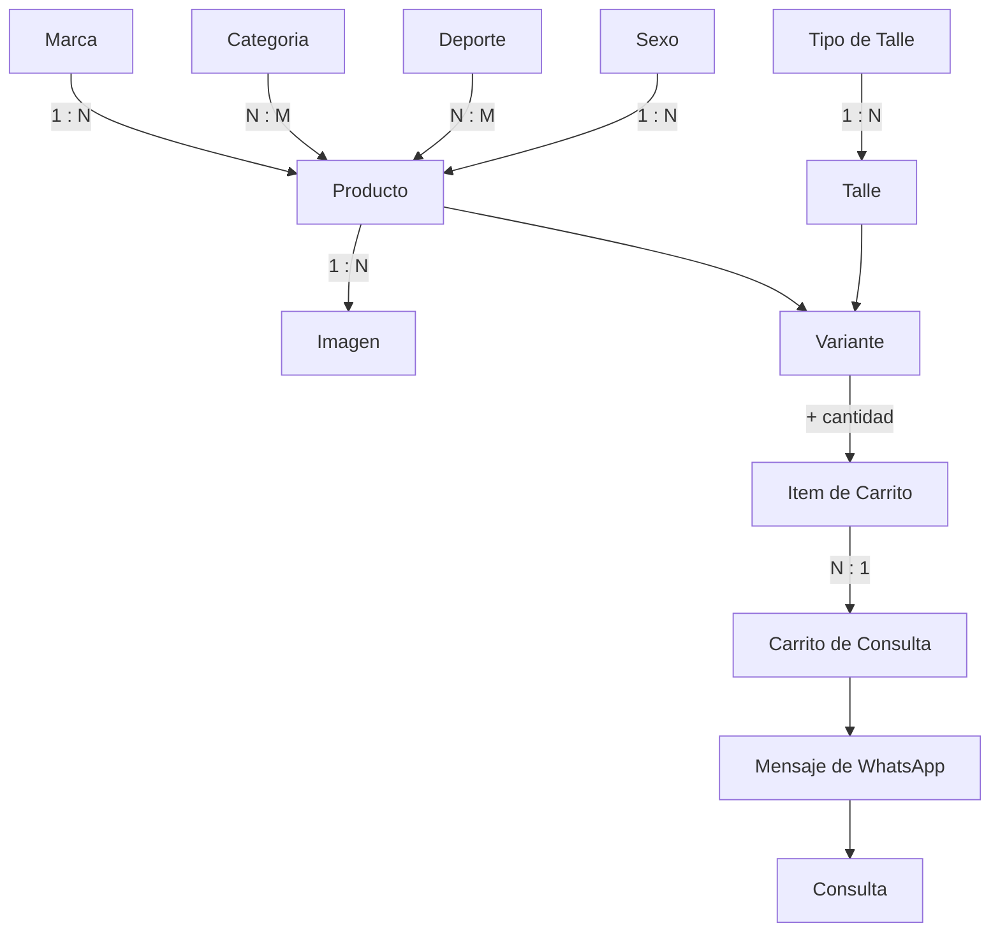
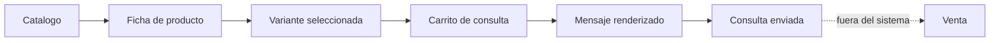

# 00.2_GLOSARIO.md

---

# 1. Información

| Campo | Valor |
|---|---|
| **Proyecto** | Pablito Sports |
| **Sistema** | Plataforma de Catálogo Comercial |
| **Documento** | Glosario de Términos |
| **Código** | 00.2 |
| **Versión** | 1.8.0 |
| **Estado** | ✅ APROBADO |
| **Fecha** | 05/08/2026 |
| **Documento previo** | [00_VISION_PROYECTO.md](00_VISION_PROYECTO.md) ✅ APROBADO |
| **Documentos relacionados** | [00.3_NOMENCLATURA.md](00.3_NOMENCLATURA.md), `01_ANALISIS_NEGOCIO.md`, `02_ARQUITECTURA.md`, `99_AI_DEVELOPMENT_GUIDE.md` |
| **Aplica a** | Toda la documentación, la interfaz de usuario y el código fuente |

---

# 2. Objetivo

Establecer el **vocabulario único y obligatorio** del proyecto Pablito Sports.

Cada término del negocio debe tener **un solo nombre** y **un solo significado**, usado de forma idéntica en la documentación, en la interfaz, en la API y en el código.

Este documento existe para eliminar la ambigüedad antes de que llegue al código. Un término mal definido aquí se convierte en una tabla mal nombrada en `04_BASE_DATOS.md`, en un endpoint confuso en `05_API.md` y en un componente ambiguo en `09_COMPONENTES.md`.

---

# 3. Alcance

## 3.1 Incluye

- Términos de negocio de Pablito Sports.
- Términos de la interfaz visibles para el cliente y el administrador.
- Términos de la documentación (estados, identificadores, versionado).
- Términos prohibidos y sus reemplazos obligatorios.

## 3.2 No incluye

- Nombres de tablas, columnas, endpoints o clases. Se definen en `04_BASE_DATOS.md`, `05_API.md` y `99_AI_DEVELOPMENT_GUIDE.md`, y **deben derivarse de este glosario**.
- Terminología de infraestructura y despliegue. Se define en `12_DEPLOY.md`.
- Vocabulario de marca o comunicación comercial.

---

# 4. Definiciones

## 4.1 Negocio

| Término | Definición |
|---|---|
| **Pablito Sports** | Nombre del proyecto, de la tienda y de la plataforma. Se escribe siempre con ambas iniciales en mayúscula. |
| **Tienda** | La sucursal física de Pablito Sports. En v1 existe una sola. |
| **Cliente** | Persona que navega el catálogo y arma una consulta. Es anónima: no se registra ni se autentica. |
| **Visitante** | Sinónimo de Cliente. Se prefiere **Cliente** en documentación. |
| **Vendedor** | Persona de la tienda que recibe las consultas por WhatsApp y cierra la venta. Actor externo: no usa el sistema. |
| **Consulta** | Solicitud de información que el cliente envía por WhatsApp con uno o más productos. **No es una compra ni un pedido.** |
| **Venta** | Transacción comercial. **Ocurre fuera del sistema**, en la conversación de WhatsApp o en el local. |
| **Catálogo** | Conjunto de productos activos visibles públicamente. |

## 4.2 Producto

| Término | Definición |
|---|---|
| **Producto** | Artículo comercializable. Unidad central del catálogo. |
| **Variante** | Combinación concreta de **Producto + Talle**. Es lo que el cliente selecciona y agrega al carrito. |
| **SKU** | Código interno único de identificación del producto. **No visible para el cliente.** |
| **Slug** | Identificador textual único utilizado en las **URL públicas de toda entidad navegable del sistema**. Aplica como mínimo a Producto, Marca, Categoría, Deporte y Sexo, y a cualquier otra entidad que aparezca en una URL pública. Es permanente y **nunca se reutiliza** (`AD-19`, `RN-79`). Ejemplos: `botin-nike-mercurial-vapor-16`, `nike`, `botines`. |
| **Ficha de producto** | Página de detalle de un producto. Sinónimo: *detalle de producto*. |
| **Imagen principal** | Única imagen designada como representativa del producto. Siempre aparece primero. |
| **Galería** | Conjunto ordenado de imágenes del producto, encabezado por la imagen principal. |
| **Producto activo** | Producto visible en el catálogo público. |
| **Producto oculto** | Producto desactivado por el administrador. Existe, conserva sus datos, pero no se muestra. **No está eliminado.** |
| **Producto eliminado** | Producto marcado como eliminado de forma lógica. No se muestra ni se lista en el panel. |

## 4.3 Clasificación

| Término | Definición |
|---|---|
| **Marca** | Fabricante o marca comercial del producto. Un producto tiene exactamente una. |
| **Categoría** | Clasificación del producto por tipo de artículo (Calzado, Indumentaria, Pelotas…). Un producto puede tener varias. |
| **Categoría principal** | Categoría designada para navegación, migas de pan y URL cuando el producto pertenece a varias. |
| **Deporte** | Disciplina asociada al producto (Fútbol, Básquet, Running, Gimnasio…). Un producto puede tener varios, o ninguno. |
| **Sexo** | Público destinatario del producto: Hombre, Mujer, Unisex, Niño, Niña. Es un criterio de clasificación comercial del artículo. |
| **Talle** | Medida disponible de un producto. Pertenece a un tipo de talle. |
| **Tipo de talle** | Agrupador de talles: Calzado numérico, Indumentaria alfanumérica, Único. Cada producto define el suyo. |

## 4.4 Precios y Moneda

| Término | Definición |
|---|---|
| **Guaraní (PYG)** | Moneda única del sistema. Moneda oficial de Paraguay. |
| **Gs.** | Símbolo de presentación del guaraní. Se antepone al importe: `Gs. 300.000`. |
| **Precio de lista** | Precio normal del producto, con impuestos incluidos. Obligatorio y mayor a cero. |
| **Precio de oferta** | Precio promocional cargado por el administrador. Siempre menor al precio de lista. |
| **Oferta vigente** | Oferta cuya fecha actual se encuentra dentro de su rango de validez. Solo una oferta vigente se muestra y se aplica. |
| **Porcentaje de descuento** | Diferencia entre precio de lista y precio de oferta, expresada en porcentaje y redondeada hacia abajo. |
| **Promoción** | Descuento aplicable a un producto, una categoría o una marca, con vigencia definida. |
| **Subtotal** | Cantidad × precio unitario vigente de un ítem del carrito. |
| **Total estimado** | Suma de los subtotales del carrito. **Estimado** porque está sujeto a confirmación del vendedor. |

## 4.5 Disponibilidad

Los cuatro estados son excluyentes: un producto tiene exactamente uno.

| Estado | Significado comercial |
|---|---|
| **Disponible** | Hay stock en la tienda. |
| **Poco stock** | Quedan pocas unidades. Comunica urgencia al cliente. |
| **Sin stock** | No hay unidades en este momento. **El producto sigue siendo consultable y agregable al carrito.** |
| **Próximamente** | Mercadería en camino, aún no llegada. Habilita la venta anticipada. |

## 4.6 Carrito y Consulta

| Término | Definición |
|---|---|
| **Carrito de consulta** | Lista de variantes que el cliente arma para consultar por WhatsApp. **Nunca genera una venta.** Nombre completo obligatorio en la interfaz la primera vez que aparece. |
| **Ítem de carrito** | Una variante más su cantidad. Dos variantes distintas del mismo producto son dos ítems distintos. |
| **Revalidación** | Verificación de los ítems del carrito contra la API al abrirlo: producto activo, precio vigente y disponibilidad actual. |
| **LocalStorage** | Almacenamiento del navegador donde persiste el carrito. El servidor no guarda carritos. |
| **Expiración del carrito** | Vencimiento automático del carrito a los 30 días desde su última modificación. |

## 4.7 WhatsApp

| Término | Definición |
|---|---|
| **Plantilla de mensaje** | Texto editable por el administrador que define el formato general del mensaje de WhatsApp. Contiene variables. |
| **Plantilla de ítem** | Texto editable que define el formato de cada producto dentro del mensaje. |
| **Variable** | Marcador de la forma `{{nombre}}` que el sistema reemplaza por un valor real al componer el mensaje. |
| **Variable obligatoria** | Variable sin la cual la plantilla no puede guardarse: `{{items}}` y `{{total}}`. |
| **Mensaje renderizado** | Resultado final de aplicar los datos del carrito sobre las plantillas. Es lo que se pre-carga en WhatsApp. |
| **Código de consulta** | Identificador corto con formato `PS-XXXXX` incluido en el mensaje, para referenciar la conversación. |
| **Enlace wa.me** | Mecanismo de apertura de WhatsApp con un mensaje pre-cargado. El envío lo confirma el cliente. |

## 4.8 Administración

| Término | Definición |
|---|---|
| **Panel administrativo** | Área privada de gestión del sistema. Requiere autenticación. Sinónimo aceptado: *panel*. |
| **Administrador** | Usuario que gestiona el catálogo, precios, imágenes, promociones y configuración. |
| **Superadministrador** | Administrador que además gestiona usuarios administradores. |
| **Dashboard** | Pantalla inicial del panel, con totales y alertas de estado del catálogo. |
| **ABM** | Alta, Baja y Modificación. Conjunto de operaciones de gestión de una entidad. |
| **Eliminación lógica** | Marcado de un registro como eliminado sin borrarlo físicamente. Sinónimo técnico: *soft delete*. |
| **Historial de precios** | Registro de cada cambio de precio, con usuario, valor anterior, valor nuevo y fecha. |
| **Configuración de tienda** | Datos globales editables: número de WhatsApp, plantillas, horarios, dirección, redes. |
| **Banner** | Pieza gráfica promocional de la página principal, con orden y vigencia. |
| **Destacado** | Marca manual del administrador que resalta un producto en la página principal. |
| **Nuevo** | Marca manual del administrador. **No se calcula por antigüedad**: el administrador decide cuándo un producto es nuevo. |

## 4.9 Documentación

| Término | Definición |
|---|---|
| **Documentation First** | Metodología del proyecto: primero se documenta, luego se aprueba, finalmente se implementa. |
| **Documento aprobado** | Documento validado por el responsable del proyecto. Es de cumplimiento obligatorio y no se modifica sin nueva versión. |
| **Decisión abierta** | Pregunta de diseño sin respuesta definitiva, registrada explícitamente para evitar que quede dispersa. |
| **Supuesto** | Afirmación asumida para poder avanzar, pendiente de confirmación. |
| **Trazabilidad** | Correspondencia explícita entre un objetivo y los requisitos que lo cubren. |

### Estados de un documento

| Estado | Significado |
|---|---|
| 📝 **BORRADOR** | En redacción. No se revisa todavía. |
| 🟡 **EN REVISIÓN** | Entregado para revisión. No debe usarse como base de implementación. |
| ✅ **APROBADO** | Validado. Es de cumplimiento obligatorio. |
| 🔵 **OBSOLETO** | Reemplazado por otro documento o por una versión mayor. |

### Prefijos de identificadores

Obligatorios y uniformes en toda la documentación.

| Prefijo | Significado | Ejemplo |
|---|---|---|
| `P-` | Problema del negocio | `P-01` |
| `RN-` | Regla de negocio | `RN-23` |
| `RF-` | Requisito funcional | `RF-41` |
| `RNF-` | Requisito no funcional | `RNF-04` |
| `CU-C-` | Caso de uso — Cliente | `CU-C-08` |
| `CU-A-` | Caso de uso — Administrador | `CU-A-24` |
| `S-` | Supuesto a validar | `S-01` |
| `DA-` | Decisión abierta | `DA-01` |
| `R-` | **Riesgo de negocio** — `01` §19, en exclusiva | `R-07` |
| `AR-` | **Riesgo de arquitectura** — `02` §25 | `AR-01` |
| `DR-` | **Riesgo documental** — `00.2`, `00.3` y `02.1`, numeración continua | `DR-08` |
| `D-` | Diagrama | `D-01` |
| `GL-` | Decisión de vocabulario — `00.2` | `GL-10` |
| `GP-` | Pendiente de vocabulario — `00.2` | `GP-07` |
| `NM-` | Decisión de nomenclatura — `00.3` | `NM-03` |
| `NP-` | Pendiente de nomenclatura — `00.3` | `NP-04` |
| `DV-` | Decisión de visión — `00` | `DV-04` |
| `RV-` | Riesgo de visión — `00` | `RV-01` |
| `DN-` | Decisión de negocio — `01` | `DN-01` |
| `PA-` | Principio arquitectónico — `02` | `PA-05` |
| `OA-` | Objetivo arquitectónico — `02` | `OA-03` |
| `DEP-` | Regla de dependencia entre capas — `02` | `DEP-02` |
| `PR-` | Prohibición arquitectónica — `02` | `PR-04` |
| `ES-` | Regla de gestión de estado — `02` §8.6 | `ES-01` |
| `VAL-` | Regla de validación — `02` §9.10 | `VAL-02` |
| `ERR-` | Regla de manejo de errores — `02` §9.11 | `ERR-03` |
| `CFG-` | Regla de configuración — `02` §9.12 | `CFG-01` |
| `INT-` | Regla de integración externa — `02` §10.3 | `INT-05` |
| `CONS-` | Regla de consistencia transaccional — `02` §14.7 | `CONS-02` |
| `AP-` | Pendiente de arquitectura — `02` | `AP-01` |
| `AD-` | Decisión de arquitectura — `02.1` | `AD-01` |
| `ADR-` | Decisión sobre el registro ADR — `02.1` | `ADR-02` |
| `ADP-` | Pendiente del registro ADR — `02.1` | `ADP-01` |

---

# 5. Responsabilidades

| Responsabilidad | Responsable |
|---|---|
| Aprobar la incorporación o modificación de un término | Responsable del proyecto |
| Mantener el glosario actualizado ante cada documento nuevo | Redactor del documento |
| Verificar que la documentación use el vocabulario aprobado | Revisor |
| Derivar los nombres del código, la base de datos y la API de este glosario | Implementador |
| Detectar y reportar sinónimos no autorizados | Todos |

**Regla de precedencia:** ante una discrepancia de vocabulario entre documentos, **prevalece este glosario**.

---

# 6. Diagramas

## 6.1 Relación entre términos del catálogo

Diagrama **conceptual**. No representa tablas ni claves: el modelo físico se define en `04_BASE_DATOS.md`.

## 6.2 Del catálogo a la venta

Muestra dónde termina el sistema y dónde empieza la venta.

---

# 7. Decisiones

| ID | Decisión | Justificación |
|---|---|---|
| GL-01 | Se usa **Consulta**, nunca *pedido*, *orden* ni *compra*. | El carrito no genera una venta. Usar vocabulario de comercio electrónico crearía una expectativa falsa en el cliente y en el código. |
| GL-02 | Se usa **Carrito de consulta**, no *carrito de compras*. | Misma razón que GL-01. |
| GL-03 | **Variante** es el término oficial para la combinación Producto + Talle. | Evita las perífrasis "producto con talle" que aparecían en borradores previos. Hasta el 19/08/2026 incluía también color, retirado del catálogo. |
| GL-04 | El campo de clasificación por público se denomina **Sexo**. | Decisión del responsable del proyecto. Es un criterio de clasificación del artículo, alineado con la organización habitual del rubro deportivo. |
| GL-05 | El estado se llama **Poco stock**, no *stock bajo* ni *últimas unidades*. | Un único término, corto y directo, apto para etiquetas en móvil. |
| GL-06 | **Producto oculto** y **producto eliminado** son estados distintos y no intercambiables. | El administrador oculta con frecuencia; elimina casi nunca. Confundirlos produce pérdida de datos. |
| GL-07 | El importe se escribe **`Gs. 300.000`**: símbolo, espacio, punto de miles, sin decimales. | El guaraní no usa subunidad decimal. Fija un formato único para toda la interfaz. |
| GL-08 | **Nuevo** y **Destacado** se definen como marcas manuales en el glosario, no como cálculos. | El control comercial pertenece al administrador. Definirlo en el glosario impide que se reintroduzca como automatismo en documentos posteriores. |
| GL-09 | Los prefijos de identificadores son uniformes en toda la documentación. | Permite referenciar cualquier requisito desde cualquier documento sin ambigüedad. |
| GL-10 | **Separación entre lenguaje del negocio y lenguaje técnico.** El negocio, la documentación funcional y la interfaz de usuario utilizan terminología en **español**. El código fuente, la base de datos, la API, los modelos, los componentes y las estructuras internas utilizan nomenclatura en **inglés**, siguiendo las convenciones del ecosistema tecnológico seleccionado. Toda entidad del negocio tendrá una equivalencia documentada en **[00.3_NOMENCLATURA.md](00.3_NOMENCLATURA.md)**, que actúa como diccionario oficial entre ambos dominios. | Escribir el código en español contradice al ecosistema completo del stack: cada ejemplo de SQLAlchemy, cada guía de React y cada respuesta de la comunidad usan inglés. Quien lee `Product.query.filter(...)` en la documentación oficial debe encontrar lo mismo en este proyecto. Al mismo tiempo, el cliente y el vendedor nunca deben ver un término en inglés. La solución no es elegir un idioma, sino **separar los dominios y documentar el puente**. |
| GL-11 | **Resuelve `GP-06`: el código fuente se escribe en inglés**, conforme a `GL-10`. | Ver `00.3_NOMENCLATURA.md` §14, decisión `NM-01`. |

---

# 8. Buenas Prácticas

- **Un concepto, un término.** Si aparece un sinónimo, se elige uno y el otro se registra en la tabla de términos prohibidos.
- **Definir antes de usar.** Un término que aparece en un documento y no existe aquí debe incorporarse en el mismo momento.
- **Escribir para el cliente, no para el sistema.** Los términos visibles en la interfaz deben ser comprensibles sin conocimiento técnico.
- **El glosario manda sobre el código.** Si el código llama `order` a lo que el negocio llama consulta, el error está en el código.
- **Registrar la razón.** Toda decisión de vocabulario lleva su justificación en la sección 7. Sin justificación, la decisión se rediscute cada tres meses.
- **Revisar el glosario al cerrar cada documento.** Es la última verificación antes de pasar a estado APROBADO.

---

# 9. Convenciones

## 9.1 Términos prohibidos

| ❌ No usar | ✅ Usar | Motivo |
|---|---|---|
| Pedido, orden, compra | **Consulta** | El sistema no vende (GL-01). |
| Carrito de compras | **Carrito de consulta** | Ídem. |
| Checkout, finalizar compra | **Enviar consulta** | Ídem. |
| Precio final | **Total estimado** | El precio lo confirma el vendedor. |
| Producto con talle | **Variante** | GL-03. |
| Género | **Sexo** | GL-04. |
| Stock bajo, últimas unidades | **Poco stock** | GL-05. |
| Agotado | **Sin stock** | Un término único por estado. |
| Borrar producto | **Ocultar** o **Eliminar** | Son operaciones distintas (GL-06). |
| Descuento manual | **Precio de oferta** | El descuento se carga como precio, no como porcentaje. |
| Usuario | **Cliente** o **Administrador** | *Usuario* es ambiguo: designa a dos actores opuestos. |
| Backoffice, admin panel | **Panel administrativo** | Un solo nombre en español. |

## 9.2 Escritura

| Regla | Ejemplo |
|---|---|
| Las entidades del negocio se escriben con inicial mayúscula al referirse al concepto. | "Cada Producto tiene una Marca." |
| En texto corriente, en minúscula. | "el producto está sin stock" |
| Los términos de la interfaz se citan entre comillas. | El botón "Consultar por WhatsApp" |
| Los estados se escriben tal cual se muestran al cliente. | `Poco stock`, no `POCO_STOCK` |
| Los identificadores se citan con su prefijo completo. | `RN-40`, no "regla 40" |
| Las variables de plantilla se citan con sus llaves. | `{{total}}` |

## 9.3 Formato de importes

| Caso | Formato |
|---|---|
| Importe normal | `Gs. 300.000` |
| Importe en millones | `Gs. 1.650.000` |
| Rango de precios | `Gs. 100.000 – Gs. 500.000` |
| Descuento | `-25%` |

Sin decimales, sin espacios entre el punto y las cifras, siempre con el símbolo `Gs.` antepuesto.

## 9.4 Versionado de documentos

| Cambio | Incremento |
|---|---|
| Corrección de redacción, sin cambio de significado | Parche — `1.0.1` |
| Incorporación de contenido sin invalidar lo aprobado | Menor — `1.1.0` |
| Cambio que invalida decisiones ya aprobadas | Mayor — `2.0.0` |

Todo cambio se registra en la sección **Historial de Cambios** del documento afectado.

## 9.5 Idioma según el dominio

Decisión **GL-10**. El proyecto no elige un idioma: **separa dos dominios**.

| Dominio | Idioma | Alcance |
|---|---|---|
| **Negocio** | 🇪🇸 Español | Documentación, interfaz de usuario, mensajes al cliente, mensaje de WhatsApp |
| **Técnico** | 🇬🇧 Inglés | Código fuente, base de datos, API, modelos, componentes, estructuras internas |

Ejemplo de la misma entidad en ambos dominios:

| Negocio | Código |
|---|---|
| Producto | `Product` |
| Marca | `Brand` |
| Categoría | `Category` |
| Variante | `Variant` |
| Imagen | `Image` |
| Promoción | `Promotion` |
| Consulta | `Inquiry` |
| Carrito de consulta | `InquiryCart` |
| Cliente | `Customer` |
| Administrador | `Administrator` |

**El diccionario completo, con atributos, estados, acciones y componentes, es [00.3_NOMENCLATURA.md](00.3_NOMENCLATURA.md).** Este glosario define **qué significa** cada término; `00.3` define **cómo se llama en el código**.

Regla de la frontera: la traducción ocurre **únicamente en la capa de presentación**. Ningún término en inglés llega al cliente; ningún término en español entra al modelo de datos.

---

# 10. Riesgos

| ID | Riesgo | Impacto | Mitigación |
|---|---|---|---|
| DR-01 | Aparición de sinónimos no autorizados en documentos posteriores. | Alto | Tabla de términos prohibidos (9.1) + revisión del glosario al cerrar cada documento. |
| DR-02 | El código adopta vocabulario propio, distinto del negocio. | Alto | Regla de derivación obligatoria (§3.2 y §5) + `99_AI_DEVELOPMENT_GUIDE.md`. |
| DR-03 | El glosario queda desactualizado respecto de los documentos. | Medio | Responsabilidad asignada al redactor de cada documento (§5). |
| DR-04 | Términos de interfaz demasiado técnicos para el cliente. | Medio | Buena práctica "escribir para el cliente" (§8). |
| DR-05 | Términos que dependen de decisiones abiertas se fijan prematuramente. | Medio | Sección 11: se listan y no se definen hasta resolverse. |
| DR-06 | Formato de importes inconsistente entre pantallas. | Bajo | Formato único (9.3), a implementar en un único módulo de formateo. |

---

# 11. Pendientes

| ID | Pendiente | Depende de | Se resuelve en |
|---|---|---|---|
| GP-01 | Término para la disponibilidad a nivel variante, si se incorpora. | DA-01 | 01 / 04 |
| GP-02 | Término para el precio diferenciado por variante, si se incorpora. | DA-02 | 01 / 04 |
| GP-03 | Vocabulario de promociones complejas (combo, 2x1, cupón). | DA-03 | 01 / 04 |
| GP-04 | Término para sucursal / punto de venta, si se incorporan varias. | DA-04 | 02 |
| GP-05 | Nomenclatura de talles de calzado (PY / BR / US / EU). | DA-11 | 01 |
| GP-05 | Nomenclatura de talles de calzado (PY / BR / US / EU). | DA-11 | 04 |
| GP-07 | Nombres definitivos de tablas, columnas y endpoints. | GL-10 | 00.3 / 04 / 05 |
| GP-08 | Catálogo inicial de deportes y categorías. | — | 01 / 04 |

## 11.1 Pendientes resueltos

| ID | Resolución |
|---|---|
| GP-01 | Cerrado por `DN-01`: la disponibilidad es del producto en v1; la Variante se modela como entidad propia. No se requiere término nuevo. |
| GP-02 | Cerrado por `DN-02`: precio único por producto. No se requiere término nuevo. |
| GP-03 | Cerrado por `DN-03`: solo descuento simple. No se incorpora vocabulario de promociones complejas. |
| GP-04 | Cerrado por `DN-04`: no se modela sucursal en v1. |
| GP-06 | Cerrado por `GL-10` y `GL-11`: **código en inglés**, negocio e interfaz en español. Diccionario en `00.3_NOMENCLATURA.md`. |

---

# 12. Historial de Cambios

| Versión | Fecha | Estado | Cambios |
|---|---|---|---|
| 1.0.0 | 05/08/2026 | 🟡 EN REVISIÓN | Versión inicial. 9 grupos de definiciones, 9 decisiones de vocabulario, tabla de términos prohibidos, convenciones de escritura, formato de importes, versionado de documentos y prefijos de identificadores. Primer documento redactado con la estructura estándar de 12 secciones. |
| 1.1.0 | 05/08/2026 | 🟡 EN REVISIÓN | Prefijos `D-`, `GL-` y `DN-` incorporados a §4.9. Cierre de GP-01 a GP-04 por las decisiones `DN-01` a `DN-04`. Primera resolución de GP-06 (código en español), **revertida en 1.2.0**. |
| **1.2.0** | 05/08/2026 | ✅ **APROBADO** | **GL-10 definido: separación entre lenguaje del negocio y lenguaje técnico.** Negocio, documentación e interfaz en español; código, base de datos, API y componentes en inglés. `GL-11` corregido en consecuencia: **el código se escribe en inglés**, no en español. §9.5 reescrita como frontera entre dominios. Se crea `00.3_NOMENCLATURA.md` como diccionario oficial entre ambos dominios. |

| **1.3.0** | 05/08/2026 | ✅ APROBADO | Tabla de prefijos de §4.9 completada con los identificadores en uso en todos los documentos: `GP-`, `NM-`, `NP-`, `DV-`, `RV-`, `PA-`, `OA-`, `DEP-` y `AP-`. Cada prefijo indica su documento de origen. |
| **1.4.0** | 05/08/2026 | ✅ APROBADO | Prefijos `PR-` (prohibición arquitectónica), `ADR-` y `ADP-` incorporados a §4.9 con la creación de `02.1_DECISIONES_ARQUITECTONICAS.md`. `AD-` pasa a indicar `02.1` como documento de origen. |
| **1.7.0** | 05/08/2026 | ✅ APROBADO | Prefijo `CONS-` (regla de consistencia transaccional) incorporado a §4.9 con el Bloque D de `02_ARQUITECTURA.md`. |
| **1.6.0** | 05/08/2026 | ✅ APROBADO | **Corrección de la inconsistencia C-02.** La definición de **Slug** en §4.2 se limitaba al producto, mientras `AD-23` extiende su uso a marca, categoría, deporte, color y sexo. Se amplía a toda entidad navegable y se incorpora su carácter permanente y no reutilizable (`AD-19`, `RN-79`). |
| **1.5.0** | 05/08/2026 | ✅ APROBADO | Prefijos `ES-`, `VAL-`, `ERR-`, `CFG-` e `INT-` incorporados a §4.9 con el Bloque B de `02_ARQUITECTURA.md`. Cada uno agrupa una familia de reglas que será referenciada desde `05_API.md`, `06_FRONTEND.md`, `03_SEGURIDAD.md` y `12_DEPLOY.md`. |
| **1.8.0** | 19/08/2026 | 🟡 EN REVISIÓN | **Se retira la entidad "Color" del glosario** (`01_ANALISIS_NEGOCIO.md` 2.7.0). **Variante** (§4.2, GL-03) pasa a definirse como Producto + Talle. El diagrama de §6.1 y la tabla de términos prohibidos de §9.1 se ajustan. Las entradas anteriores a esta versión que mencionan "color" describen el estado histórico de esa decisión y no se reescriben. |

---

**Documentos siguientes:** [00.3_NOMENCLATURA.md](00.3_NOMENCLATURA.md) ✅ y `02_ARQUITECTURA.md`.
