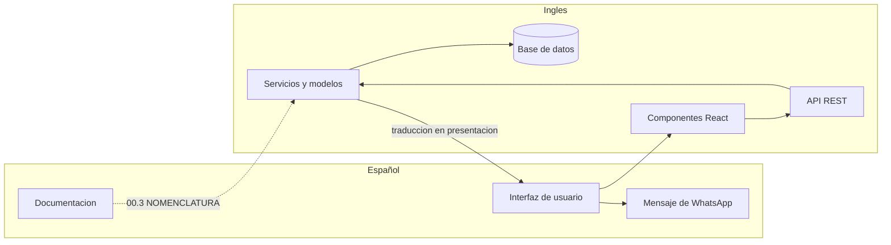
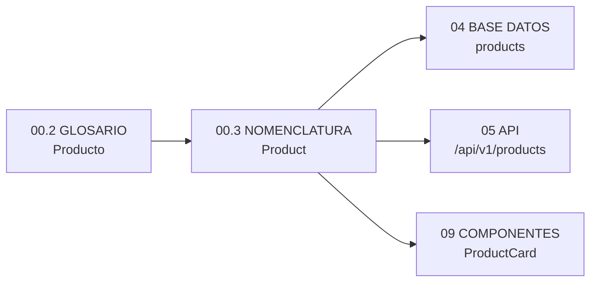

# 00.3_NOMENCLATURA.md

---

# 1. Información

| Campo | Valor |
|---|---|
| **Proyecto** | Pablito Sports |
| **Sistema** | Plataforma de Catálogo Comercial |
| **Documento** | Diccionario de Nomenclatura |
| **Código** | 00.3 |
| **Versión** | 1.4.0 |
| **Estado** | ✅ APROBADO |
| **Fecha** | 06/08/2026 |
| **Documentos previos** | [00_VISION_PROYECTO.md](00_VISION_PROYECTO.md), [00.2_GLOSARIO.md](00.2_GLOSARIO.md) |
| **Documentos dependientes** | `02_ARQUITECTURA.md`, `04_BASE_DATOS.md`, `05_API.md`, `06_FRONTEND.md`, `09_COMPONENTES.md`, `99_AI_DEVELOPMENT_GUIDE.md` |
| **Origen** | Decisión `GL-10` de `00.2_GLOSARIO.md` |

---

# 2. Objetivo

Establecer la **equivalencia oficial y única** entre el lenguaje del negocio (español) y el lenguaje técnico (inglés).

`00.2_GLOSARIO.md` define **qué significa** cada término. Este documento define **cómo se llama ese término dentro del código**.

Sin este diccionario, cada desarrollador —humano o IA— inventaría su propia traducción, y `Consulta` terminaría siendo `Order` en un módulo, `Quote` en otro y `Request` en un tercero.

---

# 3. Alcance

## 3.1 Incluye

- Equivalencias de entidades, atributos, estados, acciones y componentes.
- Convenciones de nomenclatura por tipo de elemento técnico.
- Términos que no se traducen.
- Reglas de resolución para casos no previstos.

## 3.2 No incluye

- El significado de los términos → `00.2_GLOSARIO.md`
- El modelo físico de datos → `04_BASE_DATOS.md`
- El contrato de la API → `05_API.md`
- El inventario de componentes → `09_COMPONENTES.md`
- Las instrucciones operativas de implementación → `99_AI_DEVELOPMENT_GUIDE.md`

---

# 4. Definiciones

| Término | Definición |
|---|---|
| **Dominio de negocio** | Ámbito donde se usa español: documentación, interfaz de usuario, comunicación con el cliente y con el vendedor. |
| **Dominio técnico** | Ámbito donde se usa inglés: código fuente, base de datos, API, modelos, componentes y estructuras internas. |
| **Equivalencia** | Par formado por un término de negocio y su nombre técnico. Es obligatoria y unívoca. |
| **Equivalencia no literal** | Equivalencia donde el nombre técnico no es la traducción directa del término de negocio, por seguir una convención del ecosistema. Requiere justificación explícita. |
| **Falso amigo** | Palabra que existe en ambos dominios con significados distintos. Debe señalarse para evitar colisiones. |

---

# 5. Responsabilidades

| Responsabilidad | Responsable |
|---|---|
| Aprobar una equivalencia nueva o modificada | Responsable del proyecto |
| Incorporar al diccionario todo término nuevo antes de usarlo en código | Implementador |
| Verificar que el código no contenga nombres fuera del diccionario | Revisor |
| Mantener la coherencia entre `00.2` y `00.3` | Redactor |

**Regla de precedencia:** para el **significado** prevalece `00.2_GLOSARIO.md`. Para el **nombre técnico** prevalece este documento.

---

# 6. Frontera entre Dominios

| Ámbito | Idioma | Ejemplo |
|---|---|---|
| Documentación del proyecto | 🇪🇸 Español | "El producto tiene una marca" |
| Interfaz de usuario | 🇪🇸 Español | Botón "Consultar por WhatsApp" |
| Mensajes al cliente | 🇪🇸 Español | "Precios sujetos a confirmación" |
| Mensaje de WhatsApp | 🇪🇸 Español | `Total estimado: Gs. 1.650.000` |
| Modelos y clases | 🇬🇧 Inglés | `class Product` |
| Tablas y columnas | 🇬🇧 Inglés | `products.list_price` |
| Endpoints de la API | 🇬🇧 Inglés | `/api/v1/products` |
| Componentes React | 🇬🇧 Inglés | `<ProductCard />` |
| Funciones y variables | 🇬🇧 Inglés | `get_active_products()` |
| Archivos y carpetas | 🇬🇧 Inglés | `product_service.py` |
| Docstrings y comentarios técnicos | 🇬🇧 Inglés | Ver `NM-05` |
| Comentarios de regla de negocio | 🇪🇸 Español | Ver `NM-05` |

---

# 7. Diccionario de Entidades

| Negocio | Modelo | Tabla | Nota |
|---|---|---|---|
| Producto | `Product` | `products` | |
| Variante | `Variant` | `variants` | Entidad propia desde el inicio (`DN-01`) |
| Marca | `Brand` | `brands` | |
| Categoría | `Category` | `categories` | |
| Deporte | `Sport` | `sports` | |
| Sexo | `Gender` | `genders` | ⚠️ Equivalencia no literal — ver `NM-03` |
| Talle | `Size` | `sizes` | |
| Tipo de Talle | `SizeType` | `size_types` | |
| Imagen | `Image` | `images` | |
| Promoción | `Promotion` | `promotions` | |
| Banner | `Banner` | `banners` | |
| Administrador | `Administrator` | `administrators` | |
| Superadministrador | `SuperAdministrator` | — | Rol, no entidad |
| Configuración de Tienda | `StoreSettings` | `store_settings` | |
| Historial de Precios | `PriceHistory` | `price_history` | |
| Registro de Auditoría | `AuditLog` | `audit_logs` | `AD-20`; inmutable |
| Consulta | `Inquiry` | — | No se persiste en v1 (`RN-63`) |
| Carrito de consulta | `InquiryCart` | — | Vive en el navegador (`RN-52`) |
| Ítem de carrito | `InquiryCartItem` | — | Ídem |
| Cliente | `Customer` | — | No se registra en v1 |

## 7.1 Tablas de relación

| Relación | Tabla | Origen |
|---|---|---|
| Producto ↔ Categoría | `product_categories` | `RN-03` |
| Producto ↔ Deporte | `product_sports` | `RN-08` |
| Producto ↔ Talle | `product_sizes` | `RN-14` |

---

# 8. Diccionario de Atributos

## 8.1 Producto

| Negocio | Campo |
|---|---|
| Nombre | `name` |
| Descripción | `description` |
| Slug | `slug` |
| Código interno (SKU) | `sku` |
| Precio de lista | `list_price` |
| Precio de oferta | `sale_price` |
| Inicio de la oferta | `sale_starts_at` |
| Fin de la oferta | `sale_ends_at` |
| Disponibilidad | `availability` |
| Destacado | `is_featured` |
| Nuevo | `is_new` |
| Activo | `is_active` |
| Categoría principal | `primary_category_id` |
| Tipo de talle | `size_type_id` |

## 8.2 Imagen

| Negocio | Campo |
|---|---|
| Imagen principal | `is_primary` |
| Orden en la galería | `position` |
| Texto alternativo | `alt_text` |

## 8.3 Carrito y consulta

| Negocio | Campo |
|---|---|
| Cantidad | `quantity` |
| Precio unitario | `unit_price` |
| Subtotal | `subtotal` |
| Total estimado | `estimated_total` |
| Código de consulta | `inquiry_code` |
| Plantilla de mensaje | `message_template` |
| Plantilla de ítem | `item_template` |

## 8.4 Comunes

| Negocio | Campo |
|---|---|
| Fecha de creación | `created_at` |
| Fecha de modificación | `updated_at` |
| Eliminación lógica | `deleted_at` |
| Vigencia desde | `starts_at` |
| Vigencia hasta | `ends_at` |

---

# 9. Diccionario de Estados y Valores

## 9.1 Disponibilidad

| Se muestra al cliente | Se almacena |
|---|---|
| Disponible | `available` |
| Poco stock | `low_stock` |
| Sin stock | `out_of_stock` |
| Próximamente | `coming_soon` |

## 9.2 Sexo

| Se muestra al cliente | Se almacena |
|---|---|
| Hombre | `men` |
| Mujer | `women` |
| Unisex | `unisex` |
| Niño | `boys` |
| Niña | `girls` |

## 9.3 Roles

| Negocio | Se almacena |
|---|---|
| Administrador | `administrator` |
| Superadministrador | `super_administrator` |

## 9.4 Tipos de talle

| Negocio | Se almacena |
|---|---|
| Calzado numérico | `footwear_numeric` |
| Indumentaria alfanumérica | `apparel_alpha` |
| Único | `one_size` |

> **Regla:** el valor almacenado nunca se muestra al cliente. La traducción a español ocurre en la capa de presentación.

---

# 10. Diccionario de Acciones

| Negocio | Backend | Frontend |
|---|---|---|
| Listar | `list_*` | `fetch*` |
| Obtener uno | `get_*` | `fetch*` |
| Crear | `create_*` | `create*` |
| Actualizar | `update_*` | `update*` |
| Eliminar (lógico) | `soft_delete_*` | `delete*` |
| Activar / Desactivar | `activate_*` / `deactivate_*` | `toggleActive` |
| Ocultar | `deactivate_*` | — |
| Buscar | `search_*` | `search*` |
| Filtrar | `filter_*` | `applyFilters` |
| Revalidar el carrito | `revalidate_cart` | `revalidateCart` |
| Agregar al carrito | — | `addToCart` |
| Componer el mensaje | — | `buildInquiryMessage` |
| Generar el enlace | — | `buildWhatsAppLink` |

> **Ocultar** y **Desactivar** son la misma operación técnica. El negocio usa "ocultar"; el código usa `deactivate`.

---

# 11. Diccionario de Interfaz

| Elemento de interfaz | Componente |
|---|---|
| Tarjeta de producto | `ProductCard` |
| Ficha de producto | `ProductDetail` |
| Galería de imágenes | `ProductGallery` |
| Selector de talle | `SizeSelector` |
| Etiqueta de disponibilidad | `AvailabilityBadge` |
| Precio | `PriceTag` |
| Etiqueta de oferta | `DiscountBadge` |
| Buscador | `SearchBar` |
| Panel de filtros | `CatalogFilters` |
| Carrito de consulta | `InquiryCart` |
| Ítem del carrito | `InquiryCartItem` |
| Botón de WhatsApp | `WhatsAppButton` |
| Banner principal | `HeroBanner` |
| Sin resultados | `EmptyState` |

---

# 12. Términos que No se Traducen

| Término | Motivo |
|---|---|
| **Pablito Sports** | Nombre propio. |
| **WhatsApp** | Marca registrada. |
| **SKU** | Sigla internacional. |
| **Slug** | Término técnico sin equivalente en español de uso corriente. |
| **PYG** | Código ISO de moneda. |
| **Gs.** | Símbolo de la moneda. Solo aparece en presentación. |
| **Nike, Adidas, Penalty…** | Marcas comerciales. Son datos, no identificadores. |
| **Nombres de productos** | Datos cargados por el administrador. |

---

# 13. Diagramas

## 13.1 Frontera entre dominios



La traducción ocurre **en un único punto**: la capa de presentación. Ningún término en inglés debe llegar al cliente, y ningún término en español debe entrar al modelo de datos.

## 13.2 Cadena de derivación de un nombre



---

# 14. Decisiones

| ID | Decisión | Justificación |
|---|---|---|
| **NM-01** | El negocio, la documentación funcional y la interfaz usan **español**. El código, la base de datos, la API, los modelos, los componentes y las estructuras internas usan **inglés**. | Materializa `GL-10`. El código en español contradice al ecosistema completo: cada ejemplo de SQLAlchemy, cada guía de React y cada respuesta de la comunidad usa inglés. Un desarrollador que lee `Product.query.filter(...)` en la documentación oficial debe encontrar lo mismo en este proyecto. |
| **NM-02** | Este documento es la **única fuente** de equivalencias. Ningún nombre técnico puede inventarse fuera de él. | Sin fuente única, la traducción se vuelve criterio personal y diverge por módulo. |
| **NM-03** | **`Sexo` → `Gender`**, con valores `men`, `women`, `unisex`, `boys`, `girls`. | Equivalencia **no literal**, adoptada por convención del comercio electrónico: es el nombre de faceta que usan Nike, Adidas y prácticamente todo el rubro. La traducción literal `sex` designa otra cosa en contexto técnico y no se usa como segmentación de catálogo. |
| **NM-04** | **`Consulta` → `Inquiry`**. Prohibidos `Order`, `Quote`, `Request` y `Cart` a secas. | Extiende `GL-01` al dominio técnico: el sistema no vende. `Order` induciría a implementar semántica de pedido que el negocio no tiene. |
| **NM-05** | **El idioma del comentario depende de lo que explica.** Comentarios **técnicos** y **docstrings** en inglés; comentarios que explican una **regla de negocio**, en español. Ver §17.4. | Si en el futuro se incorporan herramientas de documentación automática, asistentes de IA u otro desarrollador, el código y su documentación técnica deben estar alineados con el ecosistema. Las reglas de negocio, en cambio, pertenecen a la documentación del proyecto y citan identificadores `RN-xx` que viven en español. |
| **NM-06** | **Inglés estadounidense.** `color`, no `colour`. `catalog`, no `catalogue`. | Es la variante de todas las bibliotecas del stack. |
| **NM-07** | Los booleanos llevan prefijo **`is_`** o **`has_`**. | `is_active`, `is_featured`, `has_discount`. Evita ambigüedad entre estado y valor. |
| **NM-08** | Las marcas de tiempo llevan sufijo **`_at`**. | `created_at`, `sale_starts_at`, `deleted_at`. |
| **NM-09** | Las tablas de relación se nombran **`<entidad>_<entidad>`** en plural, con la entidad principal primero. | `product_categories`, `product_sports`. Legible y predecible. |

---

# 15. Buenas Prácticas

- **Buscar antes de nombrar.** Todo nombre nuevo se busca primero en este diccionario. Si no está, se agrega **antes** de escribirlo en código.
- **La traducción vive en un solo lugar.** La capa de presentación traduce; ninguna otra capa lo hace.
- **Nunca almacenar el texto que ve el cliente.** La base de datos guarda `low_stock`; la interfaz decide que eso se muestra como "Poco stock".
- **Los identificadores de documentación no se traducen.** `RN-40` se cita igual en el código y en los documentos.
- **Ante un término sin equivalencia obvia, preguntar.** Inventar una traducción y seguir adelante es la forma más rápida de romper el diccionario.
- **Un término de negocio, un nombre técnico.** Si aparece un sinónimo en inglés, se elige uno y el otro se prohíbe explícitamente.

---

# 16. Convenciones

## 16.1 Por tipo de elemento

| Elemento | Idioma | Formato | Ejemplo |
|---|---|---|---|
| Modelo / clase | Inglés | `PascalCase`, singular | `Product`, `SizeType` |
| Tabla | Inglés | `snake_case`, plural | `products`, `size_types` |
| Columna | Inglés | `snake_case` | `list_price` |
| Clave foránea | Inglés | `<singular>_id` | `brand_id` |
| Tabla de relación | Inglés | `snake_case`, plural | `product_categories` |
| Endpoint | Inglés | plural, `kebab-case` si compuesto, bajo `/api/v1/` (`AD-17`) | `/api/v1/products`, `/api/v1/size-types` |
| **Nombre** de parámetro de consulta | Inglés | `snake_case` | `brand`, `category`, `min_price`, `sort` |
| **Valor** de parámetro de consulta | Depende del tipo de dato | Ver §17.5 | `?brand=nike`, `?gender=men` |
| Componente React | Inglés | `PascalCase` | `ProductCard` |
| Archivo de componente | Inglés | `PascalCase.jsx` | `ProductCard.jsx` |
| Hook | Inglés | `use` + `PascalCase` | `useInquiryCart` |
| Función Python | Inglés | `snake_case` | `get_active_products` |
| Función JavaScript | Inglés | `camelCase` | `buildInquiryMessage` |
| Constante | Inglés | `UPPER_SNAKE_CASE` | `MAX_CART_QUANTITY` |
| Archivo Python | Inglés | `snake_case.py` | `product_service.py` |
| Carpeta | Inglés | `snake_case` o `kebab-case` | `services`, `product-detail` |
| Texto de interfaz | Español | — | "Consultar por WhatsApp" |
| Docstring | Inglés | — | `"""Creates a new customer inquiry."""` |
| Comentario técnico | Inglés | — | `# Validate uploaded image size` |
| Comentario de negocio | Español | — | `# RN-40: los productos sin stock pueden agregarse al carrito.` |

## 16.4 Idioma de comentarios y docstrings

Decisión `NM-05`. El idioma **no depende del archivo, sino de lo que el comentario explica**.

| Caso | Idioma | Ejemplo |
|---|---|---|
| **Docstring** | 🇬🇧 Inglés | `"""Creates a new customer inquiry from the current inquiry cart."""` |
| **Comentario técnico** — explica implementación | 🇬🇧 Inglés | `# Validate uploaded image size` |
| **Comentario de negocio** — explica una regla | 🇪🇸 Español | `# RN-40: los productos sin stock pueden agregarse al carrito de consulta.` |

**Regla de resolución:** si el comentario cita un identificador `RN-xx`, `RF-xx` o `DN-xx`, va en español. Si explica **cómo** funciona el código, va en inglés.

Ejemplo combinado:

```python
def add_to_inquiry_cart(product_id: int, size_id: int, quantity: int) -> InquiryCartItem:
    """
    Adds a product variant to the inquiry cart.

    Raises ValidationError if the requested quantity is out of range.
    """
    # RN-54: la cantidad por ítem es un entero entre 1 y 99.
    if not 1 <= quantity <= MAX_CART_QUANTITY:
        raise ValidationError("quantity out of range")

    # Normalize the lookup key before hitting the cache
    key = build_variant_key(product_id, size_id)
```

## 16.2 Excepciones permitidas

Vocabulario del lenguaje o del framework, no del negocio:

- Palabras reservadas y API estándar: `get`, `post`, `render`, `useState`, `id`.
- Nombres impuestos por bibliotecas o herramientas.
- Convenciones de Alembic, Flask y SQLAlchemy.

## 16.3 Regla de resolución

Ante un nombre no previsto:

```
¿Designa un concepto del negocio?
   ↓ Sí                          ↓ No
Buscar en 00.2 GLOSARIO      Seguir la convención
   ↓                          del ecosistema
Traducir según 00.3
   ↓
¿No existe la equivalencia?
   ↓
Agregarla a 00.3 antes de escribir código
```

## 16.5 Parámetros de consulta

Decisión `AD-23`. En un parámetro de consulta, **el nombre y el valor siguen reglas distintas**.

### Nombre

**Siempre en inglés**, `snake_case`. Sin excepción.

```
brand · category · sport · gender · size · min_price · max_price · sort · page
```

### Valor

Depende de **qué tipo de dato representa**:

| Tipo de dato | Valor | Idioma | Ejemplo |
|---|---|---|---|
| **Entidad administrable** — la carga el administrador | **Slug** de la entidad | El del dato: normalmente español | `?brand=nike` · `?category=botines` |
| **Enumeración del sistema** — la define el proyecto | **Identificador técnico** | Inglés | `?gender=men` · `?sort=price_asc` |
| **Valor escalar** | El valor literal | — | `?min_price=100000` · `?page=2` · `?size=42` |

### Regla

> El **nombre** del parámetro siempre está en inglés.
> El **valor** es un **slug** cuando representa una entidad administrable.
> El **valor** es un **identificador técnico** cuando representa una enumeración del sistema.

### Prohibido

**Ningún parámetro de consulta expone identificadores internos.**

```
❌ ?brand_id=3          ✅ ?brand=nike
❌ ?category_id=12      ✅ ?category=botines
❌ ?size_id=17          ✅ ?size=42
```

Es la aplicación de `AD-23`: los identificadores son internos, los slugs son públicos. `AD-19` garantiza además que esos slugs son permanentes y no se reutilizan, de modo que un enlace filtrado compartido conserva su significado indefinidamente.

El **orden** en que se emiten los parámetros está fijado por `AD-27`.

---

# 17. Riesgos

| ID | Riesgo | Impacto | Mitigación |
|---|---|---|---|
| DR-07 | Se inventan traducciones ad hoc durante la implementación. | Alto | `NM-02` (fuente única) + revisión obligatoria contra este diccionario. |
| DR-08 | **Falso amigo: "consulta".** En negocio significa `Inquiry`; en contexto técnico, una consulta a la base de datos es `query`. | Alto | Nunca usar `query` para designar la consulta del cliente, ni `inquiry` para una consulta SQL. |
| DR-09 | Términos en inglés se filtran a la interfaz del cliente. | Medio | Traducción concentrada en la capa de presentación (§16). |
| DR-10 | El diccionario queda desactualizado respecto del código. | Medio | Responsabilidad asignada al implementador (§5). |
| DR-11 | Divergencia entre `00.2` y `00.3`: un término existe en uno y no en el otro. | Medio | Regla de precedencia (§5) + revisión conjunta al cerrar cada documento. |
| DR-12 | Mezcla de inglés británico y estadounidense. | Bajo | `NM-06`. |

---

# 18. Pendientes

| ID | Pendiente | Se resuelve en |
|---|---|---|
| NP-01 | Catálogo definitivo de tablas y columnas derivado de este diccionario. | `04_BASE_DATOS.md` |
| NP-02 | Nombres definitivos de endpoints y parámetros. | `05_API.md` |
| NP-03 | Inventario completo de componentes. | `09_COMPONENTES.md` |
| NP-04 | Idioma de los mensajes de commit y de las ramas. | `02_ARQUITECTURA.md` §24.7 |
| NP-05 | Nombres de los archivos de migración de Alembic. | `04_BASE_DATOS.md` |
| NP-06 | ¿`Administrator` o el más breve `Admin` para el modelo? | Confirmación del responsable |

---

# 19. Historial de Cambios

| Versión | Fecha | Estado | Cambios |
|---|---|---|---|
| **1.4.0** | 06/08/2026 | ✅ APROBADO | **Equivalencia de auditoría añadida.** `AD-20` impone un registro de auditoría en base de datos; el diccionario de entidades incorpora `AuditLog` → `audit_logs`, cerrando el vacío detectado al redactar `04_BASE_DATOS.md`. |
| 1.0.0 | 05/08/2026 | 🟡 EN REVISIÓN | Versión inicial. Creado por decisión `GL-10`. Frontera entre dominios, diccionarios de entidades, atributos, estados, acciones e interfaz, términos no traducibles, 9 decisiones `NM-01` a `NM-09` y convenciones por tipo de elemento. |
| **1.2.0** | 05/08/2026 | ✅ APROBADO | **Corrección de inconsistencias C-01 y C-08.** El ejemplo de parámetro de consulta en §17.1 mostraba `?brand_id=3`, forma que `AD-23` prohíbe. Se separan **nombre** y **valor** como filas distintas y se agrega **§17.5** con la regla completa: nombre siempre en inglés; valor como slug si es entidad administrable, como identificador técnico si es enumeración del sistema. El ejemplo de endpoint mostraba `/api/products`, sin el prefijo de versión que exige `AD-17`: corregido a `/api/v1/products`. Se restablece el orden físico de las subsecciones de §17 sin renumerarlas, para no invalidar referencias. |
| **1.1.0** | 05/08/2026 | ✅ **APROBADO** | **`NM-05` refinada:** el idioma del comentario depende de lo que explica, no del archivo. Docstrings y comentarios técnicos en inglés; comentarios que explican una regla de negocio, en español. Nueva §17.4 con la regla de resolución y ejemplo combinado. `NM-03` (`Sexo` → `Gender`) y `DR-08` (`Query` ≠ `Inquiry`) confirmados sin cambios. |
| **1.5.0** | 19/08/2026 | 🟡 EN REVISIÓN | **Se retira "Color" del diccionario de entidades** (`01_ANALISIS_NEGOCIO.md` 2.7.0): fila `Color`/`colors` y relación `product_colors` fuera de §7 y §7.1; `ColorSelector` fuera de §11; ejemplos de parámetros de consulta en §16.5 sin `color`. |

---

**Estado:** ✅ APROBADO — vinculante para `02_ARQUITECTURA.md`, `04_BASE_DATOS.md`, `05_API.md`, `09_COMPONENTES.md` y `99_AI_DEVELOPMENT_GUIDE.md`.
