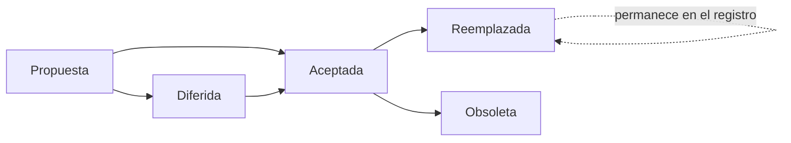
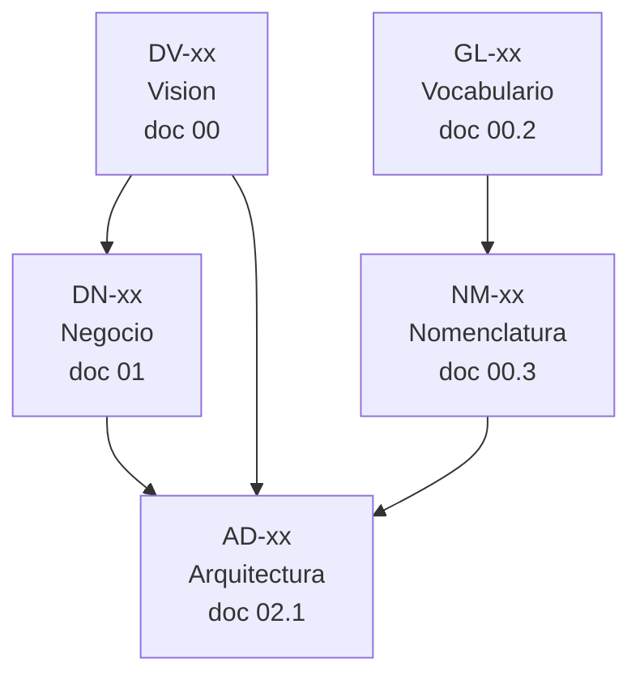

# 02.1_DECISIONES_ARQUITECTONICAS.md

---

# 1. Información

| Campo | Valor |
|---|---|
| **Proyecto** | Pablito Sports |
| **Sistema** | Plataforma de Catálogo Comercial |
| **Documento** | Registro de Decisiones Arquitectónicas (ADR) |
| **Código** | 02.1 |
| **Versión** | 1.9.0 |
| **Estado** | ✅ APROBADO — Architecture Freeze Review, 05/08/2026 |
| **Fecha** | 06/08/2026 |
| **Documento principal** | [02_ARQUITECTURA.md](02_ARQUITECTURA.md) |
| **Naturaleza** | **Documento vivo.** No se cierra: crece durante toda la vida del proyecto. |

---

# 2. Objetivo

Conservar el **razonamiento y el historial** detrás de cada decisión arquitectónica de Pablito Sports, siguiendo la práctica de *Architecture Decision Records*.

`02_ARQUITECTURA.md` describe **cómo es** la arquitectura hoy. Este documento explica **por qué llegó a ser así**, qué alternativas se descartaron y qué se pagó por cada elección.

La distinción importa porque los dos documentos envejecen distinto: la arquitectura se reescribe cuando cambia; el registro de decisiones **nunca se reescribe, solo crece**. Una decisión reemplazada permanece, marcada como tal.

## 2.1 Qué problema resuelve

Sin este registro, dentro de un año la pregunta *"¿por qué las imágenes están en disco y no en la base de datos?"* solo tiene tres respuestas posibles: nadie se acuerda, alguien lo supone, o se rediscute desde cero.

Con este registro, la respuesta es `AD-05`, con su contexto de la época y sus consecuencias declaradas.

---

# 3. Alcance

## 3.1 Incluye

- Decisiones **estructurales** de arquitectura, con prefijo `AD-`.
- Alternativas evaluadas y descartadas, con su motivo.
- Consecuencias aceptadas, incluidas las negativas.
- Historial de decisiones reemplazadas.

## 3.2 No incluye

| Tipo de decisión | Dónde vive |
|---|---|
| Decisiones de visión y alcance | `00_VISION_PROYECTO.md` §13 — `DV-xx` |
| Decisiones de vocabulario | `00.2_GLOSARIO.md` §7 — `GL-xx` |
| Decisiones de nomenclatura | `00.3_NOMENCLATURA.md` §14 — `NM-xx` |
| Decisiones de negocio | `01_ANALISIS_NEGOCIO.md` §16 — `DN-xx` |
| Principios y objetivos arquitectónicos | `02_ARQUITECTURA.md` §6 — `PA-xx`, `OA-xx` |
| Prohibiciones tecnológicas | `02_ARQUITECTURA.md` §7.7 — `PR-xx` |

## 3.3 Criterio de inclusión

No toda elección técnica es un ADR. Se registra una decisión aquí cuando cumple **al menos dos** de estas condiciones:

- Es costosa de revertir.
- Afecta a más de un módulo o a más de una capa.
- Existía una alternativa razonable que fue descartada.
- Alguien podría razonablemente cuestionarla en el futuro.
- Condiciona decisiones posteriores.

Elegir el nombre de una variable no es un ADR. Elegir dónde vive el estado del carrito, sí.

---

# 4. Definiciones

| Término | Definición |
|---|---|
| **ADR** | *Architecture Decision Record*. Registro de una decisión arquitectónica con su contexto y consecuencias. |
| **Contexto** | Situación que obligó a decidir. Se escribe en tiempo presente y **no se actualiza** después: refleja lo que se sabía en ese momento. |
| **Consecuencia** | Efecto de la decisión, positivo o negativo. Una decisión sin consecuencias negativas está mal analizada. |
| **Decisión diferida** | Decisión identificada pero deliberadamente no tomada, con el documento donde se resolverá y la condición para hacerlo. |
| **Decisión reemplazada** | Decisión que fue válida y dejó de serlo. Permanece en el registro con la referencia a la que la sustituye. |

## 4.1 Estados de una decisión

| Estado | Significado |
|---|---|
| 💭 **Propuesta** | Redactada, sin aprobar. |
| ✅ **Aceptada** | Aprobada y vigente. De cumplimiento obligatorio. |
| ⏸️ **Diferida** | Identificada, no tomada. Indica dónde y cuándo se resolverá. |
| 🔄 **Reemplazada** | Sustituida por otra decisión. Se conserva con la referencia. |
| 🔵 **Obsoleta** | Ya no aplica porque desapareció el contexto que la motivó. |

---

# 5. Responsabilidades

| Responsabilidad | Responsable |
|---|---|
| Proponer una decisión | Cualquier participante |
| Aprobar, diferir o reemplazar una decisión | Responsable del proyecto |
| Redactar el registro completo | Redactor del documento de arquitectura |
| Verificar que la implementación respete las decisiones aceptadas | Revisor |
| **No modificar el contexto de una decisión ya aceptada** | Todos |

> **Regla fundamental:** el contexto de una decisión aceptada **nunca se corrige**. Si el contexto cambió, no se edita el ADR: se crea uno nuevo que reemplaza al anterior. Editar el pasado destruye el valor del registro.

---

# 6. Formato del Registro

Todo ADR de este documento sigue esta estructura:

| Campo | Contenido |
|---|---|
| **Identificador** | `AD-xx`, correlativo y nunca reutilizado |
| **Título** | Enunciado de la decisión en una frase |
| **Estado** | Ver §4.1 |
| **Fecha** | De la aprobación |
| **Contexto** | Qué situación obligó a decidir. No se actualiza. |
| **Alternativas** | Opciones evaluadas y motivo del descarte |
| **Decisión** | Qué se resolvió, en términos accionables |
| **Objetivos favorecidos** | `PA-xx` y `OA-xx` que refuerza |
| **Objetivos sacrificados** | Qué se pierde, y por qué es aceptable |
| **Consecuencias** | Qué obliga a hacer, qué habilita, qué cierra |
| **Documentos afectados** | Dónde se materializa |

---

# 7. Índice de Decisiones

| ID | Título | Estado | Ámbito |
|---|---|---|---|
| [AD-01](#ad-01) | SPA React desacoplada con comunicación por API REST | ✅ Aceptada | Estructural |
| [AD-02](#ad-02) | Backend en capas con dependencias unidireccionales | ✅ Aceptada | Estructural |
| [AD-03](#ad-03) | La lógica de negocio reside exclusivamente en la capa de servicios | ✅ Aceptada | Estructural |
| [AD-04](#ad-04) | Nginx sirve estáticos e imágenes; Gunicorn atiende solo la API | ✅ Aceptada | Infraestructura |
| [AD-05](#ad-05) | Las imágenes se almacenan en el sistema de archivos | ✅ Aceptada | Datos |
| [AD-06](#ad-06) | El carrito no tiene representación en el servidor | ✅ Aceptada | Datos |
| [AD-07](#ad-07) | Independencia de una biblioteca global de estado | ⏸️ Diferida | Frontend |
| [AD-08](#ad-08) | Frontend organizado por features, con zona común explícita | ✅ Aceptada | Frontend |
| [AD-09](#ad-09) | Renderizado del lado del cliente con metadatos para rastreadores | ✅ Aceptada | Frontend |
| [AD-10](#ad-10) | Toda integración externa pasa por un adaptador | ✅ Aceptada | Integraciones |
| [AD-11](#ad-11) | Una única capa de configuración | ✅ Aceptada | Backend |
| [AD-12](#ad-12) | La API expone DTOs, nunca modelos | ✅ Aceptada | Datos |
| [AD-13](#ad-13) | El error es parte del contrato; la API devuelve códigos, no mensajes | ✅ Aceptada | Backend |
| [AD-14](#ad-14) | Backend por capas, con módulos por dominio dentro de cada capa | ✅ Aceptada | Backend |
| [AD-15](#ad-15) | La Variante se materializa completa al crear el producto | ✅ Aceptada | Datos |
| [AD-16](#ad-16) | Envoltura uniforme en toda respuesta de la API | ✅ Aceptada | API |
| [AD-17](#ad-17) | Versionado de la API en la ruta desde el primer día | ✅ Aceptada | API |
| [AD-18](#ad-18) | Prohibición absoluta del borrado físico | ✅ Aceptada | Datos |
| [AD-19](#ad-19) | El slug nunca se reutiliza | ✅ Aceptada | Datos |
| [AD-20](#ad-20) | Auditoría general de toda operación de escritura del panel | ✅ Aceptada | Datos |
| [AD-21](#ad-21) | Búsqueda insensible a acentos y mayúsculas | ✅ Aceptada | Datos |
| [AD-22](#ad-22) | El carrito lleva versión de contenido | ✅ Aceptada | Frontend |
| [AD-23](#ad-23) | Filtros por slug público; identificadores solo internos | ✅ Aceptada | API |
| [AD-24](#ad-24) | Jerarquía de categorías de dos niveles en la v1 | ✅ Aceptada | Datos |
| [AD-25](#ad-25) | Matriz de resolución de discrepancias del carrito | ✅ Aceptada | Carrito |
| [AD-26](#ad-26) | Los parámetros desconocidos se ignoran, nunca producen error | ✅ Aceptada | API |
| [AD-27](#ad-27) | Orden canónico de parámetros de consulta | ✅ Aceptada | API |
| [AD-28](#ad-28) | El carrito nunca se modifica en silencio | ✅ Aceptada | Carrito |
| [AD-29](#ad-29) | La consulta por categoría padre incluye a sus descendientes | ✅ Aceptada | Datos |
| [AD-30](#ad-30) | Un fallo de red en la revalidación no bloquea la consulta | ✅ Aceptada | Carrito |
| [AD-31](#ad-31) | Paginación por desplazamiento, no por cursor | ✅ Aceptada | API |
| [AD-32](#ad-32) | La revalidación del carrito usa POST | ✅ Aceptada | API |
| [AD-33](#ad-33) | Clave primaria entera; el slug es la identidad pública | ✅ Aceptada | Datos |
| [AD-34](#ad-34) | Marcas de tiempo almacenadas en UTC | ✅ Aceptada | Datos |
| [AD-35](#ad-35) | Índices por medición, no por anticipación | ✅ Aceptada | Datos |
| [AD-36](#ad-36) | El servidor no recibe ni utiliza precios del cliente | ✅ Aceptada | Carrito |
| [AD-37](#ad-37) | Sesión de servidor con cookie, no testigo autocontenido | ✅ Aceptada | Seguridad |
| [AD-38](#ad-38) | El original es el activo autoritativo; los derivados son caché | ✅ Aceptada | Imágenes |
| [AD-39](#ad-39) | La limpieza física alcanza solo archivos sin fila | ✅ Aceptada | Imágenes |
| [AD-40](#ad-40) | El archivo se escribe antes que la fila | ✅ Aceptada | Imágenes |

---

# 8. Registro de Decisiones

## AD-01

### SPA React desacoplada con comunicación por API REST

| | |
|---|---|
| **Estado** | ✅ Aceptada — **alcance acotado por [`AD-09`](#ad-09)** |
| **Fecha** | 05/08/2026 |

> **Nota de supersesión parcial — Architecture Review v1, hallazgo `B-01`.**
> La frase *"El backend no genera HTML"* de la decisión siguiente debe leerse como: **el backend no genera HTML destinado a personas**. `AD-09` estableció una excepción única y acotada: un endpoint que devuelve un documento HTML mínimo **exclusivamente para rastreadores**, sin interfaz, sin estado y sin lógica de presentación.
> El principio de `AD-01` —que las personas reciben la aplicación React y que toda comunicación de datos ocurre en JSON— permanece intacto. El contexto y el texto original se conservan sin modificar conforme a `ADR-02`.

**Contexto.** `00_VISION_PROYECTO.md` fija React y Flask como stack. Queda por resolver cómo se relacionan: si Flask entrega HTML renderizado y React actúa como complemento, o si ambos son aplicaciones independientes que se comunican por una API.

`00_VISION_PROYECTO.md` §10 prevé como extensiones futuras una API pública y una aplicación móvil. Ambas requieren que la lógica sea accesible por API.

**Alternativas.**

| Opción | Motivo del descarte |
|---|---|
| Plantillas renderizadas por Flask | Acopla presentación y lógica. Contradice `PA-05`. Cierra la puerta a la aplicación móvil prevista. |
| Renderizado del lado del servidor con framework adicional | Suma una tecnología y un proceso de construcción que ningún requisito exige (`PA-11`). |
| **SPA React + API REST** | **Elegida.** |

**Decisión.** El frontend es una aplicación de página única en React, independiente del backend. Toda comunicación ocurre por API REST sobre HTTPS, en JSON. El backend no genera HTML.

**Objetivos favorecidos.** `PA-05` (API First), `PA-12` (evolución sin ruptura), `OA-03` (desacoplamiento).

**Objetivos sacrificados.** El SEO exigido por `RNF-10` requiere trabajo adicional en una SPA: metadatos dinámicos y datos estructurados que un servidor entregaría sin esfuerzo.

**Por qué el intercambio es aceptable.** El catálogo tiene una cantidad acotada de páginas indexables y el costo del trabajo adicional es conocido y puntual. El costo de cerrar la puerta a la aplicación móvil sería estructural.

**Consecuencias.**
- La estrategia de SEO debe resolverse explícitamente (`02_ARQUITECTURA.md` §8.9, resuelta por `AD-09`).
- El contrato de la API es la frontera de acuerdo entre ambos lados.
- Frontend y backend pueden desarrollarse y desplegarse por separado.

**Documentos afectados.** `02` §7.4, §8 · `05_API.md` · `06_FRONTEND.md`

---

## AD-02

### Backend en capas con dependencias unidireccionales

| | |
|---|---|
| **Estado** | ✅ Aceptada |
| **Fecha** | 05/08/2026 |

**Contexto.** Flask no impone estructura. Sin una decisión explícita, la organización del backend queda al criterio de quien escriba cada módulo, y a los seis meses conviven tres formas distintas de hacer lo mismo.

`01_ANALISIS_NEGOCIO.md` define 74 reglas `RN-xx` que necesitan un lugar inequívoco donde vivir.

**Alternativas.**

| Opción | Motivo del descarte |
|---|---|
| Todo en las rutas | Imposible de probar sin levantar el servidor. Duplica reglas en cada endpoint. |
| Rutas + modelos, sin capa intermedia | Las reglas terminan en los modelos, invisibles y acopladas al ORM. |
| Arquitectura hexagonal completa con puertos y adaptadores | Complejidad no justificada por el tamaño del proyecto (`PA-11`). |
| **Capas: rutas → servicios → repositorios → modelos** | **Elegida.** |

**Decisión.** El backend se organiza en cuatro capas con dependencias en una sola dirección, formalizadas en las reglas `DEP-01` a `DEP-07` de `02_ARQUITECTURA.md` §6.8.

**Objetivos favorecidos.** `OA-01` (cohesión), `OA-05` (testeable), `OA-06` (mantenible), `PA-02`, `PA-04`.

**Objetivos sacrificados.** Más archivos por funcionalidad. Implementar un ABM simple toca cuatro capas en lugar de una.

**Por qué el intercambio es aceptable.** El costo es lineal y previsible; el beneficio —poder probar reglas de negocio sin base de datos ni servidor— es lo que hace mantenible el proyecto a lo largo de años.

**Consecuencias.**
- Ninguna ruta accede a repositorios ni a modelos (`PR-07`).
- Ningún servicio conoce HTTP: debe poder invocarse desde un script.
- La estructura de carpetas refleja las capas (`02` §9.11).

**Documentos afectados.** `02` §6.8, §9 · `04_BASE_DATOS.md` · `05_API.md` · `99_AI_DEVELOPMENT_GUIDE.md`

---

## AD-03

### La lógica de negocio reside exclusivamente en la capa de servicios

| | |
|---|---|
| **Estado** | ✅ Aceptada |
| **Fecha** | 05/08/2026 |

**Contexto.** Consecuencia directa de `AD-02`, pero merece registro propio porque es la decisión que más se viola en la práctica: siempre es más rápido escribir la validación en el componente que se está tocando.

**Alternativas.**

| Opción | Motivo del descarte |
|---|---|
| Reglas replicadas en frontend y backend como fuentes equivalentes | Divergen. Al tercer cambio, nadie sabe cuál es la verdadera. |
| Reglas en la base de datos, mediante restricciones y disparadores | Invisibles desde el código, no rastreables a un `RN-xx`, imposibles de probar sin base de datos. |
| **Reglas en servicios, únicamente** | **Elegida.** |

**Decisión.** Toda regla `RN-xx` se implementa en la capa de servicios del backend. El frontend puede duplicar validaciones **solo por experiencia de usuario**, nunca como única defensa. El backend valida siempre, aunque el frontend ya lo haya hecho.

**Objetivos favorecidos.** `OA-05`, `OA-06`, `OA-07`, `PA-02`.

**Objetivos sacrificados.** Duplicación deliberada de algunas validaciones, y la latencia de una ida al servidor en casos que el cliente podría resolver solo.

**Por qué el intercambio es aceptable.** La duplicación es intencional y está acotada: el frontend orienta, el backend decide. La alternativa —confiar en el cliente— no es una alternativa (`PA-06`).

**Ejemplo.** `RN-16` exige seleccionar variante antes de agregar al carrito. El frontend deshabilita el botón para que el cliente entienda qué falta. El backend rechaza igual la petición que llegue sin variante.

**Consecuencias.**
- `PR-05`: prohibida la lógica de negocio en componentes React.
- Toda regla es rastreable desde el código hasta un `RN-xx`.
- Las pruebas de reglas de negocio no requieren navegador.

**Documentos afectados.** `02` §6.4, §9.4, §9.12 · `06_FRONTEND.md` · `11_TESTING.md`

---

## AD-04

### Nginx sirve estáticos e imágenes; Gunicorn atiende solo la API

| | |
|---|---|
| **Estado** | ✅ Aceptada |
| **Fecha** | 05/08/2026 |

**Contexto.** El catálogo es intensivo en imágenes (`RF-31`, `RF-33`). Cada imagen servida por un proceso de aplicación ocupa un trabajador que no puede atender peticiones de la API.

**Alternativas.**

| Opción | Motivo del descarte |
|---|---|
| Flask sirve también las imágenes y los estáticos | Consume trabajadores en tareas que no requieren lógica. Compromete `RNF-02`. |
| Red de distribución de contenido externa | Dependencia externa y costo no justificados para una sola sucursal (`PA-11`). |
| **Nginx para archivos, Gunicorn para `/api`** | **Elegida.** |

**Decisión.** Nginx termina TLS, entrega el build del frontend y las imágenes con cacheo, y hace de proxy hacia Gunicorn únicamente para las rutas bajo `/api`.

**Objetivos favorecidos.** `PA-09` (escalabilidad), `OA-04`, `RNF-01`, `RNF-03`.

**Objetivos sacrificados.** Una pieza más de infraestructura que configurar y mantener, y una diferencia entre el entorno de desarrollo y el de producción.

**Por qué el intercambio es aceptable.** Nginx ya es necesario para la terminación TLS de `RNF-12`. Aprovecharlo para archivos no agrega una pieza: usa mejor una que ya está.

**Consecuencias.**
- Las imágenes se entregan desde una ruta servida directamente por Nginx.
- La política de cacheo se define a nivel de Nginx (`02` §15.7).
- El entorno de desarrollo no replica esta separación (`02` §7.8).

**Documentos afectados.** `02` §7.2, §15.7 · `12_DEPLOY.md`

---

## AD-05

### Las imágenes se almacenan en el sistema de archivos

| | |
|---|---|
| **Estado** | ✅ Aceptada |
| **Fecha** | 05/08/2026 |

**Contexto.** `00_VISION_PROYECTO.md` §8 ya contempla un sistema de archivos como parte de la arquitectura. Falta confirmarlo frente a las alternativas y registrar sus consecuencias.

**Alternativas.**

| Opción | Motivo del descarte |
|---|---|
| Imágenes en la base de datos como binarios | Infla la base, encarece los respaldos y obliga a que cada imagen pase por un proceso de aplicación. |
| Almacenamiento de objetos externo | Dependencia y costo no justificados hoy (`PA-11`). Queda como punto de extensión. |
| **Sistema de archivos local** | **Elegida.** |

**Decisión.** Las imágenes originales y sus versiones derivadas se almacenan en el sistema de archivos del servidor. La base de datos guarda únicamente la referencia.

**Objetivos favorecidos.** `PA-09`, `PA-11`, `OA-04`.

**Objetivos sacrificados.** El respaldo pasa a tener dos orígenes distintos: base de datos y archivos. `RNF-16` debe cubrir ambos, y una restauración parcial puede dejar el sistema inconsistente.

**Por qué el intercambio es aceptable.** Es el modo estándar de servir imágenes y habilita `AD-04`. El riesgo de respaldo está identificado como `R-10` en `01_ANALISIS_NEGOCIO.md`.

**Consecuencias.**
- La eliminación de un producto debe contemplar la limpieza de archivos huérfanos (`02` §15.10).
- La estructura de directorios y la nomenclatura se definen en `02` §15.2 y §15.3.
- La migración futura a almacenamiento externo debe tocar una sola capa (`OA-03`, `PA-12`).

**Documentos afectados.** `02` §15 · `04_BASE_DATOS.md` · `12_DEPLOY.md`

---

## AD-06

### El carrito no tiene representación en el servidor

| | |
|---|---|
| **Estado** | ✅ Aceptada |
| **Fecha** | 05/08/2026 |

**Contexto.** `RN-52` establece que el carrito vive en el navegador. Esta decisión registra sus consecuencias arquitectónicas, que van más allá de dónde se guardan los datos.

El cliente es anónimo (`RN-63`): no hay identidad a la cual asociar un carrito en el servidor.

**Alternativas.**

| Opción | Motivo del descarte |
|---|---|
| Carrito en base de datos con sesión anónima | Exige identificar al visitante, contradiciendo `RN-63`. Suma una tabla que crece sin límite y sin dueño. |
| Carrito en sesión de servidor | Obliga a mantener estado de sesión para usuarios anónimos, con su costo de memoria y su complejidad de escalado. |
| **LocalStorage, sin representación en el servidor** | **Elegida.** |

**Decisión.** El carrito existe únicamente en el navegador. No hay endpoint que lo cree, lo guarde ni lo recupere. El servidor solo ofrece un endpoint de **revalidación** que recibe una lista de variantes y devuelve su estado actual.

**Objetivos favorecidos.** `PA-11`, `OA-04`, y el cumplimiento de `RN-52` y `RN-63`.

**Objetivos sacrificados.** El carrito no sobrevive al cambio de dispositivo ni al borrado de datos del navegador. Y, sobre todo, **obliga a la revalidación de `RN-56`**: el carrito puede contener información de hasta 30 días de antigüedad.

**Por qué el intercambio es aceptable.** El negocio no requiere continuidad entre dispositivos: el flujo completo ocurre en una sesión y termina en WhatsApp. La revalidación es un costo conocido y ya está especificada como `DN-08`.

**Consecuencias.**
- Se requiere un endpoint de revalidación (`02` §11.8).
- El cálculo del total estimado ocurre en el frontend.
- No existe métrica de carritos abandonados, porque no hay carritos que observar.
- La expiración a 30 días (`RN-57`) debe implementarse en el cliente.

**Documentos afectados.** `02` §11.8, §13 · `05_API.md` · `06_FRONTEND.md`

---

## AD-07

### Independencia de una biblioteca global de estado

| | |
|---|---|
| **Estado** | ⏸️ **Diferida** |
| **Fecha de diferimiento** | 05/08/2026 |
| **Se resuelve en** | `06_FRONTEND.md` |

**Contexto.** El frontend deberá gestionar al menos seis ámbitos de estado compartido:

| Ámbito | Naturaleza |
|---|---|
| Carrito de consulta | Persistente, se comparte entre rutas |
| Filtros activos | Sincronizado con la URL (`RF-06`) |
| Sesión del administrador | Global, con expiración (`RF-28`) |
| Tema | Global, preferencia |
| Configuración de la tienda | Global, cargada al inicio |
| Mensajes y notificaciones | Transversal |

Todavía **no se diseñó el frontend**. Decidir hoy la herramienta implicaría hacerlo sin conocer la complejidad real de esos ámbitos.

**Alternativas identificadas, no evaluadas todavía.**

| Opción | Observación preliminar |
|---|---|
| React Context y hooks | Sin dependencias. Podría ser suficiente. A evaluar su comportamiento con actualizaciones frecuentes del carrito. |
| Zustand | Ligera, sin repetición estructural, buena separación de responsabilidades. No descartada. |
| Redux | Descartada por desproporción respecto del tamaño del proyecto (`PA-11`). |

**Decisión.** **La arquitectura se diseña sin depender de una biblioteca global de estado.** La decisión sobre la implementación concreta —React Context, Zustand u otra alternativa— queda **diferida a `06_FRONTEND.md`**. La arquitectura **no deberá impedir ninguna de estas opciones**.

**Condición de resolución.** Se resuelve al diseñar el frontend, cuando se conozca el volumen real de estado compartido y la frecuencia de sus actualizaciones.

**Objetivos favorecidos.** `PA-12` (evolución sin ruptura), `PA-11` (no decidir antes de necesitar decidir).

**Objetivos sacrificados.** Ninguno: no se cierra ninguna puerta.

**Consecuencias.**
- El acceso al estado compartido se hace **a través de hooks propios**, no invocando directamente una biblioteca. Así, cambiar de mecanismo afecta a la implementación del hook y no a los componentes que lo consumen.
- Ningún componente importa una biblioteca de estado de forma directa.
- Esta restricción es lo que mantiene la decisión abierta sin costo.

**Documentos afectados.** `02` §7.7, §8.6 · `06_FRONTEND.md` · `09_COMPONENTES.md`

---

## AD-08

### Frontend organizado por features, con zona común explícita

| | |
|---|---|
| **Estado** | ✅ Aceptada |
| **Fecha** | 05/08/2026 |

**Contexto.** El frontend abarca dos productos distintos —catálogo público y panel administrativo— sobre al menos siete dominios: catálogo, productos, carrito, marcas, categorías, tienda y administración. La organización de carpetas determina cuánto cuesta cada cambio durante los años siguientes.

**Alternativas.**

| Opción | Motivo del descarte |
|---|---|
| Type-first: `components/`, `hooks/`, `services/`, `types/` en la raíz | Un cambio en "productos" obliga a abrir cinco directorios. Viola `OA-01`: lo que cambia junto no vive junto. Es la organización que peor escala con el número de dominios. |
| Feature-first puro, sin zona común | Duplica lo genuinamente transversal: cliente HTTP, sistema de diseño, formateadores. |
| **Feature-first con `shared/`** | **Elegida.** |

**Decisión.** El frontend se organiza por features de dominio. Dentro de cada feature se organiza por tipo, escala a la que esa agrupación sí ayuda. `shared/` contiene únicamente lo transversal, y un elemento se promueve allí **solo cuando lo usan dos o más features** (`DEP-12`).

**Objetivos favorecidos.** `OA-01` (cohesión), `OA-02` (bajo acoplamiento), `OA-06` (mantenible), `PA-04`.

**Objetivos sacrificados.** Requiere disciplina en la frontera de `shared/`. Sin `DEP-12`, la zona común se convierte en un depósito de todo, que es el modo típico de fracaso de esta organización.

**Consecuencias.**
- Reglas `DEP-08` a `DEP-12` (`02` §8.2).
- Cada feature expone una única superficie pública mediante su índice.
- **Asimetría deliberada con el backend**, que se organiza por capas (`AD-14`). El motivo está documentado en `02` §8.2 y §9.2: en el backend la frontera de capa está impuesta por `DEP-01` a `DEP-07` y debe ser visible en la estructura; en el frontend no existe una restricción equivalente.

**Documentos afectados.** `02` §8.2, §8.12 · `06_FRONTEND.md` · `09_COMPONENTES.md`

---

## AD-09

### Renderizado del lado del cliente con metadatos pre-renderizados para rastreadores

| | |
|---|---|
| **Estado** | ✅ Aceptada |
| **Fecha** | 05/08/2026 |

**Contexto.** `AD-01` eligió una aplicación de página única y declaró el SEO como costo aceptado. Al desarrollar la estrategia aparece un problema que no es de posicionamiento sino **comercial**.

En este proyecto el enlace de un producto se comparte **por WhatsApp**: el vendedor con un cliente, y el cliente con sus conocidos. Ese es el canal real de distribución del catálogo.

**El rastreador de WhatsApp no ejecuta JavaScript.** Los metadatos que React inyecta dinámicamente no existen para él. Un enlace compartido se vería sin título, sin descripción y sin imagen. Google sí ejecuta JavaScript; WhatsApp, Facebook y Telegram, no.

**Alternativas.**

| Opción | Motivo del descarte |
|---|---|
| Aceptar que los enlaces no muestren vista previa | El canal de distribución del negocio es WhatsApp. Es una pérdida comercial, no una limitación técnica menor. |
| Migrar a un framework de renderizado del lado del servidor | Cambia el stack aprobado en `DV-04` y multiplica la complejidad operativa (`PA-11`). |
| Pre-renderizar durante la construcción | El catálogo es dinámico: un producto nuevo no tendría vista previa hasta el próximo despliegue. |
| **Metadatos para rastreadores servidos por el backend** | **Elegida.** |

**Decisión.** Las personas reciben la aplicación React. Nginx detecta peticiones de rastreadores sobre rutas de producto y las deriva a un endpoint del backend que devuelve un documento HTML mínimo con los metadatos correctos: título, descripción, imagen principal (`RN-20`), precio y URL canónica.

> **Relación con `AD-01`.** Esta decisión **acota** la prohibición de `AD-01` de generar HTML en el backend. La excepción es única y limitada: HTML para rastreadores, nunca para personas, sin interfaz ni estado. `AD-01` lleva la nota de supersesión parcial correspondiente. Registrado en la Architecture Review v1 como `B-01`.

**Objetivos favorecidos.** `RNF-10`, y el valor comercial directo de las vistas previas en el canal de venta.

**Objetivos sacrificados.** Una ruta adicional que mantener y una regla de Nginx que puede quedar desactualizada si cambian los agentes de los rastreadores.

**Por qué el intercambio es aceptable.** El costo es acotado y localizado; el beneficio afecta al canal por el que ocurre toda la distribución del catálogo.

**Consecuencias.**
- Se requiere un endpoint de metadatos en el backend.
- La estrategia de canónicas debe resolver el contenido duplicado que generan los filtros de `RF-06` (`02` §8.9).
- Solo la ficha de producto y las vistas limpias de catálogo y categoría son indexables.
- La migración futura a renderizado del lado del servidor sigue siendo un punto de extensión, no una reestructuración.

**Documentos afectados.** `02` §8.9, §21 · `05_API.md` · `06_FRONTEND.md` · `12_DEPLOY.md`

---

## AD-10

### Toda integración externa pasa por un adaptador

| | |
|---|---|
| **Estado** | ✅ Aceptada |
| **Fecha** | 05/08/2026 |

**Contexto.** Hoy el único punto de contacto externo es la construcción de un enlace `wa.me`. Pero `00_VISION_PROYECTO.md` §10 prevé pasarela de pagos, y el negocio podría incorporar la API de Meta, facturación electrónica o un ERP.

Sin una regla previa, la primera integración se escribe donde resulte cómodo, y a partir de ahí el SDK del proveedor queda esparcido por los servicios de negocio.

**Alternativas.**

| Opción | Motivo del descarte |
|---|---|
| Decidirlo cuando aparezca la primera integración | Para entonces la decisión ya estará tomada de hecho, y revertirla será caro. |
| Construir ahora una capa de integración genérica | No hay integraciones que la justifiquen (`PA-11`). Sería abstracción sin implementación. |
| **Definir la regla ahora, construir el módulo con el primer adaptador** | **Elegida.** |

**Decisión.** Toda integración con un servicio externo pasa por un adaptador en `integrations/`. Ningún servicio de negocio importa un SDK ni un cliente externo de forma directa. **La interfaz la define el dominio, no el proveedor.** El directorio no se crea hasta el primer adaptador.

**Objetivos favorecidos.** `OA-03` (desacoplamiento), `PA-12` (evolución sin ruptura), `OA-05`.

**Objetivos sacrificados.** Una indirección en cada integración. Con un solo proveedor puede parecer innecesaria.

**Consecuencias.**
- Reglas `INT-01` a `INT-07` (`02` §10.3).
- `INT-05`: toda integración es prescindible. La caída de un servicio externo nunca impide navegar el catálogo.
- Los fallos externos se traducen a `IntegrationError` (`ERR-06`), nunca se propagan tal cual.
- WhatsApp hoy no es una integración de backend: es un constructor de enlaces en el frontend, aislado en su módulo (`R-04`).

**Documentos afectados.** `02` §10 · `03_SEGURIDAD.md`

---

## AD-11

### Una única capa de configuración

| | |
|---|---|
| **Estado** | ✅ Aceptada |
| **Fecha** | 05/08/2026 |

**Contexto.** `PA-10` establece configuración sobre valores escritos en el código, pero no dice **dónde** vive la configuración. Sin esa decisión aparece el patrón habitual: el mismo límite de tamaño de carga declarado en tres archivos, con dos valores distintos.

**Alternativas.**

| Opción | Motivo del descarte |
|---|---|
| Cada módulo lee las variables de entorno que necesita | Imposible saber qué configura el sistema sin leerlo entero. Los valores divergen. |
| Configuración distribuida por dominio | Mismo problema, con más pasos. |
| **Una única capa en `core/config`** | **Elegida.** |

**Decisión.** Solo `core/config` lee variables de entorno. La configuración se valida al arrancar y, si falta un valor obligatorio, **la aplicación no arranca**. Se distinguen tres niveles: configuración de negocio (base de datos, editable por el administrador), configuración de entorno (variables) y constantes de código.

**Objetivos favorecidos.** `OA-08` (predecible), `OA-07`, `PA-10`.

**Objetivos sacrificados.** Ninguno relevante.

**Consecuencias.**
- Reglas `CFG-01` a `CFG-05` (`02` §9.12).
- Fallar al arrancar es preferible a fallar en la primera petición del cliente.
- Una regla `RN-xx` **no** es configuración: cambiarla exige cambiar el documento.
- El repositorio incluye un archivo de ejemplo con las claves y sin los valores (`PR-09`).

**Documentos afectados.** `02` §9.12 · `03_SEGURIDAD.md` · `12_DEPLOY.md`

---

## AD-12

### La API expone DTOs, nunca modelos

| | |
|---|---|
| **Estado** | ✅ Aceptada |
| **Fecha** | 05/08/2026 |

**Contexto.** La forma más rápida de construir una API es serializar el modelo del ORM. También es la que acopla el frontend al esquema de la base de datos: a partir de ahí, renombrar una columna rompe la interfaz.

En este proyecto hay un caso que lo hace evidente. El modelo `Product` almacena `list_price`, `sale_price`, `sale_starts_at` y `sale_ends_at`. Exponerlo tal cual obligaría al **frontend a evaluar `RN-32`** —si la oferta está vigente— y `RN-35` —el porcentaje de descuento—. Es decir, tendría reglas de negocio, violando `AD-03`.

**Alternativas.**

| Opción | Motivo del descarte |
|---|---|
| Serializar modelos directamente | Acopla el frontend al esquema. Filtra reglas de negocio al cliente. Expone campos de auditoría y marcas de eliminación. |
| Serializar modelos con lista de exclusión | Sigue acoplado: el contrato se define por lo que se oculta, no por lo que se promete. |
| **Esquemas de salida explícitos** | **Elegida.** |

**Decisión.** **El frontend nunca conoce la estructura de la base de datos. Siempre habla con DTOs, nunca con modelos.** Ningún modelo se serializa directamente. Todo lo que sale de la API pasa por un esquema de salida que puede omitir, renombrar y agregar campos calculados. Los esquemas de entrada y de salida son distintos y no se reutilizan entre sí.

**Objetivos favorecidos.** `OA-03` (desacoplamiento), `OA-08`, y el sostenimiento de `AD-03`.

**Objetivos sacrificados.** Un esquema de salida por recurso, que hay que mantener sincronizado cuando el contrato cambia a propósito.

**Por qué el intercambio es aceptable.** Ese mantenimiento es precisamente el punto: obliga a que todo cambio de contrato sea deliberado en lugar de un efecto colateral de una migración.

**Consecuencias.**
- El DTO de producto expone `sale_price` **solo si la oferta está vigente**, más `has_active_sale` y `discount_percentage` calculados. El frontend no sabe que existen fechas de vigencia.
- Un cambio de columna que no cambia el DTO no rompe el frontend.
- Habilita la API pública y la aplicación móvil previstas en `00_VISION_PROYECTO.md` §10, y la migración futura a renderizado del lado del servidor de `AD-09`.

**Documentos afectados.** `02` §9.9 · `04_BASE_DATOS.md` · `05_API.md` · `06_FRONTEND.md`

---

## AD-13

### El error es parte del contrato; la API devuelve códigos, no mensajes

| | |
|---|---|
| **Estado** | ✅ Aceptada — **refinada por [`AD-16`](#ad-16)** |
| **Fecha** | 05/08/2026 |

> **Nota de supersesión.** El **principio** de esta decisión sigue plenamente vigente: códigos en lugar de mensajes, identificador `RN-xx` en toda violación de regla, y composición del mensaje en español por parte del frontend. La **forma** de la respuesta descrita más abajo fue refinada por `AD-16`: `errors` pasó a ser un array y el campo `fields` desapareció. Para implementar, usar la forma de `AD-16`. El contexto y el texto original se conservan sin modificar conforme a `ADR-02`.

**Contexto.** Los errores suelen tratarse como accidentes y terminan con tres formatos distintos según quién escribió cada endpoint. Además aparece una tensión propia de este proyecto: `GL-10` establece la API en inglés y la interfaz en español. Si la API devolviera el mensaje final, mezclaría ambos idiomas en la misma capa.

**Alternativas.**

| Opción | Motivo del descarte |
|---|---|
| La API devuelve el mensaje en español, listo para mostrar | Rompe la frontera de `GL-10`. Impide multiidioma (`RNF-17`). Duplica en el código mensajes que ya están redactados y aprobados en `01_ANALISIS_NEGOCIO.md`. |
| Cada endpoint define su propio formato de error | Viola `OA-08`. El frontend necesita un caso especial por endpoint. |
| **Formato uniforme con códigos; el frontend compone el mensaje** | **Elegida.** |

**Decisión.** Existe una jerarquía única de excepciones y un formato uniforme de respuesta de error con `code`, `rule`, `detail`, `fields` y `request_id`. Toda `BusinessRuleError` **lleva el identificador `RN-xx` violado**. El frontend traduce ese identificador al enunciado en español.

**Objetivos favorecidos.** `OA-08` (predecible), `OA-09` (observable), `RNF-17`.

**Objetivos sacrificados.** El frontend mantiene el catálogo de mensajes, que debe seguir a `01_ANALISIS_NEGOCIO.md`.

**Por qué el intercambio es aceptable.** Ese catálogo **ya existe**: es la sección 8 del documento de negocio. El frontend no inventa mensajes; muestra reglas aprobadas.

**Consecuencias.**
- Reglas `ERR-01` a `ERR-06` (`02` §9.11).
- Todos los errores se manejan en un único registro de manejadores. Ninguna ruta atrapa excepciones por su cuenta.
- Ningún error expone trazas, consultas ni rutas del sistema de archivos.
- El identificador de correlación viaja al cliente y permite reconstruir el fallo (`OA-09`).

**Documentos afectados.** `02` §9.11 · `05_API.md` · `06_FRONTEND.md` · `03_SEGURIDAD.md`

---

## AD-14

### Backend por capas, con módulos por dominio dentro de cada capa

| | |
|---|---|
| **Estado** | ✅ Aceptada |
| **Fecha** | 05/08/2026 |

**Contexto.** `AD-02` estableció las capas y sus dependencias. Falta decidir **cómo se refleja eso en la estructura de carpetas**, y en particular si el backend debe organizarse por features como el frontend (`AD-08`).

**Alternativas.**

| Opción | Motivo del descarte |
|---|---|
| Feature-first, igual que el frontend | La frontera de capa dejaría de ser visible. Un archivo dentro de `features/products/` no muestra si puede o no tocar la base de datos, y `DEP-01` a `DEP-07` pasarían a depender de la memoria de quien escribe. |
| Un único módulo plano | No escala más allá de unos pocos dominios. |
| **Capa primero, dominio dentro** | **Elegida.** |

**Decisión.** El backend se organiza en `api/`, `services/`, `repositories/`, `models/`, `schemas/`, `core/`, `integrations/` y `utils/`. Dentro de cada capa, un archivo por dominio. Cada módulo declara qué puede y qué no puede importar.

**Objetivos favorecidos.** `OA-01`, `OA-05`, `OA-06`, y el sostenimiento de `AD-02`.

**Objetivos sacrificados.** Asimetría deliberada con el frontend, que puede resultar contraintuitiva a primera vista.

**Por qué el intercambio es aceptable.** La asimetría responde a una diferencia real: **en el backend existe una restricción estructural que la organización debe hacer visible; en el frontend no.** Al abrir `services/` se sabe, sin leer una línea, que nada de lo que hay ahí puede tocar la base de datos.

**Consecuencias.**
- La tabla de importaciones permitidas y prohibidas por módulo (`02` §9.2) es verificable de forma automática.
- `utils/` contiene solo funciones puras sin dominio. Una utilidad que sabe qué es un producto no es una utilidad: es un servicio.
- `core/` no contiene lógica de dominio.

**Documentos afectados.** `02` §9.2, §9.14 · `99_AI_DEVELOPMENT_GUIDE.md`

---

## AD-15

### La Variante se materializa completa al crear el producto

| | |
|---|---|
| **Estado** | ✅ Aceptada |
| **Fecha** | 05/08/2026 |

**Contexto.** `DN-01` estableció que la Variante se modela como entidad propia aunque en v1 no tenga precio (`RN-17`) ni disponibilidad (`RN-18`). Faltaba decidir cuándo existen sus filas.

Un producto con 5 colores y 8 talles produce 40 combinaciones. Con un catálogo del orden de 2.000 productos, hablamos de decenas de miles de filas que hoy no llevan ningún dato propio.

**Alternativas.**

| Opción | Motivo del descarte |
|---|---|
| Materializar bajo demanda: la fila aparece solo cuando la variante necesita datos propios | La variante **no tiene identificador** hasta materializarse. El carrito debería guardar una tupla y el servidor recomponerla en cada revalidación. |
| Identidad compuesta, sin tabla en v1 | Contradice `DN-01`. Traslada toda la complejidad al carrito. |
| **Materializar todas las combinaciones al crear el producto** | **Elegida.** |

**Decisión.** Al crear un producto se materializan **todas** las combinaciones de color y talle. Cada variante tiene **identificador propio y estable**. El carrito guarda ese identificador, nunca la terna producto + color + talle.

**Objetivos favorecidos.** `OA-08` (predecible), `PA-12` (evolución sin ruptura), y la simplicidad del carrito y de la revalidación.

**Objetivos sacrificados.** Almacenamiento y un alta de producto algo más lenta.

> **Nota de revisión — Architecture Review v1, hallazgo `H-01`.** Este campo **subestimó el costo real**. El sacrificio no es el almacenamiento, que es despreciable: es la **lógica de reconciliación** que §12.4 hace necesaria — crear variantes al agregar un color, eliminarlas lógicamente al quitarlo y **restaurarlas preservando identificador** al reincorporarlo. Esa transición existe únicamente porque se materializa; con la combinación derivada de `product_colors × product_sizes` no habría nada que reconciliar.
>
> **La decisión se mantiene**: su justificación —identidad estable para el carrito y la revalidación— sigue siendo válida, y `PA-12` la favorece. Lo que se corrige es el análisis, no la elección. El contexto original se conserva sin modificar conforme a `ADR-02`.
>
> Consecuencia práctica: la reconciliación de variantes es **lógica de negocio**, vive en la capa de servicios (`AD-03`) y requiere cobertura de pruebas explícita, incluido el caso de restauración.

> **Nota de revisión — 19/08/2026, pedido del administrador.** Se retira "color" como clasificación del catálogo (`01_ANALISIS_NEGOCIO.md` 2.7.0). La Variante pasa a ser Producto + Talle únicamente; `product_colors` y la tabla `colors` se eliminan (migraciones `add2a263a249` y `d20b530ad8a6`). La decisión de esta ADR —materializar todas las combinaciones al crear el producto, con identificador propio y estable— **se mantiene sin cambios**: solo cambia el número de ejes que se combinan, de dos a uno. El contexto original de 05/08/2026 se conserva sin modificar conforme a `ADR-02`.

**Por qué el intercambio es aceptable.** La razón no es de base de datos sino **de identidad del sistema**. El carrito (`RN-53`) y la revalidación (`RN-56`) necesitan una identidad estable; sin ella, el cliente guarda una tupla que el servidor debe recomponer en cada verificación, precisamente en el punto más crítico del sistema. El almacenamiento es barato; la complejidad en el carrito, no.

**Consecuencias.**
- El identificador de variante **se expone en el DTO**. Es la excepción justificada a la regla de `AD-12` sobre identificadores internos: sin él no hay carrito.
- Queda preparada la incorporación futura de stock, precio, reservas y ventas por variante: todas serían columnas nuevas sobre filas que ya existen (`PA-12`).
- El alta de producto debe reconciliar variantes al agregar o quitar un talle.
- Resuelve simultáneamente `BD-04`, `AP-09` y `CA-01` del checklist previo.

**Documentos afectados.** `02` §11.8, §12.4, §13.3 · `04_BASE_DATOS.md` · `05_API.md` · `06_FRONTEND.md`

---

## AD-16

### Envoltura uniforme en toda respuesta de la API

| | |
|---|---|
| **Estado** | ✅ Aceptada |
| **Fecha** | 05/08/2026 |

**Contexto.** `AD-13` fijó que el error es parte del contrato y que la API devuelve códigos, no mensajes. Pero el ejemplo que acompañaba a `AD-13` usaba una forma —`{ "error": { … } }`— que **no era compatible** con una envoltura uniforme para las respuestas de éxito, y las respuestas de éxito no tenían formato definido.

Sin una forma única, el frontend necesita saber qué endpoint devuelve qué estructura, y `OA-08` deja de cumplirse.

**Alternativas.**

| Opción | Motivo del descarte |
|---|---|
| Sin envoltura; listados como array desnudo | No hay dónde poner la paginación. |
| Envoltura solo en listados | Dos formas distintas según el endpoint. Es exactamente lo que `OA-08` evita. |
| **Envoltura uniforme siempre** | **Elegida.** |

**Decisión.** Toda respuesta de la API, de éxito o de error, tiene la misma forma:

```json
{
  "success": true,
  "data": {},
  "errors": [],
  "meta": {}
}
```

Ante error:

```json
{
  "success": false,
  "data": null,
  "errors": [
    { "code": "business_rule_violation", "rule": "RN-68",
      "detail": "brand has associated products", "field": null }
  ],
  "meta": { "request_id": "a3f9c1e2" }
}
```

**Relación con `AD-13`.** Esta decisión **refina la forma** del error, no su principio. Se mantienen sin cambios: los códigos en lugar de mensajes, el identificador `RN-xx` en toda violación de regla, y la composición del mensaje en español por parte del frontend. El campo `fields` de `AD-13` desaparece: `errors` pasa a ser un **array**, y cada campo inválido es una entrada con su propio `field`. Resuelve mejor la validación múltiple.

**Objetivos favorecidos.** `OA-08` (predecible), `OA-09` (`request_id` presente en toda respuesta).

**Objetivos sacrificados.** Unos bytes de sobrecarga por respuesta y un nivel de anidamiento.

**Consecuencias.**
- `meta` aloja paginación, `request_id` y cualquier metadato futuro sin cambiar el contrato.
- El cliente HTTP del frontend desenvuelve en un solo lugar (`02` §8.7).
- `success` es redundante con el código de estado HTTP, pero hace la respuesta autodescriptiva al leerla en un registro.

**Documentos afectados.** `02` §9.11, §11.5 · `05_API.md` · `06_FRONTEND.md`

---

## AD-17

### Versionado de la API en la ruta desde el primer día

| | |
|---|---|
| **Estado** | ✅ Aceptada |
| **Fecha** | 05/08/2026 |

**Contexto.** `00_VISION_PROYECTO.md` §10 prevé una API pública y una aplicación móvil. Sin versionado, cualquier cambio incompatible rompe a todos los clientes a la vez.

**Alternativas.**

| Opción | Motivo del descarte |
|---|---|
| Versión en cabecera | Invisible en registros y en el navegador. Complica el diagnóstico (`OA-09`). |
| Sin versionado | Cierra la puerta a evolucionar el contrato sin romper clientes. |
| **Versión en la ruta** | **Elegida.** |

**Decisión.** Todos los endpoints se publican bajo `/api/v1/`. El versionado es **global**: la API avanza como una unidad, no recurso por recurso.

**Objetivos favorecidos.** `PA-12` (evolución sin ruptura), `PA-05`.

**Objetivos sacrificados.** Ninguno relevante: el costo es un prefijo.

**Consecuencias.** Aunque nunca exista una v2, el contrato queda preparado para romperse sin romper a nadie.

**Documentos afectados.** `02` §11.2 · `05_API.md`

---

## AD-18

### Prohibición absoluta del borrado físico

| | |
|---|---|
| **Estado** | ✅ Aceptada |
| **Fecha** | 05/08/2026 |

**Contexto.** `RN-69` establecía borrado lógico **para productos**. No decía qué ocurre con marcas, categorías, deportes, colores o talles sin asociaciones, ni si el panel puede ofrecer un borrado definitivo.

Los productos aparecen en historiales de precio (`RN-70`), en registros de auditoría y en enlaces compartidos por WhatsApp que pueden tener meses.

**Alternativas.**

| Opción | Motivo del descarte |
|---|---|
| Lógico solo en productos, físico en el resto | Eliminar una marca destruye el contexto de auditorías e historiales que la referencian. |
| Físico con confirmación reforzada | La confirmación no devuelve el dato. |
| **Prohibición absoluta del borrado físico** | **Elegida.** |

**Decisión.** **Ninguna entidad se elimina físicamente. Nunca, ni siquiera desde el panel.** Solo existen dos mecanismos: `is_active` para ocultar (`RN-02`) y `deleted_at` para eliminar (`RN-69`). Aplican a **todas** las entidades del catálogo.

**Objetivos favorecidos.** `OA-08` (uniformidad), `OA-09` (observabilidad e historial íntegros), `PA-12`.

**Objetivos sacrificados.** Toda consulta pública debe filtrar por ambos campos. La base crece de forma monótona.

**Por qué el intercambio es aceptable.** El crecimiento es despreciable frente al volumen del catálogo, y el filtrado se resuelve una vez en la capa de repositorios.

**Consecuencias.**
- No existe operación de borrado físico en ninguna capa. No hay excepciones de administrador.
- El panel nunca ofrece "eliminar definitivamente".
- Las restricciones de unicidad deben considerar filas eliminadas (`AD-19`).
- La limpieza de archivos de imagen **no** acompaña al borrado lógico: eliminaría la posibilidad real de restaurar.

**Documentos afectados.** `02` §9.8, §12.6, §15.10 · `04_BASE_DATOS.md` · `07_PANEL_ADMIN.md`

---

## AD-19

### El slug nunca se reutiliza

| | |
|---|---|
| **Estado** | ✅ Aceptada |
| **Fecha** | 05/08/2026 |

**Contexto.** `RN-10` exige slug único. Con borrado lógico (`AD-18`), la fila permanece con su slug. La pregunta es si ese slug queda libre.

El caso real: un cliente recibe por WhatsApp el enlace de `nike-mercurial-vapor-16`. Meses después abre el enlace.

**Alternativas.**

| Opción | Motivo del descarte |
|---|---|
| Índice único parcial: el slug se libera al eliminar | El enlace viejo llevaría a un **producto distinto**. Es un problema de confianza, no de base de datos. |
| Renombrar el slug al eliminar | Libera el slug y produce el mismo problema. |
| **Unicidad global, incluidas las filas eliminadas** | **Elegida.** |

**Decisión.** Un slug, una vez asignado, **queda ocupado para siempre**. Si un producto se elimina, su slug no vuelve a estar disponible para ningún otro.

**Objetivos favorecidos.** `OA-08`, y la confianza en los enlaces compartidos, que son el canal de distribución del catálogo (`AD-09`).

**Objetivos sacrificados.** Un producto recreado con el mismo nombre necesita un slug con sufijo.

**Consecuencias.**
- El índice de unicidad **no** excluye las filas eliminadas.
- Un enlace a un producto eliminado devuelve `404`, nunca un producto diferente.
- Aplica también a marcas, categorías y deportes, cuyos slugs se usan en filtros (`AP-05`).

**Documentos afectados.** `02` §12.5 · `04_BASE_DATOS.md`

---

## AD-20

### Auditoría general de toda operación de escritura del panel

| | |
|---|---|
| **Estado** | ✅ Aceptada |
| **Fecha** | 05/08/2026 |

**Contexto.** `RN-70` exige historial de precios. `OA-09` exige observabilidad. Faltaba el alcance de la auditoría.

**Alternativas.**

| Opción | Motivo del descarte |
|---|---|
| Solo historial de precios | Cumple `RN-70` y nada más. No responde "¿quién eliminó este banner?". |
| Auditoría de cada campo modificado | Multiplica escrituras y crece sin control, para un beneficio marginal. |
| **Auditoría de toda operación de escritura del panel** | **Elegida.** |

**Decisión.** Toda operación de escritura del panel —crear, editar, activar, desactivar, eliminar, cargar imagen, cambiar precio, activar promoción— deja registro de **quién, qué, sobre qué entidad y cuándo**.

El **historial de precios** se mantiene además como registro propio, porque el negocio lo consulta (`CU-A-28`, `RF-36`); la auditoría general es de diagnóstico.

**Objetivos favorecidos.** `OA-09` (observabilidad), `OA-07`.

**Objetivos sacrificados.** Una escritura adicional por operación del panel y una tabla que crece de forma monótona.

**Por qué el intercambio es aceptable.** El panel lo usa una o pocas personas por día. El volumen es despreciable y el beneficio —poder responder qué pasó sin reproducirlo— es exactamente lo que `OA-09` persigue.

**Consecuencias.**
- La auditoría vive en base de datos, no solo en el registro estructurado, porque `RF-36` la expone en el panel.
- Nunca se registran contraseñas ni credenciales (`PA-06`).
- Requiere identidad del administrador en toda operación de escritura.

**Documentos afectados.** `02` §9.13, §12.7 · `04_BASE_DATOS.md` · `07_PANEL_ADMIN.md`

---

## AD-21

### Búsqueda insensible a acentos y mayúsculas

| | |
|---|---|
| **Estado** | ✅ Aceptada |
| **Fecha** | 05/08/2026 |

**Contexto.** `RN-48` busca sobre nombre, marca, categoría y deporte. El catálogo está en español y `RNF-06` prevé tráfico mayormente móvil, donde escribir acentos es incómodo.

El caso concreto: el cliente escribe `botin` y el producto se llama `Botín`. Sin normalización, no hay resultados. Lo mismo con `futbol` frente a `Fútbol`.

**Decisión.** La búsqueda normaliza acentos y mayúsculas de forma **obligatoria**, en ambos sentidos: el término buscado y el contenido indexado.

**Objetivos favorecidos.** `RNF-07`, y la usabilidad real del buscador.

**Objetivos sacrificados.** Requiere una extensión de normalización en la base de datos y un índice sobre la expresión normalizada.

**Consecuencias.**
- No se puede depender de que el cliente escriba con acentos.
- La tolerancia a erratas —`mercurail` en lugar de `mercurial`— es una extensión posterior, no incluida en v1.

**Documentos afectados.** `02` §12.8 · `04_BASE_DATOS.md`

---

## AD-22

### El carrito lleva versión de contenido

| | |
|---|---|
| **Estado** | ✅ Aceptada |
| **Fecha** | 05/08/2026 |

**Contexto.** El carrito vive en LocalStorage (`AD-06`) y se revalida en dos momentos (`RN-56`, `DN-10`). Aparecen dos situaciones que sin versión no tienen solución limpia:

1. **Revalidación en vuelo.** El cliente abre el carrito, se dispara la revalidación y, mientras la respuesta viaja, agrega un producto. La respuesta corresponde a un carrito que ya no existe.
2. **Varias pestañas.** LocalStorage se comparte entre pestañas del mismo origen. Dos pestañas con el carrito abierto: una agrega un ítem y la otra queda con estado obsoleto.

**Decisión.** El carrito lleva un **número de versión de contenido** que se incrementa en cada modificación. La revalidación registra con qué versión partió; si al recibir la respuesta la versión cambió, el resultado se descarta y se vuelve a pedir.

**Relación con `CA-06`.** Son cosas distintas y conviven:

| | Qué versiona | Ante discrepancia |
|---|---|---|
| **Versión de formato** (`ES-04`) | El esquema del carrito | Se descarta el carrito |
| **Versión de contenido** (`AD-22`) | El contenido del carrito | Se descarta la respuesta de revalidación |

**Objetivos favorecidos.** `OA-08` (predecible), `OA-09`.

**Objetivos sacrificados.** Un campo más y la disciplina de incrementarlo en cada mutación.

**Consecuencias.**
- Toda mutación del carrito incrementa la versión, sin excepción.
- Habilita la sincronización entre pestañas escuchando los cambios de almacenamiento.
- La versión acompaña a la petición de revalidación, permitiendo diagnóstico (`OA-09`).

**Documentos afectados.** `02` §13.2, §13.5, §13.6 · `05_API.md` · `06_FRONTEND.md`

---

## AD-23

### Filtros por slug público; identificadores solo internos

| | |
|---|---|
| **Estado** | ✅ Aceptada |
| **Fecha** | 05/08/2026 |

**Contexto.** `RF-06` exige que los filtros vivan en la URL y que el enlace sea compartible. §8.9 exige canónicas deterministas. Falta decidir con qué se identifica cada valor de filtro.

**Alternativas.**

| Opción | URL resultante |
|---|---|
| Por identificador | `/catalogo?brand_id=3&category_id=12&size_id=17` |
| **Por slug** | `/catalogo?brand=nike&category=botines&size=42` |

**Decisión.** Los filtros usan **slug público**. Los identificadores internos no aparecen en ninguna URL del catálogo.

```
/catalogo?brand=nike
/catalogo?category=botines
/catalogo?gender=men
/catalogo?size=42
```

**Objetivos favorecidos.** `RNF-10`, `OA-08`, y el valor de los enlaces compartidos por WhatsApp, que son el canal de distribución del catálogo (`AD-09`).

**Objetivos sacrificados.** El repositorio debe resolver slug a identificador en cada filtro, lo que añade una búsqueda por consulta.

**Por qué el intercambio es aceptable.** `AD-19` ya garantiza que los slugs son **permanentes y nunca se reutilizan**. Un enlace filtrado compartido hace un año sigue significando exactamente lo mismo. Con esa garantía, exponer identificadores no aporta ninguna ventaja.

**Consecuencias.**
- **Marca, categoría, deporte, sexo y talle requieren slug único**, no solo el producto (`RN-10`).
- Los slugs de estas entidades quedan sujetos a `AD-19`: nunca se reutilizan.
- El valor almacenado sigue siendo el interno; la traducción ocurre en el repositorio, no en la presentación.
- Los slugs de filtro van **en inglés** cuando corresponden a valores del sistema —`gender=men`— y en español cuando son datos cargados por el administrador —`category=botines`—. Es la frontera de `GL-10` aplicada a datos.

**Documentos afectados.** `02` §8.11, §11.6, §12.3 · `04_BASE_DATOS.md` · `05_API.md`

---

## AD-24

### Jerarquía de categorías de dos niveles en la v1

| | |
|---|---|
| **Estado** | ✅ Aceptada |
| **Fecha** | 05/08/2026 |

**Contexto.** Resuelve `DA-06`, abierta desde `01_ANALISIS_NEGOCIO.md`. `RN-03` permite múltiples categorías por producto y `RN-04` designa una principal, pero no se había fijado la profundidad.

**Decisión.** **Máximo dos niveles.**

```
Calzado
   └── Botines
Indumentaria
   └── Camisetas
Accesorios
   └── Pelotas
```

No se admite un tercer nivel del tipo `Calzado → Fútbol → Césped → Profesional`.

**Objetivos favorecidos.** `PA-11` (simplicidad), `OA-06`.

**Objetivos sacrificados.** Una taxonomía más fina exigiría reabrir la decisión.

**Por qué el intercambio es aceptable.** El negocio no lo necesita hoy, y dos niveles simplifican consultas, migas de pan, URLs y panel a la vez.

**Consecuencias.**
- Las consultas de categoría **no son recursivas**. Es la ganancia principal.
- Las migas de pan tienen profundidad fija.
- Si algún día apareciera un tercer nivel, la incorporación debe ser **aditiva** (`PA-12`): el modelo se diseña con referencia al padre, no con dos tablas separadas de categoría y subcategoría.

> Esa última consecuencia es la que hace compatible la simplicidad de hoy con la evolución de mañana. Modelar "categoría" y "subcategoría" como entidades distintas cerraría la puerta; una autorreferencia con profundidad limitada por validación, no.

**Documentos afectados.** `02` §12.3 · `04_BASE_DATOS.md` · `06_FRONTEND.md`

---

## AD-25

### Matriz de resolución de discrepancias del carrito

| | |
|---|---|
| **Estado** | ✅ Aceptada |
| **Fecha** | 05/08/2026 |

**Contexto.** `RN-56` exige revalidar y notificar, y `DN-10` amplió la revalidación a dos momentos. Pero no estaba definido **qué hacer** ante cada tipo de discrepancia. Es el comportamiento central del carrito.

**Decisión.**

| Situación detectada | Acción |
|---|---|
| **El precio cambió** | Actualizar el precio y avisar al cliente |
| **El producto se ocultó** | Eliminar del carrito e informar el motivo |
| **El producto se eliminó lógicamente** | Eliminar del carrito e informar el motivo |
| **La variante se eliminó** | Eliminar esa variante y solicitar una nueva selección |
| **La variante quedó sin disponibilidad** | Mantener el producto y mostrar el nuevo estado |
| **La oferta venció** | Recalcular el precio automáticamente e informar |
| **Se agregó un producto nuevo al catálogo** | No afecta al carrito |
| **Cambió el nombre o la imagen** | Actualizar sin aviso: no afecta a la decisión de compra |

**Regla que gobierna la matriz.** **Nunca se genera automáticamente el mensaje de WhatsApp si existe una discrepancia sin resolver.** El cliente debe confirmar el carrito actualizado (`RN-78`).

**Objetivos favorecidos.** `OA-08` (predecible), y la confianza del cliente en el momento previo a consultar.

**Objetivos sacrificados.** Un paso adicional en el flujo de envío cuando hay cambios.

**Consecuencias y aclaraciones.**

1. **`Sin stock` y `oculto` se tratan distinto, y es deliberado.** Un producto `Sin stock` **permanece** en el carrito, porque `RN-40` permite consultarlo: puede reponerse. Un producto **oculto** se elimina, porque el administrador decidió retirarlo del catálogo. `GL-06` ya distinguía ambos estados; la matriz lo materializa.
2. **La fila "variante sin disponibilidad" se aplica hoy a nivel de producto.** En v1 la disponibilidad es del producto (`RN-18`, `DN-01`); las variantes no tienen estado propio. La fila queda redactada para cubrir también el caso futuro, sin necesidad de reabrir la matriz cuando se incorpore stock por variante.
3. **La confirmación no vuelve a revalidar.** Confirmar aplica sobre el estado recién revalidado y el mensaje se genera de inmediato. Revalidar otra vez tras confirmar podría producir un ciclo sin fin.

**Documentos afectados.** `02` §13.5, §13.6 · `01` `RN-77`, `RN-78` · `06_FRONTEND.md`

---

## AD-26

### Los parámetros desconocidos se ignoran, nunca producen error

| | |
|---|---|
| **Estado** | ✅ Aceptada |
| **Fecha** | 05/08/2026 |

**Contexto.** Las URL del catálogo circulan por WhatsApp y redes sociales, que suelen añadir parámetros de seguimiento. Un enlace compartido puede llegar como `/catalogo?brand=nike&fbclid=abc123`.

**Decisión.** Un parámetro no reconocido **se ignora**. Nunca produce `400`. Se registra a nivel informativo si resulta útil para diagnóstico.

**Objetivos favorecidos.** Robustez del catálogo frente a enlaces manipulados por terceros.

**Objetivos sacrificados.** Un error tipográfico del cliente —`?bran=nike`— se ignora en silencio en lugar de avisar. El resultado es el catálogo sin filtrar, que es un fallo benigno.

**Consecuencias.**
- Aplica **solo a parámetros de consulta en endpoints de lectura**. Los cuerpos de petición de escritura del panel **sí** rechazan campos desconocidos: ahí un campo inesperado indica un error real del cliente, no un enlace compartido.
- Es la aplicación del principio de robustez sin comprometer `PA-06`: ignorar no es aceptar.

**Documentos afectados.** `02` §11.6 · `05_API.md`

---

## AD-27

### Orden canónico de parámetros de consulta

| | |
|---|---|
| **Estado** | ✅ Aceptada |
| **Fecha** | 05/08/2026 |

**Contexto.** `RF-06` pone los filtros en la URL y §8.9 exige canónicas deterministas. Sin un orden fijo, `?brand=nike&size=42` y `?size=42&brand=nike` son la misma consulta con dos URL distintas: dos entradas de caché, dos URL indexables del mismo contenido y dos historiales.

**Decisión.** Los parámetros se emiten **siempre** en este orden:

```
brand → category → gender → sport → size → min_price → max_price → sort → page
```

**Objetivos favorecidos.** `OA-08` (predecible), eficacia de caché, canónicas estables (`AD-09`), diagnóstico.

**Objetivos sacrificados.** El frontend debe serializar en orden fijo en lugar de recorrer un objeto.

**Consecuencias.**
- Los parámetros sin valor **no se emiten** (§8.11).
- El orden es responsabilidad del frontend al construir la URL; el backend acepta cualquier orden al leerla, coherente con `AD-26`.
- Ordenar al **emitir** y tolerar al **leer** es lo que hace la URL canónica sin romper enlaces escritos a mano.

**Documentos afectados.** `02` §8.11, §11.6 · `05_API.md` · `06_FRONTEND.md`

---

## AD-28

### El carrito nunca se modifica en silencio

| | |
|---|---|
| **Estado** | ✅ Aceptada |
| **Fecha** | 05/08/2026 |

**Contexto.** `AD-25` define qué hacer ante cada discrepancia. Esta decisión establece el **principio que las gobierna**: la visibilidad del cambio.

**Decisión.** Todo cambio de **precio**, **variante** o **disponibilidad** detectado en la revalidación se muestra al cliente antes de que pueda enviar el mensaje. El sistema **nunca** actualiza y envía de forma automática.

**Objetivos favorecidos.** Confianza del cliente, `OA-08`.

**Objetivos sacrificados.** Fricción adicional en el flujo cuando hay cambios.

**Por qué el intercambio es aceptable.** La alternativa —actualizar en silencio— traslada la sorpresa a la conversación con el vendedor, que es exactamente el conflicto que `R-02` busca evitar. Es preferible una fricción visible en el sitio a una discusión de precio por WhatsApp.

**Excepción.** Los cambios que no afectan a la decisión de compra —nombre o imagen del producto— se actualizan sin aviso. Avisar de todo equivale a no avisar de nada.

**Consecuencias.**
- `RN-77` y `RN-78` en `01_ANALISIS_NEGOCIO.md` v2.2.0.
- El flujo de envío incorpora un paso de confirmación cuando hay cambios.
- Requiere que la interfaz distinga con claridad qué cambió y en qué ítem.

**Documentos afectados.** `02` §13.6 · `01` `RN-77`, `RN-78` · `06_FRONTEND.md`

---

## AD-29

### La consulta por categoría padre incluye a sus descendientes

| | |
|---|---|
| **Estado** | ✅ Aceptada |
| **Fecha** | 05/08/2026 |

**Contexto.** `AD-24` fijó dos niveles de jerarquía, pero dejó dos preguntas sin responder, detectadas en la revisión de consistencia previa al Bloque C:

1. ¿Un producto debe asignarse siempre a una categoría hoja, o puede asignarse a una padre?
2. Al filtrar por una categoría padre, ¿qué se devuelve?

**Alternativas.**

| Opción | Motivo del descarte |
|---|---|
| Asignación obligatoria en la hoja | Forzaría crear subcategorías artificiales para productos que no encajan en ninguna. |
| Consulta por padre devuelve solo lo asignado directamente | Un cliente que filtra por `Calzado` no vería los botines. Contraintuitivo y comercialmente perjudicial. |
| **Asignación libre en cualquier nivel; la consulta por padre incluye descendientes** | **Elegida.** |

**Decisión.** Un producto puede asignarse **tanto a una categoría padre como a una hoja**. Al consultar una categoría padre se devuelven:

- Los productos asignados **directamente** a ella.
- Los productos de **todas sus categorías descendientes**.

**Objetivos favorecidos.** `RNF-07` (todo producto alcanzable en pocas interacciones), `OA-08`.

**Objetivos sacrificados.** La consulta por categoría deja de ser una igualdad simple: debe resolver el conjunto padre más descendientes.

**Por qué el intercambio es aceptable.** `AD-24` limitó la jerarquía a dos niveles, de modo que el conjunto se resuelve **sin recursión**: una categoría y sus hijos directos. Ese era precisamente el beneficio de limitar la profundidad.

**Consecuencias.**
- El repositorio resuelve el conjunto de categorías antes de filtrar productos.
- `?category=calzado` y `?category=botines` devuelven conjuntos distintos, ambos válidos (`AD-23`).
- La categoría principal de `RN-04` sigue siendo la usada para migas de pan, con independencia del nivel.
- Si algún día se incorporara un tercer nivel, la resolución del conjunto pasaría a ser recursiva: es el punto donde `AD-24` deberá reabrirse (`PA-12`).

**Documentos afectados.** `02` §12.3, §11.6 · `01` `RN-80`, `DN-15` · `04_BASE_DATOS.md`

---

## AD-30

### Un fallo de red en la revalidación no bloquea la consulta

| | |
|---|---|
| **Estado** | ✅ Aceptada |
| **Fecha** | 05/08/2026 |

**Contexto.** Detectada en la revisión de consistencia como `CA-12`. Tres reglas aprobadas dejaban un caso sin cubrir:

| Regla | Dice |
|---|---|
| `RN-78` (`AD-25`) | No se genera el mensaje si existe una discrepancia sin resolver |
| `CA-09` | Sin conexión, el carrito se muestra y el enlace se genera igual |
| `DN-10` | Se revalida antes de generar el mensaje |

El cliente pulsa "Consultar por WhatsApp" y la revalidación **falla por red**. No hay discrepancia detectada, pero tampoco confirmación de que no la haya. `RN-78` no distinguía **"sin discrepancias"** de **"no se pudo verificar"**.

**Alternativas.**

| Opción | Motivo del descarte |
|---|---|
| Bloquear el envío | Una caída momentánea de red se convierte en una venta perdida, por un problema ajeno al cliente. |
| Reintentar en silencio y luego bloquear | Retrasa el envío sin resolver el caso sin conexión. |
| Enviar en silencio, sin avisar | Contradice `AD-28`: el cliente debe ver el estado de su carrito. |
| **Advertir y dejar elegir** | **Elegida.** |

**Decisión.** Ante un fallo de red en la revalidación, el sistema **muestra una advertencia** indicando que los precios y la disponibilidad podrían haber cambiado, y ofrece tres opciones:

| Opción | Efecto |
|---|---|
| **Reintentar** | Vuelve a revalidar |
| **Cancelar** | Regresa al carrito sin generar el mensaje |
| **Enviar igualmente** | Genera el mensaje con los datos disponibles |

**Un fallo temporal de conectividad nunca bloquea la consulta por sí solo.**

**Objetivos favorecidos.** El propósito del sistema —reducir la fricción previa a la conversación—, `OA-08`, y la coherencia con `AD-28`: el cliente ve el estado y decide.

**Objetivos sacrificados.** El vendedor puede recibir una consulta con precios sin verificar.

**Por qué el intercambio es aceptable.** El riesgo residual es exactamente el que `RN-28` cubre por diseño: los precios son informativos y los confirma el vendedor. La leyenda correspondiente ya viaja en la plantilla por defecto del mensaje.

**Consecuencias.**
- `RN-81` en `01_ANALISIS_NEGOCIO.md` v2.3.0.
- `RN-78` queda precisada: su prohibición aplica a discrepancias **detectadas**, no a la imposibilidad de verificar.
- La distinción entre "verificado sin cambios" y "no verificado" debe ser visible en la interfaz.
- Cierra `CA-12` del checklist previo al Bloque C.

**Documentos afectados.** `02` §13.5, §13.6 · `01` `RN-81`, `DN-16` · `06_FRONTEND.md`

---

## AD-31

### Paginación por desplazamiento, no por cursor

| | |
|---|---|
| **Estado** | ✅ Aceptada |
| **Fecha** | 05/08/2026 |

**Contexto.** Todo listado del catálogo debe paginar (`PA-09`). La elección entre desplazamiento y cursor condiciona el contrato de la API y lo que el frontend puede ofrecer.

**Alternativas.**

| Opción | Motivo del descarte |
|---|---|
| Cursor | Escala mejor y es la elección habitual en APIs modernas, pero **no permite números de página**. |
| Sin paginación | Contradice `PA-09`. |
| **Desplazamiento** | **Elegida.** |

**Decisión.** Paginación por desplazamiento, con tamaño de página acotado por un máximo.

**Objetivos favorecidos.** `RNF-07`: alcanzar cualquier producto en pocas interacciones exige poder saltar de página.

**Objetivos sacrificados.** El desplazamiento profundo degrada el rendimiento.

**Por qué el intercambio es aceptable.** Nadie navega a la página 200 de un catálogo de tienda. Si el comportamiento real mostrara lo contrario, ese es el momento de reabrir esta decisión — y el cambio afectaría al contrato, no a la estructura.

**Consecuencias.**
- La paginación viaja en `meta` (`AD-16`), nunca en cabeceras.
- Un tamaño de página excesivo se acota en silencio, no produce error.
- No existe ningún endpoint que devuelva "todo".
- ⚠️ **Su reversión no es aditiva.** Registrado en la Architecture Review v1 como `M-05`: migrar a cursor elimina los números de página, lo que según la tabla de §11.2 constituye un **cambio incompatible**. Es la única decisión del documento cuya reapertura exigiría `v2` de la API y un cambio de interfaz. Se acepta conscientemente, pero debe tenerse presente al invocar `PA-12`: esta decisión es la excepción.

**Documentos afectados.** `02` §11.6 · `05_API.md`

---

## AD-32

### La revalidación del carrito usa POST

| | |
|---|---|
| **Estado** | ✅ Aceptada |
| **Fecha** | 05/08/2026 |

**Contexto.** El endpoint de revalidación (`§11.8`) es una **lectura**: no modifica nada. Por el principio 6 de §11.1 y por semántica HTTP correspondería `GET`.

Pero `RN-75` permite hasta 26 ítems, y un `GET` tendría que codificar 26 identificadores en la cadena de consulta. Es **el mismo problema de longitud de URL** que `RN-76` y `CA-05` detectaron en el enlace de WhatsApp.

> **Nota de revisión, 06/08/2026 — `ADR-02`: el contexto original no se modifica.** La medición de `ADP-07` mostró que el transporte acepta URLs de ≥ 40 000 caracteres, de modo que la longitud de URL **no era** el factor limitante en el enlace de WhatsApp y la analogía que sostiene este párrafo es incorrecta. **`AD-32` se mantiene aceptada y sin cambios:** sus otros fundamentos —cuerpo estructurado, ausencia de caché deseable, simetría con la revalidación y fragilidad de una lista de identificadores en la URL— no dependen de la analogía refutada.

**Alternativas.**

| Opción | Motivo del descarte |
|---|---|
| `GET` con los identificadores en la consulta | Reintroduce el problema de longitud que el proyecto ya identificó en otro punto. |
| `GET` paginado, varias peticiones | Multiplica las peticiones del momento más sensible del flujo. |
| **`POST` con la lista en el cuerpo** | **Elegida.** |

**Decisión.** La revalidación usa `POST`. Es una **excepción declarada** al modelado por recursos, no un descuido.

**Objetivos favorecidos.** Robustez del flujo crítico del carrito.

**Objetivos sacrificados.** La petición no es cacheable, y la semántica HTTP queda menos pura.

**Por qué el intercambio es aceptable.** Que no sea cacheable es irrelevante: el propósito del endpoint es precisamente **no** devolver nada cacheado. Y aprender del hallazgo de `CA-05` en un lugar y repetir el error en otro sería incoherente.

**Consecuencias.**
- Es el único endpoint público que acepta `POST` sin crear nada.
- Requiere límite de tasa estricto (`§11.10`): acepta listas.
- El tamaño de la lista se acota por `RN-75`; excederlo devuelve `422`.

**Documentos afectados.** `02` §11.8, §13.5 · `05_API.md`

---

## AD-33

### Clave primaria entera; el slug es la identidad pública

| | |
|---|---|
| **Estado** | ✅ Aceptada |
| **Fecha** | 05/08/2026 |

**Contexto.** `AD-23` estableció que las URL usan slugs y que los identificadores internos no se exponen. Queda por decidir qué son esos identificadores internos.

**Alternativas.**

| Opción | Motivo del descarte |
|---|---|
| UUID | No expone volumen y sirve en sistemas distribuidos, pero produce índices más pesados sin beneficio en un sistema de un solo servidor (`PA-11`). |
| **Entero autoincremental** | **Elegida.** |

**Decisión.** Clave primaria entera. La identidad **pública** es el slug (`RN-79`); el entero no aparece en ninguna URL, con la excepción de `variant_id` justificada en `AD-15`.

**Objetivos favorecidos.** `PA-11`, índices compactos, uniones eficientes.

**Objetivos sacrificados.** El repositorio debe resolver slug a identificador en cada filtro.

**Por qué el intercambio es aceptable.** Esa resolución es una búsqueda por índice único, y es el precio ya aceptado en `AD-23` a cambio de URLs legibles y permanentes.

**Documentos afectados.** `02` §12.3 · `04_BASE_DATOS.md`

---

## AD-34

### Marcas de tiempo almacenadas en UTC

| | |
|---|---|
| **Estado** | ✅ Aceptada |
| **Fecha** | 05/08/2026 |

**Contexto.** `RN-34` evalúa la vigencia de las ofertas según la zona horaria de la tienda (`America/Asuncion`, supuesto `S-01`). Eso podría sugerir almacenar en hora local.

**Alternativas.**

| Opción | Motivo del descarte |
|---|---|
| Hora local | Ambigua ante cambios de huso o de horario estacional: una misma marca puede corresponder a dos instantes. |
| **UTC, con conversión en presentación** | **Elegida.** |

**Decisión.** Todas las marcas de tiempo se almacenan en UTC. La conversión a la zona de la tienda ocurre **en la capa de presentación**, único lugar donde se traduce (`00.3` §13.1).

**Objetivos favorecidos.** `OA-08`, y la coherencia con la regla de traducción única del proyecto.

**Objetivos sacrificados.** La evaluación de `RN-34` requiere convertir antes de comparar.

**Consecuencias.**
- Una oferta con vigencia "hasta el 15" termina en el instante correcto para Paraguay, con independencia de dónde corra el servidor.
- Habilita la operación futura en otro huso sin migración de datos.

**Documentos afectados.** `02` §12.3 · `04_BASE_DATOS.md`

---

## AD-35

### Índices por medición, no por anticipación

| | |
|---|---|
| **Estado** | ✅ Aceptada |
| **Fecha** | 05/08/2026 |

**Contexto.** `RN-46` combina hasta ocho criterios de filtro y `RNF-02` exige un percentil 95 por debajo de 300 ms. La tentación es crear de entrada índices compuestos para todas las combinaciones probables.

**Alternativas.**

| Opción | Motivo del descarte |
|---|---|
| Índices compuestos anticipados | **Cuáles combinaciones son frecuentes es una pregunta empírica** y hoy no hay datos. Elegirlas equivale a adivinar, y cada índice encarece toda escritura. |
| Sin estrategia | Incumpliría `RNF-02` desde el primer día. |
| **Índices necesarios por integridad y filtrado, más medición** | **Elegida.** |

**Decisión.** Se crean de entrada los índices que se saben necesarios —unicidad de slug, claves foráneas de filtrado, expresión de texto normalizada, estado de visibilidad, precio— y los compuestos se deciden **midiendo**. `RNF-02` es el criterio de disparo.

**Objetivos favorecidos.** `PA-11`, `OA-04`, escrituras más baratas.

**Objetivos sacrificados.** Puede requerir un ajuste posterior si el patrón de uso sorprende.

**Por qué el intercambio es aceptable.** Agregar un índice es una migración aditiva y reversible (`PA-12`). Quitar cinco índices inútiles que ya encarecieron un año de escrituras, no.

**Documentos afectados.** `02` §12.9 · `04_BASE_DATOS.md` · `11_TESTING.md`

---

## AD-36

### El servidor no recibe ni utiliza precios del cliente

| | |
|---|---|
| **Estado** | ✅ Aceptada |
| **Fecha** | 05/08/2026 |

**Contexto.** El carrito guarda una copia de los datos mostrables, incluido el precio (`AD-15`, `§13.2`). Al revalidar, el servidor podría recibir esa copia y devolver únicamente lo que cambió: menos datos y el diferencial ya calculado.

**Alternativas.**

| Opción | Motivo del descarte |
|---|---|
| El cliente envía sus precios y el servidor calcula el diferencial | Convierte un dato manipulable por el cliente en parte de una decisión del servidor. Y traslada al backend una lógica de presentación. |
| El servidor devuelve solo lo que cambió | Requiere lo anterior. |
| **El cliente envía identidades; el servidor devuelve el estado actual completo** | **Elegida.** |

**Decisión.** El cliente envía `variant_id` y la versión de contenido del carrito (`AD-22`). El servidor devuelve el **estado actual autoritativo** de cada variante. El **cliente** compara y aplica la matriz de `AD-25`.

**Objetivos favorecidos.** `OA-07` (el servidor no depende de datos del cliente), `AD-03` (la lógica de presentación no migra al backend), `OA-05`.

**Objetivos sacrificados.** La respuesta es algo mayor y el cliente hace el trabajo de comparar.

**Por qué el intercambio es aceptable.** El cliente **ya tiene ambos estados**: el suyo y el recibido. Comparar es trivial ahí y ajeno al backend. Y la decisión de qué avisar, qué eliminar y qué actualizar en silencio es comportamiento de interfaz, no de dominio.

**Consecuencias.**
- El servidor responde la verdad; el cliente decide qué hacer con ella.
- La versión de contenido viaja de ida y vuelta, permitiendo descartar respuestas obsoletas (`AD-22`).
- Una variante inexistente se informa como tal, sin producir error.

**Documentos afectados.** `02` §11.8, §13.5, §13.6 · `05_API.md` · `06_FRONTEND.md`

---

## AD-37

### Sesión de servidor con cookie, no testigo autocontenido

| | |
|---|---|
| **Estado** | ✅ Aceptada |
| **Fecha** | 05/08/2026 |

**Contexto.** Resuelve `AP-11`, diferida desde el checklist previo al Bloque C. El panel es la **única superficie autenticada del sistema** (§16.1) y se sirve desde el **mismo origen** que la API (`AD-04`). `RF-28` exige cierre de sesión por inactividad.

**Alternativas.**

| Opción | Motivo del descarte |
|---|---|
| Testigo autocontenido en almacenamiento del navegador | Legible desde JavaScript: cualquier XSS lo roba. Y la expiración por inactividad de `RF-28` exigiría un mecanismo de refresco que agrega complejidad sin requisito que lo justifique (`PA-11`) |
| Testigo autocontenido en cookie | Resuelve el robo por XSS, pero la revocación inmediata sigue sin ser natural |
| **Sesión de servidor con cookie `HttpOnly`** | **Elegida** |

**Decisión.** Autenticación por sesión gestionada en el servidor, transportada en cookie no accesible desde JavaScript y exclusiva de conexión segura.

**Objetivos favorecidos.** `PA-06`, `PA-11`, y el cumplimiento directo de `RF-28`.

**Objetivos sacrificados.** El servidor mantiene estado de sesión, y **las cookies habilitan CSRF**.

**Por qué el intercambio es aceptable.** El estado de sesión es irrelevante en un sistema de un solo servidor con pocos administradores (`S-02`). Y en cuanto al riesgo: se prefiere **CSRF, que tiene mitigación conocida y verificable**, antes que el robo de credencial por XSS, cuya mitigación depende de que ningún XSS aparezca nunca en la vida del proyecto.

**Consecuencias.**
- CSRF pasa a ser un riesgo real y se aborda en §16.4. Aplica **solo al panel**: la API pública es anónima y de solo lectura.
- La sesión puede invalidarse desde el servidor en el acto.
- El mismo origen entre frontend y API (`AD-04`) elimina la necesidad de CORS permisivo (§16.6).

**Documentos afectados.** `02` §14.3, §14.4, §16.2, §16.4 · `03_SEGURIDAD.md`

---

## AD-38

### El original es el activo autoritativo; los derivados son caché

| | |
|---|---|
| **Estado** | ✅ Aceptada |
| **Fecha** | 05/08/2026 |

**Contexto.** `IM-01` decidió conservar el original y generar derivados. Falta establecer **qué papel cumple cada uno**, porque de eso dependen el respaldo, la entrega y la migración futura.

**Decisión.** El **original es el único activo irreproducible**. Los derivados son **caché regenerable**. El original nunca se sirve al cliente: existe para regenerar.

**Objetivos favorecidos.** `OA-04`, `PA-12`, y una reducción sustancial del volumen de respaldo.

**Objetivos sacrificados.** Almacenamiento adicional del original, que nunca se entrega.

**Consecuencias.**
- El respaldo prioriza originales; perder derivados es una molestia, no una pérdida de datos (§15.13).
- El formato y el peso del original **no afectan al rendimiento del catálogo**, porque no se entrega.
- Cambiar tamaños o formatos de entrega en el futuro no degrada calidad: se regenera desde el original.
- Una migración a almacenamiento externo puede mover solo originales (§15.12).

**Documentos afectados.** `02` §15.1, §15.6, §15.12, §15.13 · `12_DEPLOY.md`

---

## AD-39

### La limpieza física alcanza solo archivos sin fila

| | |
|---|---|
| **Estado** | ✅ Aceptada |
| **Fecha** | 05/08/2026 |

**Contexto.** `AD-18` prohíbe el borrado físico de filas y §12.6 regla 6 establece que el borrado lógico no elimina archivos. Eso deja una pregunta sin responder: **¿cuándo se borra un archivo?**

Sin criterio explícito, aparecen dos errores opuestos: no borrar nunca —incluidos los residuos de cargas fallidas— o borrar los archivos de filas eliminadas lógicamente, lo que haría irrestaurable el registro.

**Decisión.** Se elimina físicamente **únicamente el archivo que ninguna fila referencia**: el residuo de una carga que falló antes de registrarse. El archivo de una fila eliminada lógicamente **se conserva siempre**.

**Objetivos favorecidos.** Coherencia con `AD-18`: la restauración funciona de verdad, no solo en la base.

**Objetivos sacrificados.** El almacenamiento crece de forma monótona.

**Por qué el intercambio es aceptable.** Para un catálogo de esta escala el crecimiento es despreciable frente al costo de descubrir que restaurar un producto deja sus imágenes rotas.

**Consecuencias.**
- La restauración de un producto o de una imagen recupera también su representación visual.
- El criterio de limpieza es verificable sin ambigüedad: existe fila o no existe.
- Se apoya en `AD-40`, que garantiza que el único huérfano posible sea el archivo sin fila.

**Documentos afectados.** `02` §15.10 · `04_BASE_DATOS.md`

---

## AD-40

### El archivo se escribe antes que la fila

| | |
|---|---|
| **Estado** | ✅ Aceptada |
| **Fecha** | 05/08/2026 |

**Contexto.** `AD-05` puso las imágenes en el sistema de archivos, que **no participa de la transacción de base de datos** (`CONS-03`). Un fallo a mitad del alta deja el sistema en un estado intermedio, y hay dos posibles según el orden de escritura.

**Alternativas.**

| Orden | Si falla a mitad | Resultado |
|---|---|---|
| Fila → archivo | Fila apuntando a un archivo inexistente | **Catálogo roto**: una imagen que no carga, visible para el cliente |
| **Archivo → fila** | Archivo sin fila | **Huérfano recuperable** por `AD-39` |
| Transacción distribuida | — | Complejidad desproporcionada (`PA-11`) |

**Decisión.** El archivo se persiste **antes** de registrar la fila que lo referencia.

**Objetivos favorecidos.** `OA-08`, y la consistencia observable del catálogo.

**Objetivos sacrificados.** Un fallo produce residuos que requieren limpieza posterior.

**Por qué el intercambio es aceptable.** Es el mismo criterio que §12.12 aplica a la restauración de respaldos: **primero lo que puede sobrar, después lo que puede faltar**. Un archivo de más es invisible; una referencia rota, no.

**Consecuencias.**
- El único estado inconsistente posible es el huérfano, que `AD-39` define y resuelve.
- La generación de derivados ocurre antes del registro: si falla, falla la carga completa (§15.4).

**Documentos afectados.** `02` §14.7, §15.4, §15.11 · `04_BASE_DATOS.md`

---

# 9. Diagramas

## 9.1 Ciclo de vida de una decisión



Una decisión **nunca se borra**. Cambia de estado y conserva su contenido original.

## 9.2 Relación entre registros de decisiones



Las decisiones de arquitectura son las **últimas de la cadena**: heredan restricciones de todas las anteriores y no pueden contradecirlas.

---

# 10. Decisiones sobre este Documento

| ID | Decisión | Justificación |
|---|---|---|
| **ADR-01** | El registro completo de decisiones vive en este documento, no en `02_ARQUITECTURA.md` §22. | Dos registros paralelos se desincronizan. `02` §22 pasa a ser un índice consolidado que remite aquí. |
| **ADR-02** | El contexto de una decisión aceptada **nunca se edita**. | Un ADR documenta lo que se sabía en su momento. Corregirlo a posteriori destruye su valor: se pierde la posibilidad de entender por qué la decisión parecía correcta. |
| **ADR-03** | Las decisiones diferidas se registran con el mismo rigor que las aceptadas. | Una decisión postergada sin registrar reaparece como discusión espontánea. `AD-07` es el primer caso. |
| **ADR-04** | Los identificadores `AD-xx` nunca se reutilizan, ni siquiera si la decisión queda obsoleta. | Las referencias externas deben seguir resolviendo. |

---

# 11. Buenas Prácticas

- **Registrar en el momento de decidir**, no al final del documento. El contexto se pierde en días.
- **Escribir las alternativas descartadas con su mejor argumento**, no como espantapájaros. Un ADR honesto muestra por qué la opción rechazada era razonable.
- **Toda decisión declara qué sacrifica.** Si no sacrifica nada, no se analizó: se justificó.
- **Un ADR se escribe para quien llegue dentro de un año** sin contexto. Si necesita preguntar, está mal escrito.
- **No registrar decisiones triviales.** Ver el criterio de inclusión de §3.3. Un registro con cien entradas irrelevantes no se consulta.
- **Ante la duda entre decidir mal y diferir bien, diferir** — dejando registrada la condición de resolución.

---

# 12. Convenciones

- Prefijo de decisiones de arquitectura: **`AD-`**, correlativo, nunca reutilizado.
- Prefijo de decisiones sobre este registro: **`ADR-`**.
- Estados: los de §4.1, con su emoji.
- Vocabulario: `00.2_GLOSARIO.md`. Nomenclatura técnica: `00.3_NOMENCLATURA.md`.
- Al reemplazar una decisión, la nueva referencia a la anterior y la anterior a la nueva.
- Versionado: `00.2_GLOSARIO.md` §9.4. Cada decisión nueva incrementa la versión **menor**.

---

# 13. Riesgos

| ID | Riesgo | Impacto | Mitigación |
|---|---|---|---|
| DR-13 | Las decisiones se toman durante la implementación y no se registran. | Alto | Buena práctica de §12 + revisión al cerrar cada bloque de `02`. |
| DR-14 | El registro se llena de decisiones triviales y deja de consultarse. | Medio | Criterio de inclusión de §3.3. |
| DR-15 | Se edita el contexto de una decisión antigua para "corregirla". | Medio | `ADR-02` + regla explícita en §5. |
| DR-16 | `02_ARQUITECTURA.md` §22 y este documento divergen. | Medio | `ADR-01`: §22 es índice, no registro. |
| DR-17 | Una decisión diferida se olvida y se resuelve por omisión. | Medio | `ADR-03`: toda decisión diferida indica documento y condición de resolución. |

---

# 14. Pendientes

| ID | Pendiente | Se resuelve en |
|---|---|---|
| ADP-01 | Resolución de `AD-07` — biblioteca de estado global. | `06_FRONTEND.md` |
| ~~ADP-07~~ | ~~**Presupuesto de longitud del mensaje de WhatsApp** — límite práctico que WhatsApp acepta de forma fiable y coste en caracteres de un ítem con la plantilla por defecto. Hallazgo `B-02`: el límite de 30 de `RN-75` es comercial, no derivado.~~ | ✅ **Cerrado el 06/08/2026 con evidencia reproducible** — [`docs/evidencia/ADP-07/`](evidencia/ADP-07/INFORME_ADP-07.md). **Techo vinculante: 4 096 caracteres de cuerpo de mensaje** (documentación oficial de Meta); el transporte de `wa.me` no limita —acepta ≥ 40 000 caracteres, medido contra el servidor real—, de modo que **la magnitud a controlar es el mensaje, no la URL**. Techo de trabajo **4 000**, con margen derivado de la peor relación bytes/caracteres medida (1,0128). Coste por ítem con la plantilla por defecto: **110 / 142 / 239** caracteres según la longitud de los datos. `B-02` confirmado con números: con 30 ítems el caso **típico** alcanza 4 432 y excede el techo en 336; `DN-17` baja `RN-75` a **26**. `AR-07` reevaluado en `02` §25.3. Limitación declarada: el techo procede de la referencia de la Cloud API, no de la de click to chat, que no publica límite. Resto en `11_TESTING.md`: `T-ADP07-08`, verificación en dispositivo real y recuento en caracteres o bytes. |
| **ADP-08** | **Tratamiento explícito de las facetas** como excepción a `AD-35`. Hallazgo `H-02`. | `04_BASE_DATOS.md` |
| **ADP-09** | **La versión de contenido del carrito en el contrato de la API.** El servidor la refleja sin usarla; el cliente puede correlacionar localmente. Hallazgo `H-04`, **deliberadamente no cerrado**: se decide al definir el contrato definitivo. | `05_API.md` |
| **ADP-10** | **Autoridad entre los tres rastros de auditoría** — historial de precios, tabla de auditoría (`AD-20`) y registro estructurado (§9.13). Ninguno se declara fuente autorizada ante discrepancia. Hallazgo `M-02`. | `03_SEGURIDAD.md` o `04_BASE_DATOS.md` |
| **ADP-11** | **Acumulación de interrupciones en el flujo de conversión** — confirmación de cambios (`RN-78`), elección ante fallo de red (`RN-81`) y advertencia de longitud (`RN-76`). Hasta tres interrupciones en el momento de mayor valor del embudo. Hallazgo `M-03`. | `06_FRONTEND.md` |
| **ADP-12** | **Solapamiento entre `PA-02`, `PA-03` y `PA-04`**, reformulados por tercera vez en `DEP-01` a `DEP-07`. Evaluar consolidación. Hallazgo `M-04`. | `02` §6.2, consolidación a `1.0.0` |
| **ADP-13** | **Fragilidad de la lista de agentes de rastreo** de `AD-09` y alcance de la excepción de `M-06`. | `02` §16.1 · `12_DEPLOY.md` |
| **ADP-14** | **¿La descripción del producto admite formato enriquecido o es texto plano?** Detectado al redactar §16.4: la respuesta define la superficie de XSS almacenado. **Es una capacidad del negocio, no una decisión de seguridad**, y el Bloque D no puede resolverla sin introducir una regla de negocio. | `01_ANALISIS_NEGOCIO.md` |
| **ADP-15** | **¿Quién consulta el registro de auditoría de `AD-20`?** `CU-A-28` cubre el historial de precios; ningún caso de uso cubre la auditoría general. Sin lector definido, no se sabe si necesita interfaz en el panel o es solo diagnóstico. | `01_ANALISIS_NEGOCIO.md` · `07_PANEL_ADMIN.md` |
| ~~ADP-05~~ | ~~Decisiones abiertas del checklist previo al Bloque C.~~ | ✅ **Cerrado en la Architecture Freeze Review.** Las dieciocho quedaron resueltas al redactar los Bloques C y D: `AP-02`→`AD-17` · `AP-04`→`AD-31` · `AP-05`→`AD-23` · `AP-06`→§11.6 · `AP-08`→§11.6 · `AP-10`→§11.10 · `AP-11`→`AD-37` · `BD-01`→`AD-33` · `BD-03`→`AD-18` · `BD-07`→`AD-35` · `BD-09`→`AD-24` · `BD-10`→`AD-34` · `BD-11`→§12.11 · `CA-02`→`AD-25` · `CA-06`→§13.4 · `CA-07`→§13.4 · `CA-08`→§13.12 · `CA-09`→`AD-30`. El documento de origen `02.2` fue retirado tras absorberse su contenido. |
| ~~ADP-06~~ | ~~`AP-05`, `BD-09` y `CA-02` siguen sin resolver.~~ | ✅ **Cerrado el 05/08/2026** — resueltos por `AD-23`, `AD-24` y `AD-25` respectivamente. |
| ~~`H-03`~~ | ~~`RN-79` obliga a slug en entidades donde es redundante — Color, Talle y Sexo.~~ | ✅ **Cerrado el 05/08/2026 por el responsable del proyecto:** `RN-79` **se mantiene como está**. Justificación: *"la consistencia del modelo prevalece sobre la optimización prematura"*. Toda entidad usada como filtro público tiene slug propio, sin excepciones por conveniencia. `04_BASE_DATOS.md` lo implementa de forma uniforme. |
| ~~ADP-02~~ | ~~Decisiones de los Bloques B a E de `02_ARQUITECTURA.md`.~~ | ✅ **Cerrado en la Architecture Freeze Review** — los Bloques B a E están redactados y sus decisiones registradas como `AD-08` a `AD-40`. |
| ADP-03 | Decisiones de seguridad. | `03_SEGURIDAD.md` |
| ADP-04 | Decisión sobre entorno de pruebas intermedio (`AP-01`). | `12_DEPLOY.md` |

---

# 15. Historial de Cambios

| Versión | Fecha | Estado | Cambios |
|---|---|---|---|
| 1.0.0 | 05/08/2026 | 🟡 EN REVISIÓN | Versión inicial. Creado por indicación del responsable del proyecto para separar el registro de decisiones de la descripción de la arquitectura. Formato ADR, ciclo de vida de estados, criterio de inclusión y registro completo de `AD-01` a `AD-07`. `AD-07` queda en estado Diferida. Cuatro decisiones `ADR-01` a `ADR-04` sobre el propio registro. |
| **1.9.0** | 06/08/2026 | ✅ **APROBADO** | **`ADP-07` cerrado con evidencia reproducible.** Presupuesto de longitud establecido: techo vinculante de **4 096 caracteres de cuerpo de mensaje**, techo de trabajo de **4 000** y coste por ítem de **110 / 142 / 239** caracteres. El transporte de `wa.me` queda descartado como factor limitante (≥ 40 000 caracteres, medido). `B-02` confirmado con números y `RN-75` bajada a 26 por `DN-17` en `01` v2.4.0. **`AD-32` recibe nota de revisión** (`ADR-02`): la analogía de longitud de URL que cita en su contexto quedó refutada, pero **la decisión se mantiene aceptada y sin cambios** porque no depende de ella. Ninguna decisión reescrita. Quedan **11 pendientes abiertos**, dos de ellos bloqueantes. Evidencia en [`docs/evidencia/ADP-07/`](evidencia/ADP-07/INFORME_ADP-07.md). |
| **1.8.0** | 05/08/2026 | ✅ **APROBADO** | **Architecture Freeze Review.** Registro verificado: las 40 decisiones están definidas y citadas, sin huérfanas en ninguna dirección. Se cierran dos pendientes obsoletos detectados en la verificación: **`ADP-02`**, cubierto por la redacción de los Bloques B a E, y **`ADP-05`**, cuyas dieciocho decisiones quedaron resueltas al redactar los Bloques C y D. Quedan 12 pendientes abiertos, todos con documento de resolución asignado. El documento pasa a estado APROBADO. |
| **1.7.0** | 05/08/2026 | 🟡 EN REVISIÓN | Decisiones del Bloque D: **`AD-37`** sesión de servidor con cookie en lugar de testigo autocontenido, que **resuelve `AP-11`** diferida desde el Bloque C · **`AD-38`** el original es el activo autoritativo y los derivados son caché regenerable · **`AD-39`** la limpieza física alcanza solo archivos sin fila, cerrando el hueco que `AD-18` dejaba sobre cuándo se borra un archivo · **`AD-40`** el archivo se escribe antes que la fila. Pendientes `ADP-14` y `ADP-15` registrados como **vacíos del documento de negocio**, no resueltos en arquitectura conforme a la regla metodológica del bloque. |
| **1.6.0** | 05/08/2026 | 🟡 EN REVISIÓN | **Aplicación de la Architecture Review v1.** Bloqueante `B-01` resuelto: `AD-01` recibe **nota de supersesión parcial** acotando su prohibición de generar HTML —no aplica al endpoint para rastreadores de `AD-09`—, y `AD-09` registra la relación inversa; ninguna decisión reescrita (`ADR-02`). Hallazgo `H-01`: `AD-15` recibe **nota de revisión** reconociendo que su costo real es la lógica de reconciliación de variantes, no el almacenamiento; la decisión se mantiene. Hallazgo `M-05`: `AD-31` declara que su reversión **no es aditiva**, única excepción a `PA-12` del documento. `H-03` cerrado por el responsable del proyecto: `RN-79` se mantiene sin cambios. Pendientes `ADP-07` a `ADP-13` registrados; `ADP-09` (`H-04`) trasladado deliberadamente a `05_API.md`. |
| **1.5.0** | 05/08/2026 | 🟡 EN REVISIÓN | Decisiones del Bloque C de `02_ARQUITECTURA.md`: **`AD-31`** paginación por desplazamiento · **`AD-32`** la revalidación usa `POST`, excepción declarada al modelado por recursos por el mismo problema de longitud de URL que `CA-05` · **`AD-33`** clave primaria entera con el slug como identidad pública · **`AD-34`** marcas de tiempo en UTC · **`AD-35`** índices por medición · **`AD-36`** el servidor no recibe precios del cliente. |
| **1.4.0** | 05/08/2026 | 🟡 EN REVISIÓN | **Correcciones C-05 y C-06** de la revisión de consistencia, más dos decisiones nuevas. `ADP-06` cerrado: `AP-05`, `BD-09` y `CA-02` están resueltas. **`AD-13` recibe nota de supersesión** — refinada por `AD-16` en su forma, no en su principio; contexto conservado sin modificar conforme a `ADR-02`. **`AD-29`** nueva: la consulta por categoría padre incluye a sus descendientes, resolviendo el hueco `G-01` que `AD-24` dejaba abierto. **`AD-30`** nueva: un fallo de red en la revalidación no bloquea la consulta, cerrando `CA-12`. |
| **1.3.0** | 05/08/2026 | 🟡 EN REVISIÓN | Seis decisiones que **desbloquean el Bloque C**: **`AD-23`** filtros por slug público · **`AD-24`** jerarquía de categorías de dos niveles, que resuelve `DA-06` abierta desde `01` · **`AD-25`** matriz de resolución de discrepancias del carrito · **`AD-26`** los parámetros desconocidos se ignoran · **`AD-27`** orden canónico de parámetros · **`AD-28`** el carrito nunca se modifica en silencio. `AD-25` y `AD-28` originan `RN-77` y `RN-78` en `01` v2.2.0. |
| **1.2.0** | 05/08/2026 | 🟡 EN REVISIÓN | Ocho decisiones resueltas por el responsable del proyecto sobre el checklist previo al Bloque C: **`AD-15`** materialización completa de la Variante — resuelve `BD-04`, `AP-09` y `CA-01` de una sola vez · **`AD-16`** envoltura uniforme de respuesta, que refina la forma de `AD-13` sin alterar su principio · **`AD-17`** versionado `/api/v1/` · **`AD-18`** prohibición absoluta del borrado físico · **`AD-19`** el slug nunca se reutiliza · **`AD-20`** auditoría general de escrituras del panel · **`AD-21`** búsqueda insensible a acentos · **`AD-22`** versión de contenido del carrito. |
| **1.1.0** | 05/08/2026 | 🟡 EN REVISIÓN | Decisiones del Bloque B de `02_ARQUITECTURA.md`: **`AD-08`** frontend por features · **`AD-09`** renderizado del lado del cliente con metadatos para rastreadores · **`AD-10`** integraciones por adaptador · **`AD-11`** capa única de configuración · **`AD-12`** la API expone DTOs, nunca modelos · **`AD-13`** el error es parte del contrato, con códigos en lugar de mensajes · **`AD-14`** backend por capas con módulos por dominio. Se documenta la asimetría deliberada entre `AD-08` y `AD-14`. |

---

**Estado:** 🟡 EN REVISIÓN — **documento vivo**, crece con cada decisión del proyecto.
