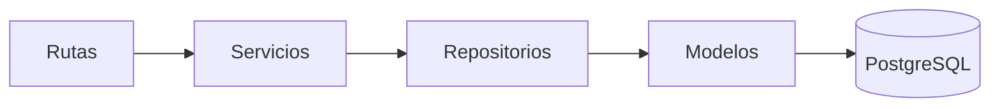
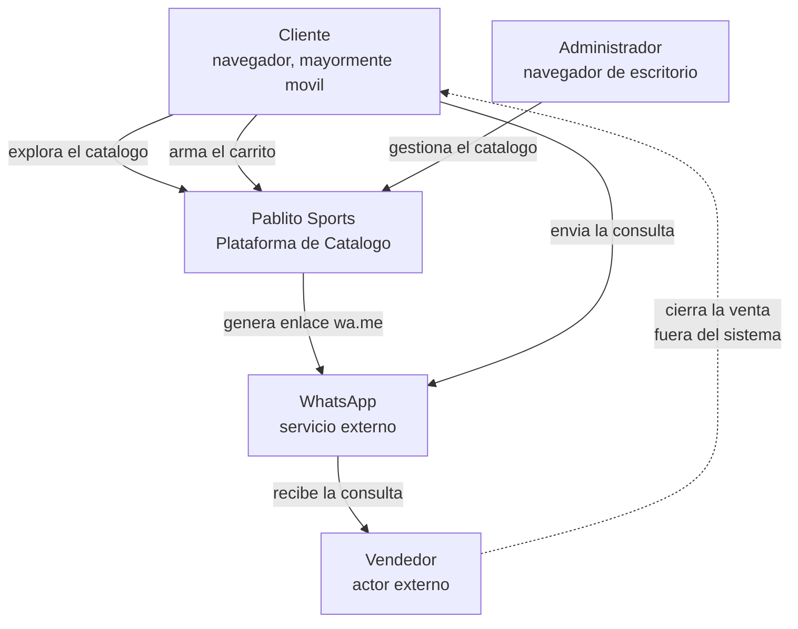
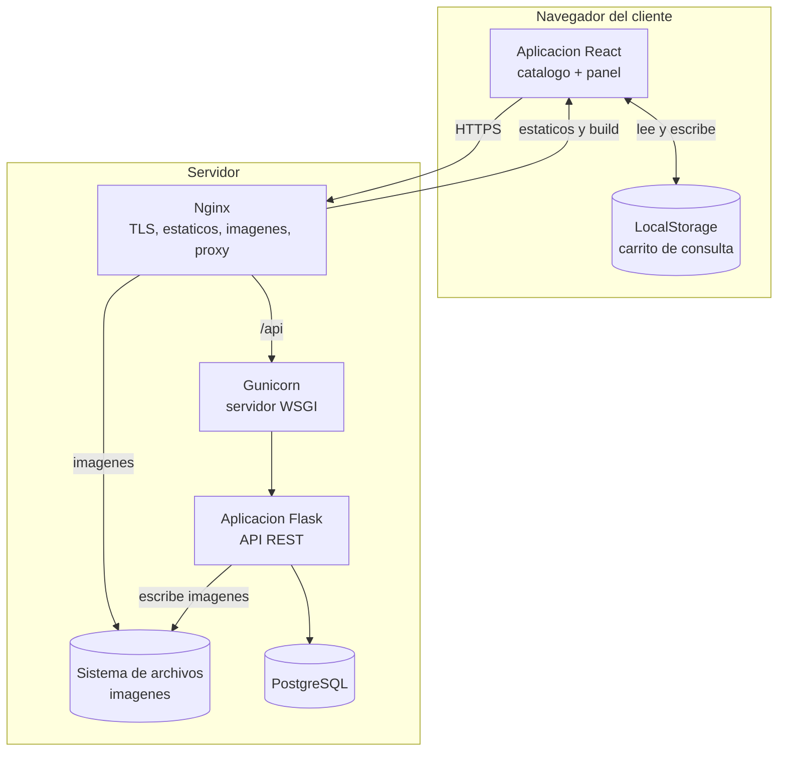
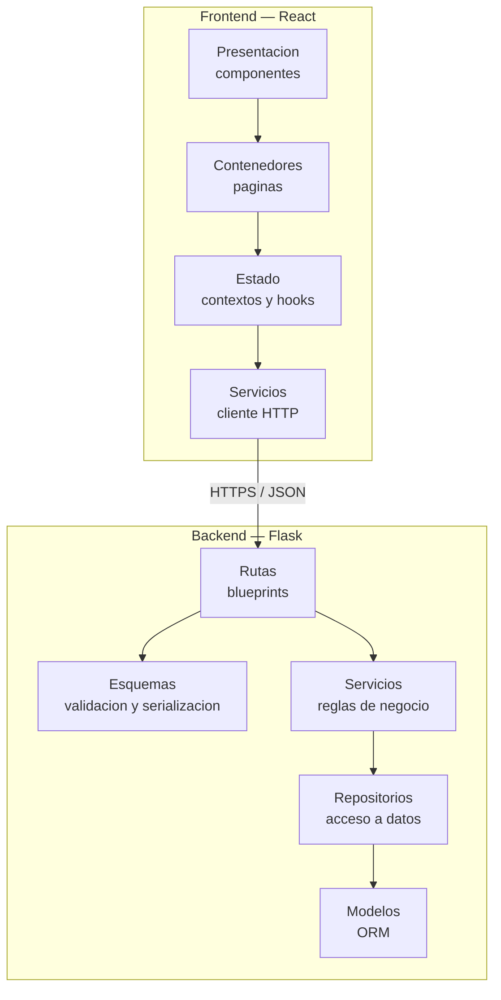
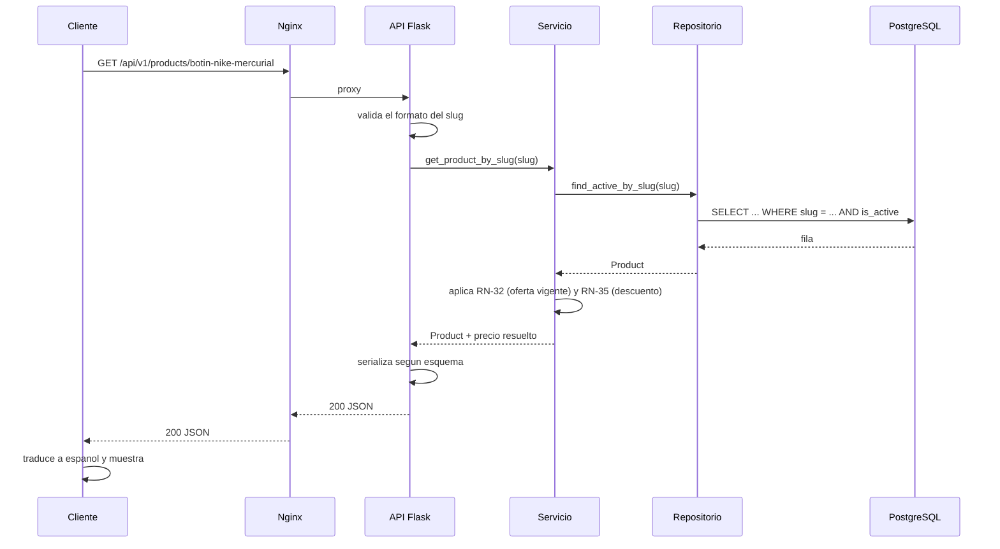
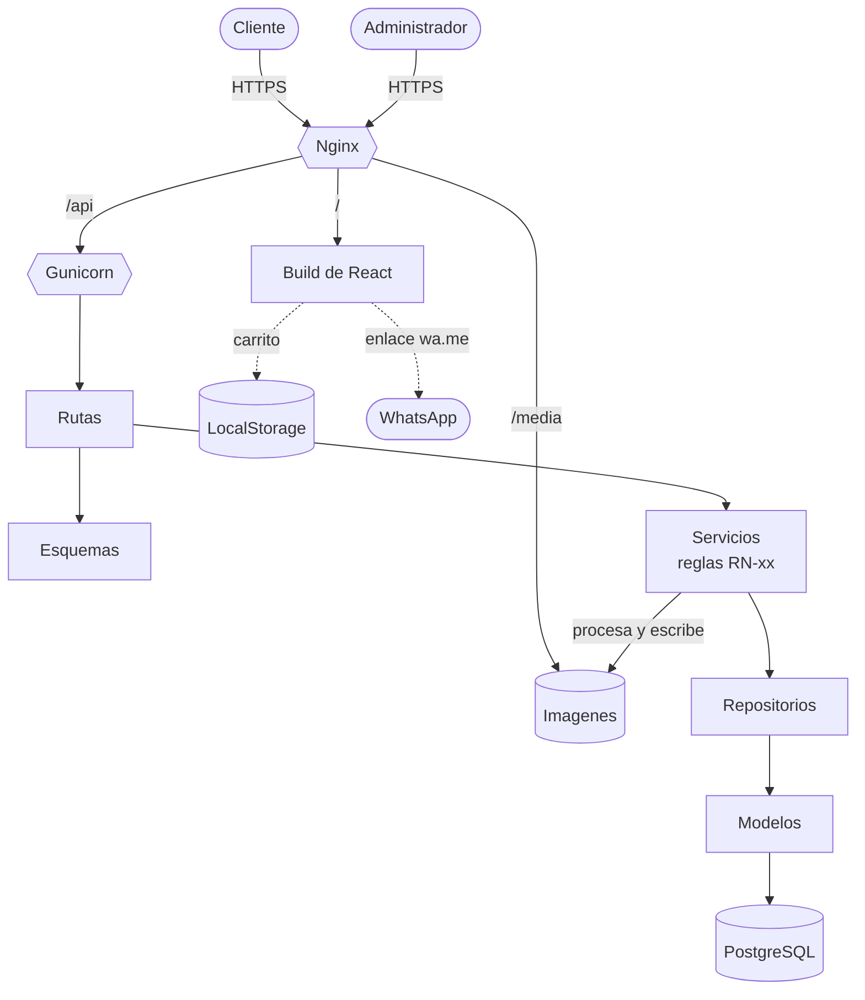
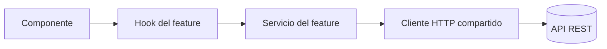
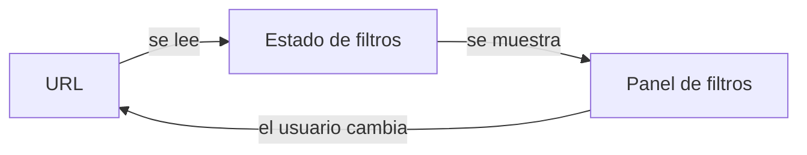
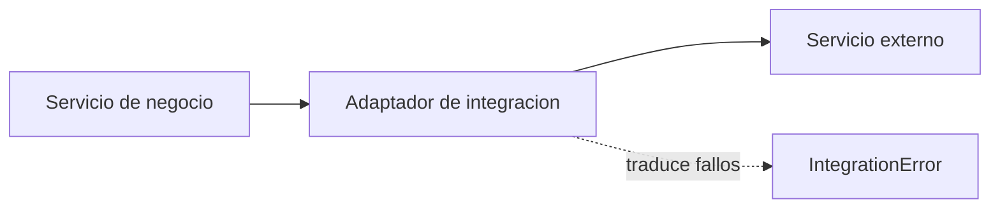
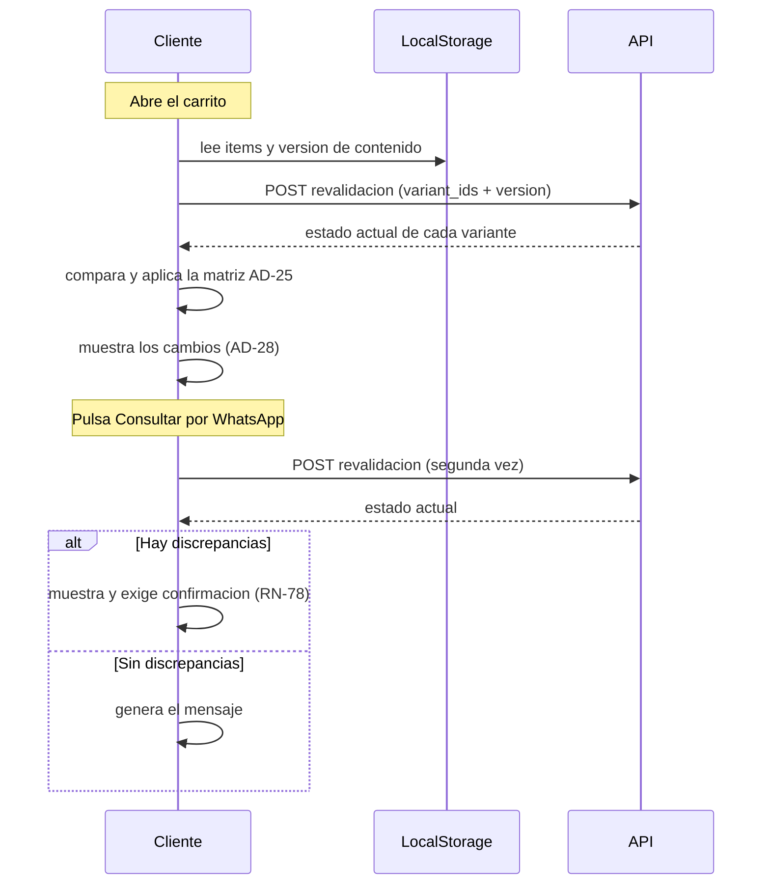

# 02_ARQUITECTURA.md

---

# 1. Información

| Campo | Valor |
|---|---|
| **Proyecto** | Pablito Sports |
| **Sistema** | Plataforma de Catálogo Comercial |
| **Documento** | Arquitectura del Sistema |
| **Código** | 02 |
| **Versión** | 0.9.2 |
| **Estado** | 🔒 ARCHITECTURE FREEZE CANDIDATE — 27 secciones completas |
| **Fecha** | 02/09/2026 |
| **Documentos previos** | [00_VISION_PROYECTO.md](00_VISION_PROYECTO.md) ✅ · [00.2_GLOSARIO.md](00.2_GLOSARIO.md) ✅ · [00.3_NOMENCLATURA.md](00.3_NOMENCLATURA.md) ✅ · [01_ANALISIS_NEGOCIO.md](01_ANALISIS_NEGOCIO.md) ✅ |
| **Documento complementario** | [02.1_DECISIONES_ARQUITECTONICAS.md](02.1_DECISIONES_ARQUITECTONICAS.md) — registro ADR |
| **Documentos dependientes** | `03_SEGURIDAD.md`, `04_BASE_DATOS.md`, `05_API.md`, `06_FRONTEND.md`, `07_PANEL_ADMIN.md`, `08_UI_SYSTEM.md`, `09_COMPONENTES.md`, `10_IMPLEMENTACION.md`, `11_TESTING.md`, `12_DEPLOY.md`, `99_AI_DEVELOPMENT_GUIDE.md` |

## 1.1 Cómo leer este documento

| Si buscás… | Ver sección |
|---|---|
| Por qué el sistema está construido así | 6 — Filosofía Arquitectónica |
| Cómo se divide el sistema | 7 — Arquitectura General |
| Qué hace cada capa y qué no | 6.8 y 7.3 |
| Por qué se eligió una tecnología | 7.7 y 21 — Decisiones |
| Cómo nombrar algo | `00.3_NOMENCLATURA.md` |

## 1.2 Estado de redacción

Este documento se redacta **por bloques**, con revisión entre cada uno. El detalle está en la sección **Plan de Redacción**, al final del archivo.

Las secciones 8 a 26 conservan su índice aprobado y aún no tienen contenido.

---

# 2. Objetivo

## 2.1 Propósito

Definir la **estructura técnica** de Pablito Sports: sus capas, sus fronteras, su comunicación interna y los principios que gobiernan toda decisión posterior.

`01_ANALISIS_NEGOCIO.md` establece **qué** debe hacer el sistema. Este documento establece **cómo se organiza** para hacerlo.

## 2.2 Qué decide este documento y qué deja a documentos posteriores

| Este documento decide | Se detalla en |
|---|---|
| Las capas del sistema y sus responsabilidades | — |
| La comunicación entre capas | — |
| El stack tecnológico y su justificación | — |
| Los principios y objetivos que guían toda decisión técnica | — |
| Dónde vive cada tipo de lógica | — |
| La estrategia de seguridad | `03_SEGURIDAD.md` |
| El modelo físico de datos | `04_BASE_DATOS.md` |
| El contrato de la API | `05_API.md` |
| La implementación del frontend | `06_FRONTEND.md` |
| El inventario de componentes | `09_COMPONENTES.md` |
| Las instrucciones operativas de implementación | `99_AI_DEVELOPMENT_GUIDE.md` |

**Regla:** este documento define la **estrategia**; los posteriores desarrollan el **detalle**. Ningún documento posterior puede contradecir una decisión `AD-xx` sin una nueva versión mayor de este.

## 2.3 Carácter vinculante

Toda decisión registrada aquí es de cumplimiento obligatorio. Las decisiones se registran con prefijo `AD-` e incluyen contexto, opciones evaluadas, justificación y consecuencias.

El propósito del registro es **no reabrir el mismo debate seis meses después**. Si una decisión debe cambiar, se cambia explícitamente, con su justificación, y se documenta el impacto.

---

# 3. Alcance

## 3.1 Incluye

- Principios y objetivos arquitectónicos.
- Vistas de contexto, contenedores y capas.
- Arquitectura del frontend, del backend, de la API y de los datos.
- Arquitectura del carrito, del panel administrativo y de las imágenes.
- Estrategia de seguridad a nivel arquitectónico.
- Flujos de datos de los procesos principales.
- Organización del proyecto, patrones de diseño y escalabilidad.
- Registro de decisiones de arquitectura.

## 3.2 No incluye

- Diseño visual, tipografía y color → `08_UI_SYSTEM.md`
- Implementación concreta de cada pantalla → `06_FRONTEND.md`, `07_PANEL_ADMIN.md`
- Definición de tablas, columnas e índices → `04_BASE_DATOS.md`
- Especificación endpoint por endpoint → `05_API.md`
- Estrategia de pruebas → `11_TESTING.md`
- Infraestructura de despliegue → `12_DEPLOY.md`

## 3.3 Horizonte temporal

La arquitectura se diseña para la **versión 1** definida en `00_VISION_PROYECTO.md` §3.

Los puntos de extensión previstos en §11 de ese documento —pagos, clientes registrados, favoritos, inventario, múltiples sucursales, multiidioma, multimoneda, API pública y aplicación móvil— **no se implementan**, pero la arquitectura **no debe impedirlos**.

Distinción que este documento sostiene en todo momento:

| | Significado |
|---|---|
| **Implementar** | Construirlo ahora. |
| **Preparar** | Diseñar hoy para que la incorporación futura sea aditiva y no estructural. |
| **No impedir** | No tomar decisiones que cierren la puerta, sin invertir esfuerzo hoy. |

La mayor parte de las extensiones futuras cae en **no impedir**. Solo `DN-01` (Variante modelada) cae en **preparar**.

---

# 4. Definiciones

El vocabulario de negocio se define en **[00.2_GLOSARIO.md](00.2_GLOSARIO.md)**. La nomenclatura técnica, en **[00.3_NOMENCLATURA.md](00.3_NOMENCLATURA.md)**. Este documento no redefine ninguno de los dos.

## 4.1 Términos de arquitectura

| Término | Definición en este proyecto |
|---|---|
| **Contenedor** | Unidad desplegable y ejecutable por separado: la aplicación web, la API, la base de datos, el servidor de archivos. No se refiere a contenedores de virtualización. |
| **Capa** | Agrupación horizontal de responsabilidades dentro de un contenedor. Ejemplo: rutas, servicios, repositorios. |
| **Módulo** | Agrupación vertical por dominio dentro de una capa. Ejemplo: el módulo de productos, el de promociones. |
| **Ruta** | Punto de entrada HTTP. Traduce petición a llamada de servicio y resultado a respuesta. No contiene lógica de negocio. |
| **Servicio** | Unidad donde vive la lógica de negocio. Es donde se implementan las reglas `RN-xx`. Desconoce HTTP. |
| **Repositorio** | Unidad de acceso a datos. Traduce intenciones del servicio a consultas. Es lo único que conoce el ORM. |
| **Modelo** | Representación de una entidad persistente. |
| **Esquema** | Definición de validación y serialización de datos de entrada y salida. |
| **Capa de presentación** | Frontera donde los valores internos se traducen a lenguaje del cliente. Único lugar donde `low_stock` se convierte en "Poco stock". |
| **Punto de extensión** | Lugar del diseño donde una funcionalidad futura puede incorporarse sin reestructurar. |
| **Decisión de arquitectura (`AD-xx`)** | Elección técnica registrada con contexto, opciones, justificación y consecuencias. |

---

# 5. Responsabilidades

## 5.1 Propiedad de cada capa

| Capa | Responsable de | **No** responsable de |
|---|---|---|
| **Presentación** (componentes React) | Mostrar datos, capturar interacción, traducir valores internos a español | Lógica de negocio, acceso directo a la API |
| **Estado del cliente** (contextos y hooks) | Carrito, filtros activos, sesión del panel | Reglas de precios o disponibilidad |
| **Servicios del frontend** | Hablar con la API, manejar errores de red | Decidir qué es válido según el negocio |
| **Rutas** (backend) | Recibir HTTP, validar formato, delegar, responder | Reglas `RN-xx`, consultas a la base de datos |
| **Servicios** (backend) | **Todas las reglas de negocio** | HTTP, SQL, formato de respuesta |
| **Repositorios** | Consultas y persistencia | Decisiones de negocio |
| **Modelos** | Estructura de los datos | Comportamiento de negocio complejo |
| **Nginx** | TLS, archivos estáticos, imágenes, proxy, **derivación de rastreadores** (`AD-09`) | Lógica de aplicación |

> **Precisión — Architecture Review v1, hallazgo `M-06`.** La derivación de rastreadores de `AD-09` hace que Nginx decida **qué representación** recibe cada cliente, lo que roza la frontera de "lógica de aplicación" que esta tabla le prohíbe.
>
> Se admite como **excepción declarada y acotada**: Nginx decide sobre un único criterio —naturaleza del agente— y sobre un único conjunto de rutas. No conoce el dominio, no consulta datos y no altera contenido. Cualquier ampliación de ese criterio sería una violación de la tabla y exigiría decisión propia.
>
> El detalle de la superficie y la fragilidad de la lista de agentes se tratan en §16.1.

## 5.2 Quién puede modificar una decisión de arquitectura

| Acción | Requiere |
|---|---|
| Proponer una decisión nueva | Cualquier participante |
| Aprobar una decisión `AD-xx` | Responsable del proyecto |
| Contradecir una decisión aprobada | Nueva versión **mayor** de este documento |
| Aplicar una decisión aprobada | Implementador, sin consulta adicional |

## 5.3 Proceso de cambio arquitectónico

```
Se detecta que una decisión AD-xx ya no sirve
   ↓
Se documenta el motivo y el impacto en documentos aprobados
   ↓
Se propone la decisión de reemplazo
   ↓
Aprobación del responsable del proyecto
   ↓
Nueva versión mayor de 02_ARQUITECTURA.md
   ↓
Actualización de los documentos afectados
```

**Nunca se modifica una decisión en silencio.** La decisión anterior permanece en el registro, marcada como reemplazada, con la referencia a la que la sustituye.

---

# 6. Filosofía Arquitectónica

## 6.1 Origen

Esta filosofía deriva de `00_VISION_PROYECTO.md` §14.1 y §15.2. Aquello enunciaba principios; esta sección los convierte en **reglas verificables**.

Un principio que no puede verificarse es una declaración de intenciones. Cada principio y cada objetivo de esta sección incluye **cómo se comprueba** y **cuál es la señal de que se está incumpliendo**.

## 6.2 Principios Arquitectónicos

Prefijo `PA-`. Gobiernan **toda decisión técnica** del proyecto.

### PA-01 · Documentation First

**Qué significa.** Ninguna funcionalidad se implementa sin especificación aprobada previamente.

**Cómo se verifica.** Todo código implementado es rastreable hasta un `RF-xx` o `RN-xx` de un documento aprobado.

**Señal de incumplimiento.** Existe código que nadie puede explicar señalando un documento.

---

### PA-02 · Separation of Concerns

**Qué significa.** Cada unidad del sistema resuelve un solo tipo de problema. La presentación no decide reglas; los servicios no conocen HTTP; los repositorios no deciden nada.

**Cómo se verifica.** Un cambio en una preocupación no obliga a tocar código de otra. Cambiar el formato de una respuesta JSON no debe requerir modificar un servicio.

**Señal de incumplimiento.** Una ruta que consulta la base de datos. Un componente que calcula un descuento.

---

### PA-03 · Single Responsibility

**Qué significa.** Cada módulo, clase y función tiene una única razón para cambiar.

**Cómo se verifica.** La responsabilidad de una unidad se describe en una frase sin la palabra "y".

**Señal de incumplimiento.** "Este servicio valida el producto **y** genera la miniatura **y** notifica el cambio de precio."

---

### PA-04 · Modularidad

**Qué significa.** El sistema se organiza en módulos por dominio, con fronteras explícitas. Un módulo se entiende, se prueba y se modifica sin leer los demás.

**Cómo se verifica.** Se puede describir qué hace el módulo de promociones sin mencionar el de imágenes.

**Señal de incumplimiento.** Un cambio en promociones rompe pruebas de productos.

---

### PA-05 · API First

**Qué significa.** El contrato de la API se define **antes** de implementar frontend o backend. La API es el punto de acuerdo entre ambos, no un subproducto del backend.

**Cómo se verifica.** El frontend puede desarrollarse contra el contrato antes de que exista la implementación real.

**Señal de incumplimiento.** El contrato se descubre leyendo el código del backend.

**Consecuencia práctica.** `05_API.md` se aprueba antes de `06_FRONTEND.md`. Es un punto de extensión directo hacia la API pública y la aplicación móvil previstas en `00_VISION_PROYECTO.md` §10.

---

### PA-06 · Security First

**Qué significa.** La seguridad es una condición de diseño, no una capa que se agrega al final. Toda entrada es no confiable hasta ser validada; todo acceso es denegado hasta ser autorizado.

**Cómo se verifica.** Cada endpoint declara explícitamente si es público o privado. Ningún dato de entrada llega a un servicio sin validación previa.

**Señal de incumplimiento.** Un endpoint privado que resulta accesible porque nadie recordó protegerlo.

**Consecuencia práctica.** El valor por defecto es siempre el más restrictivo.

---

### PA-07 · Mobile First

**Qué significa.** El diseño parte de la pantalla pequeña y se amplía hacia arriba, no al revés.

**Cómo se verifica.** Los estilos base corresponden al móvil; los `media query` agregan, no corrigen.

**Señal de incumplimiento.** Una hoja de estilos que empieza describiendo el escritorio y luego lo desarma para móvil.

**Por qué.** El tráfico del catálogo será mayoritariamente móvil: el cliente llega desde WhatsApp y vuelve a WhatsApp (`RNF-06`).

---

### PA-08 · Responsive First

**Qué significa.** La interfaz se adapta de forma continua a cualquier ancho, sin puntos de quiebre que dejen huecos.

**Relación con PA-07.** Mobile First es el **método**; Responsive es el **resultado exigido**. No son sinónimos: se puede diseñar mobile-first y aun así producir una interfaz que se rompe en tablet.

**Cómo se verifica.** No existe ancho entre 320 px y 2560 px donde la interfaz se rompa o produzca desplazamiento horizontal.

---

### PA-09 · Escalabilidad

**Qué significa.** El crecimiento del catálogo no debe degradar la experiencia (`RNF-04`).

**Cómo se verifica.** Ninguna operación crece de forma lineal con el tamaño del catálogo en la ruta que ve el cliente. Toda lista está paginada; toda búsqueda usa índice.

**Señal de incumplimiento.** Un endpoint que devuelve "todos los productos".

---

### PA-10 · Configuración sobre hardcode

**Qué significa.** Todo valor que el negocio pueda querer cambiar es configuración, no constante en el código.

**Cómo se verifica.** Cambiar el número de WhatsApp, la plantilla del mensaje, la cantidad de destacados o el plazo de expiración del carrito **no requiere desplegar**.

**Señal de incumplimiento.** Un número de teléfono escrito dentro de un componente.

**Consecuencia práctica.** Se distinguen tres niveles:

| Nivel | Quién lo cambia | Ejemplo |
|---|---|---|
| **Configuración de negocio** | Administrador, desde el panel | Número de WhatsApp, plantilla del mensaje, cantidad de destacados |
| **Configuración de entorno** | Operador, en el despliegue | Credenciales, rutas, orígenes permitidos |
| **Constante de código** | Desarrollador | `MAX_CART_QUANTITY = 99` (`RN-54`) |

Una regla de negocio con identificador `RN-xx` **no** es configuración: cambiarla exige cambiar el documento.

---

### PA-11 · Simplicidad antes que sofisticación

**Qué significa.** Ante dos soluciones que resuelven el problema, se elige la más simple. La complejidad se admite solo cuando un requisito la exige, y se documenta cuál.

**Cómo se verifica.** Toda pieza compleja del sistema puede señalar el `RF-xx`, `RN-xx` o `RNF-xx` que la justifica.

**Señal de incumplimiento.** Una abstracción con una sola implementación, creada "por si acaso".

---

### PA-12 · Evolución sin ruptura

**Qué significa.** Toda decisión arquitectónica debe permitir **agregar** funcionalidad nueva sin **rediseñar** módulos existentes.

**Cómo se verifica.** Incorporar una entidad nueva no obliga a modificar los servicios de las entidades ya existentes. La extensión es aditiva.

**Señal de incumplimiento.** Agregar un campo obliga a tocar las cuatro capas y tres módulos que nada tienen que ver.

**Ejemplo del horizonte real del proyecto:**

```
Hoy                    Mañana
Producto        →      Producto
                       ↓
                       Inventario
                       ↓
                       Pedidos
                       ↓
                       Facturación
```

Ninguna de esas incorporaciones debería obligar a reescribir el módulo de productos.

**Tensión con `PA-11`, y cómo se resuelve.** `PA-11` prohíbe generalizar por anticipado; `PA-12` exige no cerrar puertas. No se contradicen porque operan sobre cosas distintas:

| | Exige |
|---|---|
| `PA-11` | No **implementar** lo que no se necesita hoy |
| `PA-12` | Que lo que se necesite mañana entre de forma **aditiva** |

Aplicación concreta: no se construye un motor de promociones (`PA-11`, `DN-03`), pero el modelo de promociones no debe impedir que se agregue uno (`PA-12`).

---

## 6.3 Objetivos Arquitectónicos

Prefijo `OA-`. Son las **metas de calidad** del sistema. Toda decisión `AD-xx` debe justificarse señalando qué objetivos favorece y cuáles sacrifica.

| ID | Objetivo | Definición operativa | Cómo se verifica |
|---|---|---|---|
| **OA-01** | **Alta cohesión** | Todo lo que cambia junto vive junto. Un módulo agrupa elementos que comparten una razón de existir. | Al implementar un `RF-xx`, los archivos tocados están agrupados, no dispersos por todo el proyecto. |
| **OA-02** | **Bajo acoplamiento** | Los módulos de una misma capa dependen entre sí lo mínimo posible. | Se puede modificar el módulo de banners sin abrir el de productos. |
| **OA-03** | **Desacoplado** | Las capas dependen de contratos, no de implementaciones concretas. Distinto de OA-02: aquel es **horizontal** entre módulos; este es **vertical** entre capas y respecto de la tecnología. | Se puede reemplazar el almacenamiento de imágenes en disco por almacenamiento externo tocando una sola capa. |
| **OA-04** | **Escalable** | El sistema absorbe el crecimiento del catálogo sin rediseño estructural. | `RNF-02` se sigue cumpliendo al multiplicar por diez el catálogo. |
| **OA-05** | **Testeable** | La lógica de negocio se prueba sin levantar el servidor, sin navegador y sin base de datos real. | Los servicios se prueban con dependencias sustituidas. |
| **OA-06** | **Mantenible** | Un cambio requiere entender una parte, no el todo. | Alguien que no escribió el código puede localizar dónde vive una regla `RN-xx` en menos de un minuto. |
| **OA-07** | **Seguro** | El comportamiento por defecto es el más restrictivo. | Un endpoint nuevo sin declaración explícita es privado, no público. |
| **OA-08** | **Predecible** | Situaciones equivalentes se resuelven de forma equivalente en todo el sistema. | Todos los errores tienen el mismo formato; todos los listados paginan igual; todos los nombres siguen `00.3`. |
| **OA-09** | **Observable** | El sistema permite responder **qué pasó, cuándo, quién lo hizo y por qué falló**, sin depender de reproducir el problema. | Ante un error reportado por el administrador, la operación puede reconstruirse desde los registros sin pedirle que lo repita. |

### OA-09 · Observabilidad desde el primer día

No significa incorporar herramientas de monitoreo. Significa **diseñar el sistema para que sea observable**, decisión que es cara de tomar después y barata de tomar ahora.

```
Registros (logs)
   ↓
Errores correlacionables
   ↓
Eventos de negocio
   ↓
Auditoría
   ↓
Diagnóstico
```

| Elemento | Qué exige a la arquitectura |
|---|---|
| **Registros** | Estructurados y con contexto suficiente, no cadenas sueltas. |
| **Errores** | Identificador correlacionable entre lo que ve el usuario y lo que queda registrado. |
| **Eventos de negocio** | Las operaciones relevantes dejan rastro. `RN-70` (historial de precios) es el primer caso y ya está exigido por el negocio. |
| **Auditoría** | Quién hizo qué y cuándo, en las operaciones del panel. |
| **Diagnóstico** | Poder distinguir un fallo de red de un fallo de aplicación y de un fallo de datos. |

**Qué se decide ahora:** que estos puntos existan y dónde viven (§9.13 y §23.4).
**Qué no se decide ahora:** con qué herramientas se recogen y se consultan. Eso corresponde a `12_DEPLOY.md`.

> **Regla de justificación.** Toda decisión `AD-xx` declara: qué objetivos favorece, qué objetivos sacrifica, y por qué el intercambio es aceptable. Una decisión que "no sacrifica nada" está mal analizada.

## 6.4 Separación estricta de responsabilidades

La lógica de negocio vive en **un solo lugar**: la capa de servicios del backend.

| Dónde **no** vive una regla de negocio | Por qué |
|---|---|
| En un componente React | El cliente puede desactivarla |
| En una ruta HTTP | Se duplica en cada endpoint que la necesite |
| En un modelo o en la base de datos | Queda invisible y no se puede probar sin base de datos |
| En una consulta SQL | Deja de ser legible y de ser rastreable a un `RN-xx` |

**Excepción admitida:** validaciones duplicadas en el frontend **por experiencia de usuario**. Nunca son la única defensa. El backend valida siempre, aunque el frontend ya lo haya hecho.

Ejemplo con `RN-16` (selección obligatoria de variante): el frontend deshabilita el botón para que el cliente entienda qué falta; el backend rechaza igual la petición si llega sin variante.

## 6.5 Simplicidad antes que sofisticación

Aplicación concreta de `PA-11` a este proyecto:

| Se hace | No se hace | Por qué |
|---|---|---|
| Consultas directas al ORM | Capa de abstracción sobre el ORM | `PA-11` — no hay requisito de cambiar de ORM |
| Estado del carrito en el navegador | Carrito persistido en servidor | `RN-52` — el negocio no lo necesita |
| Imágenes en sistema de archivos | Almacenamiento de objetos | `PA-11` — una sola sucursal, un solo servidor |
| Descuento simple | Motor de reglas de promociones | `DN-03` |
| Variante como entidad modelada | Variante como texto en el ítem | `DN-01` — único caso donde se paga complejidad hoy |

## 6.6 Criterio de decisión ante alternativas

Cuando dos opciones son técnicamente viables, se aplica este orden:

```
1. ¿Alguna viola un principio PA-xx?
      → Se descarta.
2. ¿Alguna favorece más objetivos OA-xx sin sacrificar otros?
      → Se elige.
3. ¿Alguna es significativamente más simple? (PA-11)
      → Se elige.
4. ¿Alguna es más convencional en el ecosistema del stack?
      → Se elige.
5. Empate.
      → Decide el responsable del proyecto y se registra como AD-xx.
```

El paso 4 no es menor: la solución convencional tiene documentación, ejemplos y respuestas de la comunidad. Es el mismo razonamiento que llevó a `GL-10` (código en inglés).

## 6.7 Qué se optimiza y qué se sacrifica

Toda arquitectura elige. Estas son las elecciones de Pablito Sports, declaradas de forma explícita:

| Se optimiza | Se sacrifica | Justificación |
|---|---|---|
| Velocidad de lectura del catálogo | Velocidad de escritura del panel | El catálogo lo leen todos los clientes; el panel lo usa una persona por día. |
| Simplicidad operativa | Elasticidad automática | Una sucursal, un servidor, tráfico previsible. |
| Claridad del código | Concisión | El proyecto se mantendrá durante años, posiblemente por otras personas. |
| Consistencia | Optimización puntual | `OA-08`: es preferible que todo funcione igual a que una parte funcione mejor. |
| Preparación mínima para el futuro | Generalidad anticipada | `PA-11`: solo `DN-01` justificó pagar complejidad por anticipado. |

## 6.8 Reglas de dependencia entre capas

Regla fundamental del sistema. **Las dependencias apuntan en una sola dirección.**



| Regla | Enunciado |
|---|---|
| **DEP-01** | Una ruta **solo** puede llamar a servicios. Nunca a repositorios ni a modelos. |
| **DEP-02** | Un servicio **nunca** conoce HTTP: no recibe ni devuelve peticiones, respuestas ni códigos de estado. |
| **DEP-03** | Un servicio accede a datos **solo** a través de repositorios. |
| **DEP-04** | Un repositorio **no** contiene reglas de negocio. Recibe criterios, devuelve datos. |
| **DEP-05** | Ninguna capa depende de una capa superior. Un servicio no sabe que existen rutas. |
| **DEP-06** | Un servicio puede llamar a otro servicio. Un repositorio **no** puede llamar a otro repositorio. |
| **DEP-07** | El frontend depende **solo** del contrato de la API, nunca de detalles del backend. |

**Prueba práctica de `DEP-02`:** si un servicio pudiera invocarse desde un script de línea de comandos sin adaptarlo, la regla se cumple.

---

# 7. Arquitectura General

## 7.1 Vista de contexto

Quiénes interactúan con el sistema y qué queda fuera de él.



Tres observaciones que condicionan toda la arquitectura:

1. **El vendedor no es usuario del sistema.** Recibe consultas por WhatsApp. El sistema nunca le escribe.
2. **El sistema no envía el mensaje.** Genera un enlace; el cliente confirma el envío desde WhatsApp (`RN-62`). No hay integración con la API de WhatsApp.
3. **La venta ocurre fuera.** El sistema termina en el momento en que el enlace se abre.

## 7.2 Vista de contenedores



| Contenedor | Responsabilidad |
|---|---|
| **Aplicación React** | Interfaz del catálogo y del panel. Estado del cliente. Traducción a español. |
| **LocalStorage** | Único lugar donde vive el carrito (`RN-52`). |
| **Nginx** | Terminación TLS, entrega de estáticos e imágenes, proxy hacia la API. |
| **Gunicorn** | Ejecución de la aplicación Flask en múltiples procesos. |
| **Aplicación Flask** | API REST. Reglas de negocio. Procesamiento de imágenes. |
| **PostgreSQL** | Persistencia del catálogo y la configuración. |
| **Sistema de archivos** | Imágenes originales y derivadas. |

## 7.3 Capas del sistema



**Dónde vive cada cosa:**

| Elemento | Capa |
|---|---|
| Reglas `RN-xx` | Servicios del backend, exclusivamente |
| Traducción `low_stock` → "Poco stock" | Presentación del frontend, exclusivamente |
| Cálculo del total estimado | Servicios del frontend (el carrito no está en el servidor) |
| Validación de formato de entrada | Esquemas del backend |
| Validación de coherencia de negocio | Servicios del backend |
| Composición del mensaje de WhatsApp | Frontend, en un módulo aislado (`R-04`) |

## 7.4 Separación Frontend / Backend

**Decisión `AD-01`.** El sistema se construye como una aplicación de página única desacoplada del backend, que se comunica exclusivamente por API REST.

| Opción evaluada | Resultado |
|---|---|
| Plantillas renderizadas por Flask | ❌ Acopla presentación y lógica; contradice `PA-05` y cierra la puerta a la aplicación móvil prevista |
| SPA React + API REST | ✅ Elegida |
| Renderizado del lado del servidor con framework adicional | ❌ Complejidad no justificada por ningún requisito (`PA-11`) |

**Favorece:** `OA-03` (desacoplamiento), `PA-05` (API First).
**Sacrifica:** SEO, que en una SPA requiere trabajo adicional para cumplir `RNF-10`.
**Mitigación del sacrificio:** resuelta en §8.9. Es un costo aceptado conscientemente, no un descuido.

## 7.5 Comunicación entre capas

| Frontera | Protocolo | Formato |
|---|---|---|
| Navegador ↔ Nginx | HTTPS | HTML, JS, CSS, imágenes |
| Frontend ↔ API | HTTPS | JSON |
| Nginx ↔ Gunicorn | Proxy local | WSGI |
| API ↔ PostgreSQL | Conexión local | SQL vía ORM |
| API ↔ Sistema de archivos | Sistema operativo | Binario |

**Recorrido de una petición típica** — apertura de la ficha de producto:



Obsérvese que la regla `RN-32` se evalúa **en el servicio**, no en la consulta SQL ni en el componente: es la aplicación directa de `DEP-04` y §6.4.

## 7.6 Vista consolidada



## 7.7 Stack tecnológico y justificación

El stack fue fijado en `00_VISION_PROYECTO.md` §9 y `DV-04`. Esta sección registra **por qué** cada elección es adecuada y qué se descartó.

### Frontend

| Tecnología | Rol | Justificación |
|---|---|---|
| **React** | Biblioteca de interfaz | Ecosistema maduro y ampliamente documentado. Modelo de componentes alineado con `PA-04`. |
| **Vite** | Herramienta de construcción | Arranque y recarga rápidos; división de código nativa, necesaria para `RNF-01`. |
| **Bootstrap 5.3** | Sistema de estilos | Cubre `PA-07` y `PA-08` sin construir un sistema de rejilla propio (`PA-11`). Incluye utilidades de accesibilidad que aportan a `RNF-09`. |
| **Axios** | Cliente HTTP | Interceptores para manejo centralizado de errores y de la sesión del panel. |

### Backend

| Tecnología | Rol | Justificación |
|---|---|---|
| **Flask** | Framework web | Minimalista: no impone estructura, lo que permite aplicar la arquitectura en capas de §6.8 sin luchar contra el framework. |
| **SQLAlchemy** | ORM | Estándar del ecosistema Python. Permite consultas explícitas donde el rendimiento lo exija (`PA-09`). |
| **Alembic** | Migraciones | Versionado del esquema con historial reversible. Integración nativa con SQLAlchemy. |
| **PostgreSQL** | Base de datos | Integridad referencial, índices adecuados al filtrado combinado de `RN-46`, y capacidad de búsqueda de texto para `RN-48`. |

### Infraestructura

| Tecnología | Rol | Justificación |
|---|---|---|
| **Gunicorn** | Servidor WSGI | Estándar de producción para Flask. Múltiples procesos. |
| **Nginx** | Proxy y servidor de archivos | Entrega de imágenes y estáticos con cacheo, sin ocupar procesos de aplicación (`PA-09`). Terminación TLS (`RNF-12`). |

### Lo que el stack no incluye, y por qué

| No se incorpora | Motivo |
|---|---|
| Caché en memoria | `RNF-02` es alcanzable con índices adecuados al volumen previsto. Punto de extensión documentado en §21. |
| Cola de tareas | El único proceso pesado es el redimensionado de imágenes, que ocurre en el panel y tolera espera. |
| Contenedores de virtualización | Corresponde a `12_DEPLOY.md`, no a la arquitectura de la aplicación. |
| Framework de renderizado del lado del servidor | `AD-01`. |

> **Biblioteca de gestión de estado global:** decisión **diferida** a `06_FRONTEND.md`. Ver `AD-07`.

### Prohibiciones arquitectónicas

Prefijo `PR-`. Son **restricciones absolutas**: no admiten excepción sin una decisión `AD-xx` que las levante explícitamente.

| ID | Prohibición | Motivo |
|---|---|---|
| **PR-01** | **No jQuery**, ni ninguna manipulación directa del DOM fuera de React. | React es dueño del DOM. Mezclar ambos produce estado inconsistente e imposible de depurar. |
| **PR-02** | **No JavaScript en línea** dentro del HTML. | `PA-06`. Impide aplicar una política de seguridad de contenido estricta. |
| **PR-03** | **No CSS en línea.** Única excepción: valores calculados en tiempo de ejecución, como una posición o un porcentaje. | `OA-08`. El estilo vive en el sistema de estilos; disperso, deja de ser consistente. |
| **PR-04** | **No SQL sin ORM.** Única excepción: consulta de rendimiento justificada, encapsulada en un repositorio y documentada con su motivo. | `OA-03`, `OA-05`. El SQL suelto no se prueba, no se refactoriza y acopla a la base de datos. |
| **PR-05** | **No lógica de negocio en componentes React.** | `AD-03`, `PA-02`. El cliente puede desactivarla; deja de ser una regla. |
| **PR-06** | **No lógica en plantillas.** Las plantillas del mensaje de WhatsApp son **sustitución de variables**, no un lenguaje: sin condicionales, sin bucles, sin cálculos. | `RN-59`, `RN-60`. Una plantilla con lógica es código escrito por quien no puede probarlo. |
| **PR-07** | **No acceso directo a la base de datos desde rutas.** | `DEP-01`. |
| **PR-08** | **No valores de negocio escritos en el código.** | `PA-10`. Extensión directa del principio. |
| **PR-09** | **No secretos en el control de versiones.** | `PA-06`. Extensión directa del principio. |
| **PR-10** | **No incorporar una dependencia nueva sin justificación registrada.** | `PA-11`. Extensión directa del principio. |

`PR-01` a `PR-07` provienen de la revisión del responsable del proyecto. `PR-08` a `PR-10` se derivan de principios ya aprobados y se explicitan aquí para que sean verificables.

Los antipatrones de diseño —distintos de estas prohibiciones tecnológicas— se desarrollan en §20.4.

## 7.8 Entornos

| Entorno | Frontend | Backend | Base de datos | Propósito |
|---|---|---|---|---|
| **Desarrollo** | Servidor de desarrollo de Vite | Flask en modo depuración | PostgreSQL local | Trabajo diario |
| **Producción** | Build estático servido por Nginx | Gunicorn tras Nginx | PostgreSQL del servidor | Operación real |

Reglas comunes a ambos:

- La configuración se toma de **variables de entorno**, nunca del código (`PA-10`).
- Ningún secreto se versiona.
- El esquema de base de datos se aplica **solo** mediante migraciones de Alembic, en ambos entornos.

> La existencia de un entorno de pruebas intermedio queda como pendiente `AP-01` (§26) y se resuelve en `12_DEPLOY.md`.

## 7.9 Qué queda fuera del sistema

| Fuera del sistema | Consecuencia arquitectónica |
|---|---|
| El envío del mensaje de WhatsApp | No hay integración con la API de WhatsApp. Solo se genera un enlace (`RN-62`). |
| La conversación con el vendedor | No hay bandeja de entrada, ni notificaciones, ni estados de consulta. |
| La venta y el pago | No existen entidades de pedido, pago ni factura (`DV-01`). |
| La identidad del cliente | No hay registro, sesión ni datos personales del cliente (`RN-63`). |
| El stock real | No hay inventario. Solo un estado comercial (`RN-39`). |

Esta lista explica **ausencias deliberadas** del modelo. Si en un documento posterior aparece una entidad `Order`, `Payment` o `Customer` persistida, contradice esta sección.

## 7.10 Decisiones tomadas en este bloque

Resumen. **El registro completo —contexto, alternativas evaluadas, consecuencias e historial— vive en [02.1_DECISIONES_ARQUITECTONICAS.md](02.1_DECISIONES_ARQUITECTONICAS.md).**

| ID | Decisión | Estado | Favorece | Sacrifica |
|---|---|---|---|---|
| **AD-01** | SPA React desacoplada, comunicación exclusiva por API REST. | ✅ Aceptada | `OA-03`, `PA-05` | SEO (`RNF-10`), mitigado en §8.9 |
| **AD-02** | Backend en capas: rutas → servicios → repositorios → modelos, con dependencias unidireccionales (`DEP-01` a `DEP-07`). | ✅ Aceptada | `OA-01`, `OA-05`, `OA-06` | Más archivos por funcionalidad |
| **AD-03** | La lógica de negocio reside **exclusivamente** en la capa de servicios. | ✅ Aceptada | `OA-05`, `OA-06`, `PA-02` | Duplicación deliberada de validaciones en el frontend |
| **AD-04** | Nginx sirve estáticos e imágenes; Gunicorn atiende únicamente `/api`. | ✅ Aceptada | `PA-09`, `OA-04` | Una pieza más de infraestructura que configurar |
| **AD-05** | Las imágenes se almacenan en el sistema de archivos, no en la base de datos. | ✅ Aceptada | `PA-11`, `PA-09` | Respaldo en dos lugares distintos (`RNF-16`) |
| **AD-06** | El carrito no tiene representación en el servidor. | ✅ Aceptada | `PA-11`, `RN-52` | Obliga a la revalidación de `RN-56` |
| **AD-07** | **La arquitectura se diseña sin depender de una biblioteca global de estado.** La implementación concreta —React Context, Zustand u otra— queda **diferida** a `06_FRONTEND.md`. La arquitectura no deberá impedir ninguna de esas opciones. | ⏸️ **Diferida** | `PA-12` | Ninguno: no se cierra ninguna puerta |

---

---

# 8. Arquitectura Frontend

## 8.1 Filosofía de la arquitectura frontend

### Alcance de esta sección

| Documento | Responde |
|---|---|
| **`02_ARQUITECTURA.md` §8** | **Cómo está diseñado** el frontend: su organización, sus fronteras, dónde vive cada tipo de estado, qué puede y qué no puede hacer cada pieza. |
| `06_FRONTEND.md` | **Cómo se implementa**: componentes concretos, rutas concretas, bibliotecas concretas. |

El diseño del frontend es una decisión arquitectónica y se toma aquí. `06_FRONTEND.md` no puede contradecirlo.

### Principios propios del frontend

| # | Principio | Deriva de |
|---|---|---|
| 1 | **El frontend no decide reglas de negocio.** Las muestra, las anticipa por experiencia de usuario, pero nunca es su fuente de verdad. | `AD-03`, `PR-05` |
| 2 | **El frontend no conoce la base de datos.** Habla con DTOs, no con modelos. | `AD-12` |
| 3 | **La organización sigue al dominio, no al tipo de archivo.** | `AD-08`, `OA-01` |
| 4 | **Todo lo que el cliente ve está en español.** La traducción ocurre en presentación, en un solo lugar. | `GL-10`, `NM-01` |
| 5 | **Se optimiza la primera pantalla del catálogo.** Es la que decide si el cliente sigue o se va. | `RNF-01`, `PA-07` |
| 6 | **Ningún componente depende de una biblioteca de estado global.** | `AD-07` |

---

## 8.2 Arquitectura por features

### La decisión

**`AD-08`.** El frontend se organiza **por features** (dominio), no por tipo de archivo.

| Enfoque | Qué agrupa | Descartado porque |
|---|---|---|
| **Type-first** — `components/`, `hooks/`, `services/`, `types/` en la raíz | Archivos del mismo tipo | Un cambio en "productos" obliga a abrir cinco directorios. Viola `OA-01`: lo que cambia junto no vive junto. |
| **Feature-first puro** — sin zona común | Todo por dominio | Duplica lo genuinamente transversal: el cliente HTTP, el sistema de diseño, los formateadores. |
| **Feature-first + `shared/`** | Dominio, con zona común explícita | ✅ **Elegida.** |

### Estructura

```
src/
├── features/
│   ├── catalog/          # listado, búsqueda, filtros, orden
│   ├── products/         # ficha, galería, selección de variante
│   ├── cart/             # carrito de consulta, revalidación, WhatsApp
│   ├── brands/
│   ├── categories/
│   ├── store/            # información institucional, banners
│   └── admin/            # panel administrativo completo
│
├── shared/
│   ├── components/       # sistema de diseño, elementos sin dominio
│   ├── layouts/          # estructuras de página
│   ├── hooks/            # hooks transversales
│   ├── services/         # cliente HTTP, manejo de errores
│   ├── formatters/       # Gs., fechas, traducción de estados
│   ├── types/            # tipos compartidos
│   └── config/           # constantes y configuración del cliente
│
├── routes/               # composición de rutas públicas y privadas
└── app/                  # arranque, proveedores, límites de error
```

### Anatomía interna de un feature

Dentro de un feature **sí** se organiza por tipo, porque a esa escala la cantidad de archivos es manejable y la agrupación por tipo ayuda:

```
features/products/
├── components/       # ProductDetail, ProductGallery, SizeSelector…
├── hooks/            # useProduct, useProductVariants
├── services/         # llamadas a /api/v1/products
├── types/            # DTOs del dominio de producto
└── index.js          # única superficie pública del feature
```

### Reglas de dependencia del frontend

Extienden las reglas `DEP-01` a `DEP-07` de §6.8.

| Regla | Enunciado |
|---|---|
| **DEP-08** | Un feature **no importa desde el interior** de otro feature. Solo desde su `index`, si ese feature lo expone. |
| **DEP-09** | `shared/` **nunca** importa desde `features/`. La dependencia es unidireccional. |
| **DEP-10** | Ningún componente llama a la API directamente. Pasa por la capa de servicios de su feature. |
| **DEP-11** | Ningún componente importa una biblioteca de estado global de forma directa. Accede mediante un hook propio (`AD-07`). |
| **DEP-12** | Un elemento se promueve a `shared/` **solo cuando lo usan dos o más features**. Hasta entonces vive en el suyo. |

`DEP-12` evita el error más común de esta organización: crear una zona común anticipada que termina siendo un depósito de todo.

### Por qué el frontend y el backend se organizan distinto

No es una inconsistencia, y conviene dejarlo escrito:

| | Eje principal | Por qué |
|---|---|---|
| **Backend** | Capa, con módulos por dominio dentro | La frontera de capa está impuesta por `DEP-01` a `DEP-07` y debe ser **visible en la estructura**. Un archivo en `services/` no puede tocar la base de datos, y eso se ve al mirar dónde está. |
| **Frontend** | Feature, con tipos dentro | No hay capas estrictas equivalentes. Lo que debe ser visible es **a qué parte del producto pertenece cada cosa**. |

---

## 8.3 Estructura de la aplicación React

| Nivel | Responsabilidad | Puede | No puede |
|---|---|---|---|
| **`app/`** | Arranque, proveedores globales, límites de error | Componer el árbol de proveedores | Contener lógica de dominio |
| **`routes/`** | Composición de rutas y protección | Decidir qué se renderiza y con qué guardas | Contener interfaz |
| **Páginas** (dentro del feature) | Orquestar la pantalla | Pedir datos, componer | Formatear, calcular reglas |
| **Componentes de presentación** | Mostrar y capturar interacción | Recibir datos ya listos | Llamar a la API, calcular precios |
| **Hooks del feature** | Datos, estado y efectos del dominio | Hablar con los servicios del feature | Renderizar |
| **Servicios del feature** | Comunicación con la API | Construir peticiones y mapear DTOs | Decidir reglas de negocio |

---

## 8.4 Separación entre catálogo público y panel administrativo

Son dos productos distintos dentro de una misma aplicación.

| | Catálogo público | Panel administrativo |
|---|---|---|
| Usuario | Anónimo | Autenticado |
| Dispositivo | Mayormente móvil | Mayormente escritorio |
| Prioridad | Velocidad de la primera pantalla | Densidad de información y eficiencia |
| Indexable | Sí | **No** (`RNF-13`) |
| Carga | En el arranque | **Diferida** |

**Decisión de empaquetado.** Una sola aplicación, un solo proyecto de construcción, pero el panel se carga de forma **diferida**: el cliente que entra al catálogo **nunca descarga el código del panel**.

Alternativa descartada: dos aplicaciones separadas. Duplicaría el sistema de diseño, el cliente HTTP y los formateadores, a cambio de un beneficio que la división de código ya provee (`PA-11`).

---

## 8.5 Enrutamiento

| Tipo de ruta | Ejemplo | Protección |
|---|---|---|
| Pública | `/`, `/catalogo`, `/producto/:slug` | Ninguna |
| Pública con parámetros | `/catalogo?brand=nike&size=42` | Ninguna. Ver §8.11 |
| Privada | `/admin/*` | Guarda de autenticación |
| Privada por rol | `/admin/usuarios` | Guarda de autenticación **y** de rol (`RN-67`) |

**Reglas.**

1. La guarda de ruta es una **conveniencia de interfaz**, nunca una medida de seguridad. La autorización real la impone el backend en cada endpoint (`PA-06`, `AD-03`).
2. Toda ruta privada carga de forma diferida.
3. Las URL públicas usan el **slug** del producto (`RN-10`), nunca su identificador interno.
4. Las rutas se escriben **en español**: son parte de la interfaz, no del código (`NM-01`).

> **Nota de nomenclatura.** Las rutas de la interfaz (`/producto/:slug`) van en español porque el cliente las ve. Los endpoints de la API (`/api/v1/products`) van en inglés porque el cliente no los ve. No es una contradicción: es exactamente la frontera de `GL-10`.
>
> Los **parámetros de consulta** son un caso intermedio y se rigen por `00.3_NOMENCLATURA.md` §16.5: el **nombre** va en inglés, el **valor** es el slug de la entidad —`?brand=nike`, `?category=botines`— o un identificador técnico si es una enumeración del sistema —`?gender=men`— (`AD-23`).

---

## 8.6 Estrategia de gestión de estado

Esta sección **no elige biblioteca** (`AD-07`). Define **qué tipos de estado existen y dónde vive cada uno**, para que `06_FRONTEND.md` solo tenga que elegir la implementación.

### Los cuatro tipos de estado

| Tipo | Definición | Dónde vive |
|---|---|---|
| **Local** | Lo necesita un solo componente y muere con él. | Estado interno del componente. |
| **Compartido** | Lo necesitan componentes de ramas distintas del árbol. | Proveedor + **hook propio** (`DEP-11`). |
| **Persistente** | Sobrevive a la recarga de la página. | Hook propio con adaptador de almacenamiento. |
| **Derivado** | Se **calcula** a partir de otro estado. | No se almacena: se calcula al renderizar. |

### Clasificación de los ámbitos del proyecto

| Ámbito | Tipo | Fuente de verdad | Observación |
|---|---|---|---|
| Carrito de consulta | **Persistente** | LocalStorage | `RN-52`. Expira a 30 días (`RN-57`). |
| Filtros activos | **Derivado** | **La URL** | `RF-06`. La URL es la fuente de verdad; el estado se deriva de ella, no al revés. |
| Sesión del administrador | **Compartido** | Backend | Expira por inactividad (`RF-28`). |
| Configuración de la tienda | **Estado del servidor** | Backend | Se carga una vez y se cachea. No es estado del cliente. |
| Tema | **Compartido + persistente** | LocalStorage | Preferencia del usuario. |
| Mensajes y notificaciones | **Compartido, efímero** | En memoria | Nunca persiste. |
| Total estimado del carrito | **Derivado** | Ítems del carrito | Nunca se almacena. |
| Cantidad de ítems en la cabecera | **Derivado** | Ítems del carrito | Ídem. |

### Reglas de estado

| Regla | Enunciado | Por qué |
|---|---|---|
| **ES-01** | **El estado derivado nunca se almacena.** Se calcula. | Almacenar el total estimado crea dos fuentes de verdad que se desincronizan. |
| **ES-02** | **El estado del servidor no es estado del cliente.** Los datos del catálogo se piden y se cachean; no se "gestionan". | Confundirlos lleva a replicar la base de datos en memoria del navegador. |
| **ES-03** | **Todo acceso a estado compartido pasa por un hook propio del proyecto.** | `AD-07`. Es lo que permite cambiar de mecanismo sin tocar componentes. |
| **ES-04** | **El estado persistente declara versión y política de expiración.** | Un carrito guardado con un formato viejo debe poder detectarse y descartarse. |
| **ES-05** | **Los filtros viven en la URL, no en memoria.** | `RF-06`: el enlace debe ser compartible y el botón "atrás" debe funcionar. |

`ES-05` tiene una consecuencia que conviene anticipar: **no hace falta un almacén de filtros**. El estado de filtrado se lee de la URL en cada renderizado. Esto elimina una de las seis fuentes de complejidad que motivaban discutir una biblioteca de estado.

---

## 8.7 Capa de servicios y cliente HTTP



| Pieza | Responsabilidad |
|---|---|
| **Cliente HTTP** (`shared/services`) | Base de la URL, tiempos de espera, cabeceras, interceptores, traducción de errores de red |
| **Servicio del feature** | Construir la petición del dominio, mapear el DTO recibido |
| **Hook del feature** | Estados de carga y error, caché, reintentos |
| **Componente** | Consumir el hook, mostrar |

**Interceptores del cliente HTTP:**

1. **Petición** — adjunta credenciales de sesión en rutas privadas; agrega el identificador de correlación.
2. **Respuesta** — normaliza el error al formato uniforme de §9.11; ante expiración de sesión, redirige al acceso del panel.

---

## 8.8 Manejo de errores y estados de carga

| Estado | Qué se muestra |
|---|---|
| **Cargando** | Esqueleto con la forma del contenido final, no un indicador giratorio genérico. Evita el salto de diseño. |
| **Vacío** | Mensaje explicativo y acción sugerida (`RF-14`). |
| **Error recuperable** | Mensaje en español y acción de reintento. |
| **Error no recuperable** | Límite de error de la sección, sin tumbar la aplicación. |
| **Sin conexión** | Mensaje diferenciado. El carrito sigue disponible: vive en el navegador. |

**Reglas.**

1. Ningún error técnico llega al cliente tal cual. El código de error se **traduce** a un mensaje en español (§9.11, `AD-13`).
2. Los límites de error se colocan **por sección**, no solo en la raíz: un fallo en el carrusel de destacados no debe vaciar la página.
3. Todo error mostrado incluye el identificador de la petición cuando existe, para `OA-09`.

---

## 8.9 Estrategia SEO

`AD-01` eligió una aplicación de página única y declaró el SEO como costo aceptado. Esta sección paga esa deuda.

### El caso que más importa no es Google

En este proyecto, el enlace de un producto se comparte **por WhatsApp**: lo comparte el vendedor con un cliente, y el cliente con sus conocidos. Ese es el canal real de distribución.

Y aquí aparece un problema concreto: **el rastreador de WhatsApp no ejecuta JavaScript.** Los metadatos inyectados dinámicamente por React no existen para él. Un enlace compartido se vería sin título, sin descripción y sin imagen.

Google sí ejecuta JavaScript. WhatsApp, Facebook y Telegram, no.

### La decisión

**`AD-09`.** Renderizado del lado del cliente para las personas; **entrega de metadatos pre-renderizados para los rastreadores**.

Nginx detecta peticiones de rastreadores sobre rutas de producto y las deriva a un endpoint del backend que devuelve un documento HTML mínimo con los metadatos correctos. Las personas reciben la aplicación React normal.

| Alternativa | Motivo del descarte |
|---|---|
| Aceptar que los enlaces no muestren vista previa | El canal de distribución del negocio es WhatsApp. Es un costo comercial, no técnico. |
| Migrar a un framework de renderizado del lado del servidor | Cambia el stack aprobado y multiplica la complejidad operativa (`PA-11`). |
| Pre-renderizar en la construcción | El catálogo es dinámico: un producto nuevo no tendría vista previa hasta el próximo despliegue. |
| **Metadatos para rastreadores desde el backend** | ✅ **Elegida.** Unas pocas decenas de líneas resuelven el caso de negocio real. |

### Elementos

| Elemento | Definición |
|---|---|
| **URLs amigables** | `/producto/:slug` con el slug de `RN-10`. Sin identificadores internos, sin parámetros innecesarios. |
| **Metadatos** | Título y descripción propios por producto, categoría y marca. Generados desde los datos, no fijos. |
| **Open Graph** | Título, descripción, imagen principal (`RN-20`), tipo y URL canónica. **Es el elemento de mayor valor comercial del proyecto.** |
| **Datos estructurados** | Esquema de producto con nombre, marca, imagen, precio en `PYG` y disponibilidad. `RNF-10`. |
| **Sitemap** | Generado por el backend a partir de los productos activos (`RN-01`) y las categorías. Se regenera al cambiar el catálogo. |
| **Robots** | Permite el catálogo. **Prohíbe `/admin`** (`RNF-13`). Prohíbe las combinaciones de filtros. |
| **Canónica** | Ver más abajo. |

### El problema de los filtros

`RF-06` exige que los filtros se reflejen en la URL. Eso genera **combinaciones prácticamente infinitas** de URL con contenido casi idéntico: contenido duplicado.

| Tipo de URL | Indexable | Canónica apunta a |
|---|---|---|
| `/producto/:slug` | ✅ Sí | Sí misma |
| `/catalogo` | ✅ Sí | Sí misma |
| `/catalogo/:categoria` | ✅ Sí | Sí misma |
| `/catalogo?brand=…&size=…` | ❌ No | `/catalogo` |
| `/catalogo?pagina=2` | ❌ No | `/catalogo` |
| `/admin/*` | ❌ No | — |

Regla: **solo la ficha de producto y las vistas limpias de catálogo y categoría son indexables.** Toda combinación de filtros lleva marca de no indexación y canónica hacia su vista limpia.

### Estrategia futura

Si el volumen de tráfico orgánico llegara a justificarlo, la migración a renderizado del lado del servidor es un **punto de extensión**, no una reestructuración: `AD-01` ya separó frontend y backend, y `AD-12` ya garantiza que el frontend consume DTOs estables. Queda registrado en §21.

---

## 8.10 Estrategia de rendimiento

**Presupuesto.** `RNF-01` exige LCP inferior a 2,5 s en 4G. De ahí se derivan objetivos verificables:

| Métrica | Objetivo |
|---|---|
| JavaScript inicial de la ruta pública | Lo mínimo necesario para la primera pantalla |
| Código del panel en el paquete público | **Cero** |
| Salto de diseño acumulado | Prácticamente nulo: toda imagen reserva su espacio |
| Imágenes fuera de pantalla en la carga inicial | Ninguna se descarga |

### Técnicas

| Técnica | Aplicación en este proyecto |
|---|---|
| **División de código** | Por ruta. El panel completo es un paquete aparte (`§8.4`). |
| **Carga diferida de rutas** | Todas las rutas salvo la principal y el catálogo. |
| **Carga diferida de imágenes** | Todas las imágenes fuera de la primera pantalla (`RNF-03`). |
| **Suspensión** | Límites por ruta y por sección pesada, acompañando a los límites de error de §8.8. |
| **Imágenes adaptativas** | Los tres tamaños de `RF-33` se ofrecen según el ancho real del dispositivo. Es la optimización de mayor impacto en un catálogo. |
| **Reserva de espacio** | Toda imagen declara su proporción antes de cargar. |
| **Memoización** | **Solo cuando se mide.** Ver la regla siguiente. |
| **Virtualización de listas** | **No en v1.** La paginación de `RF-01` ya acota el tamaño de las listas. Punto de extensión. |

### Regla sobre memoización

**No se memoiza por defecto.** La memoización aplicada de forma preventiva agrega complejidad, oculta errores de dependencias y en listas pequeñas suele costar más de lo que ahorra.

Se memoiza cuando se cumplen las dos condiciones: **hay una medición** que muestra el problema, y **el comentario que acompaña** indica qué se midió. Es la aplicación directa de `PA-11`.

---

## 8.11 Sincronización de filtros con la URL

`RF-06` y `ES-05`. La URL es la **fuente de verdad** del estado de filtrado.



| Regla | Enunciado |
|---|---|
| 1 | Todo filtro activo aparece en la URL. Ningún filtro vive solo en memoria. |
| 2 | El **nombre** del parámetro va en inglés; el **valor** es el slug de la entidad o un identificador técnico si es una enumeración del sistema. Regla completa en `00.3_NOMENCLATURA.md` §16.5 (`AD-23`). |
| 3 | Un cambio de filtro **reemplaza** la entrada del historial; un cambio de página la **agrega**. Así el botón "atrás" hace lo que el usuario espera. |
| 4 | Los filtros sin valor no aparecen en la URL. |
| 5 | El orden de los parámetros es estable, para que la canónica de §8.9 sea determinista. |

---

## 8.12 Organización de carpetas

Ver §8.2. Complementos:

| Regla | Enunciado |
|---|---|
| 1 | Un feature nuevo se crea **completo**: componentes, hooks, servicios, tipos e índice. |
| 2 | Un archivo sin dominio claro **no** va a `shared/` por defecto: se queda donde está hasta que un segundo feature lo necesite (`DEP-12`). |
| 3 | La nomenclatura es la de `00.3_NOMENCLATURA.md` §16.1. |
| 4 | Los nombres de carpeta de feature coinciden con el término del glosario, en inglés y plural. |

---

## 8.13 Estrategia de build con Vite

| Aspecto | Decisión |
|---|---|
| **Salida** | Estáticos servidos por Nginx (`AD-04`). |
| **División** | Automática por ruta, más separación explícita del panel. |
| **Variables de entorno** | Solo valores **públicos**. Ningún secreto llega al paquete (`PR-09`). |
| **Nombres con huella** | Permiten cacheo indefinido de los estáticos. |
| **Modo desarrollo** | Servidor de Vite con proxy hacia la API, para evitar diferencias de CORS con producción. |
| **Comprobación previa** | La construcción falla ante errores de tipo o de reglas de estilo. No se despliega código que no pasa la verificación. |

---

# 9. Arquitectura Backend

## 9.1 Filosofía de la arquitectura backend

| # | Principio | Deriva de |
|---|---|---|
| 1 | **La capa es la unidad de disciplina.** La estructura de carpetas hace visible la frontera que `DEP-01` a `DEP-07` imponen. | `AD-02` |
| 2 | **Las reglas de negocio viven en un solo lugar.** | `AD-03` |
| 3 | **Nada sale sin pasar por un DTO.** | `AD-12` |
| 4 | **El error es parte del contrato**, no un accidente. | `AD-13` |
| 5 | **Toda configuración pasa por una sola capa.** | `AD-11` |
| 6 | **Todo servicio externo entra por un adaptador.** | `AD-10` |

---

## 9.2 Arquitectura modular

**`AD-14`.** El backend se organiza **por capas**, con **módulos por dominio dentro de cada capa**.

```
app/
├── api/              # rutas — traducción HTTP ↔ dominio
├── services/         # reglas de negocio (RN-xx)
├── repositories/     # acceso a datos
├── models/           # entidades ORM
├── schemas/          # validación de entrada y DTOs de salida
├── core/             # configuración, errores, seguridad, extensiones
├── integrations/     # adaptadores de servicios externos
└── utils/            # utilidades puras, sin dominio
```

### Responsabilidad de cada módulo

| Módulo | Responsabilidad única | Puede importar | Nunca importa |
|---|---|---|---|
| **`api/`** | Traducir HTTP a dominio y viceversa | `services`, `schemas`, `core` | `repositories`, `models` |
| **`services/`** | Aplicar reglas de negocio | `repositories`, `integrations`, `core`, otros `services` | `api`, `schemas` de entrada, nada de HTTP |
| **`repositories/`** | Consultar y persistir | `models`, `core` | `services`, `api`, otros `repositories` |
| **`models/`** | Estructura de los datos | `core` | Todo lo demás |
| **`schemas/`** | Validar entrada y componer DTOs de salida | `core` | `services`, `repositories` |
| **`core/`** | Configuración, errores, seguridad, extensiones | Nada del dominio | `api`, `services`, `repositories` |
| **`integrations/`** | Hablar con servicios externos | `core` | `services`, `repositories` |
| **`utils/`** | Funciones puras | Nada | Todo |

Dentro de cada capa, un archivo por dominio: `services/product_service.py`, `services/promotion_service.py`, `repositories/product_repository.py`.

**Por qué capa antes que dominio.** Al abrir `services/` se ve, sin leer una línea, que nada de lo que hay ahí puede tocar la base de datos. La organización hace **visible** la restricción. En el frontend no existe una restricción equivalente, y por eso se organiza al revés (§8.2).

---

## 9.3 Estructura de la aplicación Flask

| Elemento | Decisión |
|---|---|
| **Creación de la aplicación** | Mediante una función de fábrica. Permite crear instancias con configuración distinta, requisito de `OA-05`. |
| **Registro de rutas** | Un *blueprint* por dominio, todos bajo el prefijo `/api`. |
| **Extensiones** | Se inicializan en `core/`, nunca en el ámbito global de un módulo. |
| **Ciclo de petición** | Enganches de inicio y fin de petición en `core/`: identificador de correlación, contexto de registro, cierre de sesión de base de datos. |
| **Manejadores de error** | Registrados en un solo lugar (§9.11). |

---

## 9.4 Ciclo completo de una petición

```
Request
   ↓
Nginx            → TLS, cabeceras, proxy hacia /api
   ↓
Gunicorn         → asigna un trabajador
   ↓
Enganche inicial → identificador de correlación, contexto de registro
   ↓
Router           → resuelve el blueprint y la función de vista
   ↓
Guarda           → autenticación y rol, si la ruta es privada
   ↓
Schema entrada   → valida formato, tipos y rangos        ← falla: 422
   ↓
Ruta             → traduce a llamada de servicio
   ↓
Service          → aplica reglas RN-xx                    ← falla: 409
   ↓
Repository       → construye y ejecuta la consulta
   ↓
Database         → devuelve filas
   ↓
Repository       → devuelve modelos
   ↓
Service          → resuelve derivados (precio vigente, descuento)
   ↓
Schema salida    → compone el DTO                          ← nunca expone el modelo
   ↓
Respuesta        → formato uniforme
   ↓
Enganche final   → registro con duración e identificador
   ↓
Response
```

### Qué puede y qué no puede hacer cada paso

| Paso | Puede | No puede |
|---|---|---|
| **Guarda** | Rechazar por identidad o rol | Consultar datos de negocio |
| **Schema de entrada** | Validar forma, tipo, rango, obligatoriedad | Consultar la base de datos, aplicar reglas de negocio |
| **Ruta** | Llamar a **un** servicio, elegir el código de estado | Encadenar varios servicios para armar una operación |
| **Servicio** | Orquestar repositorios, aplicar `RN-xx`, llamar a otros servicios | Conocer HTTP, códigos de estado o formatos de respuesta |
| **Repositorio** | Consultar, insertar, actualizar | Decidir si la operación es válida |
| **Schema de salida** | Omitir, renombrar, calcular campos derivados | Consultar la base de datos |

> **Sobre "la ruta llama a un solo servicio":** si un endpoint necesita coordinar varias operaciones, esa coordinación es **una operación de negocio** y vive en un servicio, no en la ruta. La ruta que orquesta es una ruta que contiene lógica.

---

## 9.5 Capa de rutas

| Regla | Enunciado |
|---|---|
| 1 | Una ruta es **delgada**: valida, delega, responde. |
| 2 | Ninguna ruta importa `repositories` ni `models` (`PR-07`, `DEP-01`). |
| 3 | Cada ruta declara explícitamente si es **pública o privada**. No hay valor por omisión (`PA-06`, `OA-07`). |
| 4 | La ruta elige el código de estado; el servicio elige la excepción. |
| 5 | Los blueprints se agrupan por dominio y se versionan en conjunto (§11.2). |

---

## 9.6 Capa de servicios

Es el corazón del sistema: **todas las reglas `RN-xx` viven aquí** (`AD-03`).

| Regla | Enunciado |
|---|---|
| 1 | Un servicio **no conoce HTTP**. Prueba práctica: debe poder invocarse desde un script sin adaptarlo (`DEP-02`). |
| 2 | Un servicio accede a datos **solo** por repositorios (`DEP-03`). |
| 3 | Un servicio puede llamar a otro servicio (`DEP-06`). |
| 4 | Cada regla implementada lleva un comentario en español citando su `RN-xx` (`NM-05`). |
| 5 | Un servicio lanza excepciones de dominio, nunca devuelve códigos de error. |
| 6 | Toda operación que modifica varias entidades define su unidad transaccional en el servicio, no en el repositorio. |

---

## 9.7 Capa de repositorios

| Regla | Enunciado |
|---|---|
| 1 | Un repositorio traduce **intenciones a consultas**. Recibe criterios, devuelve datos. |
| 2 | No contiene reglas de negocio (`DEP-04`). |
| 3 | No llama a otros repositorios (`DEP-06`). Si una operación necesita dos, la coordina el servicio. |
| 4 | Es el **único** lugar donde aparece el ORM. |
| 5 | Toda consulta que devuelve listas acepta paginación. Ningún repositorio expone un método que devuelva "todo" (`PA-09`). |
| 6 | El SQL directo está prohibido salvo excepción justificada y documentada (`PR-04`). |

---

## 9.8 Modelos y ORM

| Regla | Enunciado |
|---|---|
| 1 | Un modelo describe **estructura**, no comportamiento de negocio. |
| 2 | Los modelos **nunca se serializan directamente** hacia la API (`AD-12`). |
| 3 | La eliminación es lógica (`RN-69`): los modelos afectados llevan marca de eliminación y las consultas la respetan por omisión. |
| 4 | Las restricciones de integridad se declaran en el modelo **y** se aplican en la migración. |
| 5 | El esquema se modifica **únicamente** mediante migraciones de Alembic, nunca a mano. |

---

## 9.9 Esquemas y DTOs

### La decisión

**`AD-12`. El frontend nunca conoce la estructura de la base de datos. Siempre habla con DTOs, nunca con modelos.**

| | Modelo | DTO |
|---|---|---|
| Representa | Cómo se **almacena** | Cómo se **expone** |
| Cambia cuando | Cambia el esquema | Cambia el contrato |
| Lo conoce | Repositorios y servicios | El frontend |

### Ejemplo concreto

El modelo `Product` almacena `list_price`, `sale_price`, `sale_starts_at` y `sale_ends_at`. Si eso se expusiera tal cual, **el frontend tendría que evaluar `RN-32`** —si la oferta está vigente— y `RN-35` —el porcentaje de descuento—. Es decir, tendría reglas de negocio, violando `AD-03`.

El DTO expone en cambio:

| Campo del DTO | Origen |
|---|---|
| `list_price` | Directo |
| `sale_price` | **Solo si la oferta está vigente** (`RN-32`, resuelto en el servicio) |
| `has_active_sale` | Derivado |
| `discount_percentage` | Calculado (`RN-35`) |
| `availability` | Directo, como valor interno; lo traduce la presentación |

El frontend recibe la respuesta ya resuelta. No sabe que existen fechas de vigencia.

### Reglas

| Regla | Enunciado |
|---|---|
| 1 | Ningún modelo se serializa directamente. |
| 2 | Todo lo que sale de la API pasa por un esquema de salida. |
| 3 | Un DTO puede **omitir, renombrar y agregar** campos calculados. |
| 4 | Un cambio de columna que no cambia el DTO **no rompe el frontend**. Ese es el propósito. |
| 5 | Los DTO nunca exponen identificadores internos innecesarios, marcas de eliminación ni campos de auditoría. |
| 6 | Existen esquemas de **entrada** y de **salida** separados. Un esquema de entrada nunca se reutiliza como salida. |

---

## 9.10 Estrategia de validaciones por capas

Tres capas validan, con propósitos distintos. **No es redundancia: es defensa en profundidad.**

| Capa | Valida | Propósito | Ejemplo | Si falla |
|---|---|---|---|---|
| **Frontend** | Formato y completitud | **Experiencia de usuario**: orientar antes de enviar | Variante no seleccionada → botón deshabilitado (`RN-16`) | No se envía la petición |
| **Esquemas** | Forma, tipo, rango, obligatoriedad | **Contrato**: rechazar lo que no tiene forma válida | `quantity` entero entre 1 y 99 (`RN-54`) | `422` |
| **Servicios** | Reglas de negocio | **Corrección**: rechazar lo que tiene forma válida pero viola una regla | Precio de oferta no menor al de lista (`RN-31`) | `409` |
| **Base de datos** | Integridad referencial y unicidad | **Última red**: impedir corrupción | Slug único (`RN-10`), claves foráneas | `500` — no debería ocurrir |

### Reglas

| Regla | Enunciado |
|---|---|
| **VAL-01** | **El frontend nunca es la única validación.** Es orientación, no defensa (`AD-03`). |
| **VAL-02** | **La base de datos es la última red, no la primera.** Si un error de integridad llega a la base, el fallo está en el servicio que no lo previno. |
| **VAL-03** | **Cada regla se valida en una sola capa del backend.** Una regla de negocio no se replica en el esquema, ni una validación de formato en el servicio. |
| **VAL-04** | **La distinción entre formato y regla es el criterio de reparto.** "¿Es un entero entre 1 y 99?" es formato. "¿Este producto admite esta variante?" es regla. |
| **VAL-05** | **Toda validación fallida identifica qué falló**, no solo que algo falló. El cliente debe poder corregir sin adivinar. |

---

## 9.11 Gestión centralizada de errores

**`AD-13`.** El error es parte del contrato de la API y tiene un formato único en todo el sistema (`OA-08`).

### Jerarquía de excepciones

```
AppError                     (base)
├── ValidationError          → 422  formato inválido
├── BusinessRuleError        → 409  regla RN-xx violada
├── AuthenticationError      → 401  sin identidad
├── AuthorizationError       → 403  identidad sin permiso
├── NotFoundError            → 404  recurso inexistente
├── IntegrationError         → 502  fallo de servicio externo
└── (no controlado)          → 500  fallo técnico
```

### Formato uniforme de respuesta

**`AD-16`.** Toda respuesta de la API —de éxito o de error— tiene la misma envoltura.

**Éxito:**

```json
{
  "success": true,
  "data": { },
  "errors": [],
  "meta": { "request_id": "a3f9c1e2" }
}
```

**Error:**

```json
{
  "success": false,
  "data": null,
  "errors": [
    {
      "code": "business_rule_violation",
      "rule": "RN-68",
      "detail": "brand has associated products",
      "field": null
    }
  ],
  "meta": { "request_id": "a3f9c1e2" }
}
```

| Campo | Contenido |
|---|---|
| `success` | Redundante con el código de estado, pero hace la respuesta autodescriptiva en un registro |
| `data` | Recurso o listado. `null` ante error |
| `errors` | **Array**. Vacío ante éxito. Cada entrada es un error independiente |
| `errors[].code` | Categoría del error, estable, en inglés |
| `errors[].rule` | Identificador `RN-xx` violado, cuando aplica |
| `errors[].detail` | Descripción técnica, en inglés, para registro y diagnóstico |
| `errors[].field` | Campo afectado, en errores de validación. `null` si no aplica |
| `meta` | Paginación, `request_id` (`OA-09`) y metadatos futuros |

> `errors` es un array para que una validación con varios campos inválidos se resuelva en **una** respuesta, con una entrada por campo.

### La API no devuelve el mensaje que ve el cliente

Decisión importante, y fácil de violar por comodidad: **la API devuelve un código; el frontend compone el mensaje en español.**

| Por qué | |
|---|---|
| Coherencia con `GL-10` | La API está en inglés; el cliente ve español. Si la API devolviera el texto final, el inglés y el español se mezclarían en la misma capa. |
| El catálogo de reglas es el catálogo de mensajes | `rule: "RN-68"` permite al frontend mostrar exactamente el enunciado de esa regla, que ya está redactado y aprobado en `01_ANALISIS_NEGOCIO.md`. |
| Habilita multiidioma | `RNF-17`. Sin costo hoy. |

### Reglas

| Regla | Enunciado |
|---|---|
| **ERR-01** | Todos los errores se manejan en un **único registro de manejadores** en `core/`. Ninguna ruta atrapa excepciones por su cuenta. |
| **ERR-02** | Un servicio **lanza excepciones de dominio**; nunca devuelve códigos ni tuplas de error. |
| **ERR-03** | Toda `BusinessRuleError` lleva el identificador `RN-xx` que se violó. Sin excepción. |
| **ERR-04** | Ningún error expone trazas, consultas ni rutas del sistema de archivos al cliente. |
| **ERR-05** | Todo error `500` se registra con nivel de error, contexto completo e identificador de correlación. Los errores `4xx` se registran con nivel informativo. |
| **ERR-06** | Un fallo de integración **nunca** se presenta como error del catálogo. Se degrada de forma controlada (`INT-05`). |

---

## 9.12 Gestión centralizada de configuración

**`AD-11`.** Toda configuración pasa por una sola capa. No existe `UPLOAD_SIZE = 5` repetido en tres archivos.

### Los tres niveles

| Nivel | Quién lo cambia | Dónde vive | Requiere despliegue |
|---|---|---|---|
| **Configuración de negocio** | Administrador, desde el panel | Base de datos | ❌ No |
| **Configuración de entorno** | Operador | Variables de entorno | ✅ Sí (reinicio) |
| **Constante de código** | Desarrollador | `core/constants` | ✅ Sí |

Ejemplos: número de WhatsApp y plantillas del mensaje son **configuración de negocio** (`PA-10`). Credenciales y orígenes permitidos son **configuración de entorno**. `MAX_CART_QUANTITY = 99` es **constante de código**, porque deriva de `RN-54` y cambiarla exige cambiar el documento.

### Reglas

| Regla | Enunciado |
|---|---|
| **CFG-01** | **Solo `core/config` lee variables de entorno.** Ningún otro módulo las consulta directamente. |
| **CFG-02** | La configuración se **valida al arrancar**. Si falta un valor obligatorio, la aplicación **no arranca**. Fallar al inicio es preferible a fallar en la primera petición del cliente. |
| **CFG-03** | La configuración de negocio se lee de la base de datos y se cachea; su invalidación ocurre al guardarla desde el panel. |
| **CFG-04** | Ningún valor de configuración se declara dos veces. Un valor, un lugar. |
| **CFG-05** | Ningún secreto se versiona (`PR-09`). El repositorio incluye un archivo de ejemplo con las claves y **sin** los valores. |

---

## 9.13 Registro y observabilidad

Materializa `OA-09`.

| Elemento | Decisión |
|---|---|
| **Identificador de correlación** | Se genera al inicio de cada petición, viaja en el contexto de registro y se devuelve al cliente en errores. |
| **Registro estructurado** | Pares clave-valor, no cadenas armadas. Permite filtrar sin analizar texto. |
| **Contexto mínimo** | Identificador de petición, método, ruta, código de estado, duración y usuario administrador cuando aplica. |
| **Niveles** | Error para `5xx`; advertencia para degradaciones y fallos de integración; informativo para `4xx` y operaciones del panel. |
| **Eventos de negocio** | Toda operación relevante deja rastro. `RN-70` (historial de precios) es el primer caso, y ya lo exige el negocio. |
| **Auditoría del panel** | Quién, qué y cuándo, en toda operación de escritura. |
| **Nunca se registra** | Contraseñas, credenciales, cabeceras de autenticación, cuerpos de petición que las contengan (`PA-06`). |

> Las herramientas de recolección y consulta se deciden en `12_DEPLOY.md`. Aquí se decide **qué debe existir**.

---

## 9.14 Organización de carpetas

Ver §9.2. Complementos:

| Regla | Enunciado |
|---|---|
| 1 | Un dominio nuevo agrega un archivo en cada capa que necesite, no una carpeta nueva en la raíz. |
| 2 | `utils/` contiene **solo funciones puras sin dominio**. Si una utilidad conoce qué es un producto, no es una utilidad: es un servicio. |
| 3 | `core/` no contiene lógica de dominio. |
| 4 | La nomenclatura es la de `00.3_NOMENCLATURA.md` §16.1. |

---

## 9.15 Dónde se implementa cada regla de negocio

Mapa de las 74 reglas de `01_ANALISIS_NEGOCIO.md` §8 a su lugar de implementación.

| Grupo de reglas | Capa | Observación |
|---|---|---|
| `RN-01` a `RN-12` — producto y clasificación | Servicios + esquemas | `RN-12` (condiciones para activar) es del servicio. |
| `RN-13` a `RN-18` — variantes | Servicios + modelos | `RN-18` implica que `Variant` es entidad (`DN-01`). |
| `RN-19` a `RN-22` — imágenes | Servicios | Incluye el orden y la imagen principal. |
| `RN-23` a `RN-29` — precios | Servicios + **presentación** | El formato `Gs. 300.000` (`RN-24`) es de presentación; el resto, del servicio. |
| `RN-30` a `RN-37` — ofertas | **Servicios** | `RN-32` y `RN-35` se resuelven antes de componer el DTO (`AD-12`). |
| `RN-38` a `RN-41` — disponibilidad | Servicios + presentación | El valor se almacena en inglés; la traducción es de presentación (`00.3` §9.1). |
| `RN-42` a `RN-45` — destacados y novedades | Servicios | Marcas manuales (`DN-06`). |
| `RN-46` a `RN-48` — búsqueda y filtros | Repositorios + servicios | El servicio arma los criterios; el repositorio los ejecuta. |
| `RN-49` a `RN-57` — carrito | **Frontend** + endpoint de revalidación | El carrito no existe en el servidor (`AD-06`). |
| `RN-58` a `RN-65` — WhatsApp | **Frontend** + configuración | La plantilla es configuración de negocio (`CFG-03`). |
| `RN-66` a `RN-72` — administración | Servicios + guardas | `RN-68`, `RN-71` y `RN-72` son del servicio, no de la base de datos (`VAL-02`). |
| `RN-73` a `RN-74` — banners | Servicios | |

---

## 9.16 Decisiones tomadas en este bloque

Registro completo en [02.1_DECISIONES_ARQUITECTONICAS.md](02.1_DECISIONES_ARQUITECTONICAS.md).

| ID | Decisión | Estado | Favorece | Sacrifica |
|---|---|---|---|---|
| **AD-08** | Frontend organizado por features, con `shared/` para lo transversal. | ✅ Aceptada | `OA-01`, `PA-04` | Requiere disciplina en la frontera de `shared/` (`DEP-12`) |
| **AD-09** | Renderizado del lado del cliente, con metadatos pre-renderizados para rastreadores. | ✅ Aceptada | `RNF-10`, valor comercial de las vistas previas en WhatsApp | Una ruta adicional que mantener |
| **AD-10** | Toda integración externa pasa por un adaptador. | ✅ Aceptada | `OA-03`, `PA-12` | Una indirección en cada integración |
| **AD-11** | Una única capa de configuración. | ✅ Aceptada | `OA-08`, `PA-10` | Ninguno relevante |
| **AD-12** | La API expone DTOs, nunca modelos. | ✅ Aceptada | `OA-03`, `AD-03` | Un esquema de salida por recurso |
| **AD-13** | El error es parte del contrato; la API devuelve códigos, no mensajes. | ✅ Aceptada | `OA-08`, `RNF-17` | El frontend mantiene el catálogo de mensajes |
| **AD-14** | Backend por capas, con módulos por dominio dentro de cada capa. | ✅ Aceptada | `OA-01`, `OA-06` | Asimetría deliberada con el frontend |

---

---

# 10. Arquitectura de Integraciones Externas

> **Promovida a sección de primer nivel** en la versión `0.8.0`, por decisión del responsable del proyecto. Antes era §10. El contenido no cambió: cambió su rango, para que la regla que gobierna toda integración futura no quede subordinada al backend.

## 10.1 Por qué existe esta sección hoy

Hoy el único punto de contacto externo es WhatsApp, y ni siquiera es una integración de backend. Podría parecer prematuro dedicarle una sección.

No lo es, y el motivo es de secuencia: **cuando aparezca la primera integración real, la decisión ya estará tomada de hecho**. Se escribirá donde resulte cómodo, y a partir de ahí el SDK del proveedor quedará esparcido por los servicios de negocio. Definir la regla ahora cuesta una página; revertir esa dispersión después cuesta un refactor.

`00_VISION_PROYECTO.md` §10 prevé pasarela de pagos, y el negocio podría incorporar la API de Meta, facturación electrónica o un ERP.

## 10.2 La decisión

**`AD-10`. Toda integración con un servicio externo pasa por un adaptador. Ningún servicio de negocio importa un SDK externo de forma directa.**



## 10.3 Reglas

| Regla | Enunciado |
|---|---|
| **INT-01** | Un adaptador por servicio externo, en `integrations/`. |
| **INT-02** | **La interfaz la define el dominio, no el proveedor.** El servicio pide "notificar una consulta", no "llamar al endpoint X del proveedor Y". |
| **INT-03** | Ningún servicio de negocio importa un SDK ni un cliente HTTP externo directamente. |
| **INT-04** | Los fallos externos se traducen a `IntegrationError` (`ERR-06`). El error del proveedor no se propaga tal cual. |
| **INT-05** | **Toda integración es prescindible.** La caída de un servicio externo **nunca** debe impedir navegar el catálogo. Se degrada de forma controlada. |
| **INT-06** | Toda integración se configura por `core/config` (`CFG-01`) y puede desactivarse por configuración. |
| **INT-07** | Toda integración registra sus llamadas y sus fallos con el identificador de correlación (`OA-09`). |

`INT-02` es la regla que sostiene a todas las demás: si la interfaz la definiera el proveedor, cambiar de proveedor obligaría a cambiar los servicios que lo usan, que es exactamente lo que el adaptador existe para impedir (`OA-03`).

`INT-05` es la que protege al negocio: el catálogo es el activo, y ninguna integración puede tener poder para tumbarlo.

## 10.4 Situación actual

| Integración | Estado | Dónde vive |
|---|---|---|
| **WhatsApp** | Activa, pero **no es una integración de backend**: es la construcción de un enlace `wa.me` que ocurre en el frontend (`AD-06`). Vive aislada en su propio módulo dentro de `features/cart/`, mitigando `R-04`. Ver §13.11 | Frontend |
| Meta, medios de pago, facturación, ERP | No existen. `AD-10` define la regla para cuando aparezcan. | — |

**El directorio `integrations/` no se crea hasta el primer adaptador** (`PA-11`). Lo que se decide ahora es la regla, no la carpeta vacía.

## 10.5 Frontera con la seguridad

Toda integración amplía la superficie de exposición del sistema. Su tratamiento de seguridad —credenciales, límites, validación de respuestas externas— se rige por §16 y por `03_SEGURIDAD.md`. Aquí se decide **la forma** de la integración; allí, **su protección**.

---

# 11. Arquitectura de la API

## 11.1 Estilo y principios

### Por qué existe una API

`AD-01` separó frontend y backend. Esa separación **solo tiene valor si la frontera es explícita**: sin un contrato, dos piezas desplegables por separado terminan acopladas por suposiciones no escritas.

La API es esa frontera. No es un detalle de implementación del backend: es el acuerdo entre ambos lados y, según `00_VISION_PROYECTO.md` §10, el punto de extensión hacia la API pública y la aplicación móvil.

### Principios

| # | Principio | Por qué |
|---|---|---|
| 1 | **La API expresa el dominio, no la base de datos.** | `AD-12`. Si reflejara el esquema, cada migración rompería el frontend. |
| 2 | **El contrato se define antes de implementar.** | `PA-05`. Un contrato descubierto leyendo el backend no es un contrato. |
| 3 | **Uniformidad antes que optimización local.** | `OA-08`. Es preferible que todo funcione igual a que un endpoint funcione mejor. |
| 4 | **Privado por omisión, público por declaración.** | `PA-06`, `OA-07`. |
| 5 | **La API se optimiza para lectura.** | El catálogo se lee miles de veces al día y se escribe unas pocas. |
| 6 | **La API modela recursos, no acciones.** | Las acciones envejecen; los recursos no. Una sola excepción, justificada en §11.8. |

### Qué significa "optimizada para lectura"

No es una frase de estilo: tiene consecuencias verificables.

- Los endpoints de lectura son tolerantes (`AD-26`); los de escritura, estrictos.
- La lectura del catálogo resuelve **todo lo derivado en el servidor** —precio vigente, descuento, disponibilidad— para que el frontend no calcule nada (`AD-03`, `AD-12`).

---

## 11.2 Versionado

`AD-17`. Todos los endpoints viven bajo `/api/v1/`, con versionado **global**.

### Por qué desde el primer día

El costo es un prefijo. El costo de no tenerlo aparece el día en que hay que cambiar el contrato y existen clientes que no se controlan: la aplicación móvil, un integrador, una pestaña abierta hace horas.

### Qué constituye un cambio incompatible

Esta tabla decide si algo entra en `v1` o exige `v2`. Sin ella, "romper el contrato" es una opinión.

| Cambio | ¿Rompe? | Por qué |
|---|---|---|
| Agregar un campo opcional a una respuesta | ❌ No | Un cliente que lo ignora sigue funcionando |
| Agregar un endpoint nuevo | ❌ No | Nadie lo consumía |
| Agregar un parámetro opcional | ❌ No | `AD-26` ya obliga a tolerar lo desconocido |
| Ampliar los valores de una enumeración | ⚠️ Depende | Rompe si el cliente los enumera de forma exhaustiva |
| Eliminar o renombrar un campo | ✅ Sí | |
| Cambiar el tipo o el significado de un campo | ✅ Sí | El más peligroso: no falla, **miente** |
| Volver obligatorio un parámetro opcional | ✅ Sí | |
| Cambiar un código de estado | ✅ Sí | |

**Regla.** `v1` evoluciona de forma **aditiva** indefinidamente (`PA-12`). Solo un cambio de la columna derecha justifica `v2`.

---

## 11.3 Convenciones de nombres

Este documento **no redefine nomenclatura**. La fuente es `00.3_NOMENCLATURA.md` §16.1 y §17.5.

Reglas propias del diseño de recursos:

| Regla | Enunciado | Por qué |
|---|---|---|
| 1 | Los recursos son **sustantivos en plural**: `/products`, `/brands`. | Un recurso es una cosa, no una operación. |
| 2 | **Sin verbos en la ruta.** El verbo es el método HTTP. | `/get-products` duplica lo que `GET` ya dice. |
| 3 | **Anidamiento máximo de un nivel.** | Una ruta profunda codifica una jerarquía que puede cambiar; la URL no debe depender de ella. |
| 4 | El identificador público en la ruta es el **slug** (`AD-23`, `RN-79`). | Un enlace debe significar lo mismo dentro de un año (`AD-19`). |

---

## 11.4 Métodos y códigos de estado

### Por qué importa la uniformidad

Un cliente que sabe que `409` significa siempre lo mismo escribe **un** manejador. Si cada endpoint elige su código, el frontend acumula casos especiales, y ahí es donde aparecen los errores.

| Método | Significado | Idempotente |
|---|---|---|
| `GET` | Leer | ✅ |
| `POST` | Crear, o ejecutar una operación no idempotente | ❌ |
| `PUT` | Reemplazar por completo | ✅ |
| `PATCH` | Modificar parcialmente | ❌ |
| `DELETE` | Eliminar **de forma lógica** (`AD-18`) | ✅ |

> `DELETE` **nunca** borra físicamente. Es el método correcto porque expresa la intención del cliente; lo que ocurre por debajo lo decide `AD-18`.

| Código | Cuándo | Origen |
|---|---|---|
| `200` | Lectura o modificación correcta | |
| `201` | Recurso creado | |
| `204` | Operación correcta sin contenido | |
| `400` | Petición malformada | |
| `401` | Sin identidad | `AuthenticationError` |
| `403` | Identidad sin permiso | `AuthorizationError` |
| `404` | Recurso inexistente **o no visible** | `NotFoundError` |
| `409` | **Regla de negocio violada** | `BusinessRuleError` |
| `422` | Validación de formato | `ValidationError` |
| `429` | Límite de tasa superado | §11.10 |
| `500` | Fallo técnico | |
| `502` | Fallo de servicio externo | `IntegrationError` |

### La distinción entre 422 y 409

Es la más importante de la tabla, porque **el frontend actúa distinto en cada caso**:

| | `422` | `409` |
|---|---|---|
| Qué pasó | La petición no tiene forma válida | La petición es válida pero el dominio la rechaza |
| Ejemplo | `quantity` no es un entero | Precio de oferta no menor al de lista (`RN-31`) |
| Quién decide | Esquema (`VAL-04`) | Servicio (`AD-03`) |
| Lleva `rule` | No | **Sí**, el `RN-xx` violado (`ERR-03`) |
| Qué hace el frontend | Señala el campo | Muestra el enunciado de la regla |

`404` cubre también lo **no visible**: un producto oculto o eliminado responde `404` en el catálogo público, nunca `403`. Revelar que existe pero no se muestra filtra información del negocio.

---

## 11.5 Formato uniforme de respuesta

`AD-16`. Toda respuesta —éxito o error— usa la misma envoltura, definida en §9.11.

Contenido de `meta` según el caso:

| Caso | `meta` contiene |
|---|---|
| Siempre | `request_id` (`OA-09`) |
| Listados | `page`, `per_page`, `total`, `total_pages` |
| Catálogo filtrado | Facetas disponibles — ver §11.6 |

---

## 11.6 Paginación, filtrado y ordenamiento

### Paginación

**`AD-31`. Paginación por desplazamiento, no por cursor.**

El cursor escala mejor y es la elección habitual en APIs modernas. Se descarta por una razón de producto: **el cursor no permite números de página**. El catálogo se navega, y `RNF-07` exige alcanzar cualquier producto en pocas interacciones; "ir a la página 5" es parte de eso.

| Regla | Enunciado | Por qué |
|---|---|---|
| 1 | **Todo listado pagina.** No existe un endpoint que devuelva "todo". | `PA-09`. Un endpoint sin paginar estalla cuando el catálogo crece. |
| 2 | Existe un **tamaño máximo de página**. Pedir más lo acota, no produce error. | Protege `RNF-02` de un cliente que pida cien mil elementos. |
| 3 | La paginación viaja en `meta`, nunca en cabeceras. | `OA-08`: un solo lugar donde mirar. |
| 4 | El desplazamiento profundo se degrada, y se acepta. | Nadie navega a la página 200. Si ocurriera, es el momento de reabrir `AD-31`. |

### Filtrado

| Regla | Enunciado |
|---|---|
| 1 | Criterios **distintos** se combinan con **Y**: `?brand=nike&size=42` es Nike **y** talle 42 (`RN-46`). |
| 2 | Valores múltiples del **mismo** criterio se combinan con **O**: `?brand=nike,adidas` es Nike **o** Adidas. |
| 3 | La sintaxis multivalor es **separada por comas**. |
| 4 | Los valores son **slugs** (`AD-23`), en el orden canónico de `AD-27`. |
| 5 | Los parámetros desconocidos **se ignoran** (`AD-26`). |
| 6 | Filtrar por categoría padre **incluye a sus descendientes** (`AD-29`, `RN-80`). |

La regla 2 merece justificación: dentro de un criterio, quien marca dos marcas quiere **ampliar** su búsqueda; entre criterios, quiere **acotarla**. Es lo que espera cualquiera que haya usado un filtro de catálogo, y coincidir con esa expectativa vale más que la pureza formal.

La sintaxis por comas se prefiere al parámetro repetido porque produce URLs más cortas y de **orden estable**, que es lo que `AD-27` necesita para que la canónica de §8.9 sea determinista.

### Búsqueda

La búsqueda es **un filtro más**, no un endpoint aparte: `?q=botin`.

`RN-48` busca sobre nombre, marca, categoría y deporte, pero **devuelve productos**, y `RN-46` exige combinarla con el resto. Un endpoint separado impediría esa combinación. La normalización de acentos es obligatoria (`AD-21`).

### Ordenamiento

`sort` acepta **únicamente un conjunto cerrado de valores**.

Un `sort` abierto permitiría ordenar por una columna sin índice y romper `RNF-02` desde el cliente. El conjunto cerrado evita además exponer nombres de columnas, coherente con `AD-12`.

### Facetas

`RN-47` exige que los filtros ofrezcan solo opciones con resultados. Eso obliga a que la respuesta del catálogo informe **qué opciones siguen teniendo resultados** dentro de la selección actual.

Viaja en `meta`. Es el único caso en que un listado devuelve información que no son los elementos listados, y está justificado: calcularlo en el cliente exigiría traerse el catálogo entero, que es exactamente lo que `PA-09` prohíbe.

---

## 11.7 Endpoints públicos y privados

### Por qué la declaración es obligatoria

`PA-06` y `OA-07` establecen que el valor por omisión es el más restrictivo. Aplicado aquí: **un endpoint que no declara su visibilidad es privado**, y el registro de rutas debe rechazar uno sin declaración.

La razón es concreta: el modo habitual de filtrar datos no es escribir un endpoint inseguro, sino **olvidarse de proteger uno nuevo**. La declaración obligatoria convierte ese olvido en un fallo al arrancar en lugar de una filtración en producción.

| Ámbito | Visibilidad |
|---|---|
| Catálogo, productos, clasificaciones, banners, configuración pública | **Público**, solo lectura |
| Revalidación del carrito | **Público**, escritura sin efectos (§11.8) |
| Metadatos para rastreadores | **Público**, solo lectura (`AD-09`) |
| Todo lo demás | **Privado** |

### Lo que un endpoint público nunca expone

| Nunca | Por qué |
|---|---|
| Entidades inactivas o eliminadas | `RN-01`, `AD-18` |
| Marcas de eliminación y campos de auditoría | `AD-12` |
| Identificadores internos, salvo `variant_id` | `AD-12`, con la excepción justificada de `AD-15` |
| Precios de oferta no vigentes ni sus fechas | `RN-32` se resuelve en el servidor; exponerlo obligaría al frontend a evaluar la regla |
| Recuentos del catálogo administrativo | Filtra información del negocio |

---

## 11.8 Endpoint de revalidación del carrito

**Es el endpoint más importante del sistema:** el único punto donde el servidor corrige un estado que no controla.

### Por qué existe

`AD-06` puso el carrito en el cliente. `RN-57` le da hasta 30 días de vida. `DN-10` obliga a revalidar en dos momentos. Sin este endpoint, el cliente enviaría al vendedor precios de hasta un mes de antigüedad — el conflicto que `R-02` busca evitar.

### Por qué usa POST

**`AD-32`. La revalidación usa `POST`, aunque no modifique nada.**

Es una excepción deliberada al principio 6 de §11.1 y merece justificarse.

`RN-75` permite hasta 26 ítems. Un `GET` tendría que codificar 26 identificadores en la cadena de consulta: **el mismo problema de longitud de URL** que `RN-76` y `CA-05` detectaron en el enlace de WhatsApp. Repetirlo aquí sería no aprender del hallazgo.

> **Nota tras `ADP-07`.** La medición (§13.10) mostró que el transporte acepta URLs de ≥ 40 000 caracteres, de modo que la longitud de URL **no era** el factor limitante en el enlace de WhatsApp. `AD-32` **se mantiene sin cambios**: sus otros fundamentos —el cuerpo estructurado, la ausencia de caché deseable y la simetría con la revalidación— siguen siendo válidos, y una lista de identificadores en la URL sigue siendo frágil. Lo que se corrige es la analogía, no la decisión.

`POST` traslada la lista al cuerpo, donde la longitud no es un problema. El costo es que la petición no es cacheable — irrelevante, porque el propósito del endpoint es precisamente **no** devolver nada cacheado.

### Qué envía el cliente y qué no

**`AD-36`. El cliente envía identidades, nunca precios. El servidor no recibe ni utiliza datos económicos del cliente.**

| El cliente envía | El servidor devuelve |
|---|---|
| Lista de `variant_id` | Por cada variante: si existe, si su producto sigue activo, disponibilidad actual, precio vigente y estado de oferta |
| Versión de contenido del carrito (`AD-22`) | La misma versión, para que el cliente detecte una respuesta obsoleta |

El cliente **no** envía los precios que tiene guardados, y el servidor **no** calcula el diferencial.

Dos razones. Primera: el servidor no debe depender de datos económicos suministrados por el cliente ni siquiera para comparar, porque eso convierte un dato manipulable en parte de una decisión. Segunda: el diferencial alimenta la matriz de `AD-25`, que es **comportamiento de presentación** —qué se avisa, qué se elimina, qué se actualiza en silencio—. Su lugar es el cliente, que ya tiene ambos estados.

El servidor responde **la verdad**; el cliente decide qué hacer con ella.

### Otras propiedades

| Propiedad | Decisión | Por qué |
|---|---|---|
| Visibilidad | Público | El carrito es anónimo (`RN-63`) |
| Límite de tasa | **Estricto** | Es el endpoint público más caro: acepta listas |
| Tamaño máximo de la lista | Acotado por `RN-75` | Una lista mayor se rechaza con `422` |
| Variante inexistente | Se informa como tal, **no** produce error | El carrito puede contener variantes eliminadas: es un resultado esperado |

Esa última regla importa: un `404` ante una variante eliminada haría fallar la revalidación completa por un ítem obsoleto, que es justamente el caso que el endpoint existe para resolver.

---

## 11.9 Contrato de datos

`PA-05`. El contrato se define antes de implementar y vive en `05_API.md`.

| # | Principio |
|---|---|
| 1 | Cada endpoint declara su **esquema de entrada** y su **DTO de salida**. |
| 2 | El DTO nunca filtra campos del modelo (`AD-12`). |
| 3 | Esquemas de entrada y de salida son **distintos** y no se reutilizan entre sí. |
| 4 | El contrato se versiona con la API (§11.2). |
| 5 | Todo campo declara tipo y obligatoriedad. |

---

## 11.10 Límite de tasa

### Por qué en un catálogo público

La API pública es anónima. No hay usuario al que atribuir el abuso, así que el límite es la única defensa disponible antes de que el tráfico llegue a la base de datos.

| Ámbito | Dónde | Rigor |
|---|---|---|
| Lectura del catálogo | Nginx, por origen | Holgado |
| Revalidación del carrito | Aplicación | **Estricto** — acepta listas |
| Acceso al panel | Aplicación | **Estricto** — protege contra prueba de credenciales |
| Escrituras del panel | Aplicación | Moderado |

**Reglas.** La respuesta `429` usa la envoltura de `AD-16` (`OA-08`). El límite **nunca** se aplica al endpoint de metadatos para rastreadores: bloquear a un rastreador legítimo anularía el beneficio de `AD-09`.

---

## 11.11 Frontera con `05_API.md`

| Aquí | Allí |
|---|---|
| Estilo, principios y versionado | El contrato endpoint por endpoint |
| Reglas de paginación, filtrado y orden | Los parámetros exactos de cada recurso |
| Formato de respuesta y de error | El DTO campo por campo |
| Qué es público y qué es privado | La lista completa de rutas |
| Comportamiento de la revalidación | Su esquema exacto |

---

# 12. Arquitectura de Base de Datos

## 12.1 Motor

PostgreSQL, fijado en `DV-04`. Esta sección registra **por qué es adecuado**, no lo elige de nuevo.

| Necesidad del proyecto | Qué exige del motor |
|---|---|
| `RN-46` — ocho criterios de filtro combinables | Planificador capaz de combinar índices |
| `RN-48` con `AD-21` — búsqueda insensible a acentos | Normalización de texto disponible como extensión |
| `AD-18` — borrado lógico universal | Índices parciales y restricciones que consideren el estado |
| `AD-19` — slug único incluyendo eliminados | Unicidad sobre el conjunto completo |
| `RN-70`, `AD-20` — historial y auditoría | Integridad referencial estricta |
| `AD-15` — decenas de miles de variantes | Rendimiento estable en tablas con muchas filas y pocos datos |

---

## 12.2 Estrategia de modelado

### Por qué relacional normalizado

El catálogo es **intrínsecamente relacional**: un producto se cruza con marca, categorías, deportes, sexo y talles, y `RN-46` exige combinar esos cruces de forma arbitraria.

Desnormalizar —guardar las marcas como texto en el producto, por ejemplo— haría rápido el caso simple e **imposible** el que el negocio necesita: filtrar por marca y talle a la vez, con facetas correctas.

| # | Principio | Por qué |
|---|---|---|
| 1 | **El modelo expresa el negocio, no las pantallas.** | Las pantallas cambian cada temporada; el negocio, no. |
| 2 | **Normalizado por defecto.** Desnormalizar exige justificación medida. | `PA-11`. |
| 3 | **Toda relación existe porque una regla `RN-xx` la exige.** | Una relación sin regla que la respalde es una suposición. |
| 4 | **El carrito no está en la base de datos.** | `AD-06`. |
| 5 | **La integridad se declara, no se confía.** | `VAL-02`: la base es la última red. |

---

## 12.3 Entidades y relaciones, y por qué existen

Esta sección no lista tablas: **justifica cada relación**. El modelo físico corresponde a `04_BASE_DATOS.md`.

### Producto y clasificación

| Relación | Cardinalidad | Por qué esa cardinalidad |
|---|---|---|
| **Producto → Marca** | N:1 | `RN-05`. Un artículo tiene **un** fabricante. No es una simplificación: es un hecho del negocio. Permitir N:M invitaría a usar la marca como etiqueta. |
| **Producto ↔ Categoría** | N:M | `RN-03`. El mismo artículo pertenece legítimamente a más de una agrupación comercial. Forzar una sola lo ocultaría de una ruta de navegación válida. |
| **Categoría → Categoría** | Autorreferencia, máx. 2 niveles | `AD-24`. **Autorreferencia y no dos tablas**: modelar "categoría" y "subcategoría" por separado cerraría la puerta a un tercer nivel. Con autorreferencia, la profundidad la limita una validación y ampliarla es aditivo (`PA-12`). |
| **Producto ↔ Deporte** | N:M | `RN-08`. Una pelota puede ser de fútbol y de futsal. La asociación es opcional. |
| **Producto → Sexo** | N:1 | `RN-09`. Un artículo se dirige a **un** público. `Unisex` es un valor, no la ausencia de valor: la distinción evita un campo nulo con significado implícito. |
| **Producto → Tipo de Talle** | N:1 | `RN-15`. **En el producto, no en la categoría.** Como `RN-03` permite varias categorías, heredarlo de ellas sería ambiguo. Es la consecuencia directa de haber aprobado categorías múltiples. |

### Variantes

| Relación | Cardinalidad | Por qué |
|---|---|---|
| **Producto ↔ Talle** | N:M | `RN-14`. Define **qué talles existen** para ese producto, del tipo declarado. |
| **Variante → Producto, Talle** | N:1 cada una | `DN-01`, `AD-15`. La Variante existe **para tener identidad**, no para guardar datos: hoy no lleva precio (`RN-17`) ni disponibilidad (`RN-18`). Su razón de ser es que el carrito referencie una combinación con un identificador estable. |

> Las relaciones N:M **declaran el espacio de combinaciones**; la tabla de variantes lo **materializa**. Son cosas distintas y ambas necesarias: sin las N:M no se sabe qué combinaciones son válidas al editar el producto; sin las variantes no hay identidad para el carrito.

### Imágenes, precios y administración

| Relación | Cardinalidad | Por qué |
|---|---|---|
| **Producto → Imagen** | 1:N | `RN-19`. **Entidad propia y no una lista de rutas**: cada imagen tiene orden (`RN-22`), marca de principal (`RN-20`) y texto alternativo para `RNF-09`. Un arreglo de cadenas no soportaría nada de eso. |
| **Producto → Historial de Precios** | 1:N | `RN-70`. Entidad propia porque el negocio la **consulta** (`CU-A-28`), no solo la registra. |
| **Promoción → Producto \| Categoría \| Marca** | N:1 excluyente | `RN-36`. El alcance es exactamente uno de los tres. |
| **Administrador → Registro de Auditoría** | 1:N | `AD-20`. Toda escritura del panel deja rastro atribuible. |
| **Configuración de Tienda** | Registro único | `PA-10`. Está en la base y no en un archivo **porque el administrador la edita sin desplegar**. |

### Lo que deliberadamente no existe

| No existe | Por qué |
|---|---|
| `Customer`, `Order`, `Payment` | `DV-01`, `RN-63`. §7.9 lo declaró: si aparecieran, contradirían la visión. |
| Tabla de carritos | `AD-06`. |
| Tabla de consultas enviadas | `RN-63`. |
| Stock numérico | `RN-39`. |

---

## 12.4 Tratamiento de la Variante

`AD-15`. Todas las combinaciones se materializan al crear el producto.

### Reconciliación al editar

El caso que hay que resolver bien: el administrador agrega o quita un talle de un producto existente.

| Cambio | Efecto sobre las variantes | Por qué |
|---|---|---|
| Se **agrega** un talle | Se crea la variante faltante | El espacio de combinaciones creció |
| Se **quita** un talle | La variante afectada se **elimina lógicamente** | `AD-18`. Nunca físicamente: puede haber carritos referenciándola |
| Se **reincorpora** un talle quitado | La variante eliminada se **restaura** | Conserva su identificador, de modo que un carrito antiguo vuelve a ser válido |

La tercera fila justifica no haber optado por el borrado físico: **restaurar preserva la identidad**, y con ella los carritos que la referenciaban.

Un carrito con una variante eliminada no falla: `AD-25` lo resuelve eliminando el ítem y pidiendo nueva selección, y §11.8 garantiza que la revalidación informe la ausencia sin producir error.

---

## 12.5 Producto con múltiples categorías

`RN-03`, `RN-04`, `AD-29`.

**La categoría principal se declara en el producto, no en la relación.**

Podría modelarse como una marca en la tabla intermedia. Se prefiere el campo en el producto porque **es un valor único**: en la tabla intermedia nada impediría estructuralmente que dos filas quedaran marcadas como principal, y habría que defenderlo con una restricción compleja. Un campo con clave foránea lo hace imposible por construcción.

Regla de coherencia: la categoría principal debe estar entre las asignadas. Se valida en el servicio (`VAL-03`), con la base como última red.

**Consulta por categoría padre** (`AD-29`): se resuelve el conjunto de la categoría más sus hijas y se filtra por pertenencia. Como `AD-24` limitó la jerarquía a dos niveles, **no hay recursión**. Ese era precisamente el beneficio de limitar la profundidad.

---

## 12.6 Eliminación lógica

`AD-18`. Ninguna entidad se elimina físicamente.

| Regla | Enunciado | Por qué |
|---|---|---|
| 1 | El **repositorio** excluye eliminados por omisión. | `VAL-02`. Si dependiera de que cada servicio lo recuerde, un olvido filtra datos eliminados al catálogo público. |
| 2 | Incluir eliminados es **explícito**, solo para panel y auditoría. | Lo excepcional se pide, no se supone. **Excepción (v1.9.0 de `05_API.md`):** el listado de productos del panel ya no ofrece esa opción — un producto eliminado no se ve ni se restaura desde el panel; revertirlo exige intervención directa en la base de datos. Marcas, categorías, deportes, talles y promociones conservan su vista de eliminados con restauración. |
| 3 | `is_active` y `deleted_at` son **independientes**. | `RN-02` y `RN-69` describen operaciones distintas (`GL-06`). |
| 4 | Las consultas públicas filtran por **ambos**. | Oculto y eliminado son igualmente invisibles al cliente. |
| 5 | La unicidad **incluye** las filas eliminadas. | `AD-19`: el slug nunca se libera. |
| 6 | El borrado lógico **no** elimina archivos de imagen. | Eliminarlos haría irrestaurable el producto, anulando el propósito de `AD-18`. |

---

## 12.7 Auditoría e historial

`AD-20` estableció ambos. Son **dos cosas distintas**, y esa distinción justifica dos estructuras.

| | Historial de precios | Registro de auditoría |
|---|---|---|
| Lo exige | `RN-70` | `AD-20`, `OA-09` |
| Quién lo lee | El negocio, desde el panel (`CU-A-28`, `RF-36`) | Quien diagnostica un problema |
| Frecuencia de lectura | Habitual | Excepcional |
| Contenido | Valor anterior, valor nuevo, usuario, fecha | Quién, qué operación, sobre qué entidad, cuándo |
| Alcance | Solo precios | Toda escritura del panel |

Unificarlos parecería más simple, pero produciría una tabla enorme de la que el negocio tendría que extraer su caso frecuente. Separarlas mantiene barata la consulta habitual.

**Nunca se registran** contraseñas, credenciales ni cabeceras de autenticación (`PA-06`).

---

## 12.8 Modelado de promociones

`DN-03` limitó la v1 al descuento simple. Pero hay un punto que el modelo debe resolver con claridad: **existen dos mecanismos de descuento y pueden concurrir**.

| Mecanismo | Dónde vive | Regla |
|---|---|---|
| **Oferta directa** | Campos del producto: precio de oferta y vigencia | `RN-30` a `RN-33` |
| **Promoción** | Entidad propia, con alcance a producto, categoría o marca | `RN-36` |

`RN-37` resuelve la concurrencia: **se aplica el mayor descuento**.

### Precio efectivo

De ahí se deriva la regla que el servicio implementa, y que ningún otro lugar puede duplicar (`AD-03`):

```
precio efectivo = el menor entre
      precio de lista
      precio de oferta directa, si está vigente (RN-32)
      precio de la mejor promoción vigente aplicable (RN-37)
```

El resultado viaja al frontend ya resuelto (`AD-12`). El cliente nunca ve fechas de vigencia ni evalúa qué mecanismo ganó.

**Por qué la Promoción es entidad propia y no columnas del producto**, pese a que `DN-03` limita su alcance: una promoción por categoría o marca no puede vivir en el producto sin duplicarse en cada uno. Y mantenerla como entidad deja abierta la incorporación de promociones complejas sin reestructurar (`PA-12`), que es lo que `DN-03` explícitamente no quiso cerrar.

---

## 12.9 Estrategia de índices

**`AD-35`. Se indexa lo que se sabe necesario y se mide antes de optimizar.**

Optimizar sin medición es adivinar (`PA-11`), y los índices cuestan: ocupan espacio y encarecen cada escritura.

### Lo que se sabe necesario sin medir

| Índice | Por qué |
|---|---|
| Slug único en toda entidad navegable | `RN-79`, `AD-19`. Es integridad, no rendimiento |
| Claves foráneas de filtrado | `RN-46`. Toda consulta del catálogo las usa |
| Expresión de texto normalizada | `AD-21`. Sin índice sobre la forma normalizada, la búsqueda recorre la tabla |
| Estado de visibilidad | Toda consulta pública filtra por él (`AD-18`) |
| Precio | Ordenamiento y rango son filtros de `RN-46` |

### Lo que se decide midiendo

Los índices compuestos para combinaciones frecuentes de filtros. **Cuáles son frecuentes es una pregunta empírica** y hoy no hay datos. Crearlos por anticipado significa elegir al azar y pagar el costo de escritura de todos.

`RNF-02` es el criterio de disparo: si el percentil 95 supera los 300 ms, se mide, se identifica la consulta y se indexa **esa**.

### Excepción conocida: las facetas

> **Registrado en la Architecture Review v1 como hallazgo `H-02`.**

`AD-35` es un principio general, pero hay un caso que **no debe tratarse como general**.

`RN-47` obliga a que los filtros ofrezcan solo opciones con resultados, y §11.6 lo resuelve devolviendo facetas en `meta` **en cada petición del catálogo**. Calcular facetas sobre ocho criterios combinables es agregación múltiple sobre el conjunto ya filtrado: **es la operación más costosa de la ruta de lectura**, y está en el camino que todo cliente recorre.

Aplicarle "medir primero" significaría diferir el plan de rendimiento justo donde `RNF-02` tiene más probabilidad de incumplirse.

| | Resto de las consultas | Facetas |
|---|---|---|
| Estrategia | Índices necesarios, luego medir (`AD-35`) | **Requiere plan explícito desde el diseño** |
| Motivo | El patrón de uso es desconocido | El costo es conocido y estructural, no depende del patrón |

`04_BASE_DATOS.md` debe tratar las facetas de forma explícita y no por omisión bajo `AD-35`. Es la excepción declarada de esta sección.

---

## 12.10 Migraciones

| Regla | Enunciado | Por qué |
|---|---|---|
| 1 | El esquema se modifica **solo** por migración. Nunca a mano, en ningún entorno. | Un cambio manual hace que los entornos dejen de ser comparables, y el problema aparece semanas después |
| 2 | Toda migración es **reversible**, o documenta por qué no lo es. | Sin vuelta atrás, un despliegue fallido se convierte en una restauración de respaldo |
| 3 | Una migración que **destruye datos** requiere aprobación explícita. | `AD-18` prohíbe el borrado físico de filas; esta regla lo extiende a columnas y tablas |
| 4 | Migración de esquema y de datos van **separadas**. | Tienen riesgos y tiempos de ejecución distintos |
| 5 | Las migraciones son código: se revisan. | `PA-01` |

---

## 12.11 Datos semilla

**Se entrega por migración solo lo que el sistema necesita para funcionar**; el resto lo carga el administrador.

| Se entrega | Por qué |
|---|---|
| Tipos de talle | `RN-15` exige que el producto declare uno; sin datos no se puede crear ningún producto |
| Sexos | `RN-09` los enumera; son enumeración del sistema, no dato administrable |
| Superadministrador inicial | Sin él no hay forma de entrar al panel |

Marcas, categorías, deportes y talles **no** se siembran: son datos del negocio, y cargarlos por migración congelaría decisiones comerciales en el código (`PA-10`).

---

## 12.12 Respaldo y restauración

`RNF-16`, riesgo `R-10`. `AD-05` puso las imágenes en el sistema de archivos, lo que produce **dos orígenes de respaldo**. Esa era su consecuencia declarada y aquí se resuelve.

| Regla | Enunciado | Por qué |
|---|---|---|
| 1 | Base de datos y archivos se respaldan **con la misma frecuencia**. | Frecuencias distintas garantizan inconsistencia |
| 2 | El orden de restauración es **archivos primero, base después**. | Una imagen huérfana es inocua; una fila que apunta a un archivo inexistente rompe el catálogo |
| 3 | El sistema **tolera** referencias a archivos ausentes sin fallar. | Una restauración imperfecta debe degradar, no tumbar |
| 4 | La restauración se **prueba**. Un respaldo no verificado no es un respaldo. | |

---

## 12.13 Frontera con `04_BASE_DATOS.md`

| Aquí | Allí |
|---|---|
| Qué entidades existen y **por qué** cada relación | Tablas, columnas y tipos |
| Estrategia de índices y su criterio | Los índices concretos |
| Reglas de migración | Las migraciones |
| Qué se siembra y por qué | Los datos semilla |

---

# 13. Arquitectura del Carrito

> El carrito es el **corazón comercial** del sistema: donde la navegación se convierte en consulta. Es también la única parte cuyo estado el servidor no controla.

## 13.1 Por qué el estado vive en el cliente

`AD-06`. El cliente es anónimo (`RN-63`): **no hay identidad a la que asociar un carrito en el servidor**. Persistirlo exigiría identificar al visitante, contradiciendo `DV-03`.

| Consecuencia | Detalle |
|---|---|
| No sobrevive al cambio de dispositivo | Aceptado: el flujo ocurre en una sesión y termina en WhatsApp |
| No hay métrica de carritos abandonados | No hay carritos que observar |
| El total se calcula en el cliente | `RN-55` |
| **Obliga a revalidar** | `RN-56`, y es la razón de ser de §11.8 |

## 13.2 Estructura en el navegador

El carrito guarda **identidad más copia de los datos mostrables** (`AD-15`).

### Por qué guarda una copia

Podría guardar solo identificadores y pedir todo al abrir. Se descarta porque el carrito debe **renderizar de inmediato y sin conexión**: con solo identificadores, una red lenta lo deja en blanco, y `RN-81` acepta que el cliente consulte aun sin poder revalidar.

La copia envejece, y es aceptable **porque `RN-56` existe precisamente para corregirla**. Sin copia, la revalidación dejaría de ser una verificación para convertirse en la única forma de mostrar el carrito.

| Nivel | Contenido | Regla |
|---|---|---|
| Carrito | **Versión de formato** | `ES-04` |
| Carrito | **Versión de contenido** | `AD-22` |
| Carrito | Fecha de última modificación | `RN-57` |
| Ítem | `variant_id` | `AD-15` |
| Ítem | Cantidad | `RN-54` |
| Ítem | Copia: nombre, marca, talle, imagen, precio, disponibilidad | Para renderizar sin red |

### Las dos versiones

Coexisten y resuelven problemas distintos. Confundirlas es fácil:

| | Versión de formato | Versión de contenido |
|---|---|---|
| Qué versiona | La **estructura** del carrito | El **contenido** del carrito |
| Cuándo cambia | Al desplegar un cambio de esquema | En cada modificación del cliente |
| Ante discrepancia | Se descarta el carrito | Se descarta la respuesta de revalidación |

## 13.3 Identidad del ítem

`RN-53`: la unidad del carrito es la variante. `AD-15` le dio identificador estable.

El carrito **nunca** guarda el par producto + talle. Guarda `variant_id`. Esa decisión es la que simplifica todo lo demás: la revalidación envía identificadores, no pares que el servidor deba recomponer.

## 13.4 Ciclo de vida

```
Se crea al agregar el primer ítem
   ↓
Cada modificación incrementa la versión de contenido y la fecha
   ↓
Expira a los 30 días de la última modificación (RN-57)
   ↓
Se descarta, informando al cliente
```

La expiración es **por carrito, no por ítem**. Por ítem sería más precisa y menos comprensible: un carrito del que desaparecen productos solos es exactamente lo que `AD-28` prohíbe.

Un carrito con versión de formato desconocida **se descarta**, no se migra. Es una lista de consulta, no una compra: el costo de perderla es bajo y el de mantener código de migración, permanente (`PA-11`).

## 13.5 Revalidación

`RN-56` y `DN-10`: en dos momentos.



**Por qué dos veces.** El cliente puede abrir el carrito, dejarlo quince minutos y recién entonces enviar. El segundo momento es **el último instante en que el sistema puede evitar que un precio incorrecto llegue al vendedor**.

**La confirmación no vuelve a revalidar.** Confirmar aplica sobre el estado recién obtenido y el mensaje se genera de inmediato. Revalidar otra vez tras confirmar produciría un ciclo sin fin.

## 13.6 Resolución de discrepancias

La matriz de `AD-25`, gobernada por `AD-28`: **nada cambia sin que el cliente lo vea**.

| Situación | Acción | Por qué |
|---|---|---|
| El precio cambió | Actualizar y **avisar** | `R-02`: un precio viejo enviado al vendedor genera conflicto |
| El producto se **ocultó** | Eliminar e informar | El administrador lo retiró del catálogo |
| El producto se **eliminó** | Eliminar e informar | Ídem |
| La **variante** se eliminó | Eliminar y pedir nueva selección | El producto sigue existiendo; la combinación no |
| Cambió la **disponibilidad** | Mantener y mostrar el nuevo estado | `RN-40`: un producto sin stock sigue siendo consultable |
| La **oferta venció** | Recalcular e informar | `RN-32` |
| Cambió nombre o imagen | Actualizar **sin aviso** | No afecta a la decisión de compra |

### Por qué `Sin stock` y `oculto` se tratan distinto

Es la distinción más sutil de la matriz, y proviene de `GL-06`.

**Sin stock** es un estado comercial: el producto se sigue vendiendo y puede reponerse la semana próxima. `RN-40` permite consultarlo, y `DN-07` explicó por qué: la consulta genera venta.

**Oculto** es la decisión del administrador de retirarlo del catálogo. Mantenerlo llevaría al cliente a consultar por algo que la tienda decidió no ofrecer.

### Cuando la revalidación no se completa

`RN-81`, `AD-30`. Un fallo de red **no bloquea la consulta**:

```
Fallo de red en la revalidación
   ↓
Advertencia: los precios y la disponibilidad podrían haber cambiado
   ↓
Reintentar  ·  Cancelar  ·  Enviar igualmente
```

`RN-78` prohíbe generar el mensaje ante discrepancias **detectadas**, no ante la imposibilidad de detectarlas. Bloquear convertiría una caída momentánea en una venta perdida, y el riesgo residual ya lo cubre `RN-28`: el precio lo confirma el vendedor.

La interfaz debe distinguir **"verificado sin cambios"** de **"no se pudo verificar"**. Son estados distintos y presentarlos igual sería engañoso.

## 13.7 Composición del mensaje

`RN-59` a `RN-61`. Dos plantillas editables: la del mensaje y la del ítem. Las variables están en `01_ANALISIS_NEGOCIO.md` §12.

El total usa el **precio vigente al momento de generar el mensaje**, que tras §13.5 es el recién revalidado.

## 13.8 Motor de plantillas

**`PR-06`: las plantillas son sustitución de variables, no un lenguaje.** Sin condicionales, sin bucles, sin cálculos.

La razón es directa: la plantilla la edita el administrador desde el panel, sin más forma de probarla que una vista previa. **Una plantilla con lógica es código escrito por quien no puede depurarlo**, y su fallo aparecería en el mensaje que recibe el vendedor.

| Regla | Enunciado |
|---|---|
| 1 | El motor sustituye variables conocidas y nada más. |
| 2 | Una variable desconocida **no rompe**: se deja vacía y se advierte en la vista previa. |
| 3 | Las variables obligatorias se validan al guardar (`RN-60`). |
| 4 | Existe restauración a la plantilla por defecto (`RN-61`). |

## 13.9 Omisión de variables sin valor

Si el producto no tiene talle, **no se imprime la etiqueta `Talle:`**, ni vacía.

La etiqueta y su valor se omiten juntos. Es una regla de composición, no de plantilla: el administrador no debería tener que preverlo.

## 13.10 Generación del enlace y control de longitud

`RN-62`: enlace `wa.me` con el mensaje codificado. **El cliente confirma el envío desde WhatsApp**; el sistema nunca envía.

### El control de longitud

`RN-76` y `DN-12`. Superar el límite produce un mensaje **truncado sin error visible**: el vendedor recibe una consulta incompleta y nadie se entera.

| Defensa | Regla | Qué garantiza |
|---|---|---|
| Primera | El carrito se limita a 26 productos distintos (`RN-75`, `DN-17`) | Acota el caso habitual. **No garantiza `RN-76`** |
| **Segunda** | Se **valida la longitud real antes de generar el enlace** | **Es la única defensa que garantiza `RN-76`** |
| Tercera | Si una plantilla editada acerca el mensaje al límite, se advierte antes de abrir WhatsApp (`RN-76`) | Cubre el caso de plantilla extensa |

### El presupuesto de longitud

> **Resolución de `ADP-07`**, 06/08/2026. Evidencia reproducible en [`docs/evidencia/ADP-07/`](evidencia/ADP-07/INFORME_ADP-07.md).

**La magnitud a controlar no es la longitud de la URL, sino la del cuerpo del mensaje.** La medición lo corrigió: una versión anterior de esta sección razonaba el control como un problema de longitud de URL.

| Techo | Valor | Origen | ¿Vinculante? |
|---|---|---|---|
| Transporte del enlace `wa.me` | ≥ 40 000 caracteres | Medido contra el servidor real | ❌ No |
| **Cuerpo del mensaje** | **4 096 caracteres** | Documentación oficial de Meta | ✅ **Sí** |

El transporte sobra por más de seis veces. La expansión ~1,5× que introduce `encodeURIComponent` es real, se mide y se documenta, pero **no restringe**.

| Magnitud | Valor medido |
|---|---|
| Coste fijo de la envoltura | 174 caracteres |
| Coste por ítem — producto sin variante | 110 caracteres |
| Coste por ítem — **caso típico** | **142 caracteres** |
| Coste por ítem — nombre y datos largos | 239 caracteres |
| Techo de trabajo | **4 000 caracteres** |

El techo de trabajo aplica un margen derivado, no elegido: Meta declara el límite en *caracteres*, y si alguna implementación contara bytes UTF-8, la peor relación medida (1,0128 con tildes y emoji) reduce el techo a 4 044. Se redondea a la baja.

### Sobre el origen del límite de ítems

> **Corrección de la Architecture Review v1, hallazgo `B-02`.** Una versión anterior de esta sección afirmaba que el límite de 30 estaba *"calculado para que el mensaje no se acerque al límite"*. **No lo estaba.**

La medición confirmó el hallazgo con números: **con 30 ítems, un carrito típico alcanza 4 432 caracteres y excede el techo oficial en 336**. No era un caso extremo sino el corriente del catálogo. `DN-17` baja `RN-75` a **26**, máximo que el caso típico sostiene contra el techo de trabajo.

**Consecuencia arquitectónica — sin cambios respecto de lo aprobado en el Freeze.** `RN-76` la garantiza **la segunda defensa, no la primera**, y la evidencia lo refuerza en lugar de debilitarlo:

- el coste por ítem **varía más del doble** entre el caso corto y el largo;
- ningún límite fijo de ítems puede cubrir esa dispersión;
- `RN-59` permite además cambiar la plantilla.

**26 reduce la frecuencia con que la validación tiene que intervenir. No la reemplaza.** La validación opera con independencia de si 26 es el número correcto.

### Limitación declarada

El techo de 4 096 procede de la referencia de la Cloud API de Meta; **no existe documentación oficial del límite del parámetro `?text=` de `wa.me`**. Es una cifra oficial aplicada por analogía, y es el dato menos firme del presupuesto. No compromete la arquitectura: la defensa que garantiza `RN-76` no depende del número exacto.

Falta la verificación en dispositivo real con WhatsApp instalado, no reproducible en el entorno de medición. Queda como caso `T-ADP07-08` en `11_TESTING.md`, junto con la confirmación de si el límite se cuenta en caracteres o en bytes.

## 13.11 Aislamiento del módulo de WhatsApp

Riesgo `R-04`. **Todo lo relativo a WhatsApp vive en un único módulo**: composición del mensaje, sustitución de variables, control de longitud y construcción del enlace. Ningún componente construye un enlace `wa.me` por su cuenta.

El formato de esos enlaces lo controla un tercero y puede cambiar. Concentrado, un cambio se resuelve en un archivo; disperso, hay que buscarlo por todo el frontend.

Es también la aplicación de `INT-02` al único punto de contacto externo existente: **la interfaz la define el dominio** —"generar la consulta"—, no el proveedor.

## 13.12 Código de consulta

`RN-64`: formato `PS-XXXXX`, generado en el cliente.

No se almacena (`RN-63`), de modo que **no puede garantizarse su unicidad**. Se acepta: es una referencia de conversación, no una clave. Dos clientes con el mismo código el mismo día es improbable y, si ocurriera, inocuo — el vendedor distingue las consultas por su contenido.

## 13.13 Decisiones tomadas en este bloque

Registro completo en [02.1_DECISIONES_ARQUITECTONICAS.md](02.1_DECISIONES_ARQUITECTONICAS.md).

| ID | Decisión | Favorece | Sacrifica |
|---|---|---|---|
| **AD-31** | Paginación por desplazamiento, no por cursor. | `RNF-07`, navegación por número de página | Degradación en desplazamientos profundos |
| **AD-32** | La revalidación del carrito usa `POST`. | Evita el límite de longitud de URL | Excepción al modelado por recursos; no cacheable |
| **AD-33** | Clave primaria entera; el slug es la identidad pública. | `PA-11`, índices compactos | Resolver slug a identificador en cada filtro |
| **AD-34** | Marcas de tiempo almacenadas en UTC. | `OA-08`, inmunidad a cambios de huso | Conversión en presentación |
| **AD-35** | Índices por medición, no por anticipación. | `PA-11`, escrituras más baratas | Puede requerir ajuste posterior |
| **AD-36** | El servidor no recibe ni utiliza precios del cliente. | `OA-07`, `AD-03` | El cliente calcula el diferencial |

---

---

# 14. Arquitectura del Panel Administrativo

> **Regla metodológica del Bloque D.** Ninguna sección de este bloque introduce reglas de negocio. Las reglas pertenecen a `01_ANALISIS_NEGOCIO.md` y a la capa de servicios (`AD-03`). El Bloque D **protege** reglas existentes; nunca las redefine. Cuando una decisión de este bloque requiere una regla que no existe, se **registra como vacío** para `01`, no se inventa.

## 14.1 Separación del catálogo público

El panel y el catálogo son **dos productos con prioridades opuestas** dentro de una misma aplicación (§8.4).

| | Catálogo | Panel |
|---|---|---|
| Optimiza | Velocidad de la primera pantalla | Densidad y eficiencia por operación |
| Usuario | Anónimo, una visita | Autenticado, sesiones largas |
| Frecuencia | Miles de lecturas diarias | Decenas de escrituras diarias |
| Indexable | Sí | **No** (`RNF-13`) |

De esa asimetría se deriva todo lo demás: el panel puede permitirse ser más pesado y más conversacional; el catálogo, no.

## 14.2 Enrutamiento privado

`AD-01` y §8.5. La guarda de ruta **es una conveniencia de interfaz, no una medida de seguridad**.

Un cliente puede desactivar el guardado de rutas y llegar a la pantalla; lo que no puede es obtener datos, porque **cada endpoint impone su propia autorización** (`PA-06`, §11.7). El panel sin datos es una carcasa vacía.

Enunciarlo así evita el error clásico: creer que proteger la ruta protege el recurso.

## 14.3 Flujo de autenticación

```
Credenciales
   ↓
Verificación en el servicio
   ↓
Se establece la sesión (AD-37)
   ↓
Toda petición posterior se autoriza en el endpoint, no en la ruta
```

El mecanismo se decide en §16.2. Aquí importa el principio: **la identidad se establece una vez y se verifica en cada operación**.

## 14.4 Sesión e inactividad

`RF-28` exige cierre por inactividad. Consecuencia arquitectónica: la sesión debe poder **invalidarse desde el servidor**, lo que condiciona la decisión de §16.2.

| Regla | Enunciado |
|---|---|
| 1 | La expiración se cuenta desde la **última operación**, no desde el inicio de sesión. |
| 2 | La expiración se evalúa **en el servidor**. Un temporizador de interfaz es cortesía, no control. |
| 3 | Ante sesión expirada, el cliente HTTP redirige al acceso (§8.7) sin perder el contexto de lo que se estaba haciendo. |

## 14.5 Autorización por rol

`RN-67`: dos roles. **Esta tabla no crea permisos: los deriva de los casos de uso ya aprobados** en `01` §9.2.

| Ámbito | Administrador | Superadministrador | Origen |
|---|---|---|---|
| Catálogo, precios, ofertas, imágenes | ✅ | ✅ | `CU-A-04` a `CU-A-14` |
| Clasificaciones: marcas, categorías, deportes, sexos, talles | ✅ | ✅ | `CU-A-15` a `CU-A-20` |
| Promociones y banners | ✅ | ✅ | `CU-A-21`, `CU-A-22` |
| Configuración de tienda y plantillas de WhatsApp | ✅ | ✅ | `CU-A-23` a `CU-A-25` |
| Historial de precios | ✅ | ✅ | `CU-A-28` |
| Contraseña propia | ✅ | ✅ | `CU-A-27` |
| **Gestión de usuarios administradores** | ❌ | ✅ | `RN-67`, `CU-A-26` |

**La única diferencia entre ambos roles es la gestión de usuarios.** No se introduce ninguna distinción adicional: hacerlo sería crear una regla de negocio desde el documento de arquitectura.

## 14.6 Qué nunca podrá hacer un administrador

Restricciones absolutas. **Todas derivan de reglas o decisiones ya aprobadas**; ninguna es nueva.

| Nunca | Origen | Por qué |
|---|---|---|
| Eliminar físicamente cualquier entidad | `AD-18` | Historiales, auditorías y enlaces compartidos dependen de que la fila exista |
| Liberar o reutilizar un slug | `AD-19`, `RN-79` | Un enlace compartido no debe llevar a otro producto |
| Eliminar o desactivar al último superadministrador | `RN-71` | Dejaría el sistema sin quien gestione usuarios |
| Eliminarse a sí mismo | `RN-72` | |
| Eliminar una marca, categoría, deporte o talle con productos asociados | `RN-68` | |
| Activar un producto sin precio válido, imagen principal y categoría | `RN-12` | Un producto activo incompleto llega al cliente |
| Cargar un precio de oferta mayor o igual al de lista | `RN-31` | |
| Guardar una plantilla de WhatsApp sin las variables obligatorias | `RN-60` | El mensaje quedaría inservible |
| Editar o borrar el historial de precios | `RN-70`, `AD-20` | Un historial editable no es un historial |
| Desactivar la auditoría | `AD-20` | |
| Ver la contraseña de otro usuario | `RNF-11` | Se almacenan con hash, no son recuperables |
| Asignar como categoría principal una no asignada al producto | `RN-04` | |

**Dónde se imponen.** Todas en la **capa de servicios** (`AD-03`), nunca solo en la interfaz. El panel las anticipa deshabilitando controles —experiencia de usuario, `VAL-01`— pero la negativa la emite el servicio con `409` y el `RN-xx` correspondiente (`ERR-03`).

## 14.7 Consistencia de las operaciones

El alta de un producto no es una escritura: es **una operación de negocio compuesta**.

```
Producto
   +  categorías (RN-03) y categoría principal (RN-04)
   +  deportes (RN-08)
   +  talles (RN-14)
   +  variantes materializadas (AD-15)
   +  imágenes (RN-19)
```

| Regla | Enunciado | Por qué |
|---|---|---|
| **CONS-01** | La operación define **una única unidad transaccional en el servicio** (§9.6). | Un producto sin sus variantes es un producto que el carrito no puede referenciar. |
| **CONS-02** | La **materialización de variantes ocurre dentro de la misma transacción** que el alta. | `AD-15`. Materializar después dejaría una ventana en la que el producto existe y sus variantes no. |
| **CONS-03** | Los archivos de imagen **no son transaccionales**. Ver `AD-40`. | El sistema de archivos no participa de la transacción de base de datos. |
| **CONS-04** | La reconciliación de variantes al editar talles es **una sola transacción**. | `H-01`: es lógica de negocio con estados, no una actualización simple. |
| **CONS-05** | Toda escritura del panel deja registro de auditoría **en la misma transacción**. | `AD-20`. Una auditoría que puede faltar no es auditoría. |

## 14.8 Formularios y validación

`VAL-01` a `VAL-05`. El panel valida **para orientar**, nunca para decidir.

| Capa | En el panel |
|---|---|
| Formato | Se valida en el formulario para dar respuesta inmediata |
| Regla de negocio | Se **anticipa** deshabilitando controles, pero la decide el servicio |
| Resultado | Un `409` se presenta con el enunciado de la regla violada, tomado de `01` §8 (`AD-13`) |

## 14.9 Carga de archivos

Remite a §15 y a §16.9. El panel es el **único** punto de entrada de archivos del sistema.

## 14.10 Exclusión de indexación

`RNF-13`. La exclusión es de **capas múltiples**: el panel no aparece en el mapa del sitio, el archivo de robots lo excluye, y las rutas privadas devuelven `404` a peticiones no autenticadas (§11.4), no `403`.

La razón de `404` y no `403`: confirmar que una ruta administrativa existe es información útil para quien busca dónde atacar.

## 14.11 Frontera con `07_PANEL_ADMIN.md`

| Aquí | Allí |
|---|---|
| Responsabilidades, permisos y restricciones | Las pantallas y su composición |
| Consistencia transaccional de las operaciones | El flujo de cada formulario |
| Qué nunca puede hacer un administrador | Cómo se le comunica |

---

# 15. Arquitectura de Imágenes

## 15.1 Almacenamiento

`AD-05`: sistema de archivos. La base guarda **solo la referencia**.

**`AD-38`. El original es el activo autoritativo; los derivados son caché regenerable.**

De ahí se derivan tres consecuencias que gobiernan toda la sección:

| Consecuencia | Detalle |
|---|---|
| El original **nunca se sirve al cliente** | Existe para regenerar, no para entregar. Su formato y peso no afectan al catálogo |
| Los derivados **son reproducibles** | Perderlos es una molestia, no una pérdida de datos |
| El respaldo prioriza **originales** | §15.12 |

## 15.2 Estructura de directorios

| Criterio | Decisión | Por qué |
|---|---|---|
| Agrupación | Por identificador de producto | Localiza todo lo de un producto en un lugar; simplifica respaldo y diagnóstico |
| Separación | Original y derivados en ramas distintas | Permite respaldar solo lo autoritativo (`AD-38`) y regenerar derivados sin tocar originales |
| Servido por Nginx | **Solo** la rama de derivados | `AD-04`. El original no tiene ruta pública |

## 15.3 Nomenclatura

| Regla | Enunciado | Por qué |
|---|---|---|
| 1 | El nombre lo **genera el sistema**. Nunca se usa el nombre suministrado por el cliente. | Seguridad: §16.9. Un nombre de archivo del cliente es entrada no confiable |
| 2 | El nombre incorpora una **huella del contenido**. | Permite cacheo indefinido en Nginx: si el contenido cambia, el nombre cambia |
| 3 | El derivado deriva su nombre del original más el tamaño. | Hace evidente la relación y permite regenerar sin consultar la base |

## 15.4 Pipeline de procesamiento

```
Carga desde el panel
   ↓
Validación (§15.9)
   ↓
Se persiste el ORIGINAL sin alterar
   ↓
Se generan los DERIVADOS
   ↓
Se registra la fila con la referencia (AD-40)
```

**Generación sincrónica**, decisión `IM-01`. §7.7 descartó la cola de tareas: el único proceso pesado del sistema ocurre en el panel, lo usa una persona y tolera espera. Introducir una cola para esto sería infraestructura sin requisito que la exija (`PA-11`).

Si la generación de un derivado falla, **falla la carga completa**: es preferible a registrar una imagen cuyos derivados no existen.

## 15.5 Tamaños derivados

`RF-33`, `IM-01`. Tres tamaños, cada uno con un consumidor definido:

| Derivado | Consumidor |
|---|---|
| Miniatura | Listados del panel |
| Catálogo | Tarjeta de producto |
| Detalle | Ficha y galería |

Cada tamaño existe porque hay una pantalla que lo pide. **No se generan tamaños "por si acaso"**: cada uno multiplica el almacenamiento y el tiempo de carga (`PA-11`).

## 15.6 Formatos

`IM-01`.

| Elemento | Decisión | Por qué |
|---|---|---|
| Original | **Se conserva en su formato de origen** | `AD-38`. Si mañana cambian los tamaños o el formato de entrega, no se perdió calidad |
| Derivados | **WebP con respaldo en formato tradicional** | Peso significativamente menor, que es lo que `RNF-03` y `RNF-01` necesitan |
| SVG | **No se admite** | §16.9: un SVG puede contener script y se sirve como documento |

## 15.7 Entrega y cacheo

`AD-04`: Nginx sirve las imágenes sin ocupar procesos de aplicación.

Como el nombre incorpora la huella del contenido (§15.3), los derivados admiten **cacheo indefinido**: una imagen modificada produce un nombre nuevo, de modo que no hay invalidación que gestionar.

Las imágenes adaptativas de §8.10 se resuelven ofreciendo los tres tamaños y dejando que el navegador elija según el ancho real.

## 15.8 Imagen principal y orden

`RN-19` a `RN-22`. Reglas ya aprobadas; aquí solo su consecuencia arquitectónica:

- El orden y la marca de principal son **atributos de la fila**, no del archivo. Reordenar la galería **no toca el sistema de archivos**.
- Esa separación es la que permite que `AD-38` funcione: los archivos son inmutables una vez escritos.

## 15.9 Validación

`RF-32`. Detalle de seguridad en §16.9.

| Se valida | Por qué |
|---|---|
| Tipo real por contenido, no por extensión | La extensión es entrada del cliente |
| Peso, **antes de decodificar** | Una imagen pequeña puede expandirse enormemente al descomprimirse |
| Dimensiones máximas | Protege memoria del proceso |
| Formato dentro de una lista permitida | Todo lo no listado se rechaza (`PA-06`) |

## 15.10 Eliminación y limpieza

Es el punto donde `AD-18` y la gestión de archivos se cruzan, y necesita ser explícito.

**`AD-39`. La limpieza física alcanza únicamente archivos que ninguna fila referencia.**

| Situación | Fila | Archivo |
|---|---|---|
| El administrador quita una imagen de la galería | Eliminada lógicamente | **Se conserva** |
| El producto se elimina lógicamente | Eliminada lógicamente | **Se conserva** |
| Una imagen se restaura, o un producto se reactiva por base de datos | Vuelve a estado activo | Sigue ahí: la restauración funciona |
| Una carga falla tras escribir el archivo | **No existe** | **Se elimina**: es un huérfano real |

El único archivo que se borra es el que **nunca llegó a tener fila**. Eliminar el archivo de una fila eliminada lógicamente haría irrestaurable el registro y anularía el propósito de `AD-18`.

**Consecuencia aceptada:** el almacenamiento crece de forma monótona. Para un catálogo de esta escala es despreciable frente al costo de perder la capacidad de restaurar.

## 15.11 Orden de escritura

**`AD-40`. El archivo se escribe antes que la fila.**

El sistema de archivos no participa de la transacción de base de datos (`CONS-03`). Ante un fallo, hay dos resultados posibles y no son equivalentes:

| Orden | Si falla a mitad | Resultado |
|---|---|---|
| **Archivo → fila** | Queda un archivo sin fila | **Huérfano recuperable** por `AD-39` |
| Fila → archivo | Queda una fila apuntando a nada | **Catálogo roto**: una imagen que no carga |

Es el mismo criterio que §12.12 aplica a la restauración de respaldos: **primero lo que puede sobrar, después lo que puede faltar**.

## 15.12 Preparación para almacenamiento externo

`PA-12`. No se implementa (`PA-11`), pero no se impide: el acceso a archivos se concentra en una capa, de modo que sustituir el destino afecta a esa capa y no al resto (`OA-03`).

`AD-38` refuerza la posibilidad: como los derivados son regenerables, una migración futura puede mover solo los originales.

## 15.13 Respaldo

`RNF-16`, riesgo `R-10`, §12.12.

| Elemento | Se respalda | Por qué |
|---|---|---|
| **Originales** | ✅ Siempre | `AD-38`: son el activo autoritativo e irreproducible |
| Derivados | Opcional | Regenerables desde los originales. Respaldarlos ahorra tiempo de restauración, no evita pérdida |

Esa distinción reduce sustancialmente el volumen del respaldo sin comprometer la recuperación, y es consecuencia directa de `AD-38`.

---

# 16. Arquitectura de Seguridad

> Esta sección es el **documento rector de seguridad a nivel arquitectónico**. `03_SEGURIDAD.md` desarrolla su detalle operativo. **Toda medida se justifica indicando qué riesgo mitiga.**

## 16.1 Superficie de exposición

La forma del sistema determina su superficie, y esta es favorable:

| Superficie | Autenticada | Escritura | Observación |
|---|---|---|---|
| Catálogo público | ❌ No | ❌ No | Anónimo y de solo lectura |
| Revalidación del carrito | ❌ No | ❌ Sin efectos | `POST` que no muta nada (`AD-32`) |
| Metadatos para rastreadores | ❌ No | ❌ No | `AD-09` |
| **Panel administrativo** | ✅ Sí | ✅ Sí | **La única superficie autenticada y de escritura** |
| Archivos de imagen | ❌ No | ❌ No | Servidos por Nginx (`AD-04`) |

**Consecuencia central:** el sistema no almacena datos personales de clientes (`RN-63`), no procesa pagos (`DV-01`) y no tiene registro de usuarios (`DV-03`). **El único activo que proteger es el catálogo y su administración.**

Eso concentra el esfuerzo: casi toda la seguridad del sistema es la seguridad del panel.

## 16.2 Autenticación

**`AD-37`. Sesión de servidor con cookie, no testigo autocontenido.**

Resuelve la decisión `AP-11`, diferida desde el checklist previo al Bloque C.

| Alternativa | Descartada porque |
|---|---|
| Testigo autocontenido en almacenamiento del navegador | Accesible desde JavaScript: cualquier XSS lo roba. Y `RF-28` exige expiración por inactividad, que un testigo autocontenido no permite sin un mecanismo de refresco que agrega complejidad (`PA-11`) |
| Testigo autocontenido en cookie | Resuelve el robo por XSS pero mantiene el problema de revocación |
| **Sesión de servidor con cookie `HttpOnly`** | **Elegida** |

**Riesgos que mitiga.** Robo de credencial por XSS —la cookie `HttpOnly` no es legible desde JavaScript— y sesión no revocable —el servidor puede invalidarla en el acto, que es lo que `RF-28` necesita—.

**Riesgo que introduce.** Las cookies viajan automáticamente, lo que **habilita CSRF**. Se aborda en §16.4. Es un intercambio deliberado: se prefiere un riesgo con mitigación conocida y verificable a uno cuya mitigación depende de que ningún XSS aparezca nunca.

`RNF-11`: las contraseñas se almacenan con función de hash robusta y específica para contraseñas. Mitiga la exposición de credenciales ante una filtración de la base.

## 16.3 Autorización

| Medida | Riesgo que mitiga |
|---|---|
| Cada endpoint declara su visibilidad; sin declaración es privado (§11.7) | **Endpoint nuevo desprotegido por olvido**, que es el modo real de filtración |
| La autorización se evalúa en el endpoint, no en la ruta del frontend (§14.2) | Acceso directo a la API saltándose la interfaz |
| Rol verificado en cada operación, no solo al iniciar sesión | Escalada tras un cambio de rol en sesión activa |
| `404` en lugar de `403` para recursos no visibles (§11.4) | Enumeración de recursos existentes |

## 16.4 Protección del panel

### CSRF

Aplica **solo al panel**: la API pública es anónima y de solo lectura, de modo que no hay nada que un tercero pueda hacer en nombre de un cliente.

| Medida | Riesgo que mitiga |
|---|---|
| Cookie con atributo de mismo sitio | Envío automático de la cookie desde un origen ajeno |
| Testigo anti-falsificación en operaciones de escritura | Falsificación de petición cuando el atributo anterior no basta |
| Las operaciones de escritura nunca usan `GET` (§11.4) | Ejecución por simple carga de una imagen o un enlace |

### XSS

| Medida | Riesgo que mitiga |
|---|---|
| React escapa por defecto; no se inserta HTML sin procesar | XSS reflejado y almacenado |
| `PR-02`: sin JavaScript en línea | Habilita una política de contenido estricta |
| Política de seguridad de contenido restrictiva | Ejecución de script inyectado aunque una defensa falle |
| `PR-03`: sin CSS en línea | Refuerza la política anterior |
| Sanitización en el servidor de todo texto cargado por el administrador | **XSS almacenado**: el contenido del panel se muestra en el catálogo público |

> **Vacío detectado, no resuelto aquí.** No existe regla que defina si la **descripción del producto admite formato enriquecido** o es texto plano. La respuesta cambia la superficie de XSS almacenado. **Es una capacidad del negocio, no una decisión de seguridad**: se registra como pendiente para `01_ANALISIS_NEGOCIO.md` (`ADP-14`) y no se decide en este documento.

### Inyección SQL

| Medida | Riesgo que mitiga |
|---|---|
| `PR-04`: todo acceso por ORM | Inyección en consultas construidas por concatenación |
| La excepción justificada de `PR-04` usa siempre parámetros | Reintroducción del riesgo por la puerta de la excepción |
| El repositorio es la única capa que consulta (`DEP-04`) | Reduce a un único lugar la superficie a auditar |

## 16.5 Validación de entrada

`VAL-01` a `VAL-05`. Desde la seguridad, dos reglas importan por encima del resto:

| Regla | Riesgo que mitiga |
|---|---|
| `VAL-01`: el frontend **nunca** es la única validación | Manipulación de la petición saltándose la interfaz |
| Los cuerpos de escritura **rechazan campos desconocidos** (`AD-26` los tolera solo en lectura) | Asignación masiva de campos no previstos |

## 16.6 CORS

El frontend se sirve desde el mismo origen que la API (`AD-04`: Nginx entrega ambos). **Por diseño no se necesita CORS permisivo.**

| Medida | Riesgo que mitiga |
|---|---|
| Política restrictiva por omisión, con orígenes explícitos si alguna vez hicieran falta | Consumo de la API desde un sitio de terceros |

Que el mismo origen sirva ambos no fue una decisión de seguridad —viene de `AD-04`— pero elimina toda una categoría de problema. Conviene registrarlo para no perderlo en una reorganización futura.

## 16.7 Cabeceras de seguridad

| Cabecera | Riesgo que mitiga |
|---|---|
| Transporte estricto obligatorio | Degradación a conexión sin cifrar |
| Política de seguridad de contenido | Ejecución de script inyectado |
| Sin adivinación de tipo de contenido | Un archivo cargado interpretado como algo distinto de lo declarado |
| Control de encuadre | Secuestro de clic sobre el panel |
| Política de referencia restrictiva | Fuga de URL internas hacia sitios externos |

## 16.8 Gestión de secretos

`CFG-05`, `PR-09`.

| Medida | Riesgo que mitiga |
|---|---|
| Ningún secreto en el control de versiones | Exposición permanente en el historial, que no se borra al corregir |
| Solo `core/config` lee variables de entorno (`CFG-01`) | Dispersión que impide saber qué secretos existen |
| La aplicación **no arranca** sin un secreto obligatorio (`CFG-02`) | Arranque silencioso con un valor por defecto inseguro |
| El paquete del frontend solo recibe valores públicos (§8.13) | Secreto embebido en código que se descarga al navegador |

## 16.9 Carga de archivos

Es la **única entrada binaria del sistema** y merece tratamiento propio.

| Medida | Riesgo que mitiga |
|---|---|
| Tipo verificado por contenido, no por extensión ni por lo declarado | Archivo ejecutable con extensión de imagen |
| Nombre **generado por el sistema** (§15.3) | Recorrido de rutas y sobrescritura mediante el nombre del archivo |
| Límite de peso aplicado **antes de decodificar** | Agotamiento de memoria por archivo comprimido que se expande |
| Límite de dimensiones | Ídem, por resolución desmesurada |
| **SVG no admitido** (§15.6) | Script embebido en un formato que el navegador interpreta como documento |
| El directorio servido **no ejecuta** nada y fuerza el tipo de contenido | Ejecución de un archivo cargado |
| El original no tiene ruta pública (§15.2) | Reduce lo alcanzable desde fuera |

## 16.10 HTTPS

`RNF-12`. Todo el tráfico cifrado, con terminación en Nginx (`AD-04`).

Mitiga interceptación de credenciales del panel y manipulación del contenido en tránsito. Es también condición para que la cookie de sesión de `AD-37` pueda marcarse como exclusiva de conexión segura.

## 16.11 Auditoría como control de seguridad

`AD-20`. Además de su función de diagnóstico (`OA-09`), la auditoría es un control de seguridad: permite responder **qué hizo una cuenta comprometida**.

| Medida | Riesgo que mitiga |
|---|---|
| Toda escritura del panel queda atribuida (`CONS-05`) | Imposibilidad de determinar el alcance de un incidente |
| El administrador no puede desactivarla ni editarla (§14.6) | Borrado de rastro por quien causó el problema |
| Nunca se registran credenciales (§12.7) | Que el propio registro se convierta en el activo a robar |

## 16.12 Frontera con `03_SEGURIDAD.md`

| Aquí | Allí |
|---|---|
| Qué se protege y **qué riesgo mitiga cada medida** | Configuración concreta de cada control |
| Decisión de mecanismo de autenticación (`AD-37`) | Política de contraseñas, duraciones, rotación |
| Superficie de exposición | Procedimiento ante incidentes |

---

# 17. Flujo de Datos

## 17.1 Los tres puntos de transformación

El dato recorre el sistema y **solo cambia de forma en tres lugares**. Todo lo demás transporta.

```
Base de datos          →  valores internos, UTC, enteros
   ↓
Repositorio            →  NO transforma: recupera
   ↓
Servicio               →  ① RESUELVE derivados (precio efectivo, oferta vigente)
   ↓
Esquema de salida      →  ② COMPONE el DTO (omite, renombra, calcula)
   ↓
Cliente HTTP           →  NO transforma: desenvuelve (AD-16)
   ↓
Presentación           →  ③ TRADUCE al lenguaje del cliente
   ↓
Cliente
```

### Dónde nunca debe transformarse

| Capa | Nunca |
|---|---|
| **Ruta** | No convierte, no formatea, no calcula. Valida, delega y responde (`DEP-01`) |
| **Repositorio** | No aplica reglas ni resuelve derivados (`DEP-04`) |
| **Modelo** | No formatea ni traduce |
| **Cliente HTTP del frontend** | No interpreta el dominio: desenvuelve y propaga |
| **Base de datos** | No almacena texto de presentación (`00.3` §9) |

### Las tres traducciones de presentación

Ocurren **exclusivamente** en la capa de presentación, y en ningún otro lugar:

| Interno | Mostrado | Regla |
|---|---|---|
| `low_stock` | "Poco stock" | `00.3` §9.1 |
| `300000` | `Gs. 300.000` | `RN-24` |
| Instante en UTC | Fecha en hora de Paraguay | `AD-34`, `RN-34` |

## 17.2 Flujos de lectura

| Flujo | Recorrido y transformaciones |
|---|---|
| **Catálogo** | Repositorio resuelve slugs de filtro a identificadores (`AD-23`) → servicio resuelve precio efectivo (§12.8) y calcula facetas (`RN-47`) → DTO → presentación traduce |
| **Búsqueda y filtrado** | El término se **normaliza** antes de consultar (`AD-21`). Es la única transformación de entrada del catálogo |
| **Ficha de producto** | Igual que catálogo, sobre un elemento. `RN-32` y `RN-35` se resuelven en el servicio: el DTO ya trae `sale_price` solo si la oferta está vigente |
| **Metadatos para rastreadores** | Mismo servicio, distinta representación de salida (`AD-09`). **No duplica lógica**: solo cambia el esquema |

## 17.3 Flujo del carrito

```
Cliente selecciona variante
   ↓
Frontend guarda variant_id + copia mostrable (§13.2)
   ↓  [ningún dato viaja al servidor]
LocalStorage
   ↓
Al abrir el carrito y antes de enviar (DN-10)
   ↓
POST revalidación: SOLO identidades (AD-36)
   ↓
Servidor devuelve estado autoritativo
   ↓
Cliente compara y aplica la matriz AD-25
   ↓
Cliente confirma (RN-78)
   ↓
Composición del mensaje en el frontend
   ↓
WhatsApp
```

**Dos puntos donde el dato deliberadamente no cruza:**

| No cruza | Por qué |
|---|---|
| El carrito **nunca llega al servidor** | `AD-06`, `RN-63` |
| Los precios del cliente **nunca llegan al servidor** | `AD-36` |

El mensaje de WhatsApp es la **única salida del sistema en español destinada a un tercero**, y se compone íntegramente en la capa de presentación.

## 17.4 Flujos de escritura

| Flujo | Puntos críticos |
|---|---|
| **Autenticación** | Credenciales por HTTPS (§16.10) → verificación en servicio → sesión (`AD-37`). La contraseña nunca se registra ni se devuelve |
| **Alta de producto con imágenes** | Archivo primero, fila después (`AD-40`); variantes en la misma transacción (`CONS-02`); auditoría en la misma transacción (`CONS-05`) |
| **Cambio de precio** | El servicio valida `RN-31`, escribe el precio **y** el historial (`RN-70`) en una transacción. Un precio sin historial es una escritura incompleta |

## 17.5 Flujo de error

```
Excepción de dominio en el servicio
   ↓
Manejador único en core (ERR-01)
   ↓
Envoltura uniforme con code, rule y request_id (AD-16)
   ↓
Cliente HTTP normaliza
   ↓
Presentación traduce el RN-xx a su enunciado en español (AD-13)
```

El error **también respeta los tres puntos de transformación**: el servicio produce significado, el esquema produce forma, la presentación produce texto. Ninguna capa intermedia inventa un mensaje.

---

# 18. Diagramas

## 18.1 Regla de los diagramas

> **Un diagrama representa decisiones; nunca las introduce.**

Todo diagrama de este documento deriva de una decisión ya aprobada. Si un diagrama muestra algo que ninguna decisión establece, el defecto está en el diagrama.

## 18.2 Índice consolidado

| # | Diagrama | Sección | Deriva de |
|---|---|---|---|
| D-01 | Reglas de dependencia entre capas | §6.8 | `AD-02` |
| D-02 | Vista de contexto | §7.1 | `DV-01`, `DV-02` |
| D-03 | Vista de contenedores | §7.2 | `AD-01`, `AD-04`, `AD-05`, `AD-06` |
| D-04 | Capas del sistema | §7.3 | `AD-02`, `AD-08`, `AD-14` |
| D-05 | Recorrido de una petición | §7.5 | `AD-02`, `AD-12` |
| D-06 | Vista consolidada | §7.6 | Todas las anteriores |
| D-07 | Capa de servicios del frontend | §8.7 | `AD-01`, `DEP-10` |
| D-08 | Filtros y URL | §8.11 | `RF-06`, `ES-05`, `AD-27` |
| D-09 | Ciclo de una petición | §9.4 | `AD-02`, `AD-13` |
| D-10 | Adaptador de integración | §10.2 | `AD-10` |
| D-11 | Revalidación del carrito | §13.5 | `RN-56`, `DN-10`, `AD-36` |
| D-12 | Ciclo de vida del carrito | §13.4 | `RN-57`, `AD-22` |
| D-13 | Fallo de revalidación | §13.6 | `AD-30`, `RN-81` |
| D-14 | Flujo de autenticación | §14.3 | `AD-37` |
| D-15 | Pipeline de imágenes | §15.4 | `IM-01`, `AD-38`, `AD-40` |
| D-16 | Puntos de transformación | §17.1 | `AD-12`, `GL-10` |
| D-17 | Flujo del carrito de extremo a extremo | §17.3 | `AD-06`, `AD-36`, `AD-25` |
| D-18 | Flujo de error | §17.5 | `AD-13`, `AD-16` |

## 18.3 Convenciones y mantenimiento

| Aspecto | Decisión |
|---|---|
| Notación | Mermaid embebido en el documento |
| Por qué embebido | Versiona junto al texto: un diagrama en archivo aparte se desactualiza sin que nadie lo note |
| Idioma | Español, sin acentos en las etiquetas por compatibilidad del renderizador |
| Alcance | Un diagrama por concepto. Si dos muestran lo mismo, sobra uno |

---

---
# 19. Organización del Proyecto

> **Esta sección organiza el repositorio, no el código.** Los árboles internos de directorios viven donde vive su razonamiento: el del frontend en §8.12, el del backend en §9.14. Aquí no se repiten (`M-01`).

## 19.1 Estructura del repositorio

| Opción | Evaluación |
|---|---|
| Repositorios separados para frontend y backend | Despliegue independiente, pero duplica la gestión y desincroniza el contrato de la API con su implementación |
| **Repositorio único** | Un contrato, una versión, una revisión. `AD-01` ya garantiza el desacoplamiento **lógico**; no hace falta desacoplarlos también en el control de versiones |

**Repositorio único.** El desacoplamiento que importa —el del contrato— ya lo impone `AD-01`. Separar los repositorios agregaría coordinación sin agregar independencia real (`PA-11`).

## 19.2 Distribución de primer nivel

| Ubicación | Contenido | Detalle en |
|---|---|---|
| Aplicación backend | Capas de §9.2 | §9.14 |
| Aplicación frontend | Features de §8.2 | §8.12 |
| Documentación | Los documentos numerados del proyecto | §19.3 |
| Migraciones | Historial de esquema (§12.10) | `04_BASE_DATOS.md` |
| Almacenamiento de imágenes | Originales y derivados (§15.2) | §15.2 |
| Configuración de despliegue | Nginx, servicio, entorno | `12_DEPLOY.md` |

## 19.3 Ubicación de la documentación

La documentación **vive en el repositorio**, no fuera de él.

`PA-01` establece que ninguna funcionalidad se implementa sin especificación aprobada. Si la especificación vive en otro sistema, se desincroniza del código en la primera semana. Dentro del repositorio, documento y código se revisan juntos y avanzan en la misma versión.

## 19.4 Configuración y entorno

| Regla | Enunciado | Origen |
|---|---|---|
| 1 | La configuración se toma de variables de entorno | `PA-10`, `CFG-01` |
| 2 | El repositorio incluye un archivo de ejemplo con las claves y **sin** los valores | `CFG-05` |
| 3 | La aplicación no arranca si falta un valor obligatorio | `CFG-02` |

## 19.5 Archivos excluidos del control de versiones

| Excluido | Por qué |
|---|---|
| Secretos y archivos de entorno reales | `PR-09`. El historial de versiones no se borra |
| Imágenes cargadas | Son datos, no código. Se respaldan aparte (§15.13) |
| Artefactos de construcción y dependencias | Reproducibles |
| Archivos locales del editor y del sistema | Ruido |

## 19.6 Nomenclatura

Según `00.3_NOMENCLATURA.md` §16.1. Este documento no la redefine.

---

# 20. Patrones de Diseño

## 20.1 Criterio general

Este proyecto **no adopta patrones por catálogo**. Cada patrón presente resuelve un problema concreto y puede señalarlo.

`PA-11` lo formula como regla verificable: *una abstracción con una sola implementación, creada "por si acaso", es una señal de incumplimiento*.

## 20.2 Patrones del backend

| Patrón | Qué resuelve | Impuesto por |
|---|---|---|
| **Capas** | Separación de responsabilidades verificable en la estructura | `AD-02`, `AD-14` |
| **Repositorio** | Aísla el ORM en una sola capa, y con él la posibilidad de sustituirlo | `DEP-04`, `OA-03` |
| **Servicio** | Un único lugar donde viven las reglas `RN-xx` | `AD-03` |
| **Fábrica de aplicación** | Permite instanciar la aplicación con configuración distinta, requisito de `OA-05` | §9.3 |
| **Adaptador** | Frontera con servicios externos definida por el dominio | `AD-10`, `INT-02` |
| **Objeto de transferencia** | Desacopla el contrato del esquema | `AD-12` |

## 20.3 Patrones del frontend

| Patrón | Qué resuelve | Impuesto por |
|---|---|---|
| **Organización por features** | Lo que cambia junto vive junto | `AD-08`, `OA-01` |
| **Hook propio como frontera de estado** | Permite cambiar el mecanismo sin tocar componentes | `AD-07`, `DEP-11` |
| **Capa de servicios por feature** | Ningún componente habla con la API | `DEP-10` |
| **Límite de error por sección** | Un fallo local no vacía la página | §8.8 |
| **Módulo aislado de WhatsApp** | Concentra lo que un tercero controla | `R-04`, §13.11 |

## 20.4 Antipatrones prohibidos

Las prohibiciones **tecnológicas** son `PR-01` a `PR-10`, definidas en §7.7. **No se repiten aquí.**

Esta sección añade únicamente los antipatrones de **diseño** que aquellas no cubren:

| Antipatrón | Por qué se prohíbe |
|---|---|
| **Servicio anémico** | Un servicio que solo reenvía al repositorio no aporta nada y hace creer que la regla está implementada |
| **Modelo con comportamiento de negocio** | Vuelve la regla invisible y no comprobable sin base de datos (`AD-03`) |
| **Ruta que orquesta** | Si un endpoint coordina varias operaciones, esa coordinación **es** una operación de negocio y vive en un servicio (§11.4) |
| **Utilidad que conoce el dominio** | No es una utilidad: es un servicio mal ubicado (§9.15) |
| **Abstracción con una sola implementación** | `PA-11` |
| **Estado derivado almacenado** | Crea dos fuentes de verdad que se desincronizan (`ES-01`) |
| **Validación replicada en dos capas del backend** | `VAL-03` |

## 20.5 Criterio para incorporar un patrón nuevo

```
¿Resuelve un problema que ya existe?          → si no, se descarta (PA-11)
¿Podría resolverse sin él?                    → si sí, se descarta
¿Contradice alguna regla DEP-xx?              → se descarta
¿Se puede explicar en una frase?              → si no, no está entendido
```

Si supera las cuatro, se incorpora **y se registra como decisión** en `02.1`.

---

# 21. Escalabilidad

> **Mapa consolidado de puntos de extensión.** Cada uno está descrito donde corresponde; esta sección los reúne y remite (`M-01`). No reenuncia estrategias ya definidas.

## 21.1 Qué significa escalar en este proyecto

`RNF-04` no pide soportar millones de usuarios: pide que **el crecimiento del catálogo no degrade la experiencia**.

La distinción importa porque orienta el esfuerzo. El sistema no necesita elasticidad ni distribución; necesita que una consulta con ocho filtros siga respondiendo bajo 300 ms cuando el catálogo se multiplique.

## 21.2 Dimensiones de crecimiento previstas

| Crece | Impacto | Dónde se trata |
|---|---|---|
| Número de productos | Consultas y paginación | §12.9, §11.6 |
| Combinaciones de variantes | Filas sin dato de negocio | `AD-15`, §12.4 |
| Volumen de imágenes | Almacenamiento y entrega | §15.7, `AD-39` |
| Tráfico de lectura | Ruta pública | §7.7, §21.4 |
| Escrituras del panel | Despreciable: una persona, decenas al día | — |

## 21.3 Estrategias ya definidas

No se repiten; se enumeran para que el mapa esté completo.

| Estrategia | Definida en |
|---|---|
| Paginación obligatoria en todo listado | §11.6, `AD-31` |
| Índices necesarios y medición para el resto | §12.9, `AD-35` |
| Facetas como excepción con plan explícito | §12.9, `H-02` |
| Nginx sirve archivos sin ocupar la aplicación | `AD-04` |
| Cacheo indefinido de derivados por huella de contenido | §15.7 |
| División de código y carga diferida | §8.10 |

## 21.4 Cacheo

No se implementa caché en memoria (§7.7). El motivo se mantiene: `RNF-02` es alcanzable con índices adecuados al volumen previsto, y una caché añade invalidación, que es una fuente de errores difíciles.

**Criterio de reapertura:** que la medición de `AD-35` muestre que los índices ya no bastan. Ese es el momento, y no antes.

## 21.5 Escalado del servidor

El escalado disponible sin cambio arquitectónico es **vertical y por procesos**: Gunicorn atiende con múltiples trabajadores y Nginx absorbe los archivos.

El escalado horizontal exigiría resolver dos supuestos hoy vigentes: la sesión en servidor (`AD-37`) y las imágenes en disco local (`AD-05`). Ninguno se prepara (`PA-11`); ambos quedan registrados aquí para que la conversación futura empiece por el lugar correcto.

## 21.6 Puntos de extensión previstos

Derivan de `00_VISION_PROYECTO.md` §10. Se clasifican según la escala de §3.3.

| Extensión | Nivel | Qué la habilita |
|---|---|---|
| API pública | **No impedir** | `AD-17` versionado, `AD-12` DTOs |
| Aplicación móvil | **No impedir** | `AD-01`, `AD-12` |
| Stock por variante | **Preparar** | `AD-15`: filas ya existen; sería una columna |
| Precio por variante | **No impedir** | `AD-15` |
| Tercer nivel de categoría | **No impedir** | `AD-24`: autorreferencia, no dos tablas |
| Almacenamiento externo de imágenes | **No impedir** | `AD-38`, §15.12 |
| Promociones complejas | **No impedir** | §12.8: Promoción es entidad propia |
| Multimoneda | **No impedir** | `RN-29`, `DN-05` |
| Multiidioma | **No impedir** | `AD-13`: la API devuelve códigos, no textos |
| Pasarela de pagos | **No impedir** | `AD-10`: entraría por adaptador |
| Renderizado del lado del servidor | **No impedir** | `AD-01`, `AD-09` |
| Múltiples sucursales | **No impedir** | `DN-04` |

**Solo `AD-15` está en nivel "preparar".** Es la única complejidad que el proyecto pagó por anticipado, y su justificación consta.

## 21.7 Lo que no se prepara, y por qué

| No se prepara | Por qué |
|---|---|
| Escalado horizontal | Una sucursal, un servidor, tráfico previsible (`PA-11`) |
| Caché distribuida | Sin caché, no hay caché que distribuir |
| Cola de tareas | El único proceso pesado tolera espera (§15.4) |
| Multi-inquilino | No está en la visión |
| Virtualización de listas | La paginación acota el tamaño (§8.10) |

Registrar lo que **no** se prepara vale tanto como registrar lo que sí: evita que alguien lo interprete como olvido.

---

# 22. Decisiones de Arquitectura

## 22.1 Dónde vive el registro

**El registro completo está en [02.1_DECISIONES_ARQUITECTONICAS.md](02.1_DECISIONES_ARQUITECTONICAS.md)**, con contexto, alternativas evaluadas, objetivos favorecidos y sacrificados, y consecuencias.

Esta sección es **un índice**, no un segundo registro (`ADR-01`). Dos registros paralelos divergen.

## 22.2 Índice consolidado

| Ámbito | Decisiones |
|---|---|
| **Estructurales** | `AD-01` SPA desacoplada · `AD-02` backend en capas · `AD-03` reglas solo en servicios · `AD-14` capas antes que dominio |
| **Frontend** | `AD-07` ⏸️ estado global diferido · `AD-08` organización por features · `AD-09` metadatos para rastreadores · `AD-22` versión de contenido del carrito |
| **API** | `AD-13` el error es contrato · `AD-16` envoltura uniforme · `AD-17` versionado en la ruta · `AD-26` parámetros desconocidos ignorados · `AD-27` orden canónico · `AD-31` paginación por desplazamiento · `AD-32` revalidación por `POST` |
| **Datos** | `AD-12` DTOs y no modelos · `AD-15` variantes materializadas · `AD-18` sin borrado físico · `AD-19` slug no reutilizable · `AD-20` auditoría general · `AD-21` búsqueda sin acentos · `AD-23` filtros por slug · `AD-24` dos niveles de categoría · `AD-29` categoría padre incluye descendientes · `AD-33` clave entera · `AD-34` UTC · `AD-35` índices por medición |
| **Carrito** | `AD-06` sin representación en servidor · `AD-25` matriz de discrepancias · `AD-28` nunca en silencio · `AD-30` fallo de red no bloquea · `AD-36` el servidor no recibe precios |
| **Infraestructura** | `AD-04` Nginx sirve archivos · `AD-05` imágenes en disco · `AD-11` configuración única |
| **Imágenes** | `AD-38` original autoritativo · `AD-39` limpieza solo de huérfanos · `AD-40` archivo antes que fila |
| **Integraciones** | `AD-10` todo por adaptador |
| **Seguridad** | `AD-37` sesión de servidor |

**40 decisiones. 39 aceptadas, 1 diferida.**

## 22.3 Decisiones con nota de revisión

| Decisión | Nota | Motivo |
|---|---|---|
| `AD-01` | Supersesión parcial por `AD-09` | Su prohibición de generar HTML no alcanza al endpoint para rastreadores |
| `AD-13` | Refinada por `AD-16` | Su principio sigue vigente; la forma del error cambió |
| `AD-15` | Nota de revisión | Su costo real es la reconciliación, no el almacenamiento |
| `AD-31` | Consecuencia añadida | Es la única decisión cuya reversión **no es aditiva** |

## 22.4 Decisiones diferidas

| Decisión | Se resuelve en | Condición |
|---|---|---|
| `AD-07` — biblioteca de estado global | `06_FRONTEND.md` | Al conocerse el volumen real de estado compartido |

Ninguna otra decisión queda abierta.

---

# 23. Buenas Prácticas

> Las reglas verificables ya están definidas y **no se repiten aquí** (`M-01`): dependencias en §6.8 (`DEP-01`–`DEP-12`), errores en §9.11 (`ERR-01`–`ERR-06`), configuración en §9.12 (`CFG-01`–`CFG-05`), validación en §9.10 (`VAL-01`–`VAL-05`), estado en §8.6 (`ES-01`–`ES-05`), integraciones en §10.3 (`INT-01`–`INT-07`), consistencia en §14.7 (`CONS-01`–`CONS-05`).

Esta sección recoge lo que **no cabe en una regla**: criterios de juicio.

## 23.1 Cómo se aplica una regla de dependencia

Las reglas `DEP-xx` se verifican con una pregunta, no con una lista:

> **¿Podría invocarse esta unidad desde un contexto distinto sin adaptarla?**

Un servicio que solo funciona dentro de una petición HTTP viola `DEP-02` aunque no importe nada de HTTP.

## 23.2 Qué hacer ante una regla que estorba

Ocurrirá. La respuesta correcta **no es incumplirla en silencio**:

```
La regla estorba
   ↓
¿Es un caso que la regla no previó?   → se propone excepción documentada
¿Es que la regla ya no sirve?         → se propone decisión que la reemplace
¿Es que cuesta trabajo?               → se cumple
```

Las excepciones existentes —`PR-04` para SQL justificado, `AD-32` para `POST` en una lectura, `M-06` para Nginx— siguieron ese camino y están registradas. Ninguna se descubrió leyendo el código.

## 23.3 Manejo de errores

Más allá de `ERR-01` a `ERR-06`:

- **Un error que no puede explicarse al cliente no está manejado**, solo atrapado.
- **El error se lanza donde se detecta, no donde se sospecha.** Un servicio que valida por si acaso lo que otro ya validó duplica `VAL-03`.
- **Un `500` es siempre un defecto.** Si una condición es esperable, tiene su excepción de dominio.

## 23.4 Observabilidad

Más allá de `OA-09`:

- **Se registra lo que serviría para reconstruir un problema**, no lo que resulta cómodo escribir.
- **Un registro sin identificador de correlación no sirve** en un sistema con varios procesos.
- **Los eventos de negocio se registran aunque nada falle.** `RN-70` es el ejemplo: el historial de precios no documenta un error.

## 23.5 Deuda técnica aceptable

Este proyecto **acepta deuda deliberada** y la registra. Es distinto de acumularla.

| Deuda aceptada | Registrada en |
|---|---|
| Sin índices compuestos hasta medir | `AD-35` |
| Sin caché | §21.4 |
| Almacenamiento creciente por `AD-39` | `AD-39` |
| Verificación del presupuesto de longitud en dispositivo real | `T-ADP07-08` — `ADP-07` cerrado; resta solo la confirmación empírica (§13.10) |
| Degradación en desplazamiento profundo | `AD-31` |

**Criterio:** una deuda es aceptable si está registrada, tiene condición de disparo y no compromete una regla de negocio. Las cinco anteriores lo cumplen.

## 23.6 Antes de dar por terminada una funcionalidad

```
¿Puede señalarse el RF-xx o RN-xx que la justifica?      → PA-01
¿La regla vive en la capa que le corresponde?            → AD-03
¿Se puede probar sin levantar el servidor?               → OA-05
¿Un error deja rastro reconstruible?                     → OA-09
¿El nombre viene del diccionario?                        → NM-02
```

---

# 24. Convenciones

## 24.1 Remisión

**La nomenclatura del proyecto se define en `00.3_NOMENCLATURA.md`.** Este documento no la redefine ni la resume: cualquier resumen se desincronizaría del original.

| Qué buscás | Dónde |
|---|---|
| Idioma por dominio | `00.3` §6 |
| Nombres por tipo de elemento | `00.3` §16.1 |
| Parámetros de consulta | `00.3` §16.5 |
| Comentarios y docstrings | `00.3` §16.4 |
| Vocabulario de negocio | `00.2_GLOSARIO.md` |

## 24.2 Convenciones propias de este documento

Lo único que no está en `00.3`:

| Elemento | Convención |
|---|---|
| Identificadores | Un prefijo por familia, definidos en `00.2` §4.9. Nunca se reutilizan (`ADR-04`) |
| Referencias a secciones | `§N.M` para este documento; con nombre de archivo para otros |
| Diagramas | Mermaid embebido, etiquetas sin acentos (§18.3) |
| Estados | Los de `00.2` §4.9 |

## 24.3 Commits y ramas

Resuelve `NP-04`.

| Elemento | Convención | Por qué |
|---|---|---|
| Idioma | **Inglés** | `NM-01`: el mensaje de commit describe un cambio de código, no una regla de negocio |
| Referencia | Cuando el cambio implementa un requisito, cita su identificador —`RF-22`, `AD-15`— | `PA-01`: todo código es rastreable a un documento |
| Ramas | Inglés, con el identificador cuando corresponda | Ídem |

La cita del identificador es lo que convierte `PA-01` en verificable: el historial de versiones muestra qué documento justifica cada cambio.

---

# 25. Riesgos

> Prefijo `AR-`, exclusivo de riesgos de arquitectura. Los de negocio son `R-` en `01` §19; los documentales, `DR-`.
>
> **Ninguno de estos riesgos es nuevo.** Todos derivan de sacrificios ya declarados en decisiones aprobadas o de hallazgos de la Architecture Review v1. Esta sección los consolida.

## 25.1 Riesgos de rendimiento

| ID | Riesgo | Impacto | Origen | Mitigación |
|---|---|---|---|---|
| **AR-01** | El cálculo de facetas incumple `RNF-02` bajo carga. Es la operación más costosa de la ruta de lectura y está en el camino de todo cliente. | Alto | `H-02` | §12.9 la declara excepción a `AD-35`; `ADP-08` obliga a plan explícito en `04_BASE_DATOS.md` |
| **AR-02** | El desplazamiento profundo degrada la paginación. | Bajo | `AD-31` | Nadie navega a la página 200. Criterio de reapertura declarado |
| **AR-03** | Los índices decididos por medición llegan tarde: el problema aparece en producción. | Medio | `AD-35` | `RNF-02` como criterio de disparo y verificación en `11_TESTING.md` |

## 25.2 Riesgos de datos

| ID | Riesgo | Impacto | Origen | Mitigación |
|---|---|---|---|---|
| **AR-04** | La reconciliación de variantes es incorrecta y rompe carritos que referencian una variante restaurada. | **Alto** | `H-01` | `CONS-04` la hace transaccional; requiere cobertura de pruebas del caso de restauración |
| **AR-05** | El almacenamiento crece de forma monótona: `AD-18` no borra filas y `AD-39` no borra archivos. | Bajo | `AD-18`, `AD-39` | Aceptado. Despreciable a la escala del catálogo |
| **AR-06** | Base de datos e imágenes se respaldan desfasadas y la restauración queda inconsistente. | Alto | `AD-05` | §12.12: misma frecuencia, orden archivos→base, tolerancia a referencias ausentes |

## 25.3 Riesgos del flujo comercial

| ID | Riesgo | Impacto | Origen | Mitigación |
|---|---|---|---|---|
| **AR-07** | El mensaje de WhatsApp se trunca sin error visible y el vendedor recibe una consulta incompleta. | **Alto** | `B-02`, `ADP-07` | **Reevaluado el 06/08/2026 al cerrar `ADP-07`.** Deja de ser un riesgo **desconocido** y pasa a ser **cuantificado y demostrado**: con el límite anterior de 30 ítems, un carrito típico excedía el techo de 4 096 caracteres en 336. **El impacto se mantiene Alto** — el modo de fallo sigue siendo silencioso. Mitigación en dos partes: `DN-17` baja `RN-75` a 26, lo que reduce la frecuencia, y la **validación de longitud real antes de generar el enlace** (§13.10) sigue siendo la única garantía. Riesgo residual: el peor caso —nombres de producto largos— depende enteramente de la validación, y el techo de 4 096 es oficial por analogía (§13.10). Verificación en dispositivo real pendiente en `11_TESTING.md` |
| **AR-08** | Las interrupciones acumuladas en el envío —confirmación, fallo de red, aviso de longitud— reintroducen fricción en el momento de conversión. | Medio | `M-03` | `ADP-11` en `06_FRONTEND.md` |

## 25.4 Riesgos operativos y de seguridad

| ID | Riesgo | Impacto | Origen | Mitigación |
|---|---|---|---|---|
| **AR-09** | La lista de agentes de rastreo de `AD-09` queda desactualizada y los enlaces compartidos pierden vista previa. | Medio | `M-06` | `ADP-13`. El fallo es silencioso: requiere verificación periódica |
| **AR-10** | El panel es la única superficie autenticada; su compromiso da control total del catálogo. | Alto | §16.1 | `AD-37`, límite de tasa estricto, auditoría no desactivable (§16.11) |

## 25.5 Riesgos de la propia arquitectura

| ID | Riesgo | Impacto | Origen | Mitigación |
|---|---|---|---|---|
| **AR-11** | Los registros de reglas se duplican en secciones posteriores y divergen. | Medio | `M-01` | §20.4, §23 y §24.1 remiten en lugar de reenunciar |
| **AR-12** | La implementación se desvía de la arquitectura sin que nadie lo advierta. | **Alto** | — | `99_AI_DEVELOPMENT_GUIDE.md` deriva de este documento; §23.6 da la lista de verificación |

---

# 26. Pendientes

## 26.1 Registro único

**Todos los pendientes viven en `02.1_DECISIONES_ARQUITECTONICAS.md` §14**, con prefijo `ADP-`. Esta sección agrupa por documento de resolución **los que siguen abiertos**.

`ADP-02`, `ADP-05` y `ADP-06` están cerrados y no aparecen en el mapa. Los tres se cerraron al comprobar, durante la Architecture Freeze Review, que su contenido había quedado resuelto por la redacción de los Bloques C y D.

**`ADP-07` está cerrado** desde el 06/08/2026 por la medición de §13.10. Solo permanece en el mapa su verificación en dispositivo real, asignada a `11_TESTING.md`.

## 26.2 Por documento

| Documento | Pendientes |
|---|---|
| `01_ANALISIS_NEGOCIO.md` | `ADP-14` formato de la descripción de producto · `ADP-15` lector del registro de auditoría |
| `02_ARQUITECTURA.md` | `ADP-12` solapamiento `PA-02`/`PA-03`/`PA-04` |
| `03_SEGURIDAD.md` | `ADP-03` decisiones de seguridad · `ADP-10` autoridad entre rastros de auditoría |
| `04_BASE_DATOS.md` | `ADP-08` plan de facetas · `ADP-10` |
| `05_API.md` | `ADP-09` versión de contenido en el contrato |
| `06_FRONTEND.md` | `ADP-01` biblioteca de estado · `ADP-11` interrupciones del flujo |
| `07_PANEL_ADMIN.md` | `ADP-15` |
| `11_TESTING.md` | `T-ADP07-08` verificación en dispositivo real y recuento en caracteres o bytes — resto de `ADP-07`, ya cerrado |
| `12_DEPLOY.md` | `ADP-04` entorno de pruebas (`AP-01`) · `ADP-13` agentes de rastreo |

## 26.3 Bloqueantes antes de implementar

| Pendiente | Por qué bloquea |
|---|---|
| ~~`ADP-07`~~ | ✅ **Cerrado el 06/08/2026.** Era la mitigación de `AR-07`. El presupuesto está establecido con evidencia (§13.10) y `AR-07` reevaluado. **Ya no bloquea.** |
| `ADP-08` | Es la mitigación de `AR-01`, y se congela al escribir `04_BASE_DATOS.md` |
| `ADP-09` | Se congela al escribir `05_API.md`: eliminar un campo después es cambio incompatible (§11.2) |

Los demás pueden resolverse durante la redacción de su documento.

---

# 27. Historial de Cambios

| Versión | Fecha | Estado | Cambios |
|---|---|---|---|
| 0.1.0 | 05/08/2026 | 📝 BORRADOR | Índice detallado propuesto para aprobación previa. 26 secciones, ~170 subsecciones. Se reincorporan cinco secciones estándar omitidas en la propuesta original. |
| 0.2.0 | 05/08/2026 | 📝 BORRADOR | **Índice ✅ APROBADO.** Todas las dependencias resueltas. Plan de redacción por bloques. |
| 0.3.0 | 05/08/2026 | 📝 BORRADOR | **Bloque A: secciones 1 a 7.** Principios `PA-01` a `PA-11`, objetivos `OA-01` a `OA-08`, reglas `DEP-01` a `DEP-07`, vistas de contexto y contenedores, justificación del stack, decisiones `AD-01` a `AD-07`. |
| 0.4.0 | 05/08/2026 | 📝 BORRADOR — Bloque A ✅ | `PA-12` evolución sin ruptura · `OA-09` observabilidad · `AD-07` pasa a diferida · prohibiciones `PR-01` a `PR-10` · el registro de decisiones se traslada a `02.1`. |
| 0.5.0 | 05/08/2026 | 📝 BORRADOR | **Bloque B: secciones 8 y 9.** Arquitectura por features (`AD-08`), estado en cuatro tipos (`ES-`), SEO con metadatos para rastreadores (`AD-09`), arquitectura modular del backend (`AD-14`), DTOs (`AD-12`), validaciones (`VAL-`), errores (`ERR-`), configuración (`CFG-`), integraciones (`INT-`). Mapa de las 74 reglas `RN-xx` a su capa. |
| 0.5.1 | 05/08/2026 | 📝 BORRADOR | Correcciones de consistencia previas al Bloque C: endpoints con prefijo de versión, parámetros en inglés, referencias desplazadas. |
| 0.6.0 | 05/08/2026 | 📝 BORRADOR | **Bloque C: API, Base de Datos y Carrito.** Criterio de cambio incompatible, distinción `422`/`409`, facetas, endpoint de revalidación, justificación de cada relación de datos, doble mecanismo de descuento, doble versionado del carrito. Decisiones `AD-31` a `AD-36`. |
| 0.6.1 | 05/08/2026 | 📝 BORRADOR | **Architecture Review v1 aplicada.** `B-02`: se retira la afirmación de que el límite de 30 ítems está calculado. `H-02`: facetas como excepción a `AD-35`. `M-06`: excepción acotada para Nginx. `M-01`: advertencias de remisión. |
| 0.7.0 | 05/08/2026 | 📝 BORRADOR | **Bloque D: secciones 13 a 17.** Restricciones absolutas del administrador, consistencia transaccional (`CONS-`), `AD-37` a `AD-40`, seguridad justificada por riesgo mitigado, tres puntos de transformación, índice de diagramas. |
| 0.8.0 | 05/08/2026 | 📝 BORRADOR | **Reorganización estructural aprobada.** Integraciones Externas **promovida a sección de primer nivel** (§10); §10 a §26 renumeradas a §11 a §27. Referencias cruzadas actualizadas en cuatro documentos con las de otros documentos protegidas. |
| **0.9.2** | 02/09/2026 | 🔒 **ARCHITECTURE FREEZE CANDIDATE** | **Excepción a §12.6 regla 2 y ajuste de §15.10** (pedido explícito del usuario, `05_API.md` v1.9.0, `07_PANEL_ADMIN.md` v1.14.0). El listado de productos del panel deja de exponer los eliminados y desaparece la restauración de producto por API — un producto borrado (`AD-18`) solo se revierte por base de datos. `AD-18` **no cambia**: el borrado sigue siendo lógico y ninguna fila se elimina físicamente. Marcas, categorías, deportes, talles y promociones conservan su vista de eliminados con restauración. **Ninguna decisión arquitectónica nueva ni modificada.** |
| **0.9.1** | 06/08/2026 | 🔒 **ARCHITECTURE FREEZE CANDIDATE** | **Cierre de `ADP-07`.** §13.10 reescrita con el presupuesto de longitud medido: techo vinculante de **4 096 caracteres de cuerpo de mensaje**, techo de trabajo de **4 000**, coste por ítem de **110 / 142 / 239** caracteres. **Corrección de la magnitud a controlar:** el factor limitante es el cuerpo del mensaje, no la longitud del enlace — el transporte de `wa.me` acepta ≥ 40 000 caracteres, medido contra el servidor real. `AR-07` **reevaluado**: mantiene impacto Alto, pasa de riesgo desconocido a cuantificado, y deja de bloquear la implementación. §11.9 recibe nota sobre la analogía de longitud de URL de `AD-32`, **decisión que se mantiene sin cambios**. Límite de ítems actualizado a 26 por `DN-17` de `01` v2.4.0. **Ninguna decisión arquitectónica nueva ni modificada**; el Freeze se respeta: la corrección desarrolla §13.10, no la altera. Evidencia en [`docs/evidencia/ADP-07/`](evidencia/ADP-07/INFORME_ADP-07.md). |
| **0.9.0** | 05/08/2026 | 🔒 **ARCHITECTURE FREEZE CANDIDATE** | **Bloque E: secciones 19 a 27.** Organización del repositorio remitiendo a §8.12 y §9.14 · patrones con su problema justificante y antipatrones de diseño · escalabilidad como mapa consolidado de puntos de extensión · índice de las 40 decisiones · buenas prácticas como criterios de juicio · convenciones remitiendo a `00.3` y resolviendo `NP-04` · **riesgos `AR-01` a `AR-12`** derivados de sacrificios ya declarados · pendientes agrupados por documento. **Sin decisiones nuevas de gran alcance.** |

---

# Estado del Documento

## 🔒 Architecture Freeze Candidate — v0.9.1

Las 27 secciones están redactadas. La arquitectura de Pablito Sports queda **completa y congelable**.

| Indicador | Valor |
|---|---|
| Secciones | 27 de 27 |
| Decisiones registradas | 40 — 39 aceptadas, 1 diferida |
| Familias de reglas | `PA`, `OA`, `DEP`, `PR`, `ES`, `VAL`, `ERR`, `CFG`, `INT`, `CONS` |
| Riesgos de arquitectura | 12 |
| Contradicciones abiertas | 0 |
| Pendientes bloqueantes | **2** — `ADP-08`, `ADP-09`. `ADP-07` cerrado el 06/08/2026 |

---

# Architecture Freeze Review

> **Fecha:** 05/08/2026 · **Alcance:** `00`, `00.2`, `00.3`, `01`, `02`, `02.1`
>
> No es una auditoría de hallazgos: es la **verificación formal** que autoriza el paso al modelo de datos.

## Resultado de la verificación

| # | Criterio | Verificación realizada | Resultado |
|---|---|---|---|
| 1 | **Visión** | `00_VISION_PROYECTO.md` v1.2.0, aprobado. Seis decisiones `DV-01` a `DV-06`. Ninguna decisión posterior la contradice. | ✔ |
| 2 | **Negocio** | `01_ANALISIS_NEGOCIO.md` v2.3.0, aprobado. 81 reglas, 42 requisitos funcionales, 18 no funcionales, 43 casos de uso, 16 decisiones `DN-`. | ✔ |
| 3 | **Arquitectura** | 27 secciones completas. Todas las referencias internas `§N.M` resuelven a secciones existentes. | ✔ |
| 4 | **Registro ADR** | 40 decisiones definidas en `02.1`. **Ninguna citada sin definir; ninguna definida sin citar.** Cuatro llevan nota de supersesión o revisión, conforme a `ADR-02`. | ✔ |
| 5 | **Trazabilidad** | Todas las `RN-`, `RF-` y `RNF-` citadas desde `02` y `02.1` existen en `01`. Las 74 reglas originales tienen capa de implementación asignada en §9.15; las siete posteriores, en `01` §14.1. | ✔ |
| 6 | **Consistencia** | 15 familias de identificadores, todas contiguas y sin duplicados. Unicidad global tras separar `R-`, `AR-` y `DR-`. Sin caracteres corruptos tras la renumeración. | ✔ |
| 7 | **Riesgos** | 12 riesgos `AR-01` a `AR-12`, cada uno con impacto, origen y mitigación. Ninguno inventado: todos derivan de sacrificios declarados o de hallazgos de la Architecture Review v1. | ✔ |
| 8 | **Pendientes** | 15 registrados, 3 cerrados durante esta revisión, 12 abiertos con documento de resolución asignado. | ✔ |

## Hallazgos de la revisión

La verificación detectó **dos pendientes obsoletos** y los cerró:

| Pendiente | Motivo del cierre |
|---|---|
| `ADP-02` | Cubría "las decisiones de los Bloques B a E". Esos bloques están redactados y sus decisiones registradas como `AD-08` a `AD-40`. |
| `ADP-05` | Agrupaba dieciocho decisiones del checklist previo al Bloque C. Todas quedaron resueltas al redactar los Bloques C y D. Su documento de origen fue retirado. |

Ambos habrían quedado como pendientes fantasma en un documento congelado.

**No se detectaron contradicciones, referencias rotas ni identificadores duplicados.**

## Resultado

```
Architecture Freeze Review

✔ Visión
✔ Negocio
✔ Arquitectura
✔ Registro ADR
✔ Trazabilidad
✔ Consistencia
✔ Riesgos
✔ Pendientes identificados

Resultado:  APROBADA
```

## Efecto: la arquitectura deja de evolucionar

A partir de este hito rige la **regla de congelación**:

> **Ningún documento posterior puede introducir arquitectura nueva. Únicamente desarrolla o implementa decisiones ya aprobadas.**

| Documento | Qué puede hacer | Qué no puede hacer |
|---|---|---|
| `04_BASE_DATOS.md` | Definir tablas, columnas, tipos e índices conforme a §12 | Cambiar una relación, una cardinalidad o el tratamiento de la Variante |
| `05_API.md` | Definir el contrato endpoint por endpoint conforme a §11 | Cambiar el formato de respuesta, el versionado o la visibilidad |
| `03_SEGURIDAD.md` | Detallar controles conforme a §16 | Cambiar el mecanismo de autenticación de `AD-37` |
| `06` a `12` | Desarrollar su dominio | Introducir decisiones `AD-` nuevas |

Un documento posterior que necesite una decisión de arquitectura **no la toma**: la registra como pendiente y exige una nueva versión mayor de `02_ARQUITECTURA.md`, conforme a §5.3.

Es el mecanismo que hace verificable el riesgo `AR-12`.

## Condición para v1.0.0

| Requisito | Estado |
|---|---|
| Architecture Freeze Review aprobada | ✅ |
| `ADP-07` — presupuesto de longitud del mensaje | ✅ **Cerrado 06/08/2026** |
| `ADP-08` — plan de facetas, se cierra con `04_BASE_DATOS.md` | ⏳ Pendiente |
| `ADP-09` — versión del carrito en el contrato, se cierra con `05_API.md` | ⏳ Pendiente |

Con los tres cerrados, el documento pasa a `1.0.0` y la arquitectura queda **congelada**. Quedan dos.
