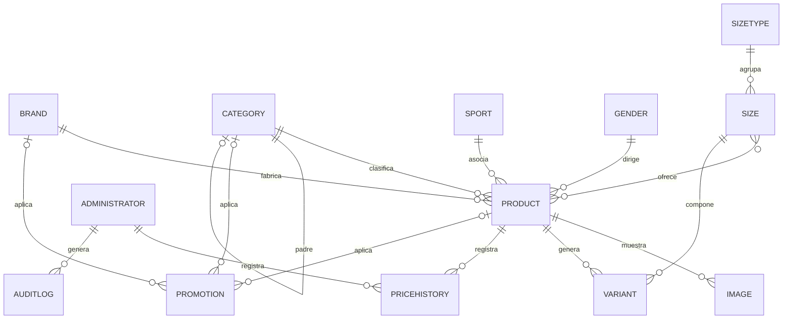

# 04_BASE_DATOS.md

---

# 1. Información

| Campo | Valor |
|---|---|
| **Proyecto** | Pablito Sports |
| **Sistema** | Plataforma de Catálogo Comercial |
| **Documento** | Modelo de Datos |
| **Código** | 04 |
| **Versión** | 1.10.0 |
| **Estado** | 🟡 EN REVISIÓN |
| **Fecha** | 22/09/2026 |
| **Documentos previos** | [00_VISION_PROYECTO.md](00_VISION_PROYECTO.md) ✅ · [00.2_GLOSARIO.md](00.2_GLOSARIO.md) ✅ · [00.3_NOMENCLATURA.md](00.3_NOMENCLATURA.md) ✅ · [01_ANALISIS_NEGOCIO.md](01_ANALISIS_NEGOCIO.md) ✅ · [02_ARQUITECTURA.md](02_ARQUITECTURA.md) ✅ · [02.1_DECISIONES_ARQUITECTONICAS.md](02.1_DECISIONES_ARQUITECTONICAS.md) ✅ |
| **Documentos dependientes** | `05_API.md`, `07_PANEL_ADMIN.md`, `11_TESTING.md`, `99_AI_DEVELOPMENT_GUIDE.md` |

---

# 2. Objetivo

## 2.1 Propósito

Definir el **modelo físico de datos** de Pablito Sports: tablas, columnas, tipos, relaciones, restricciones, índices, migraciones y reglas de integridad. Este documento **desarrolla** las decisiones de arquitectura aprobadas en `02_ARQUITECTURA.md` §12 y en `02.1_DECISIONES_ARQUITECTONICAS.md`, sin introducir arquitectura nueva.

## 2.2 Qué decide este documento y qué deja a otros

| Este documento decide | Se detalla en |
|---|---|
| Tablas, columnas, tipos de datos y valores por omisión | — |
| Claves primarias, foráneas, índices y restricciones | — |
| Estrategia de migraciones y datos semilla | — |
| Reglas de soft delete, auditoría e historial | — |
| Plan de facetas como excepción a `AD-35` | — |
| Contrato de la API | `05_API.md` |
| Diseño de pantallas del panel | `07_PANEL_ADMIN.md` |
| Estrategia de pruebas | `11_TESTING.md` |
| Instrucciones operativas de implementación | `99_AI_DEVELOPMENT_GUIDE.md` |

**Regla del Freeze:** ninguna tabla, columna o relación de este documento puede contradecir una decisión `AD-xx` aprobada. Si al redactar apareciera un vacío que requiera una decisión arquitectónica nueva, se registra como pendiente y se exige una nueva versión mayor de `02_ARQUITECTURA.md` (`02_ARQUITECTURA.md` §5.3).

---

# 3. Alcance

## 3.1 Incluye

- Modelo conceptual, lógico y físico de datos.
- Especificación de tablas, columnas, tipos, claves, restricciones e índices.
- Convenciones de nomenclatura del esquema.
- Estrategia de migraciones con Alembic.
- Datos semilla obligatorios.
- Reglas de soft delete, auditoría e historial de precios.
- Plan de facetas como excepción a `AD-35`.
- Transacciones, concurrencia e integridad referencial.
- Trazabilidad de cada elemento del esquema con reglas y decisiones aprobadas.

## 3.2 No incluye

- Contratos de API ni DTOs → `05_API.md`.
- Lógica de negocio de los servicios → código del backend, gobernado por `AD-03`.
- Diseño visual del panel → `08_UI_SYSTEM.md` y `07_PANEL_ADMIN.md`.
- Infraestructura de respaldo y despliegue → `12_DEPLOY.md`.

## 3.3 Relación con el Architecture Freeze

`02_ARQUITECTURA.md` v0.9.1 está en estado **Architecture Freeze Candidate**. Este documento no altera ninguna decisión arquitectónica: solo las materializa en tablas y columnas. Los dos pendientes que deben cerrarse aquí son:

| Pendiente | Cierre en este documento |
|---|---|
| `ADP-08` — Plan explícito de facetas | §9.6 y §21 |
| `ADP-10` — Autoridad entre historial de precios, auditoría y logs | §14, §15 y §21 |

---

# 4. Definiciones

| Término | Definición en este documento |
|---|---|
| **Esquema** | Conjunto de tablas, columnas, restricciones e índices de la base de datos. |
| **Migración** | Script versionado de Alembic que modifica el esquema o los datos de forma controlada. |
| **Semilla** | Datos obligatorios que el sistema necesita para funcionar en un entorno nuevo. |
| **Soft delete** | Eliminación lógica mediante `deleted_at`, sin borrar la fila (`AD-18`). |
| **Tabla de relación** | Tabla intermedia que materializa una relación N:M. |
| **Índice parcial** | Índice que cubre solo las filas que cumplen una condición. |
| **Faceta** | Conteo de opciones de filtro que aún arrojan resultados dentro de la selección actual (`RN-47`, §11.6 de `02_ARQUITECTURA.md`). |

---

# 5. Responsabilidades

| Responsabilidad | Responsable |
|---|---|
| Aprobar cambios en el esquema | Responsable del proyecto |
| Escribir y mantener migraciones | Implementador |
| Verificar equivalencia entre esquemas de desarrollo y producción antes de fusionar | Revisor |
| Asegurar que cada tabla/columna derive de una regla o decisión aprobada | Revisor |
| Mantener actualizado el diccionario de nomenclatura (`00.3_NOMENCLATURA.md`) | Redactor |

---

# 6. Entidades del modelo

El modelo contiene **16 entidades** más **5 tablas de relación N:M**. Todas derivan del glosario (`00.2_GLOSARIO.md` §4), del diccionario de nomenclatura (`00.3_NOMENCLATURA.md` §7) y de la arquitectura de datos (`02_ARQUITECTURA.md` §12.3).

*(Revisado 19/08/2026: se retiran la entidad Color/`colors` y la relación Producto-Color/`product_colors` — `01_ANALISIS_NEGOCIO.md` 2.7.0. Numeración renumerada sin huecos; la tabla es un índice de esta sección, no un identificador citado desde otros documentos. Revisado 24/08/2026: se suma la relación Producto-Sexo/`product_genders` — `RN-09` pasa de FK simple a N:M, pedido explícito del usuario.)*

| # | Entidad de negocio | Tabla | Origen |
|---|---|---|---|
| 1 | Producto | `products` | `RN-01` a `RN-12`, `00.3` §7 |
| 2 | Variante | `variants` | `DN-01`, `AD-15`, `RN-13` a `RN-18` |
| 3 | Marca | `brands` | `RN-05`, `RN-06`, `00.3` §7 |
| 4 | Categoría | `categories` | `RN-03`, `RN-04`, `RN-80`, `AD-24`, `AD-29` |
| 5 | Deporte | `sports` | `RN-08`, `00.3` §7 |
| 6 | Sexo | `genders` | `RN-09`, `S-06`, `00.3` §7 |
| 7 | Talle | `sizes` | `RN-14`, `RN-15`, `RN-16`, `00.3` §7 |
| 8 | Tipo de Talle | `size_types` | `RN-15`, `S-07`, `00.3` §7 |
| 9 | Imagen | `images` | `RN-19` a `RN-22`, `00.3` §7 |
| 10 | Promoción | `promotions` | `RN-30` a `RN-38b`, `DN-03` |
| 11 | Banner | `banners` | `RN-73`, `RN-74` |
| 12 | Administrador | `administrators` | `RN-66`, `RN-67`, `00.3` §7 |
| 13 | Configuración de Tienda | `store_settings` | `PA-10`, `RN-58` a `RN-61`, `00.3` §7 |
| 14 | Historial de Precios | `price_history` | `RN-70`, `00.3` §7 |
| 15 | Registro de Auditoría | `audit_logs` | `AD-20`, `00.3` §7 (actualizado a v1.4.0) |
| 16 | Imagen de Marca | `brand_images` | Portada administrable (v1.1.0) |
| 17 | Relación Producto-Categoría | `product_categories` | `RN-03`, `00.3` §7.1 |
| 18 | Relación Producto-Deporte | `product_sports` | `RN-08`, `00.3` §7.1 |
| 19 | Relación Producto-Talle | `product_sizes` | `RN-14`, `00.3` §7.1 |
| 20 | Relación Producto-Sexo | `product_genders` | `RN-09` (v2.9.0), `00.3` §7.1 |
| 21 | Relación Categoría-Sexo | `category_genders` | `RN-83` (v2.10.0), `AD-41` |

**Entidades deliberadamente ausentes:** carrito, consulta, cliente, pedido, pago, stock numérico. Su ausencia está justificada en `AD-06`, `RN-63`, `DV-01`, `RN-39` y `02_ARQUITECTURA.md` §7.9.

---

# 7. Modelo conceptual



---

# 8. Modelo lógico

## 8.1 Relaciones y cardinalidades

| Relación | Cardinalidad | Regla / Decisión |
|---|---|---|
| Producto → Marca | N:1 | `RN-05` |
| Producto ↔ Categoría | N:M | `RN-03`; categoría principal en `products.primary_category_id` (`RN-04`) |
| Categoría → Categoría | Autorreferencia, máx. 2 niveles | `AD-24`, `AD-29` |
| Producto ↔ Deporte | N:M | `RN-08` |
| Producto ↔ Sexo | N:M | `RN-09` (v2.9.0: era N:1) |
| Producto → Tipo de Talle | N:1 | `RN-15` |
| Producto ↔ Talle | N:M | `RN-14` |
| Categoría ↔ Sexo | N:M | `RN-83` (v2.10.0); sin filas = sin restricción (`AD-41`) |
| Variante → Producto | N:1 | `DN-01`, `AD-15` |
| Variante → Talle | N:1 | `DN-01` |
| Producto → Imagen | 1:N | `RN-19` a `RN-22` |
| Promoción → Producto \| Categoría \| Marca | N:1 excluyente | `RN-36` |
| Producto → Historial de Precios | 1:N | `RN-70` |
| Administrador → Historial de Precios | 1:N | `RN-70` |
| Administrador → Registro de Auditoría | 1:N | `AD-20` |
| Configuración de Tienda | Registro único | `PA-10` |

## 8.2 Principios de modelado

1. **Normalizado por defecto** (`02_ARQUITECTURA.md` §12.2).
2. **Una relación por una regla**: cada tabla o FK responde a un `RN-xx` o `AD-xx` aprobado.
3. **Sin duplicación de datos de negocio**: los precios, la disponibilidad y las marcas de producto viven en `products`; las variantes solo materializan combinaciones.
4. **Inmutabilidad de auditoría e historial**: `price_history` y `audit_logs` no se actualizan ni eliminan.

---

# 9. Modelo físico

## 9.1 Tipos de datos base

| Tipo conceptual | Tipo PostgreSQL | Uso |
|---|---|---|
| Identificador entero | `INTEGER` | Claves primarias y foráneas (`AD-33`). |
| Texto corto | `VARCHAR(n)` | Nombres, slugs, títulos. |
| Texto largo | `TEXT` | Descripciones, plantillas. |
| Entero monetario | `INTEGER` | Precios en guaraníes, sin decimales (`RN-23`, `RN-24`). |
| Booleano | `BOOLEAN` | Banderas `is_*`. |
| Fecha/hora | `TIMESTAMP WITH TIME ZONE` | Almacenadas en UTC (`AD-34`). |
| JSON | `JSONB` | Datos semiestructurados (`social_links`, valores de auditoría). |
| Dirección IP | `INET` | Dirección del administrador en auditoría. |

## 9.2 Tablas

### 9.2.1 `products`

| Columna | Tipo | Nullable | Default | Descripción |
|---|---|---|---|---|
| `id` | `INTEGER` | No | PK autoincremental | Identificador interno (`AD-33`). |
| `name` | `VARCHAR(255)` | No | — | Nombre del producto. |
| `description` | `TEXT` | Sí | `NULL` | Descripción (`ADP-14` define si admite formato enriquecido). |
| `slug` | `VARCHAR(255)` | No | — | Identidad pública, única permanente (`RN-10`, `RN-79`, `AD-19`). |
| `sku` | `VARCHAR(100)` | No | — | Código interno único (`RN-11`). |
| `list_price` | `INTEGER` | No | — | Precio de lista en PYG (`RN-23`, `RN-27`). |
| `sale_price` | `INTEGER` | Sí | `NULL` | Precio de oferta; solo válido si está vigente (`RN-30` a `RN-32`). |
| `sale_starts_at` | `TIMESTAMPTZ` | Sí | `NULL` | Inicio de vigencia de oferta. |
| `sale_ends_at` | `TIMESTAMPTZ` | Sí | `NULL` | Fin de vigencia de oferta; `NULL` = indefinido (`RN-33`). |
| `availability` | `VARCHAR(20)` | No | — | Estado comercial (`RN-38`, `00.3` §9.1). **v1.2.0**: deja de ser un valor que el administrador escribe a mano — se recalcula en el servicio como la suma de `variants.quantity` de las variantes vivas del producto, con la misma regla de `RN-38b`. Se mantiene como columna física (no derivada en consulta) para no romper el filtro `?availability=` ni el índice `idx_products_availability` (`05_API.md`). |
| `is_featured` | `BOOLEAN` | No | `FALSE` | Destacado manual (`RN-42`). |
| `is_new` | `BOOLEAN` | No | `FALSE` | Nuevo manual (`RN-43`). |
| `home_new_position` | `INTEGER` | Sí | `NULL` | **v1.5.0.** Selección editorial de Novedades en la Home. `NULL` = el producto no está en Novedades; un entero marca a la vez que está y en qué lugar de la fila. Mismo patrón que `brands.home_position` (§9.2.3) — no se reutiliza `is_new` ni `is_featured` a propósito (`COMPP-08` de `09_COMPONENTES.md`): ninguno de los dos tiene curaduría ni orden propio, y ambos ya significan otra cosa. |
| `is_active` | `BOOLEAN` | No | `TRUE` | Producto activo/visible (`RN-01`, `RN-02`). |
| `primary_category_id` | `INTEGER` | No | FK | Categoría principal (`RN-04`). |
| `size_type_id` | `INTEGER` | No | FK | Tipo de talle del producto (`RN-15`). |
| `brand_id` | `INTEGER` | No | FK | Marca (`RN-05`). |
| `created_at` | `TIMESTAMPTZ` | No | `NOW()` | Alta en UTC (`AD-34`). |
| `updated_at` | `TIMESTAMPTZ` | No | `NOW()` | Última modificación en UTC. |
| `deleted_at` | `TIMESTAMPTZ` | Sí | `NULL` | Soft delete (`AD-18`, `RN-69`). |

> **v2.9.0 (`RN-09` revisada):** `gender_id` deja de ser columna de
> `products` — pedido explícito del usuario: un producto puede pertenecer a
> varios sexos, no a uno solo. Pasa a resolverse por la tabla intermedia
> `product_genders` (§9.2.19), mismo patrón que `product_sports`/RN-08: sin
> columna propia, clave primaria compuesta. "Al menos un sexo" sigue siendo
> obligatorio, pero ya no lo puede expresar una FK `NOT NULL` — lo valida
> `AdminProductService` al guardar.

**Restricciones:**

```sql
PRIMARY KEY (id),
UNIQUE (slug) — índice funcional que incluye filas eliminadas,
UNIQUE (sku),
FOREIGN KEY (brand_id) REFERENCES brands(id),
FOREIGN KEY (size_type_id) REFERENCES size_types(id),
FOREIGN KEY (primary_category_id) REFERENCES categories(id),
CHECK (list_price > 0),
CHECK (sale_price IS NULL OR sale_price < list_price),
CHECK (sale_ends_at IS NULL OR sale_starts_at IS NULL OR sale_ends_at > sale_starts_at),
CHECK (availability IN ('available', 'low_stock', 'out_of_stock')),
CHECK (home_new_position IS NULL OR home_new_position >= 0)
```

**v1.2.0 — RN-38b (regla de disponibilidad derivada):** se retira el estado
`coming_soon` (no tenía datos cargados) y el dominio queda en 3 valores,
calculados a partir de `quantity` sumada entre las variantes vivas del
producto:

| Cantidad total | Estado |
|---|---|
| `> 5` | `available` |
| `1` a `5` | `low_stock` |
| `0`, o sin variantes vivas | `out_of_stock` |

**Nota sobre `primary_category_id`:** la coherencia de que la categoría principal esté entre las asignadas se valida en la capa de servicios (`VAL-03`, `RN-04`).

### 9.2.2 `variants`

| Columna | Tipo | Nullable | Default | Descripción |
|---|---|---|---|---|
| `id` | `INTEGER` | No | PK autoincremental | Identificador estable expuesto al carrito (`AD-15`). |
| `product_id` | `INTEGER` | No | FK | Producto padre. |
| `size_id` | `INTEGER` | Sí | FK | Talle; `NULL` si el producto no tiene talles. |
| `quantity` | `INTEGER` | No | `0` | **v1.2.0.** Cantidad real de unidades de esta variante (`RN-18`, `RN-38b`). Fuente de verdad del stock: no se guarda un estado de disponibilidad por variante aparte, se deriva de este número (`derive_availability`, `05_API.md`). |
| `created_at` | `TIMESTAMPTZ` | No | `NOW()` | Alta. |
| `updated_at` | `TIMESTAMPTZ` | No | `NOW()` | Última modificación. |
| `deleted_at` | `TIMESTAMPTZ` | Sí | `NULL` | Soft delete para reconciliación (`AD-15`, `AD-18`). |

**Restricciones:**

```sql
PRIMARY KEY (id),
FOREIGN KEY (product_id) REFERENCES products(id),
FOREIGN KEY (size_id) REFERENCES sizes(id),
UNIQUE (product_id, COALESCE(size_id, 0)) WHERE deleted_at IS NULL,
CHECK (quantity >= 0)
```

*(Revisado 19/08/2026: se retira `color_id` y la restricción única pasa de `(product_id, color_id, size_id)` a `(product_id, size_id)` — migración `d20b530ad8a6`, `01_ANALISIS_NEGOCIO.md` 2.7.0.)*

**Justificación de no tener `is_active`:** en v1 no existe una operación de negocio para “ocultar una variante” sin eliminarla. La variante solo se elimina lógicamente al quitar un talle (`AD-15`, §9.4). Por eso basta con `deleted_at`.

**v1.2.0 — `RN-18` revisada:** hasta la v1.1.0 la disponibilidad era exclusivamente del producto. Desde v1.2.0 cada variante tiene su propia cantidad y por tanto su propio estado derivado (`VariantDTO.availability` en `05_API.md` deja de "reflejar al producto padre"); el estado del producto es la agregación (suma) de sus variantes.

### 9.2.3 `brands`

| Columna | Tipo | Nullable | Default |
|---|---|---|---|
| `id` | `INTEGER` | No | PK |
| `name` | `VARCHAR(100)` | No | — |
| `slug` | `VARCHAR(100)` | No | — |
| `image_path` | `VARCHAR(500)` | Sí | `NULL` |
| `tagline` | `VARCHAR(255)` | Sí | `NULL` |
| `home_position` | `INTEGER` | Sí | `NULL` |
| `is_active` | `BOOLEAN` | No | `TRUE` |
| `created_at` | `TIMESTAMPTZ` | No | `NOW()` |
| `updated_at` | `TIMESTAMPTZ` | No | `NOW()` |
| `deleted_at` | `TIMESTAMPTZ` | Sí | `NULL` |

```sql
PRIMARY KEY (id),
UNIQUE (slug) — índice funcional que incluye filas eliminadas,
CHECK (home_position IS NULL OR home_position >= 0)
```

**Nota sobre las tres columnas nuevas (v1.1.0):**

- `image_path` es el logotipo de la marca. Vive en el espacio de nombres `brands` del almacenamiento, con la misma separación original/derivados que productos y banners (`AD-38`).
- `tagline` es la frase corta que acompaña al logotipo en el bloque de marca de la portada. Es texto comercial que decide el administrador, no una descripción del catálogo.
- `home_position` gobierna **si** la marca tiene bloque propio en la portada y **en qué orden**. `NULL` significa que la marca existe en el catálogo pero no protagoniza un bloque: es la diferencia entre «marca del catálogo» y «marca destacada», y evita tener que inventar una entidad aparte para expresarla.

### 9.2.4 `categories`

| Columna | Tipo | Nullable | Default |
|---|---|---|---|
| `id` | `INTEGER` | No | PK |
| `name` | `VARCHAR(100)` | No | — |
| `slug` | `VARCHAR(100)` | No | — |
| `parent_id` | `INTEGER` | Sí | FK → categories(id) |
| `is_active` | `BOOLEAN` | No | `TRUE` |
| `created_at` | `TIMESTAMPTZ` | No | `NOW()` |
| `updated_at` | `TIMESTAMPTZ` | No | `NOW()` |
| `deleted_at` | `TIMESTAMPTZ` | Sí | `NULL` |

```sql
PRIMARY KEY (id),
UNIQUE (slug) — índice funcional que incluye filas eliminadas,
FOREIGN KEY (parent_id) REFERENCES categories(id),
CHECK (parent_id IS NULL OR parent_id != id)
```

**Nota:** la profundidad máxima de 2 niveles se valida en la capa de servicios (`AD-24`).

### 9.2.5 `sports`

| Columna | Tipo | Nullable | Default |
|---|---|---|---|
| `id` | `INTEGER` | No | PK |
| `name` | `VARCHAR(100)` | No | — |
| `slug` | `VARCHAR(100)` | No | — |
| `is_active` | `BOOLEAN` | No | `TRUE` |
| `created_at` | `TIMESTAMPTZ` | No | `NOW()` |
| `updated_at` | `TIMESTAMPTZ` | No | `NOW()` |
| `deleted_at` | `TIMESTAMPTZ` | Sí | `NULL` |

```sql
PRIMARY KEY (id),
UNIQUE (slug) — índice funcional que incluye filas eliminadas
```

### 9.2.6 `genders`

| Columna | Tipo | Nullable | Default |
|---|---|---|---|
| `id` | `INTEGER` | No | PK |
| `name` | `VARCHAR(50)` | No | — |
| `slug` | `VARCHAR(50)` | No | — |
| `is_active` | `BOOLEAN` | No | `TRUE` |
| `created_at` | `TIMESTAMPTZ` | No | `NOW()` |
| `updated_at` | `TIMESTAMPTZ` | No | `NOW()` |
| `deleted_at` | `TIMESTAMPTZ` | Sí | `NULL` |

```sql
PRIMARY KEY (id),
UNIQUE (slug) — índice funcional que incluye filas eliminadas,
UNIQUE (name) — índice funcional que incluye filas eliminadas
```

**Semilla:** `men`, `women`, `unisex`, `boys`, `girls` (`S-06`, `00.3` §9.2).

*(§9.2.7 "`colors`" retirada el 19/08/2026 — `01_ANALISIS_NEGOCIO.md` 2.7.0, migración `d20b530ad8a6`. Numeración de esta subsección renumerada sin huecos.)*

### 9.2.7 `size_types`

| Columna | Tipo | Nullable | Default |
|---|---|---|---|
| `id` | `INTEGER` | No | PK |
| `name` | `VARCHAR(50)` | No | — |
| `slug` | `VARCHAR(50)` | No | — |
| `is_active` | `BOOLEAN` | No | `TRUE` |
| `created_at` | `TIMESTAMPTZ` | No | `NOW()` |
| `updated_at` | `TIMESTAMPTZ` | No | `NOW()` |
| `deleted_at` | `TIMESTAMPTZ` | Sí | `NULL` |

```sql
PRIMARY KEY (id),
UNIQUE (slug) — índice funcional que incluye filas eliminadas,
UNIQUE (name) — índice funcional que incluye filas eliminadas
```

**Semilla:** `footwear_numeric`, `apparel_alpha`, `one_size` (`S-07`, `00.3` §9.4).

### 9.2.8 `sizes`

| Columna | Tipo | Nullable | Default |
|---|---|---|---|
| `id` | `INTEGER` | No | PK |
| `name` | `VARCHAR(20)` | No | — |
| `slug` | `VARCHAR(20)` | No | — |
| `size_type_id` | `INTEGER` | No | FK |
| `is_active` | `BOOLEAN` | No | `TRUE` |
| `created_at` | `TIMESTAMPTZ` | No | `NOW()` |
| `updated_at` | `TIMESTAMPTZ` | No | `NOW()` |
| `deleted_at` | `TIMESTAMPTZ` | Sí | `NULL` |

```sql
PRIMARY KEY (id),
UNIQUE (slug) — índice funcional que incluye filas eliminadas,
FOREIGN KEY (size_type_id) REFERENCES size_types(id),
UNIQUE (name, size_type_id) — índice funcional que incluye filas eliminadas
```

### 9.2.9 `images`

| Columna | Tipo | Nullable | Default |
|---|---|---|---|
| `id` | `INTEGER` | No | PK |
| `product_id` | `INTEGER` | No | FK |
| `file_path` | `VARCHAR(500)` | No | — |
| `is_primary` | `BOOLEAN` | No | `FALSE` |
| `position` | `INTEGER` | No | `0` |
| `alt_text` | `VARCHAR(255)` | Sí | `NULL` |
| `is_active` | `BOOLEAN` | No | `TRUE` |
| `created_at` | `TIMESTAMPTZ` | No | `NOW()` |
| `updated_at` | `TIMESTAMPTZ` | No | `NOW()` |
| `deleted_at` | `TIMESTAMPTZ` | Sí | `NULL` |

```sql
PRIMARY KEY (id),
FOREIGN KEY (product_id) REFERENCES products(id),
CHECK (position >= 0),
UNIQUE (product_id) WHERE is_primary = TRUE AND deleted_at IS NULL
```

### 9.2.10 `promotions`

| Columna | Tipo | Nullable | Default |
|---|---|---|---|
| `id` | `INTEGER` | No | PK |
| `name` | `VARCHAR(255)` | No | — |
| `description` | `TEXT` | Sí | `NULL` |
| `discount_percentage` | `INTEGER` | No | — |
| `starts_at` | `TIMESTAMPTZ` | No | — |
| `ends_at` | `TIMESTAMPTZ` | Sí | `NULL` |
| `is_active` | `BOOLEAN` | No | `TRUE` |
| `product_id` | `INTEGER` | Sí | FK |
| `category_id` | `INTEGER` | Sí | FK |
| `brand_id` | `INTEGER` | Sí | FK |
| `created_at` | `TIMESTAMPTZ` | No | `NOW()` |
| `updated_at` | `TIMESTAMPTZ` | No | `NOW()` |
| `deleted_at` | `TIMESTAMPTZ` | Sí | `NULL` |

```sql
PRIMARY KEY (id),
FOREIGN KEY (product_id) REFERENCES products(id),
FOREIGN KEY (category_id) REFERENCES categories(id),
FOREIGN KEY (brand_id) REFERENCES brands(id),
CHECK (discount_percentage BETWEEN 1 AND 99),
CHECK (ends_at IS NULL OR ends_at > starts_at),
CHECK (
    (product_id IS NOT NULL)::int +
    (category_id IS NOT NULL)::int +
    (brand_id IS NOT NULL)::int <= 1
)
```

**Justificación de la implementación del alcance:** `RN-36` exige que una promoción aplique a como máximo uno de {producto, categoría, marca} — con los tres en `NULL`, aplica a todos los productos (v1.9.0, pedido explícito del usuario). Tres columnas nullable mutuamente excluyentes es la forma más simple en v1, mantiene la extensibilidad a promociones complejas futuras (`PA-12`, `DN-03`) y permite joins directos para el cálculo del precio efectivo. Una tabla de alcance normalizada sería más pura, pero añade complejidad sin requisito que la justifique (`PA-11`). Si en el futuro una promoción pudiera aplicar a varias entidades simultáneamente, el cambio requerirá una migración que reemplace este diseño por una tabla de alcance.

**"Todos los productos" (v1.9.0):** antes el CHECK exigía exactamente una columna poblada (`= 1`), así que no había forma de representar "sin alcance particular". Se relajó a `<= 1`: los tres `NULL` significan que la promoción se suma al cálculo del precio efectivo de cualquier producto (`ProductRepository._best_promotion_percentage`, RN-37 sigue resolviendo el mayor descuento entre las vigentes). Migración `a3f6c9d21b47`, de esquema únicamente — no toca ninguna fila existente.

### 9.2.11 `banners`

| Columna | Tipo | Nullable | Default |
|---|---|---|---|
| `id` | `INTEGER` | No | PK |
| `title` | `VARCHAR(255)` | No | — |
| `subtitle` | `VARCHAR(255)` | Sí | `NULL` |
| `image_path` | `VARCHAR(500)` | Sí | `NULL` |
| `link_url` | `VARCHAR(500)` | Sí | `NULL` |
| `button_label` | `VARCHAR(50)` | Sí | `NULL` |
| `placement` | `VARCHAR(20)` | No | `'hero'` |
| `position` | `INTEGER` | No | `0` |
| `starts_at` | `TIMESTAMPTZ` | Sí | `NULL` |
| `ends_at` | `TIMESTAMPTZ` | Sí | `NULL` |
| `is_active` | `BOOLEAN` | No | `TRUE` |
| `created_at` | `TIMESTAMPTZ` | No | `NOW()` |
| `updated_at` | `TIMESTAMPTZ` | No | `NOW()` |
| `deleted_at` | `TIMESTAMPTZ` | Sí | `NULL` |

```sql
PRIMARY KEY (id),
CHECK (position >= 0),
CHECK (placement IN ('hero', 'news', 'promo')),
CHECK (ends_at IS NULL OR starts_at IS NULL OR ends_at > starts_at)
```

**Nota sobre `placement` (v1.1.0):** la portada tiene tres zonas que necesitan piezas administrables —el hero, el carrusel de novedades y el de promociones— y las tres piden exactamente lo mismo: imagen, título, texto de apoyo, enlace, orden y vigencia. Crear tres entidades gemelas habría triplicado el modelo, el CRUD y las pantallas del panel para no agregar ni un campo distinto. El discriminador expresa la diferencia real, que es **dónde se muestra la pieza**, y deja el resto compartido.

El valor por defecto `'hero'` no es arbitrario: las filas que ya existen se crearon cuando la única zona era la portada, de modo que la migración las deja donde siempre estuvieron sin necesidad de decidir por el administrador.

**Nota sobre `button_label` (v1.1.0):** el texto del botón acompaña a `link_url`, que ya existía. Un banner sin `link_url` no muestra botón, tenga o no etiqueta. Cuando hay enlace pero no etiqueta, el frontend usa un texto por defecto: la ausencia de etiqueta no debe dejar al hero sin salida.

### 9.2.11b `banks`

**Nueva en v1.5.0** (pedido explícito del usuario): panel administrativo para los bancos de la sección pública "Superdescuentos", antes hardcodeados en el frontend sin ningún campo administrable.

| Columna | Tipo | Nullable | Default |
|---|---|---|---|
| `id` | `INTEGER` | No | PK |
| `name` | `VARCHAR(100)` | No | — |
| `description` | `TEXT` | Sí | `NULL` |
| `discount_percentage` | `INTEGER` | No | — |
| `image_path` | `VARCHAR(500)` | Sí | `NULL` |
| `position` | `INTEGER` | No | `0` |
| `is_active` | `BOOLEAN` | No | `TRUE` |
| `created_at` | `TIMESTAMPTZ` | No | `NOW()` |
| `updated_at` | `TIMESTAMPTZ` | No | `NOW()` |
| `deleted_at` | `TIMESTAMPTZ` | Sí | `NULL` |

```sql
PRIMARY KEY (id),
CHECK (discount_percentage BETWEEN 1 AND 99),
CHECK (position >= 0)
```

**Justificación:** no reutiliza `promotions` (atada por `RN-36`/`scope_exclusive` a producto/categoría/marca, sin ese concepto de banco) ni `banners` (atado a las tres zonas fijas de portada `placement`, con campos —`subtitle`, `link_url`, `button_label`, vigencia— que un banco no necesita). Es una entidad mínima, con el mismo rango 1-99 de `discount_percentage` que `promotions` y el mismo `position` de `banners` para el orden de aparición. Un caso comercial compuesto (p. ej. un banco con porcentaje distinto según débito/crédito) se resuelve cargando dos filas, no ampliando el modelo con un campo que nadie más pidió.

**`description` (v1.10.0, pedido explícito del usuario):** nota interna del panel, sin tope de longitud propio (`TEXT`), mismo criterio que `promotions.description`. No es un dato que la tarjeta pública muestre (`BankDTO` sigue con solo `name`, `discount_percentage`, `image_url`). Migración `766befdcc1ed`, de esquema únicamente.

`image_path` es el mini banner del banco; usa el mismo pipeline de imágenes que `banners`/`brand_images` (espacio de nombres propio `banks`, ver `99_AI_DEVELOPMENT_GUIDE.md` §17.1). El borrado es lógico (`AD-18`); el archivo solo se retira del disco si ningún otro banco vivo lo referencia.

### 9.2.12 `administrators`

| Columna | Tipo | Nullable | Default |
|---|---|---|---|
| `id` | `INTEGER` | No | PK |
| `username` | `VARCHAR(100)` | No | — |
| `email` | `VARCHAR(255)` | No | — |
| `password_hash` | `VARCHAR(255)` | No | — |
| `role` | `VARCHAR(50)` | No | — |
| `is_active` | `BOOLEAN` | No | `TRUE` |
| `last_login_at` | `TIMESTAMPTZ` | Sí | `NULL` |
| `created_at` | `TIMESTAMPTZ` | No | `NOW()` |
| `updated_at` | `TIMESTAMPTZ` | No | `NOW()` |
| `deleted_at` | `TIMESTAMPTZ` | Sí | `NULL` |

```sql
PRIMARY KEY (id),
UNIQUE (username) — índice funcional que incluye filas eliminadas,
UNIQUE (email) — índice funcional que incluye filas eliminadas,
CHECK (role IN ('administrator', 'super_administrator'))
```

### 9.2.13 `store_settings`

| Columna | Tipo | Nullable | Default |
|---|---|---|---|
| `id` | `INTEGER` | No | PK |
| `store_name` | `VARCHAR(255)` | No | — |
| `whatsapp_number` | `VARCHAR(50)` | No | — |
| `email` | `VARCHAR(255)` | Sí | `NULL` |
| `address` | `TEXT` | Sí | `NULL` |
| `business_hours` | `TEXT` | Sí | `NULL` |
| `social_links` | `JSONB` | Sí | `NULL` |
| `about_title` | `VARCHAR(255)` | Sí | `NULL` |
| `about_text` | `TEXT` | Sí | `NULL` |
| `about_image_path` | `VARCHAR(500)` | Sí | `NULL` |
| `message_template` | `TEXT` | No | — |
| `item_template` | `TEXT` | No | — |
| `featured_products_count` | `INTEGER` | No | `8` |
| `updated_at` | `TIMESTAMPTZ` | No | `NOW()` |

```sql
PRIMARY KEY (id),
CHECK (featured_products_count > 0)
```

**Nota:** es un registro único. La aplicación garantiza que solo exista la fila con `id = 1`.

**Nota sobre los cuatro campos nuevos (v1.1.0):** `email`, `about_title`, `about_text` y `about_image_path` son contenido institucional de la tienda, no configuración operativa. Los cuatro son opcionales: la sección «Nuestra historia» y el correo del pie solo se muestran cuando hay dato cargado, y su ausencia no rompe ninguna pantalla.

La migración carga un `about_title` y un `about_text` iniciales redactados por el dueño de la tienda. Nacen como **dato editable desde el panel**, no como texto escrito dentro del código: es la diferencia entre contenido que el administrador controla y contenido que hay que ir a buscar a un archivo fuente (`UDS-09`).

### 9.2.14 `price_history`

| Columna | Tipo | Nullable | Default |
|---|---|---|---|
| `id` | `INTEGER` | No | PK |
| `product_id` | `INTEGER` | No | FK |
| `old_price` | `INTEGER` | No | — |
| `new_price` | `INTEGER` | No | — |
| `administrator_id` | `INTEGER` | No | FK |
| `created_at` | `TIMESTAMPTZ` | No | `NOW()` |

```sql
PRIMARY KEY (id),
FOREIGN KEY (product_id) REFERENCES products(id),
FOREIGN KEY (administrator_id) REFERENCES administrators(id)
```

**Inmutable:** no tiene `updated_at` ni `deleted_at` (`RN-70`, `AD-20`).

### 9.2.15 `audit_logs`

| Columna | Tipo | Nullable | Default |
|---|---|---|---|
| `id` | `INTEGER` | No | PK |
| `administrator_id` | `INTEGER` | No | FK |
| `action` | `VARCHAR(50)` | No | — |
| `entity_type` | `VARCHAR(50)` | No | — |
| `entity_id` | `INTEGER` | No | — |
| `old_values` | `JSONB` | Sí | `NULL` |
| `new_values` | `JSONB` | Sí | `NULL` |
| `ip_address` | `INET` | Sí | `NULL` |
| `created_at` | `TIMESTAMPTZ` | No | `NOW()` |

```sql
PRIMARY KEY (id),
FOREIGN KEY (administrator_id) REFERENCES administrators(id),
CHECK (action IN ('create', 'update', 'delete', 'activate', 'deactivate'))
```

**Inmutable:** no tiene `updated_at` ni `deleted_at` (`AD-20`).

### 9.2.16 Tablas de relación N:M

#### `product_categories`

| Columna | Tipo | Nullable |
|---|---|---|
| `product_id` | `INTEGER` | No |
| `category_id` | `INTEGER` | No |

```sql
PRIMARY KEY (product_id, category_id),
FOREIGN KEY (product_id) REFERENCES products(id),
FOREIGN KEY (category_id) REFERENCES categories(id)
```

#### `product_sports`

```sql
PRIMARY KEY (product_id, sport_id),
FOREIGN KEY (product_id) REFERENCES products(id),
FOREIGN KEY (sport_id) REFERENCES sports(id)
```

#### `product_sizes`

```sql
PRIMARY KEY (product_id, size_id),
FOREIGN KEY (product_id) REFERENCES products(id),
FOREIGN KEY (size_id) REFERENCES sizes(id)
```

#### `product_genders` (v2.9.0)

`RN-09` revisada: un producto pertenece a uno o varios sexos, ya no a uno
solo. Reemplaza a la columna `products.gender_id` (§9.2.1) — mismo patrón
que `product_sports`, sin columna propia. "Al menos un sexo" es obligatorio
mediante código en `AdminProductService`, no mediante una restricción de
esquema: ninguna FK ni `CHECK` puede expresar "al menos una fila" sobre
otra tabla.

```sql
PRIMARY KEY (product_id, gender_id),
FOREIGN KEY (product_id) REFERENCES products(id),
FOREIGN KEY (gender_id) REFERENCES genders(id)
```

#### `category_genders` (v2.10.0)

`RN-83`: la categoría declara a qué sexos aplica, para que la navegación de la
tienda no tenga que ofrecer el árbol completo bajo Hombres, Mujeres e Infantil
a la vez. Mismo patrón que `product_genders`: sin columna propia, sin marcas de
tiempo y sin borrado lógico — la fila no tiene atributo alguno, así que quitar
un sexo es borrar la fila.

**La ausencia de filas es un estado con significado** (`AD-41`): una categoría
sin sexos **no está restringida** y se ofrece en todos los ejes. No es "ningún
sexo". Por eso la migración `c5b1f0a72e14` crea la tabla **sin backfill**: el
menú se comporta igual que antes hasta que el administrador destilde algo.

```sql
PRIMARY KEY (category_id, gender_id),
FOREIGN KEY (category_id) REFERENCES categories(id),
FOREIGN KEY (gender_id) REFERENCES genders(id)
```

### 9.2.17 `brand_images`

Collage del bloque de marca de la portada. Se numera al final para no renumerar las tablas ya aprobadas.

| Columna | Tipo | Nullable | Default |
|---|---|---|---|
| `id` | `INTEGER` | No | PK |
| `brand_id` | `INTEGER` | No | FK → brands(id) |
| `file_path` | `VARCHAR(500)` | No | — |
| `position` | `INTEGER` | No | `0` |
| `alt_text` | `VARCHAR(255)` | Sí | `NULL` |
| `is_active` | `BOOLEAN` | No | `TRUE` |
| `created_at` | `TIMESTAMPTZ` | No | `NOW()` |
| `updated_at` | `TIMESTAMPTZ` | No | `NOW()` |
| `deleted_at` | `TIMESTAMPTZ` | Sí | `NULL` |

```sql
PRIMARY KEY (id),
FOREIGN KEY (brand_id) REFERENCES brands(id) ON DELETE RESTRICT ON UPDATE CASCADE,
CHECK (position >= 0),
INDEX idx_brand_images_brand_id (brand_id)
```

**Por qué una tabla y no una columna con varias rutas:** el collage tiene orden, texto alternativo y activación por pieza. Guardarlo como lista dentro de la marca obligaría a reescribir el conjunto entero para reordenar una imagen y dejaría el texto alternativo sin lugar. La tabla es un calco de `images` (§9.2.9), de modo que el pipeline de imágenes, el reordenamiento y el borrado lógico funcionan igual que en productos y no hay que inventar nada.

**Cantidad de piezas:** el diseño de la portada usa entre 2 y 4. **El límite no se impone en base de datos**, se valida en servicios, igual que la profundidad de categorías (`AD-24`): es una regla de presentación, y una restricción de tabla volvería costoso cambiarla cuando cambie el diseño.

### 9.2.18 `sales`

Registro de ventas del administrador (`RN-82`, v1.3.0). Se numera al final por el mismo motivo que `brand_images`: no renumerar tablas ya aprobadas.

| Columna | Tipo | Nullable | Default |
|---|---|---|---|
| `id` | `INTEGER` | No | PK |
| `variant_id` | `INTEGER` | No | FK → variants(id) |
| `quantity` | `INTEGER` | No | — |
| `administrator_id` | `INTEGER` | No | FK → administrators(id) |
| `created_at` | `TIMESTAMPTZ` | No | `NOW()` |

```sql
PRIMARY KEY (id),
FOREIGN KEY (variant_id) REFERENCES variants(id) ON DELETE RESTRICT ON UPDATE CASCADE,
FOREIGN KEY (administrator_id) REFERENCES administrators(id) ON DELETE RESTRICT ON UPDATE CASCADE,
CHECK (quantity > 0),
INDEX idx_sales_variant_id (variant_id),
INDEX idx_sales_created_at (created_at)
```

**Inmutable:** no tiene `updated_at` ni `deleted_at`, mismo patrón que `price_history` (§9.2.14, `RN-70`). El servicio que inserta esta fila (`AdminProductService.register_sale`) es el mismo que descuenta `variants.quantity` y dispara el recálculo de disponibilidad de `RN-39`; ambas operaciones van en una sola transacción (`@transactional`).

## 9.3 Claves primarias

Todas las tablas usan una clave primaria entera autoincremental (`AD-33`). El slug es la identidad pública, no la clave primaria. Las tablas de relación usan clave primaria compuesta.

## 9.4 Claves foráneas

Todas las relaciones del modelo lógico se implementan con claves foráneas explícitas. No se usan relaciones implícitas por convención de nombres. Todas las FK tienen `ON DELETE RESTRICT` para evitar borrados en cascada no intencionales; el soft delete hace que la cascada no sea necesaria.

## 9.5 Restricciones y CHECKs

| Restricción | Ubicación | Origen |
|---|---|---|
| `list_price > 0` | `products` | `RN-27` |
| `sale_price < list_price` | `products` | `RN-31` |
| Vigencia de oferta | `products` | `RN-32`, `RN-33` |
| `availability` en valores válidos (3 estados, v1.2.0) | `products` | `RN-38`, `RN-38b` |
| Unicidad de variante por producto | `variants` | `AD-15` |
| `quantity >= 0` (v1.2.0) | `variants` | `RN-38b` |
| Alcance exclusivo de promoción | `promotions` | `RN-36` |
| Un solo banner/posición | `banners` | `RN-73` |
| Un imagen principal por producto | `images` | `RN-20` |
| Rol válido | `administrators` | `RN-67` |
| Acción válida en auditoría | `audit_logs` | `AD-20` |
| `quantity > 0` (v1.3.0) | `sales` | `RN-82` |

## 9.6 Índices

### 9.6.1 Índices obligatorios por integridad y filtrado conocido

| Tabla | Índice | Propósito |
|---|---|---|
| `products` | `idx_products_brand_id` | Filtrado por marca (`RN-46`). |
| `products` | `idx_products_size_type_id` | Join con talles del producto. |
| `products` | `idx_products_primary_category_id` | Filtrado por categoría principal. |
| `products` | `idx_products_availability` | Filtrado por disponibilidad. |
| `products` | `idx_products_list_price` | Rango de precios y ordenamiento. |
| `products` | `idx_products_active_not_deleted` | `(is_active, deleted_at)` — toda consulta pública. |
| `products` | `idx_products_sale_dates` | `(sale_starts_at, sale_ends_at)` — ofertas vigentes. |
| `variants` | `idx_variants_product_id` | Revalidación del carrito. |
| `variants` | `idx_variants_size_id` | Filtrado por talle. |
| `categories` | `idx_categories_parent_id` | Jerarquía (`AD-24`). |
| `sizes` | `idx_sizes_size_type_id` | Agrupación por tipo de talle. |
| `images` | `idx_images_product_id` | Galería del producto. |
| `promotions` | `idx_promotions_product_id` | Precio efectivo. |
| `promotions` | `idx_promotions_category_id` | Precio efectivo. |
| `promotions` | `idx_promotions_brand_id` | Precio efectivo. |
| `promotions` | `idx_promotions_dates` | Vigencia de promociones. |
| `price_history` | `idx_price_history_product_id` | Consulta de historial (`CU-A-28`). |
| `audit_logs` | `idx_audit_logs_entity` | `(entity_type, entity_id)` — diagnóstico. |
| `audit_logs` | `idx_audit_logs_administrator_id` | Auditoría por usuario. |
| `sales` | `idx_sales_variant_id` | Historial de ventas por variante (v1.3.0). |
| `sales` | `idx_sales_created_at` | Consulta y reportes por fecha (v1.3.0). |

### 9.6.2 Índice de búsqueda de texto

| Tabla | Índice | Propósito |
|---|---|---|
| `products` | `idx_products_search` | Expresión `lower(unaccent(name))` para `RN-48` y `AD-21`. |

Requiere la extensión `unaccent` de PostgreSQL.

### 9.6.3 Plan de facetas (`ADP-08`)

`RN-47` obliga a devolver, en cada consulta de catálogo, qué opciones de filtro aún tienen resultados. Esta operación es agregación múltiple sobre el conjunto ya filtrado y es la más costosa de la ruta de lectura (`AR-01`).

**Estrategia:**

1. **Fase inicial:** confiar en los índices simples sobre FK listados en §9.6.1 y en el índice parcial `idx_products_active_not_deleted`.
2. **Fase de medición:** durante las pruebas de carga (`11_TESTING.md`), medir el percentil 95 de la consulta de catálogo con facetas. El disparador es `RNF-02` (< 300 ms).
3. **Fase de ajuste:** si se incumple `RNF-02`, agregar índices compuestos dirigidos a los patrones de filtro más frecuentes. Ejemplo: `idx_products_catalog_brand_category` sobre `(is_active, deleted_at, brand_id, primary_category_id)`. **v2.9.0:** el filtro por sexo ya no puede entrar en un índice compuesto de `products` — `gender_id` pasó a `product_genders` (§9.2.16); un ajuste dirigido a ese filtro iría sobre `product_genders(gender_id)`.
4. **Último recurso:** si los índices no bastan, evaluar materialización de facetas en un caché de corta duración. Esta decisión requiere un `AD-xx` nuevo porque afecta la arquitectura (`PA-11`, `AD-35`).

**Regla:** no se crean índices compuestos por anticipación; solo por medición (`AD-35`).

## 9.7 Unicidad

| Tabla | Campo(s) | Notas |
|---|---|---|
| `products` | `slug`, `sku` | Incluyen filas eliminadas (`AD-19`). |
| `brands` | `slug` | Incluye filas eliminadas. |
| `categories` | `slug` | Incluye filas eliminadas. |
| `sports` | `slug` | Incluye filas eliminadas. |
| `genders` | `slug`, `name` | Incluye filas eliminadas. |
| `size_types` | `slug`, `name` | Incluye filas eliminadas. |
| `sizes` | `slug` | Incluye filas eliminadas. |
| `sizes` | `(name, size_type_id)` | Evita duplicados dentro del mismo tipo. |
| `variants` | `(product_id, size_id)` | Solo filas no eliminadas. |
| `administrators` | `username`, `email` | Incluye filas eliminadas. |
| `images` | `(product_id)` donde `is_primary = TRUE` | Solo filas no eliminadas. |

**Principio:** los slugs nunca se reutilizan, incluso después del soft delete (`AD-19`, `RN-79`). Para garantizarlo, los índices únicos sobre slugs son **funcionales**: incluyen `COALESCE(deleted_at, 'epoch')`, de modo que una fila activa no puede repetir un slug usado por una eliminada.

## 9.8 Integridad referencial

- Todas las claves foráneas usan `ON DELETE RESTRICT` y `ON UPDATE CASCADE`.
- El soft delete evita la necesidad de borrado en cascada.
- `RN-68` se implementa en la capa de servicios, reforzada por `RESTRICT`: si un servicio intentara borrar físicamente una marca con productos, la base lo rechazaría.
- La coherencia de la categoría principal (`RN-04`) se valida en servicio, no en la base.

---

# 10. Convenciones de nombres

Todas las convenciones derivan de `00.3_NOMENCLATURA.md`:

| Elemento | Convención | Ejemplo |
|---|---|---|
| Tablas | Inglés, `snake_case`, plural | `products`, `size_types` |
| Columnas | Inglés, `snake_case` | `list_price`, `primary_category_id` |
| Claves foráneas | `<singular>_id` | `brand_id`, `gender_id` |
| Banderas booleanas | Prefijo `is_` o `has_` | `is_active`, `is_featured` |
| Marcas de tiempo | Sufijo `_at` | `created_at`, `deleted_at` |
| Tablas de relación | `<entidad>_<entidad>` en plural | `product_categories` |
| Extensiones de PostgreSQL | `unaccent` para búsqueda | — |

---

# 11. Estrategia de migraciones

## 11.1 Herramienta

**Alembic**, integrado con SQLAlchemy (`00_VISION_PROYECTO.md` §9).

## 11.2 Reglas

| # | Regla | Origen |
|---|---|---|
| 1 | El esquema se modifica **solo** mediante migraciones. Nunca a mano. | `02_ARQUITECTURA.md` §12.10 |
| 2 | Toda migración es reversible, o documenta por qué no lo es. | `02_ARQUITECTURA.md` §12.10 |
| 3 | Migración de esquema y de datos van en archivos separados. | `02_ARQUITECTURA.md` §12.10 |
| 4 | Una migración que destruye datos requiere aprobación explícita. | `02_ARQUITECTURA.md` §12.10 |
| 5 | Las migraciones son código: se revisan. | `PA-01` |
| 6 | Se ejecutan en desarrollo y en producción con el mismo orden y el mismo resultado. | Esta sección |

## 11.3 Datos semilla

Se entregan por migración los datos que el sistema necesita para arrancar:

| Tabla | Datos | Origen |
|---|---|---|
| `size_types` | `footwear_numeric`, `apparel_alpha`, `one_size` | `S-07` |
| `genders` | `men`, `women`, `unisex`, `boys`, `girls` | `S-06` |
| `administrators` | Superadministrador inicial | `02_ARQUITECTURA.md` §12.11 |

**No se siembran:** marcas, categorías, deportes ni talles. Son datos comerciales del negocio y no deben congelarse en código (`PA-10`, `02_ARQUITECTURA.md` §12.11).

## 11.4 Versionado del esquema

- El esquema v1 corresponde a la API v1 (`AD-17`).
- Las migraciones se nombran descriptivamente: `create_products_table`, `add_price_history_table`.
- El número de versión de Alembic no necesita coincidir con el de la documentación.

---

# 12. Transacciones y concurrencia

## 12.1 Unidades transaccionales del negocio

| Operación | Tablas involucradas | Regla |
|---|---|---|
| Alta de producto | `products`, `product_categories`, `product_sports`, `product_sizes`, `product_genders`, `variants`, `images` | Todo en una transacción (`CONS-01`, `CONS-02`). |
| Edición de talles | `product_sizes`, `variants` | Reconciliación en una transacción (`CONS-04`). |
| Cambio de precio | `products`, `price_history` | Update + insert en una transacción (`RN-70`). |
| Cualquier escritura del panel | Tabla afectada + `audit_logs` | Auditoría en la misma transacción (`CONS-05`). |
| Carga de imagen | Archivo primero, fila después | `AD-40`, `CONS-03` — el sistema de archivos no es transaccional. |

## 12.2 Nivel de aislamiento

- **Default:** `READ COMMITTED`.
- **Cambio de precio y reconciliación de variantes:** usar `SELECT FOR UPDATE` sobre la fila de `products` y las variantes afectadas para evitar condiciones de carrera.

## 12.3 Concurrencia

- El sistema es de un solo servidor con pocos administradores; la contención de escritura es baja.
- Las operaciones de lectura del catálogo no bloquean escrituras.
- El slug nunca se libera (`AD-19`), lo que evita condiciones de carrera en la reutilización de slugs.

---

# 13. Soft delete

## 13.1 Mecanismo

Todas las entidades del catálogo y del panel llevan:

- `is_active`: oculta la entidad del catálogo público sin eliminarla (`RN-02`).
- `deleted_at`: marca la eliminación lógica (`RN-69`, `AD-18`).

## 13.2 Reglas

| # | Regla | Origen |
|---|---|---|
| 1 | Las consultas públicas filtran por `is_active = TRUE AND deleted_at IS NULL`. | `RN-01`, `AD-18` |
| 2 | El panel incluye eliminadas solo cuando se solicita explícitamente. | `02_ARQUITECTURA.md` §12.6 |
| 3 | La unicidad de slug incluye filas eliminadas. | `AD-19` |
| 4 | El borrado lógico no elimina archivos de imagen. | `AD-39` |
| 5 | No existe borrado físico desde ninguna capa. | `AD-18` |

---

# 14. Auditoría

## 14.1 Alcance

Toda operación de escritura del panel —crear, editar, activar, desactivar, eliminar, cargar imagen, cambiar precio— deja registro en `audit_logs` (`AD-20`).

## 14.2 Contenido

| Campo | Qué guarda |
|---|---|
| `administrator_id` | Quién realizó la operación. |
| `action` | Tipo de operación. |
| `entity_type` | Tabla o entidad afectada. |
| `entity_id` | Identificador interno de la entidad. |
| `old_values` / `new_values` | Snapshot selectivo de los cambios. |
| `ip_address` | Origen de la petición. |
| `created_at` | Instante UTC. |

## 14.3 Reglas

| # | Regla |
|---|---|
| 1 | El registro se inserta en la **misma transacción** que la operación (`CONS-05`). |
| 2 | No se registran contraseñas, hashes, tokens ni cabeceras de autenticación (`PA-06`). |
| 3 | Los registros son inmutables: no se editan ni eliminan. |
| 4 | Es información de diagnóstico; no reemplaza al historial de precios. |

---

# 15. Historial de precios

## 15.1 Propósito

Cumplir `RN-70` y dar soporte a `CU-A-28` / `RF-36`.

## 15.2 Contenido

| Campo | Qué guarda |
|---|---|
| `product_id` | Producto afectado. |
| `old_price` | Precio anterior en PYG. |
| `new_price` | Precio nuevo en PYG. |
| `administrator_id` | Quién hizo el cambio. |
| `created_at` | Instante UTC. |

## 15.3 Reglas

| # | Regla |
|---|---|
| 1 | Se registra **todo** cambio de `list_price` o `sale_price` de un producto. |
| 2 | El insert ocurre en la misma transacción que el update de `products`. |
| 3 | El historial es inmutable: no se edita ni elimina. |
| 4 | Es la **autoridad** sobre el valor histórico de un precio (`ADP-10`). |

---

# 16. Diagramas previstos

| # | Diagrama | Sección | Descripción |
|---|---|---|---|
| D-01 | Modelo conceptual | §7 | Entidades de negocio y relaciones, sin detalle técnico. |
| D-02 | Modelo lógico | §8 | Entidades, atributos y cardinalidades. |
| D-03 | Modelo físico | §9 | Tablas, columnas, PK, FK e índices. |

Los diagramas se mantienen en Mermaid, embebidos en el documento (`02_ARQUITECTURA.md` §18.3).

---

# 17. Decisiones

Este documento **no crea decisiones arquitectónicas propias**. Desarrolla las decisiones `AD-xx` aprobadas en `02.1_DECISIONES_ARQUITECTONICAS.md`:

| Decisión | Cómo se materializa en este documento |
|---|---|
| `AD-15` Variantes materializadas | `variants` con `product_id`, `size_id` y reconciliación por `deleted_at`. |
| `AD-18` Sin borrado físico | Campo `deleted_at` en todas las entidades del catálogo y del panel. |
| `AD-19` Slug no reutilizable | Índices `UNIQUE(slug)` que incluyen filas eliminadas. |
| `AD-20` Auditoría general | Tabla `audit_logs` inmutable, insertada en cada transacción de escritura del panel. |
| `AD-21` Búsqueda sin acentos | Índice sobre `lower(unaccent(name))` en `products`. |
| `AD-24` Dos niveles de categoría | `categories.parent_id` con validación de profundidad en servicio. |
| `AD-29` Categoría padre incluye descendientes | Consulta que resuelve padre + hijos usando `parent_id`. |
| `AD-33` Clave entera | Todas las PK son `INTEGER` autoincrementales. |
| `AD-34` UTC | Todas las marcas de tiempo son `TIMESTAMPTZ`. |
| `AD-35` Índices por medición | Índices simples iniciales; compuestos solo tras medición, salvo facetas (§9.6.3). |

---

# 18. Buenas Prácticas

1. **Ninguna tabla sin regla:** toda tabla, columna o relación debe poder señalar un `RN-xx`, `AD-xx` o `DN-xx` que la justifique.
2. **La base es la última red:** las restricciones de integridad refuerzan las validaciones del servicio, no las reemplazan (`VAL-02`).
3. **No anticipar índices compuestos:** agregarlos solo tras medir (`AD-35`).
4. **Mantener el diccionario sincronizado:** cualquier nombre nuevo se añade a `00.3_NOMENCLATURA.md` antes de usarse en código.
5. **Verificar equivalencia de esquemas:** antes de considerar terminado un cambio de esquema, comparar el esquema de desarrollo/local con el de producción y documentar diferencias.

---

# 19. Convenciones

- El idioma del esquema es inglés (`NM-01`).
- Las tablas van en plural; las columnas en singular (`NM-09`).
- Los nombres de migración son descriptivos y en inglés.
- Los comentarios de reglas de negocio en el esquema (donde la herramienta lo permita) citan el `RN-xx` o `AD-xx` correspondiente (`NM-05`).

---

# 20. Riesgos

| ID | Riesgo | Impacto | Mitigación |
|---|---|---|---|
| `AR-01` | El cálculo de facetas incumple `RNF-02`. | Alto | §9.6.3 define plan explícito: medir primero, indexar después. |
| `AR-04` | Reconciliación de variantes incorrecta. | Alto | Transaccional (`CONS-04`) y con cobertura de pruebas del caso de restauración. |
| `AR-05` | Almacenamiento monótono por soft delete y archivos conservados. | Bajo | Aceptado; despreciable a la escala del catálogo. |
| `AR-06` | Respaldo de base e imágenes desfasado. | Alto | `12_DEPLOY.md` define misma frecuencia y orden archivos→base. |
| `AR-07` | Mensaje de WhatsApp truncado. | Alto | Mitigado en `02_ARQUITECTURA.md` §13.10; no depende del modelo de datos. |
| R-02 | Precios desactualizados generan conflicto. | Alto | `RN-70` (historial) + revalidación del carrito (`RN-56`). |

---

# 21. Pendientes

| ID | Pendiente | Estado | Se resuelve en |
|---|---|---|---|
| `ADP-08` | Plan explícito de facetas | ✅ Cerrado en este documento | `04_BASE_DATOS.md` §9.6.3 |
| `ADP-10` | Autoridad entre historial, auditoría y logs | ✅ Cerrado en este documento | `04_BASE_DATOS.md` §14, §15 |
| `DA-11` | Numeración de talles de calzado | ⏳ Abierto | `01_ANALISIS_NEGOCIO.md` / implementación |
| `ADP-14` | Formato enriquecido de la descripción | ⏳ Abierto | `01_ANALISIS_NEGOCIO.md` |
| `ADP-15` | Lector del registro de auditoría | ⏳ Abierto | `01_ANALISIS_NEGOCIO.md` / `07_PANEL_ADMIN.md` |
| `NP-05` | Nombres de archivos de migración de Alembic | ⏳ Abierto | `99_AI_DEVELOPMENT_GUIDE.md` |

---

# 22. Trazabilidad con reglas de negocio

| Regla / Decisión | Elemento del esquema |
|---|---|
| `RN-01` Productos activos visibles | `products.is_active`, `products.deleted_at`, índice `idx_products_active_not_deleted` |
| `RN-03` Múltiples categorías | `product_categories` |
| `RN-04` Categoría principal | `products.primary_category_id` |
| `RN-05` Una marca por producto | `products.brand_id` |
| `RN-08` Deportes opcionales | `product_sports` |
| `RN-09` Sexo del producto (v2.9.0: N:M) | `product_genders`, `genders` |
| `RN-83` Sexos de la categoría (v2.10.0) | `category_genders`, `genders` |
| `RN-10` Slug único | `products.slug` |
| `RN-11` SKU único | `products.sku` |
| `RN-12` Condiciones de activación | CHECKs en `products`, validación en servicio |
| `RN-13` a `RN-18` Variantes | `variants`, `product_sizes` |
| `RN-19` a `RN-22` Imágenes | `images` |
| `RN-23` a `RN-29` Precios | `products.list_price`, `products.sale_price`, `price_history` |
| `RN-30` a `RN-38b` Promociones | `promotions` |
| `RN-38` Disponibilidad | `products.availability` |
| `RN-38b` Disponibilidad derivada de cantidad (v1.2.0) | `variants.quantity`, `products.availability` (recalculada) |
| `RN-42`, `RN-43` Destacado/Nuevo | `products.is_featured`, `products.is_new` |
| `RN-47` Facetas | §9.6.3 |
| `RN-58` a `RN-61` Plantillas | `store_settings.message_template`, `store_settings.item_template` |
| `RN-66` a `RN-72` Administración | `administrators`, `audit_logs` |
| `RN-70` Historial de precios | `price_history` |
| `RN-73`, `RN-74` Banners | `banners` |
| `AD-15` Variantes materializadas | Estructura de `variants` |
| `AD-18` Soft delete | `deleted_at` en todas las entidades |
| `AD-19` Slug no reutilizable | Índices `UNIQUE(slug)` sin excluir eliminadas |
| `AD-20` Auditoría | `audit_logs` |
| `AD-21` Búsqueda sin acentos | `idx_products_search` |
| `AD-24` Jerarquía de categorías | `categories.parent_id` |
| `AD-29` Padre incluye descendientes | Consulta sobre `categories.parent_id` |
| `AD-33` Claves enteras | Todas las PK son `INTEGER` |
| `AD-34` UTC | Todos los `TIMESTAMPTZ` |
| `AD-35` Índices por medición | §9.6 |
| `AD-41` Sin sexos = sin restricción | `category_genders` §9.2.16 |

---

# 23. Referencias cruzadas

| Documento | Qué aporta a este documento |
|---|---|
| `00.2_GLOSARIO.md` | Vocabulario de negocio. |
| `00.3_NOMENCLATURA.md` | Nombres técnicos de tablas, columnas y estados. |
| `01_ANALISIS_NEGOCIO.md` | Reglas de negocio y entidades conceptuales. |
| `02_ARQUITECTURA.md` | Arquitectura de datos: qué entidades existen y por qué. |
| `02.1_DECISIONES_ARQUITECTONICAS.md` | Decisiones `AD-xx` que este documento materializa. |
| `05_API.md` | Contrato que consume este modelo a través de DTOs (`AD-12`). |
| `07_PANEL_ADMIN.md` | Pantallas que operan sobre este esquema. |
| `11_TESTING.md` | Pruebas que validan integridad y rendimiento del modelo. |
| `99_AI_DEVELOPMENT_GUIDE.md` | Convenciones de implementación de migraciones y modelos. |

---

# 24. Historial de Cambios

| Versión | Fecha | Estado | Cambios |
|---|---|---|---|
| **1.10.0** | 22/09/2026 | 🟡 **EN REVISIÓN** | **`banks.description` (pedido explícito del usuario).** §9.2.11b: nueva columna `TEXT NULL`, nota interna del panel, mismo criterio que `promotions.description` — no la muestra la tarjeta pública. Migración `766befdcc1ed`, de esquema únicamente. |
| **1.9.0** | 22/09/2026 | 🟡 **EN REVISIÓN** | **Promoción "todos los productos" (`RN-36` revisada, pedido explícito del usuario).** §9.2.10: el CHECK `scope_exclusive` pasa de "exactamente uno" (`= 1`) a "como máximo uno" (`<= 1`) de `product_id`/`category_id`/`brand_id`. Con los tres en `NULL`, la promoción aplica a todos los productos — antes ese estado no era representable. Migración `a3f6c9d21b47`, de esquema únicamente: solo reemplaza el CHECK, no toca ninguna fila ni columna. |
| **1.8.0** | 22/09/2026 | 🟡 **EN REVISIÓN** | **Nueva tabla `banks` (§9.2.11b), Superdescuentos (pedido explícito del usuario).** Panel administrativo nuevo para los bancos del pie de la tienda, antes hardcodeados en el frontend sin ningún campo administrable. Migración `e2db739a4c13`, de esquema únicamente: crea la tabla, sin backfill ni tocar ninguna existente. No reutiliza `promotions` (`scope_exclusive`, `RN-36`, sin sentido para un banco) ni `banners` (`placement` fijo a las tres zonas de portada, con campos que un banco no usa). |
| **1.7.0** | 10/09/2026 | 🟡 **EN REVISIÓN** | **Sexos por categoría (`RN-83` nueva).** Pedido explícito del usuario: ordenar el menú de la tienda desde el panel en lugar de con una lista de slugs excluidos escrita en el frontend. Nueva tabla `category_genders` (§9.2.16, entidad 21 de §6), mismo patrón sin columna propia que `product_genders`. Migración `c5b1f0a72e14`, **de esquema y sin backfill**: `AD-41` establece que la ausencia de filas significa «sin restricción», así que el menú se ve igual que antes del despliegue y ninguna categoría cargada necesita tocarse. Ninguna tabla existente cambia. |
| **1.6.0** | 24/08/2026 | 🟡 **EN REVISIÓN** | **Sexo pasa de N:1 a N:M (`RN-09` revisada).** Pedido explícito del usuario: un producto puede pertenecer a varios sexos, no a uno solo. Se retira `products.gender_id` (§9.2.1) y se agrega `product_genders` (§9.2.16, entidad 20 de §6), mismo patrón sin columna propia que `product_sports`. "Al menos un sexo" ya no es una FK `NOT NULL`, pasa a validarse en `AdminProductService`. Tres migraciones en orden: `cdc83d47fa5e` (crea `product_genders`), `5208210560cf` (backfill de `gender_id` a la tabla nueva, con `insert().from_select(...)` para no aparecer como dato comercial sembrado), `b99b11955f25` (retira la columna, la FK y el índice). Se retira `idx_products_gender_id` (§9.6.1); el ejemplo de índice compuesto de §9.6.3 cambia de `brand_id + gender_id` a `brand_id + primary_category_id`. |
| **1.5.0** | 24/08/2026 | 🟡 **EN REVISIÓN** | **Novedades como selección editorial de productos.** Nueva columna `products.home_new_position` (§9.2.1): `INTEGER NULL`, `CHECK (home_new_position IS NULL OR home_new_position >= 0)`. Mismo patrón que `brands.home_position` (§9.2.3, v1.1.0) — no se reutiliza `is_featured` ni `is_new`, ninguno de los dos tiene curaduría ni orden propio y ambos ya significan otra cosa (`COMPP-08` de `09_COMPONENTES.md`). Migración `f4d4c1fe2de3` (esquema únicamente, reversible: nace `NULL` en todas las filas, ningún producto queda en Novedades por default). Pedido explícito del usuario en la tanda funcional del 24/08/2026. |
| **1.4.0** | 19/08/2026 | 🟡 **EN REVISIÓN** | **Eliminación de "color" del catálogo** (`01_ANALISIS_NEGOCIO.md` 2.7.0, pedido del administrador). Se eliminan las tablas `colors` y `product_colors`, y la columna `variants.color_id`. El índice único de `variants` pasa de `(product_id, color_id, size_id)` a `(product_id, size_id)`. Migraciones `add2a263a249` (fusiona variantes que solo se diferenciaban por color, sumando su `quantity`; no reversible) y `d20b530ad8a6` (esquema; reversible salvo los datos). §6 renumerada a 16 entidades y 3 tablas de relación; §9.2 renumerada de §9.2.7 en adelante, sin huecos. Total: 17 entidades (18 de v1.3.0 menos `colors`). |
| **1.3.0** | 18/08/2026 | 🟡 **EN REVISIÓN** | **Registro de ventas (`RN-82`).** Nueva tabla `sales` (§9.2.18): `variant_id` (FK, `RESTRICT`), `quantity` (`CHECK > 0`), `administrator_id` (FK, `RESTRICT`), `created_at`. Inmutable, mismo patrón que `price_history` (§9.2.14, `RN-70`) — sin `updated_at` ni `deleted_at`, solo inserción y consulta. Registrar una venta descuenta `quantity` de la variante en la misma transacción y dispara el recálculo de disponibilidad de `RN-39`. Total: 18 entidades. Pedido explícito del usuario: *"agregar opcion de registrar ventas para que de esta manera reduzca en el stock desded el panel admin"* (18/08/2026). |
| **1.2.0** | 17/08/2026 | 🟡 **EN REVISIÓN** | **Stock real por variante (`RN-38b`).** `variants`: nueva columna `quantity INTEGER NOT NULL DEFAULT 0 CHECK (quantity >= 0)`, fuente de verdad del stock. `products.availability` deja de ser un campo que el administrador escribe: pasa a recalcularse en el servicio como la suma de `quantity` de las variantes vivas del producto, con la regla `>5 → available`, `1-5 → low_stock`, `0 → out_of_stock`. Se retira el estado `coming_soon` del `CHECK` (sin datos que lo usaran). Migración con backfill que preserva el estado visible de los 11 productos existentes (no inventa cifras de inventario real, ver `05_API.md` para el detalle del algoritmo) y `downgrade()` reversible. Pedido explícito del usuario en la tanda funcional del 17/08/2026. |
| **1.1.0** | 13/08/2026 | ✅ **APROBADO** | **Portada administrable.** `brands`: nuevas columnas `image_path` (logotipo), `tagline` y `home_position` (§9.2.3). `banners`: nuevas columnas `placement` —`hero`, `news`, `promo`— y `button_label` (§9.2.11); un discriminador en lugar de tres entidades gemelas. `store_settings`: nuevas columnas `email`, `about_title`, `about_text` y `about_image_path` (§9.2.13), con texto inicial cargado por migración para que nazca como dato editable. Nueva tabla `brand_images` (§9.2.17), calcada de `images`, para el collage del bloque de marca. Total: 17 entidades. Ninguna columna nueva es obligatoria y ninguna existente cambia de tipo ni de nulabilidad, de modo que la migración no puede romper datos cargados. |
| **1.0.0** | 06/08/2026 | ✅ **APROBADO** | Versión inicial. Modelo físico completo: 16 entidades y 4 tablas de relación. Tipos de datos, claves, restricciones, índices, soft delete, auditoría, historial de precios, migraciones, semillas, transacciones, concurrencia, plan de facetas (`ADP-08`), autoridad entre rastros (`ADP-10`). Cierra los bloqueantes del Architecture Freeze asignados a `04_BASE_DATOS.md`. |

---

**Estado:** 🟡 EN REVISIÓN (v1.3.0) — pendiente de aprobación explícita del cambio de disponibilidad derivada (v1.2.0) y de la tabla `sales` (v1.3.0); el resto del modelo físico sigue vinculante para la implementación.
